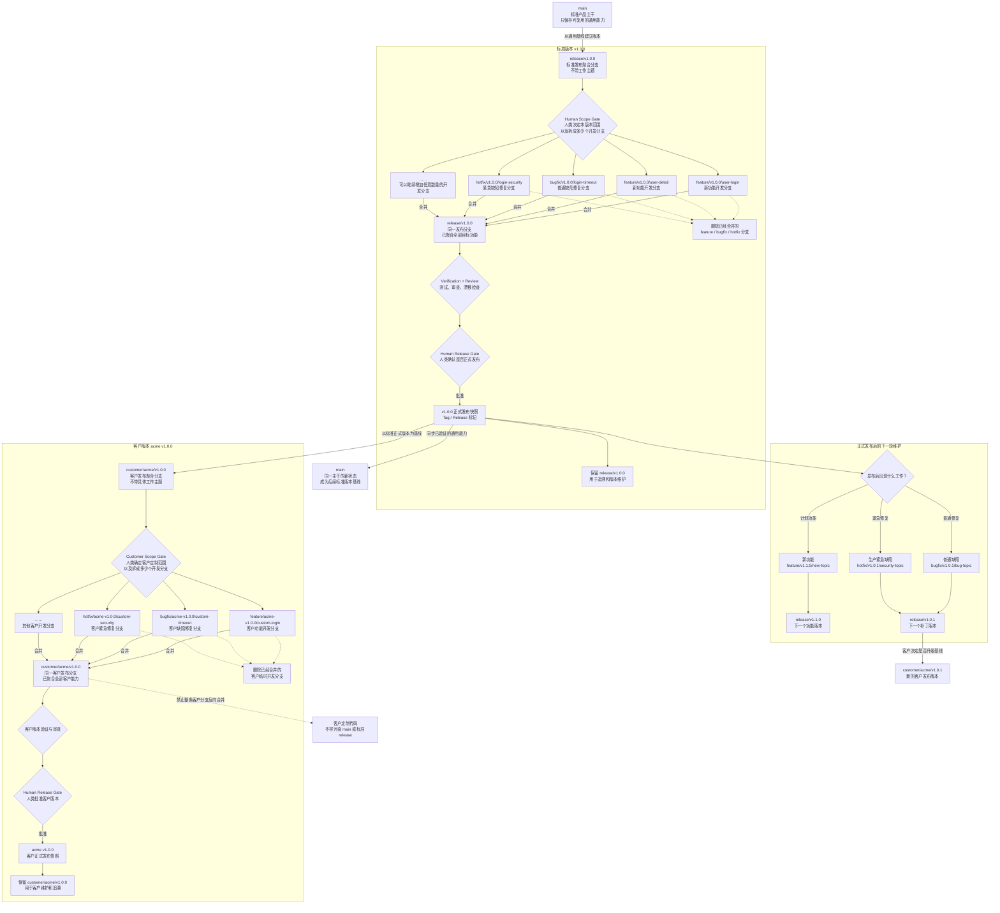
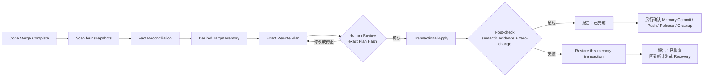
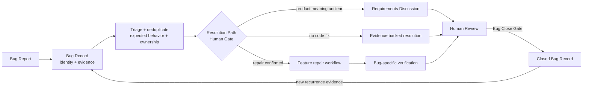

# Agent Loop 使用指南

**版本：** 1.5.0

这份文档是给人类看的。你不需要记住内部阶段名，只要用自然语言说出你想做什么，Agent 应该自己判断当前状态、推荐一个下一步，并在需要你确认的地方停下来。

核心节奏：

```text
你提出目标 -> Agent 判断状态 -> Agent 推荐下一步 -> 你确认 -> Agent 执行 -> Agent 记录证据 -> Agent 推荐下一步
```

---

## 你可以怎么说

### 我想接管一个项目

| 你可以这样说 | Agent 应该怎么做 |
|---|---|
| “帮我在这个项目里启用 agent-loop。” | 检查当前目录，确认后创建 `.agent-loop/project.md`、root `AGENTS.md`、`CLAUDE.md` 指针。 |
| “接管这个旧项目，先别写代码。” | 进入 Project Entry Scan，只建立安全继续工作的项目记忆、命令、边界、root guidance 状态和未知项。 |
| “我只想先知道怎么启动、测试、部署。” | 默认走只读扫描或操作支持，整理启动/测试/部署 checklist，不生成新人文档，不改代码。 |
| “这个项目以前用过 agent-loop，但最近没维护。” | 进入 Re-Adopt / Recovery Backfill，以代码现实为准，先回补 `.agent-loop/` 文档再继续。 |
| “这是远程项目，本地只是入口。” | 先做 Remote Project Discovery，确认远程路径、执行环境、memory 放在哪里，再扫描项目。 |

Project Entry Scan 不是新人文档生成。它不会创建：

```text
.agent-loop/onboarding-db/
onboarding-spec.md
onboarding-tasks.md
module / flow docs
onboarding diagrams
```

Project Entry Scan 不算完成，除非 root `AGENTS.md` 已存在、已创建、或你明确暂缓；`CLAUDE.md` 也必须指向 `AGENTS.md`、已创建指针、或你明确暂缓。

### 我想让新人能看懂项目

| 你可以这样说 | Agent 应该怎么做 |
|---|---|
| “我想让新人能靠文档接手项目。” | 先确认 Project Entry Scan 或可靠项目记忆，再进入 Evidence-Graph + DDD Onboarding。 |
| “给这个项目做一套新人知识库。” | 先做 Evidence Graph；你先确认 Onboarding Spec，Agent 再写 Onboarding Tasks；你另行确认 Full Execution Gate 后才写正式 onboarding-db。 |
| “重点讲清楚支付/钱包/任务调度这块。” | 先从现有代码和文档回答；如果要沉淀长期文档，再走聚焦的 onboarding-db 更新。 |
| “这个旧 onboarding-db 还能信吗？” | 把旧文档当 evidence，先和代码现实核对；不直接按旧布局刷新。 |

当前 1.5.0 使用的是 **Evidence-Graph + DDD Onboarding**，不是旧 Quick / Deep / Targeted 模式。

推荐流程：

```text
可靠项目记忆
-> 08-review/evidence-graph.md
-> Core Flow Inventory（核心流程、业务终态、恢复责任和证据链）
-> onboarding-spec.md（第一次确认）
-> onboarding-tasks.md / Full Execution Gate（第二次确认）
-> 02-modules/<module-name>.md
-> 03-flows/<flow-name>.md
-> coverage-matrix.md / batch-review.md
```

新人文档默认使用中文；代码符号、路径、命令、API、配置键、错误信息和第三方产品名保持原文。

Agent 不应该用空目录、薄 README、planned/later 占位文件、`TBD`、`TODO`、`待补充` 来假装完整。写不透但有证据可推断的地方，应该标明“推断”、证据、置信度和待验证点。

模块和流程文档默认要讲清楚：

- 这个模块/流程解决什么问题
- 边界在哪里，和谁交互
- 领域对象、数据对象、状态怎么变化
- 正常路径、失败路径、异常恢复
- 关键代码路径和证据
- 怎么验证、怎么排查、怎么安全修改
- 架构/边界图、ASCII 状态图、Timeline / 时序图

核心流程完整性先于文档评分：`critical` / `important` 流程必须从触发闭合到业务成功、失败、取消、未知或人工处理终态；callback、consumer、retry、DLQ、compensation、reconciliation 和 job 不能因为被拆成其他 topic 就从流程中消失。每个关键 slice 都要连接代码证据、图和正文，缺失时不能标记 `newcomer-ready`。

Timeline / Sequence 是单个核心流程的主叙事；Core Flow Overview / Boundary 讲 scope、owner、branch 和 terminal；ASCII State Machine 讲状态、非法转换和恢复。数据血缘、事务并发、异步拓扑、决策树、runtime 和排障图由真实复杂度触发。非流程的 stateless 文档不强制状态图。

普通流程图和时序图可以优先使用 Mermaid flowchart / sequenceDiagram；状态机、复杂原理图和复杂示例图优先使用 ASCII。

### 我只是想问问题

| 你可以这样说 | Agent 应该怎么做 |
|---|---|
| “解释一下这个模块为什么这么写。” | 作为普通讨论或代码解释，不默认创建需求、feature 或 onboarding 文档。 |
| “我改这里会影响哪里？” | 先基于代码和现有 memory 分析影响；如果需要长期沉淀，再问你是否写入文档。 |
| “这个状态是谁改的？” | 走代码/文档追踪或操作支持，必要时建议 focused scan。 |
| “先讨论一下，不要记录。” | 保持 chat，不创建 `.agent-loop/requirements/` 或 feature workspace。 |

如果讨论逐渐变成需求整理，Agent 应该问你是否要把它整理成 requirement document。讨论本身不等于开始实现。

### 我想知道版本更新或用法

| 你可以这样说 | Agent 应该怎么做 |
|---|---|
| “1.5.0 更新了什么？” | 读取 `CHANGELOG.md` 的 1.5.0 段落，按能力分类总结，不凭记忆回答。 |
| “和 1.2.2 比有什么变化？” | 对比 `CHANGELOG.md` 里的两个版本段落，说明新增、删除、替换和迁移影响。 |
| “现在 agent-loop 怎么用？” | 基于 `Usage.md` 用人类语言介绍常见触发方式。 |
| “这个功能怎么触发？” | 从 `Usage.md` 找对应说法，再说明 Agent 会进入哪个处理流。 |
| “agent-loop 是什么，怎么安装？” | 读取 `README.md`，解释总览、安装和 quick-start。 |

维护规则很简单：每个有意义版本都要更新 `CHANGELOG.md`；只有人类触发方式、使用入口或工作流口径变化时才需要更新 `Usage.md`；只有总览、安装、quick-start 变化时才需要更新 `README.md`。

### 我想让 Agent 推荐分支管理方式

| 你可以这样说 | Agent 应该怎么做 |
|---|---|
| “这个仓库的分支有点乱，给我一个方案。” | 先检查已有规则、Git 现实和目标版本，给出一个可选推荐；只有你明确接受后才记录为采用。 |
| “我们准备 v1.0.0，登录和用户详情分开做。” | 推荐一个 `release/v1.0.0` 聚合分支和由你决定数量的版本化开发分支；不会因为方案被接受就自动创建或合并分支。 |
| “给 acme 做基于 v1.0.0 的客户版本。” | 推荐独立客户发布线和客户开发分支，禁止把整条客户分支反向合入标准产品。 |
| “这个项目只有 main，不需要发布线。” | 保留轻量现状并记录 `not-needed`，不强迫迁移。 |

正式发布版本会 sealed；之后的修复进入新的 patch 版本，新功能进入你确认的新版本。发布聚合分支长期保留，临时开发分支只有在合并证据完整且你确认清理后才能删除。推荐或采用策略都不授权 create、switch、merge、delete、push、tag、release 或 publish。

推荐 profile 的命名摘要：

```text
标准发布：release/vX.Y.Z
客户发布：customer/<customer>/vX.Y.Z
标准开发：feature|bugfix|hotfix/vX.Y.Z/<topic>
客户开发：feature|bugfix|hotfix/<customer>-vX.Y.Z/<topic>
```

如果项目已有清晰规范，Agent 继续使用现有规范；如果项目只有一个受维护的主干且没有发布聚合/客户版本需求，可以经你确认记录 `not-needed`，不会为了填模板制造分支。



图中虚线表示生命周期清理或禁止方向，不代表自动执行。任何 merge、branch deletion、push、tag、release 或 publish 仍然需要现有 Human Gate。

### 代码合并后我想校准 Agent Loop 记忆

你可以这样说：

| 触发语句 | Agent 应该怎么做 |
|---|---|
| “代码已经合并，帮我合并 .agent-loop 记忆。” | 先确认稳定且已验证的 Merged Code SHA，再展示 Start Review；未确认前不创建报告。 |
| “校准 Source 和 Target 的项目记忆。” | 用 Target 记忆骨架做扫描顺序，仍覆盖 Base、Source、Target-before、Result 的全部路径，并按不同事实 owner 核对。 |
| “生成记忆合并报告，先不要 Apply。” | 只生成 Human-reviewed 候选、路径账本、预期 diff 和 Plan Hash；停在 Apply Gate。 |
| “继续已确认的 Memory Rewrite Plan。” | 只接受你确认的 exact Plan Hash，执行 pre-check、事务化 Apply 和 post-check。 |
| “恢复失败的 Memory Reconciliation。” | 使用指定 transaction ID 恢复本轮记忆修改；不会回滚已合并代码或 Git refs。 |

Agent 会先消化证据，再把注意力压缩成三层：`🔴 必须决定`、`🟡 建议复核`、`🟢 普通变更汇总`。完整计划会列出每个新增、更新、移除和 expected-unchanged 路径；人类确认的是一个确定的 Plan Hash，不是模糊的“按建议处理”。



代码合并授权、Memory Start、Plan Hash、Memory Commit、Push、Release 和 Source cleanup 是相互独立的 Gate。报告为 `待确认`、`已恢复` 或存在未恢复事务时，后续 Git/发布动作被阻断；`已完成` 也只允许进入下一个单独确认。

### 我想整理需求，但还不实现

| 你可以这样说 | Agent 应该怎么做 |
|---|---|
| “先帮我梳理这个需求，不要实现。” | 进入 Requirements Discussion，检查来源与项目证据，选择 Brief 或 Standard，并起草 Requirement `product.md`；Product Review 后仍不会自动开始开发。 |
| “先按 grill-with-docs 问清这个需求。” | 先问清术语、业务流程、边界和异常场景；提问前会查已有文档、代码和相关历史 feature。 |
| “这个需求概念容易混，先把概念、关系和状态讲清楚。” | 在 Requirements Discussion 内触发 Concept Foundation：先查证据、提取候选概念、给出推荐定义及影响，再一次只确认一个真正阻塞后续模型的问题。 |
| “只是一个目标简单、边界清楚的需求。” | 只有全部轻量条件成立时使用 Brief；Brief 不制造 Concept/State 等占位表。 |
| “把这些内容落到 product.md。” | 把它作为 Requirement Product Definition 起草；Human Review 确认产品含义后，再经 Requirement Record / Archive Gate 写到 requirement 目录，不创建 Feature `product.md`。 |
| “这个流程复杂，画图辅助我审。” | 先说明图类型、来源 stable IDs、输出路径和评审用途；你确认后才生成，并用 source digest 管理 freshness。 |
| “聊需求时遇到复杂架构取舍，要不要 ADR？” | 记录 Design Readiness evidence 和 Decision Candidate；不会直接创建 ADR。requirement 被确认后、feature construction 前判断是否需要 Decision & Design。 |
| “这个需求进入 feature 前先做 ADR / Decision Design。” | 先做 Design Readiness；涉及多 feature、业务闭环、共享状态/事实源、恢复或非功能目标时进入 Decision & Design，不要求先出现技术争议。 |
| “这个需求会拆成多个 feature，先检查整体设计是否完整。” | 运行 Design Readiness Check；需要共享设计时先形成 Decision & Design 和 Design Slice Coverage，再创建各 feature spec。 |
| “检查 ADR 是否完整落地了 requirement model。” | 解析 Effective Requirement Snapshot，逐项检查 Requirement Model Technical Landing Trace、Design Slice 与 Verification；缺失 coverage 或 compatibility 待复核时停在 Decision & Design Human Review。 |
| “这个需求比较大，先拆成几个阶段。” | 建议在 requirement README 里写 `Delivery Phases`，让你确认先做哪一段。 |
| “这个先记一下，后面做。” | 作为 deferred requirement 写进 requirement set 或 optional `requirements/INDEX.md`，不写进 `project.md`。 |
| “这是需求文档、原型图和反馈。” | 记录到 `.agent-loop/requirements/<record-date>-<topic>/`，保留人类原始材料；`record-date` 是记录/归档日期，不是截止日期。 |

需求归档目录示例：

```text
.agent-loop/requirements/YYYY-MM-DD-<topic>/
  README.md
  requirement.md
  prototype.*
  feedback.*
  notes.*
```

日期是归档日期，不是 deadline，也不是 feature 周期。

`Delivery Phases` 是给人类确认“现在做什么、先不做什么、做到什么算完成”的需求层分期。它不是 task、不是 feature、不是 ADR、也不是 project memory。

当至少一个 Phase 已实现、还有其他 Phase 未实现时，requirement 状态是 `partially-implemented`；只有确认范围内的所有 Phase 都进入实现或明确的终态后，才是 `implemented`。

`grill-with-docs`、`prd-writer` 等能力在 agent-loop 里是 Requirements Discussion 的方法，不是新的阶段。Agent 仍负责证据检查、Brief/Standard 深度、产物路径和 Human Gate。Helper 的 Feature List 映射为 Product Capability Scope，不创建 native `feature_list.md`、`PRD.md`、原型部署或自己的目录树。

Concept Foundation 是这套澄清方法在复杂需求里的前置约束，不是新的 stage。Agent 不会让你先写“领域模型”；它从成功/失败场景和项目证据提取 Concept Candidate，用 requirement-local `Concept ID` 固定定义、identity、owner、lifecycle、relationship、invariant 和 product fact meaning。每轮 Human Grill 只问一个 downstream blocker，并附推荐定义、证据以及接受/拒绝对流程、状态和产品数据的影响。

Standard Product Definition 会按适用性推导 Concept Relationships、Role / Permission Matrix、Commands / Events、Primary Business Flow、Product State Model、Requirement Product Model、Exceptions 和 Product Rules；不适用的视图写具体原因，不造假表。Feature `spec.md` 通过 Product Slice 引用 accepted IDs/section anchors；如果归档后改变产品含义，Agent 保留原 source，经人类确认后追加 product follow-up 或新建 Requirement Set，再更新 README effective pointer。

如果用了 Requirement/Product Grill，Requirement `product.md` 会承接术语、主流程、异常路径、事实源、历史冲突、验收场景和 Decision Candidates，而不是只写一段摘要。

Product Human Review 确认“这份产品定义准确”，不等于 Requirement 已接受实施，也不授权 Feature start、ADR acceptance、代码执行或 Git 动作。新 PRD 只在 `.agent-loop/requirements/<date>-<topic>/product.md`；已有 legacy Feature `product.md` 继续可读，但不会自动迁移或成为新 writer 目标。

Decision & Design / ADR 是 requirement 和 feature 之间的需求落地层。Requirement 接受后先运行 Design Readiness Check；只要需求会拆成多个 feature，或需要共享业务流程、领域/数据规则、事实源、一致性、恢复、性能、高可用、安全或可观测性设计，就会建议先完成整体 Decision & Design，即使没有技术争议。新的 decision draft 默认是 `proposed`，只有你明确确认后才会变成 `accepted`。每项 required Design Slice 都必须映射到 owning feature 和验证路径，普通 feature 内的小取舍仍写在 `spec.md` 的 `Design Decisions`。

Requirement-driven ADR 会先记录 Effective Requirement Snapshot，再用 Requirement Model Scope Inventory 对来源中的 `REL/PERM/CMD/EVT/FLOW/STATE/PM/EX` 稳定 ID 做完整盘点，最后用 Requirement Model Technical Landing Trace 给 scope 内每个 accepted model ID 安排 `landed`、`covered-by-accepted-decision`、`feature-local` 或 `not-applicable`。`landed` 必须明确技术落点、保留的不变量、Design Slice 和验证方向；inventory/coverage 不完整或 `Upstream Compatibility: review-required` 时，ADR 不能接受，依赖的 Feature Spec、Plan 和实现也会停止。

结构预检期间 ADR 保持 `proposed`；校验通过只表示可以提交人类评审。你明确接受后，Agent 才记录 Human Review Evidence、改为 `accepted` 并运行 accepted-mode validation。对于有具体理由的 `concept-foundation-not-needed`，使用 trace-not-applicable 分支，不伪造数据模型或流程。ADR 仍不能重新定义 Concept、流程、状态、不变量或事实归属；上游变化使既有技术结论失效时，必须经人类确认创建 superseding ADR。

Operational landing 不是每份 ADR 的默认大章节。只有持久化表示、协议/provider、runtime boundary 或上线兼容性发生变化时，才展开 Migration / Backfill、Compatibility、Rollout / Cutover 或 Rollback / Reversibility；未触发时只记录具体原因。

示例：

```md
## Delivery Phases

| Phase | Goal | Scope | Out Of Scope | Acceptance Direction | Status | Feature Mapping | Source Notes |
|---|---|---|---|---|---|---|---|
```

当你确认实现某个 phase 后，Agent 再创建 feature，并在 `spec.md` 里引用这个 requirement set 和 phase。

### 我想做一个边界明确的小修改

| 你可以这样说 | Agent 应该怎么做 |
|---|---|
| “把生产脚本里已经确认的旧域名换成新域名。” | 先确认这是内部机械同步且没有外部调用方变化，再在 active memory root 的 `changes/YYYY-MM/YYYY-MM-DD-topic.md` 持久化 Lightweight Execution Card；扫描引用、限定替换、做语法/解析/非生产 dry-run、检查旧值残留、diff 和回滚。真实生产调用仍需单独确认。 |
| “迁移正式生产域名，并处理 DNS、证书和调用方。” | 进入 Feature / Decision 路径，不使用轻量旁路；公共调用、灰度、回滚和发布边界需要完整设计与验证。 |
| “修正这个内部脚本条件，预期行为已经明确。” | 在边界、消费者和回滚明确时使用执行卡，并先写一个最小有意义失败用例，完成 RED/GREEN 和相关 focused regression。 |
| “这是 Bug，请登记并修复。” | 明确 Bug Management 优先，先建立或匹配 Bug Record、确认 Expected Behavior 和 Resolution Path，再由 Feature 工作流修复，绝不降级为轻量卡。 |
| “不确定有没有外部调用方。” | 在写入前停止，整理 Lightweight / Feature 的少量真实选项，给出 Agent 推荐和证据，等你选择；回答前零修改。 |

你不需要说“启用轻量模式”。Agent 先根据产品语义、边界影响、范围、不确定性、验证和回滚自主判断。明确合格后，Agent 必须在第一次目标写入前创建持久卡；月份是创建分区而不是 Archive，后续完成、记忆整理、commit 或 release 都不移动它。同日同 topic 冲突使用首个未占用的 `-2`、`-3` 后缀，不能覆盖旧卡。

轻量卡仍然必须有背景、目标与完成标准、范围、旁路理由、风险、Plan、当前进度、验证、回滚、Human Gates、结果和 Memory Review。意外上下文丢失可以在重新核对 branch、完整 HEAD、dirty diff、Scope、Plan、验证和回滚后继续；计划性跨会话、handoff、Subagent、长期观察或复杂证据仍进入 Feature。

事实、路径、域名、配置或文档同步优先使用语法、解析、引用、旧值残留和限定 dry-run 等针对性验证，不为字符串替换制造无意义单元测试。可隔离的行为逻辑仍使用最小 RED/GREEN。发现 API、数据、状态、权限、安全、依赖、迁移、未知消费者、跨会话或范围扩张时，Agent 必须停止并推荐升级到 Feature/Requirement/Bug 的唯一合适路径。

完成 Change 后，Agent 使用只读 scanner 跨月份检查 pending：macOS/POSIX 使用 `python3 <skill-root>/scripts/scan-lightweight-changes.py --project-root <project> --as-of YYYY-MM-DD`；Windows 使用 `py -3 <skill-root>\scripts\scan-lightweight-changes.py ...`，也可使用明确指向 Python 3.10+ 的 `python`。累计 3 个 pending 或最早 pending 超过 7 个完整日历日会触发 Agent 主动整理；恰好 7 天不触发。

稳定、高证据、无冲突且有现成可靠记忆 owner 的事实，可以在 Agent 披露精确目标路径、事实、证据、影响和 rollback 后同步；语义、权威或目标位置不确定时继续显示给人类确认。只有 `changes/` 的 root 不代表项目已初始化，也不能自动创建 `project.md` 或 enterprise memory。代码先合并并验证，Target memory 后校准。

执行卡只授权其中披露的本地修改与本地验证，不授权生产/外部调用、付费操作、配置写入、branch、commit、push、PR、merge、tag、release 或 publish。

### 我想开始做一个功能

| 你可以这样说 | Agent 应该怎么做 |
|---|---|
| “我要做手机号验证码登录。” | 先确认项目状态并创建/引用一个已接受的 requirement set；窄需求可以只建最小 requirement，再运行 Design Readiness 和创建 feature spec。 |
| “把这个需求写成 feature spec。” | 先解析 Requirement README 的 Effective Product Definition，再写 `spec.md` 的 Product Requirement Source、Product Slice、故事和验收标准。 |
| “先帮我梳理这个 feature 的产品意图。” | 产品含义不清时返回 Requirements Discussion 修订 Requirement Product Definition；Feature Spec 只选择本次 Product Slice，不另写产品定义。 |
| “把 spec 拆成 task。” | 写 `tasks.md`，优先 vertical slice，让每个 task 尽量能验证闭环。 |
| “设计测试方案。” | 写 `tests.md`，包含模块/API/E2E/回归/手动验证和证据记录方式。 |
| “开始执行 T003。” | 先过 Plan Gate；非简单 task 要写或确认 `plan.md` 后再执行。 |

常见 feature 产物：

```text
.agent-loop/features/YYYY-MM-DD-<feature-slug>/
  spec.md
  tasks.md
  tests.md
  plan.md
  notes.md
  contracts.md optional
```

如果来源 requirement 使用了 Delivery Phases，一个 feature 默认只实现一个已确认 phase，或一个 phase 里的更小切片。不要为了省事把多个 phase 合并进一个 feature；要合并时先回到 requirement README 让你确认。

### 我想让 Agent 自己往前推进

| 你可以这样说 | Agent 可以自动做什么 |
|---|---|
| “这个 feature spec 确认了，后续 Agent-ready 阶段你自动推进。” | Agent 先确认 Requirement Checklist 已通过，再启用 Feature Auto-Loop，在当前 feature 内推进拆任务、测试设计、计划、执行、验证、review、drift、memory update。 |
| “这个 task 的 plan 确认了，你自己跑完。” | Task Auto-Run：先运行 Analyze Consistency，再只完成当前 task/story，从 TDD 到验证、review、drift 和状态更新。 |

自动模式不会跳过风险门禁。遇到这些情况必须停下来问你：

- 需求范围变化或决策不清楚
- 要修改人类原始需求材料
- 架构、安全、数据、权限、公共接口变化
- 测试环境不可用或多次验证失败
- drift check 需要你批准
- root/directory `AGENTS.md` 或 `CLAUDE.md` 要变更
- 需要创建或接受 Delivery Contract
- 需要未批准的 subagent dispatch
- 有无关 dirty work
- submit、commit、PR、merge、release、publish、pause、close

同一时间最多只有一个 Active Feature。切换功能时，Agent 会先把当前 Feature pause，记录恢复点，再激活另一个 Feature。若 agent-loop Skill 无法加载，已有自动模式授权会被暂停，只保留安全的只读接管、恢复和操作分析。

### 我想测试、部署、排查线上问题

| 你可以这样说 | Agent 应该怎么做 |
|---|---|
| “新资源账号，先安排测试，跑通上线。” | 默认走 Code-Guided Operational Support，先只读查代码、配置、脚本、部署流程和风险。 |
| “帮我看看这个线上问题怎么处理。” | 先根据现有代码和 runbook 给排查/验证/回滚 checklist；需要改代码时再问你是否进入 feature/fix。 |
| “切一下模型/账号/配置，先确认风险。” | 先定位配置入口、依赖、验证方式、回滚方式；涉及外部服务、付费额度、生产/预发操作前要停下来确认。 |

操作支持默认不写代码、不改配置、不部署、不读取或暴露 secrets。它输出的是当前理解、必要输入、操作步骤、验证、回滚、风险和未决问题。

### 我想把常用流程做成项目技能

| 你可以这样说 | Agent 应该怎么做 |
|---|---|
| “把这个流程做成技能。” | 进入 Project Skill Creation / Update，先展示 Project Skill Candidate、精确文件树、风险和验证计划，通过 Gate 1 后才在目标项目创建 `.agent-loop/skills/<skill-name>/`。 |
| “把刚才成功的操作沉淀成 skill。” | 复用刚才的新鲜成功证据，但仍要补 RED 基线、GREEN/REFACTOR、结构验证和前向执行测试；成功后自动从 `proposed` 变为 `active`。 |
| “以后这种复杂操作你可以主动建议做成技能。” | Agent 可在当前授权阶段完成且验证成功后主动提出 Candidate；主动建议不等于获准创建。 |
| “使用 deploy-check 技能检查测试环境。” | 如果技能和范围都已明确，Agent 仍先展示执行摘要；计划没有新增未披露动作或影响时，这句话可作为本次调用的 Execution Gate，无需再问一次。扩大范围、换任务或下次调用都要重新确认。 |
| “我没点名 Skill，但项目里已经有处理这个操作的 Skill 吗？” | Agent 先只读检查 `.agent-loop/skills/INDEX.md`，匹配 active Skill 的 trigger/scope，并在进入通用 fallback 前报告匹配结果；发现不等于执行授权。 |

Project Skill 只写入使用 Agent Loop 的目标项目：

```text
.agent-loop/skills/
  INDEX.md
  <skill-name>/
    SKILL.md
    validation.md
```

创建或实质更新只有一个文件写入门禁：Gate 1。验证通过后会自动激活，不再增加 activation gate；验证失败则保持 `proposed`，不能进入正常路由。

执行是独立门禁。读取 INDEX、匹配触发条件、加载 `SKILL.md` 都可以只读完成；但真正按照技能步骤运行命令、调用工具、修改文件、访问外部系统或产生副作用前，必须为这一次有边界的调用获得 Execution Gate。`active`、`bootstrap`、Feature Auto-Loop、Task Auto-Run、以前执行成功或以前确认过都不能复用为下一次授权。

项目 Skill 不一定显示在运行时原生 Skill 列表中；Agent Loop 会在声称没有相关能力或进入通用执行 fallback 前检查 `.agent-loop/skills/INDEX.md`，只加载匹配的 active Skill，并继续保留本次 Execution Gate。INDEX 缺失或没有 active match 时才进入通用方法；路径、owner 或 manifest 漂移时停止并报告，不能用通用动作绕过。

### 关闭后发现 bug 或要小改

| 你可以这样说 | Agent 应该怎么做 |
|---|---|
| “测试发现上次那个功能有 bug。” | 先检查 Bug Index、保存报告证据并去重；再确认预期行为和 Feature 归属，不直接改代码。 |
| “QA、客户群和监控报的是同一个问题。” | 把多个 Report Origin 关联到一个稳定 Bug Record；来源只表示 provenance，不产生 Owner、Assignee 或权限。 |
| “这个和 BUG-014 重复。” | 给出 deduplication 证据并经人类确认后，将当前 Bug 以 `Resolution: duplicate` 关闭并链接 canonical Bug。 |
| “已关闭的 BUG-014 又出现了。” | 追加 Reopen History 和新证据，恢复处理状态；不覆盖原关闭结论或历史。 |
| “预期行为本身不清楚。” | 将 `Resolution Path` 路由到 Requirements Discussion；Bug 与 Requirement 可 0..N 关联，但不自动回滚 Requirement 生命周期。 |
| “这个只是个窄修复。” | 经 Resolution Path Human Gate 后使用 `maintenance-fix` Feature；修复仍由 Feature 的 spec/tasks/tests/plan/notes、TDD 和验证负责。 |
| “这是两个月前那个功能的问题。” | 60 天仍在默认 90 天 Feature metadata scan 内；90 天不是硬边界，有明确证据时继续扩展扫描。 |
| “归档的旧 Feature 可能负责这个 Bug。” | 通过 `features/archive.md` 和归档 Feature 文档只读发现归属；确认 flow-back 后、执行修复前才单独 rehydrate。 |

Bug Management 是 Feature Follow-up / Flow-back 的内部方法，不是新的 stage，也没有自己的任务或代码执行系统。Bug Record 管身份、事实、证据、生命周期、Resolution Path 和关闭记录；Requirement 管产品目标与预期行为；所有代码修复仍由 Feature 工作流完成。Bug Close Gate 与 Feature 测试、Feature Close、commit/push 等授权相互独立，不能互相复用。



低信息错误，比如 “500 / 白屏 / unknown error”，不应该随便归到最近 Feature；Agent 应先建议 `investigate-first`。Bug identity 的去重扫描没有时间截止，Feature 归属默认扫描最近 90 个日历日的 metadata，并在明确旧 Feature、归档 locator、路径/符号、验收或回归证据重叠时继续扩展。

### 我想按月份归档已经关闭的 feature

Feature Monthly Archive 只整理目录位置，不压缩或删除 feature 内容，也不会自动提交。一次正常交互是：

```text
Human: 把 2026 年 5 月和 6 月已经关闭的 feature 按月份归档。
Agent: 运行只读 scan，展示 plan SHA-256、eligible/blocked 行、目录移动、引用影响、不变内容和恢复范围。
Human: 确认这个精确批次及其 plan SHA-256。
Agent: 执行整目录移动和精确引用更新，完成 post-check，报告 transaction evidence，不自动 commit。
```

只有 `closed` 且关闭证据、Archive Readiness、drift、project memory 和 open follow-up 检查完整的 feature 才能进入候选。`active`、`blocked`、`paused`、当前月或存在不安全引用的 feature 保持 flat 并被阻断。归档结果是 `.agent-loop/features/YYYY-MM/<feature-id>/`，根级 `.agent-loop/features/archive.md` 只负责按稳定 Feature ID 定位当前位置；原 feature 文档、需求源和 accepted decisions 仍然是事实权威。

如果归档后的 feature 要重新进入 Follow-up / Flow-back，Agent 先运行只读 rehydrate scan 并展示新的 plan SHA-256；你必须通过一个独立的 rehydrate Human Gate。确认后 Agent 才把完整目录移回 `.agent-loop/features/<feature-id>/` 并复验。rehydrate 不会自行把 `spec.md` 从 `closed` 改为 `active`，后续 reopen 仍归 Feature Follow-up 管理。

原生 Python 3.10+ 调用示例：

```text
# macOS：只读生成计划
python3 scripts/scan-feature-monthly-archive.py --project-root <project> --operation archive --month 2026-05 --month 2026-06 --as-of 2026-07-14

# Windows PowerShell：只读生成计划
py -3 scripts\scan-feature-monthly-archive.py --project-root <project> --operation archive --month 2026-05 --month 2026-06 --as-of 2026-07-14
```

真正 apply 还必须提供刚刚经人类确认的 `--expected-plan-sha256`；不能使用 `--force` 绕过 stale-plan、引用阻断、transaction journal、恢复或 post-check。

### 我想同步 AGENTS.md

| 你可以这样说 | Agent 应该怎么做 |
|---|---|
| “agent-loop skill 更新了，检查一下这个项目的 AGENTS.md 要不要同步。” | 读取 root `AGENTS.md` / `CLAUDE.md`，运行只读 checker，报告哪些 managed blocks stale。 |
| “按最新 agent-loop 刷新这个项目的 AGENTS.md 托管块。” | 先给 Human Review Summary，说明要改哪些 block、为什么、风险是什么；你确认后才写。 |
| “不要覆盖我自己写的项目规则。” | 保留 managed block 外的人类/项目内容；冲突规则单独列出来让你决定。 |

如果当前 skill 提供脚本，Agent 应使用 Python 3.10+ 直接运行 canonical `.py` 入口。脚本只使用 Python 标准库；macOS 和 Windows 分别可以这样调用：

```text
# macOS
python3 scripts/check-root-agents-blocks.py --template <agent-loop-skill>/templates/root-AGENTS.md --target <project>/AGENTS.md

# Windows PowerShell
py -3 scripts\check-root-agents-blocks.py --template <agent-loop-skill>\templates\root-AGENTS.md --target <project>\AGENTS.md
```

这个脚本只读检查，不写文件。它会报告 missing / stale / broken managed block、`block-version` 漂移、marker 问题、unexpected section、source 缺失等。如果 Python 3.10+ 不可用，Agent 应报告 capability gap 并停止依赖该 checker 的判断，不能静默退回旧 Bash/Ruby 规则实现。

注意：managed block 不等于都能模板覆盖。规则块可以按模板刷新；项目事实块必须结合 `.agent-loop/project.md` 或 enterprise memory 重新生成，并经过你确认。

### 我想提交或关闭

| 你可以这样说 | Agent 应该怎么做 |
|---|---|
| “准备提交。” | 进入 Submit / Integrate，检查 diff、feature docs、requirement records、verification、review、drift、memory 和 unrelated changes。 |
| “提交一下。” | 这只授权进入提交检查；真正 commit 前还要给你 Human Review Summary 并再次确认。 |
| “关闭这个 feature。” | 先做 Feature Close Review、drift check、project memory update，再让你确认 close。 |

提交前 Agent 应同时复核 feature 文档、requirement 记录、代码 diff、验证证据、drift、project memory、root/directory guidance 影响和 unrelated changes。具体包括：

- 本次代码 diff 和 untracked files
- `product.md` / `spec.md` / `tasks.md` / `tests.md` / `plan.md` / `notes.md`
- 关联 requirement 的 lifecycle、Delivery Phase、Feature Mapping
- 新鲜验证证据
- Spec Review / Standards Review
- drift check
- project memory 和 root/directory guidance 影响
- unrelated dirty work

如果 feature 文档、requirement 文档或 memory 不需要更新，Agent 要说明原因；如果需要延后，必须由你确认。

---

## 你不需要记住这些阶段名

你可以自然地说：

```text
接管这个项目。
先别写代码，帮我搞清楚怎么启动。
我想让新人能看懂这个项目。
解释一下钱包扣费流程。
这个需求先聊清楚，不要实现。
这个需求比较大，拆成 phase。
把这个流程做成技能。
我要做一个新功能。
把需求写成 spec。
拆 task。
设计测试。
执行 T001。
这个 task 你自己跑完。
检查文档和代码有没有漂移。
测试发现上次那个功能有 bug。
提交前 review 一下。
关闭这个 feature。
```

Agent 的责任是把这些话翻译成正确的下一步，而不是让你背阶段名。

---

## 常用产物位置

| 文件 | 用途 | 不应该放什么 |
|---|---|---|
| `.agent-loop/project.md` | 长期项目记忆、当前工作、当前恢复动作 | 任务日志、原始测试输出、需求待办 |
| `.agent-loop/project/*.md` | enterprise memory 下的长期项目细节 | 临时执行日志 |
| `.agent-loop/onboarding-db/` | Evidence-Graph + DDD 新人/项目理解知识库 | 当前 task 状态、原始需求、测试长日志 |
| `.agent-loop/requirements/` | 人类原始需求材料、Requirement `product.md`、需求生命周期、待办、Delivery Phases | Agent 的工程执行计划 |
| `.agent-loop/skills/INDEX.md` | 项目技能状态、加载策略、触发条件、范围和验证证据 | 技能正文、执行授权 |
| `.agent-loop/skills/<skill-name>/` | 项目常驻技能、验证记录和必要资源 | secrets、全局安装副本、feature 状态 |
| `requirements/<set>/product.md` | Agent 起草、人类确认的 Brief/Standard 产品定义 | 工程执行细节、Git 授权、原始人类材料改写 |
| `features/<feature>/product.md` | 仅 legacy reader compatibility | 新 Feature 产品定义、自动迁移内容 |
| `spec.md` | Feature 行为规范与 Product Slice | 产品语义重定义、执行日志 |
| `tasks.md` | 任务拆分和状态 | 原始测试输出 |
| `tests.md` | 测试方案和矩阵 | 长篇测试日志 |
| `plan.md` | 当前 task/story 执行计划 | 历史记录 |
| `notes.md` | 决策、证据、drift、pause/close、submit 记录 | 原始需求正文 |
| `contracts.md` | 可选交付契约索引 | 临时 subagent 分工 |

---

## 人类确认规则

你控制目标、需求源材料、关键决策和阶段门禁。Agent 控制流程、产物、实现、验证和回补。

Agent 可以推荐下一步，但不能替你批准：

- 创建或改写 root/directory `AGENTS.md`
- 创建或接受 Delivery Contract
- 创建或实质更新 Project Skill（Gate 1）
- 每次实际执行 Project Skill（Execution Gate）
- 修改人类原始需求材料
- 合并多个 Delivery Phases
- 提交、PR、merge、release、publish
- pause / close feature
- 执行会接触 secrets、付费额度、生产/预发、破坏性操作的命令

如果你明确说“只讨论，不记录”，Agent 应该保持讨论模式。如果你说“开始做”，Agent 才进入 feature / task 执行流程。
