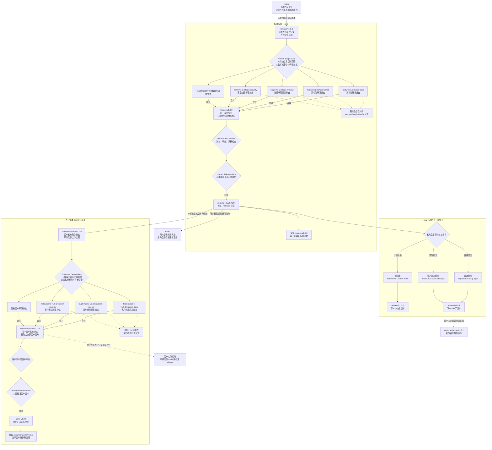

# Agent Loop Usage

**版本：** 1.5.0

这是一份给人类使用的触发指南。你不需要记住 Agent Loop 的阶段名；只要说明目标、边界和你希望 Agent 自主推进到哪里，Agent 负责判断项目状态、选择流程、维护产物并在真正的 Human Gate 停下。

## 最重要的用法：让 Agent 真正拥有项目

### 接管并持续维护

把下面这段直接发给 Agent：

```text
使用 Agent Loop 接管并持续维护这个项目。

先检查仓库、项目记忆、root AGENTS.md / CLAUDE.md、当前 branch、HEAD、
dirty diff、运行和测试方式、当前工作与不确定项，再判断正确的下一阶段。

你负责工作流诊断、计划、实施、测试、验证、review、drift 修复、
项目记忆和恢复点，并在授权范围内持续推进到有新鲜证据的完成状态。
不要因为任务有多个步骤就自动创建 Feature，也不要为了快而降低准确性；
选择满足风险要求的最小执行通道。

只有遇到真实 Human Gate 时才停下来。停下时给我：
需要我决定什么、你的推荐、证据、影响、风险、回滚和批准后的下一步。
```

这会授权 Agent 做安全的只读检查和当前任务范围内的正常实现工作，但不会授权生产、付费、外部副作用、Git 提交或发布等独立门禁。

### 从一个已接受需求自主开发

```text
这个 Requirement Product Definition 已经接受。
使用 Agent Loop 完成 Design Readiness；需要 ADR 就先完成 ADR Human Review，
不需要就记录 design-not-needed 证据。

然后建立一个合适的 Feature Product Slice。后续 Agent-ready 阶段由你自主推进：
spec、tasks、tests、Plan、TDD、验证、review、drift 和 memory update。
持续做到有新鲜证据的完成状态，或遇到必须由人类决定的真实门禁。
```

### 只让当前任务自动跑完

```text
当前 task 的范围和 plan 已确认。
启用 Task Auto-Run，只完成这个 task/story。
先做一致性检查，然后按 TDD、验证、review、drift、状态和记忆更新推进。
遇到范围扩大、关键决策、外部副作用或其他 Human Gate 时停止。
```

Auto-Loop 不是无限授权。Agent 仍然必须停在需求变化、关键设计、安全/数据/公共接口变化、不可用环境、重复失败、无关 dirty work、生产或外部动作、Git、提交、发布、pause 和 close 等边界。

## Agent 会怎样选择执行通道

| 人类意图 | 默认路径 | 不会发生什么 |
|---|---|---|
| 问问题、解释规则、查看状态 | Chat | 不默认创建 Requirement 或 Feature |
| 测试、部署准备、运行、诊断、切换环境 | Operational Support | 不默认写代码或碰生产 |
| 需求目标、范围、概念或产品行为仍在形成 | Requirements Discussion | 不提前创建 Feature |
| 已明确、低风险、边界小、可回滚的普通非 Bug 变更 | Lightweight Change Lane | 不为了形式创建完整 Feature |
| 行为/API/状态/数据/权限/安全/架构/迁移或影响不明 | Feature | 不走轻量旁路 |
| 人类明确称为 Bug | Bug Management → Feature repair | 不把 Bug 降级成轻量 Change |
| 代码已合并，`.agent-loop/` 记忆仍冲突 | Post-Merge Memory Reconciliation | 不把普通 Git 文本合并当作语义正确 |

如果 Agent 无法确定 Lightweight 与 Feature 的边界，它应零写入地给出少量真实选项、一个推荐及证据，然后问你。

## 项目接管、恢复与理解

### 初始化或接管

```text
用 Agent Loop 初始化这个项目。
```

```text
用 Agent Loop 接管这个已有项目。先做 Project Entry Scan，
不要假设旧文档仍然正确。
```

Agent 会区分新项目、已有项目、远程项目、恢复、re-adopt 和 stale-memory，并只接受一个真实 memory root。`.agent-loop/` 与 legacy `agent-loop/` 同时存在时会停止并要求处理双根冲突。

### 恢复中断的工作

```text
继续上次工作。先核对 branch、完整 HEAD、dirty diff、当前 artifact、
任务状态、验证证据和恢复点，再从真实状态继续。
```

### 远程项目

```text
代码在远程机器/容器里。先确认本地入口、远程路径、运行环境和权限边界，
再做 Project Entry，不要把空本地目录当成项目事实。
```

### 让新人看懂

```text
项目已经可以安全接管。现在用 Evidence-Graph + DDD Onboarding
建立新人知识库，覆盖领域、核心流程、代码落点、运行方式和证据。
```

Onboarding 是项目理解资料，不替代 Requirement、Feature、任务状态或项目记忆。

Agent 会检查核心流程完整性，并按需要使用架构/边界图、ASCII 状态图、Timeline / 时序图（Timeline / Sequence）帮助新人理解证据链。遇到 Visual Trigger 时仍按 active project-local visual skill → installed Archify → materially useful recommendation → Mermaid/ASCII fallback 选择；已有或 fallback 内嵌图可以保留 Mermaid flowchart / sequenceDiagram 或 ASCII 文本源，长期 Archify 图则保留经验证的 `source-render-v1` 对。

## 版本更新和使用帮助

### 我想知道版本更新或用法

这些说法都会路由到人类文档，而不是凭 Agent 记忆回答：

```text
1.5.0 更新了什么？
当前 1.5.0 使用的是什么流程？
和 1.2.2 比有什么变化？
现在 agent-loop 怎么用？
```

版本变化以 `CHANGELOG.md` 为准，触发方式以 `Usage.md` 为准，总览、安装和 quick start 以 `README.md` 为准。

## 需求沟通到产品文档

### 开始需求设计前

```text
我在谈需求，先不要实现。
先帮助我明确核心概念、用户、目标、范围和大致流程，
然后判断应该用 brief 还是 standard 产品定义。

如果你建议进入完整产品设计流程，先告诉我为什么、
预计会增加哪些讨论轮次和 token 投入，再等我确认。
```

Agent 应先检查现有产品、代码、领域材料和历史决策，激活相关产品案例、模式和理论，形成候选 Product Frame，而不是让人类从空白开始设计。

Requirement Product Definition 起草后，Requirement `product.md` 会承接术语、主流程、异常路径、事实源、历史冲突、验收场景和 Decision Candidates。新 PRD 只在 `.agent-loop/requirements/<date>-<topic>/product.md`；已有 legacy Feature `product.md` 继续可读。

### 完整产品共识循环

```text
采用 standard 产品设计。
你作为产品设计师主导：先形成 Product Frame 和 Design Block Map，
再按模块提出有价值的问题、当前设计、推荐答案、影响和改写目标。
每次只阻塞在真正需要我的问题上；我确认后重写设计并继续下一块，
直到角色、权限、流程、状态、数据、异常、恢复和边界完整。
```

Standard depth 可以触发：

- Concept Foundation：概念 ID、规范名称、身份、所有权、生命周期和边界
- Roles and Permissions：角色、可见性、授权与责任
- Commands and Events：人类/系统动作、反馈与事件
- Business Flow：主流程、分支、前置和终止条件
- State Model：状态、转移、终态、失败与恢复
- Product Data and Facts：产品对象、关系、事实来源和不变量
- Exceptions and Recovery：异常、重试、补偿、人工处理
- Cross-block Impact：一个决定影响的其他模块

不适用的视图写具体原因，不制造空表。Agent 每次先给推荐，不把设计工作推回给人类。

### 视觉辅助

```text
这段流程只看文字不容易确认。请用可用的视觉技能画一张模块图或流程图，
先说明这次图要回答的问题和权威来源；图确认后把结论重写回 product.md。
```

Agent 优先使用 active project-local visual skill，然后使用已安装 Archify。不要因为 Archify 尚未安装就先把 Mermaid 当成默认画图方案：如果 Archify 能实质改善本次审核，Agent 先推荐 [Archify](https://github.com/tt-a1i/archify)，单独展示来源、revision、命令、目标、影响、doctor 和 fallback，并请求明确授权。只有 Archify 不值得安装、人类拒绝、环境不支持或安装/使用失败时，才降级到 Mermaid/ASCII。

每次生成前先给出一个有边界的 Visual Scope Grant，说明要回答的问题、权威 source IDs、图类型、工作输出、review 目的和同一问题的迭代边界。

视觉规则是 `render to converge, text to record`。工作图帮助达成共识；`product.md` 才是产品语义权威。要长期保存的图必须是带 source/render digest 和验证证据的 `source-render-v1` 对。

在 Feature Spec 中，图只能解释已接受的 Product Slice、Feature 责任和 Feature-local 实现/验收路径。已接受的局部澄清回写 `spec.md`；如果图暴露新产品含义，停止 Feature Spec 并返回 Requirements Discussion，不在该阶段直接修改 Requirement `product.md`。

### 大需求分阶段

```text
先保留完整产品模型，再建议 Delivery Phases。
每个 phase 写目标、包含/排除、依赖、完成证据和 Feature Mapping，
不要把后续阶段从产品文档中删掉。
```

一个 Feature 默认只实现一个已确认 phase 或更小切片。合并多个 phase 需要回到 Requirement lifecycle 重新确认。

### Product Human Review 和记录

```text
我接受这版产品定义。请给出 Product Human Review Summary，
但先不要创建 Feature，也不要实现。
```

```text
确认把这版 Requirement Product Definition 记录到项目中。
```

Product Review、Requirement Record / Archive、ADR acceptance、Feature start 和 implementation 是独立门禁，不能互相代替。人类原始文字、图片、PRD 和原型保持 byte-stable；Agent 在新的 `product.md` 中解释和固化，不自动改写原件。

Product Human Review 确认“这份产品定义准确”，但不会自动接受 Requirement lifecycle、创建 Feature、执行代码或授权 Git。

## 从 Product Definition 衔接 ADR

```text
产品定义已经接受。现在做 Design Readiness，
检查共享业务流程、领域/数据规则、状态、事实来源、架构、恢复、
兼容性和非功能目标是否需要 ADR。
```

你也可以直接问：

```text
这个需求会拆成多个 feature，先检查整体设计是否完整。
聊需求时遇到复杂架构取舍，要不要 ADR？
```

简单工作可记录 `design-not-needed`。需要共享技术落地时：

```text
根据 Effective Requirement Snapshot 起草 ADR。
把 Requirement Product Model 的稳定 ID 全部纳入 Scope Inventory，
为每个 in-scope ID 写 Technical Landing、保留的不变量、
Design Slice 和验证目标。先保持 proposed，等我接受。
```

Decision & Design / ADR 消费产品语义，不重新定义产品。新的 decision draft 默认是 `proposed`。发现产品歧义时回到 Requirements Discussion；发现既有 accepted 技术决策不兼容时保留原记录并通过 Human Review supersede。

## 做一个边界明确的小修改

```text
把生产脚本中的旧域名替换为新域名。
先判断是否满足 Lightweight Change；满足就创建持久执行卡，
使用与风险匹配的最小 Plan 和针对性验证，不要为了形式创建 Feature。
```

执行卡位于：

```text
.agent-loop/changes/YYYY-MM/YYYY-MM-DD-<topic>.md
```

它必须在第一次目标写入前记录背景、完成标准、范围、旁路理由、风险、Plan、进度、验证、回滚、Human Gates、结果和 Memory Review。事实/路径/域名/文档变更优先做语法、解析、引用、旧值残留和限定 dry-run；可隔离行为逻辑仍做最小有意义 RED/GREEN。

以下任一情况升级 Feature：公共接口、数据、状态、权限、安全、架构、依赖、迁移、未知消费者、跨会话计划、handoff/subagent、长期观察、复杂证据或范围扩大。

三张 `completed + Memory Review: pending` 卡，或最早 pending 超过七个完整日历日，会触发 Agent 主动整理稳定项目事实。高置信度事实可在精确披露 owner、证据和 rollback 后写入现有可靠记忆；语义不确定时保留给人类确认。

## 开始一个 Feature

```text
基于已接受的 Requirement Product Definition 开始这个 Feature。
先解析 Effective Product Source，在 spec.md 写直接来源和本次 Product Slice，
再拆 stories/tasks、设计 tests、完成必要的 E2E discovery 和 Plan。
```

典型产物：

```text
.agent-loop/features/YYYY-MM-DD-<feature>/
  spec.md
  tasks.md
  tests.md
  plan.md
  notes.md
  contracts.md        optional
```

Feature `spec.md` 只选择产品切片，不重新定义产品。复杂任务可按触发条件使用 `tasks/`、`tests/`、`plans/`、`handoffs/` 和 `contracts/` 子目录；不要默认展开。

### Feature Auto-Loop

```text
这个 Feature 的 Product Slice 和 Requirement Checklist 已确认。
启用 Feature Auto-Loop，Agent-ready 阶段自主推进。
```

同一时间最多一个 Active Feature。切换时先 pause、记录恢复点，再激活另一个。自动模式不授权 Git、外部系统、生产、发布或 Feature close。

### Delivery Contract

```text
这个 Feature 是否真正需要 Delivery Contract？
只有存在稳定 producer-consumer handoff 时才建议，并说明消费者、兼容性和破坏性变更。
```

Delivery Contract 不是默认 artifact。创建、接受和 breaking change 各自需要 Human Gate。

## Bug 管理与修复

```text
这是一个 Bug。先登记或匹配 Bug identity，保存证据并去重，
确认 Expected Behavior、Requirement 关联和负责 Feature，
不要直接改代码。
```

```text
确认 Resolution Path：用 maintenance-fix Feature 修复这个 Bug。
```

Bug Record 管身份、来源、事实、证据、生命周期、Resolution Path、reopen 和 close；Requirement 管产品目标与预期行为；所有代码修复由 Feature 工作流承担。

Bug 与 Requirement 是可选多对多关系。产品含义不清时回到 Requirements Discussion。默认 Feature ownership metadata scan 为 90 个日历日，但不是硬边界；路径、符号、验收、回归或归档 locator 有证据时继续向更早历史查找。Bug Close、Feature Close、commit 和 release 是独立门禁。

## Operational Support（操作支持）

```text
先帮我弄清楚这个项目怎么启动和测试，不要改代码。
```

```text
根据当前代码和 runbook 给出线上故障排查、验证和回滚步骤。
涉及生产、账号、配置写入、secret、付费或外部调用时先停下来确认。
```

```text
这个操作已经重复成功多次。评估是否值得沉淀成 project-local Skill。
```

Operational Support 默认先只读检查代码、配置、脚本、部署流程和环境事实。需要代码变更时再路由 Lightweight、Feature 或 Bug；不会用“运维”名义绕过写入门禁。

## 项目本地 Skill

```text
把这个流程做成技能。
把这套可重复操作做成项目技能。
先展示 Skill Candidate、精确目录、触发条件、范围、风险和验证计划。
```

Gate 1 批准后，Agent 才可创建：

```text
.agent-loop/skills/
  INDEX.md
  <skill-name>/
    SKILL.md
    validation.md
```

验证通过可把 Skill 从 `proposed` 变为 `active`，但每次真实调用仍需要与本次范围绑定的 Execution Gate。发现 Skill 不等于授权执行；上次成功也不授权下一次。

项目 Skill 不一定显示在运行时原生 Skill 列表中；Agent 必须先检查 `.agent-loop/skills/INDEX.md` 再声称没有项目能力或进入通用 fallback。

## 分支管理

### 我想让 Agent 推荐分支管理方式



```text
这个项目没有明确分支规范。请用 Agent Loop 评估并推荐，
我确认后再记录，先不要创建或切换任何分支。
```

可选推荐模型：

```text
main
release/v1.0.0
customer/acme/v1.0.0
feature/v1.0.0/user-login
bugfix/v1.0.0/login-timeout
hotfix/v1.0.0/login-security
```

规范模式也可概括为 `feature|bugfix|hotfix/vX.Y.Z/<topic>`；客户专属开发分支使用 `feature|bugfix|hotfix/<customer>-vX.Y.Z/<topic>`。

`release` 和 `customer` 是长期聚合/发布分支；`feature`、`bugfix`、`hotfix` 是合入目标版本后删除的临时开发分支。Agent 只在现有规范混乱、目标版本不清或客户隔离有风险时推荐；清晰的既有规范优先。

采用策略、创建、切换、merge、删除、push、tag、release 和 publish 都是不同 Human Gate。

## 按月份归档关闭 Feature

```text
扫描 2026 年 5 月和 6 月可归档的 closed Features。
只给我 eligible/blocked、目录移动、引用影响、恢复范围和 plan SHA-256，
先不要 apply。
```

确认精确 plan SHA-256 后，Agent 才把完整 Feature 目录移动到：

```text
.agent-loop/features/YYYY-MM/<feature-id>/
```

`features/archive.md` 用稳定 Feature ID 定位当前位置。Archive 不压缩、不删除、不改变产品或决策权威。需要再次修复时先独立 rehydrate scan 和 Human Gate；rehydrate 不自动 reopen Feature。

## 代码合并后的记忆合并

代码必须先完成 merge 并验证。之后说：

```text
代码已经合并并验证。现在只处理 Agent Loop memory reconciliation。
以当前 Target memory 为 spine，比对 Base/Source/Target/Result，
逐条核对代码事实、环境事实、产品/决策权威和人类规范，
形成中文 Memory Merge Report；先不要 Apply。
```

流程固定为：

```text
Scan → Plan → Human Review → Apply → Post-check → Restore
```

Agent 不选择某个分支整份覆盖，也不把 Git 无冲突当作语义正确。报告只让人类处理真正不确定或高关注问题；Agent 应先自行归并高证据事实。Start Gate、精确 Plan Hash Apply、memory commit、push、release 和 Source cleanup 相互独立。

## 提交、暂停与关闭

```text
准备提交。先检查 diff、untracked、Requirement/ADR/Feature/Change/Bug 产物、
验证、review、drift、memory、guidance 和无关改动，给我 Human Review Summary。
不要 commit。
```

提交前 Agent 应同时复核 feature 文档、requirement 记录、代码 diff、验证证据、drift、project memory、root/directory guidance 影响和 unrelated changes。

```text
提交这些已确认改动。
```

第二句话只有在前面的精确范围仍然有效时才授权 commit；push、PR、merge、tag、release 和 publish 仍需分别授权。

```text
评估这个 Feature 是否可以关闭。
```

Feature Close Review 先确认所有任务、验收、测试、决策切片、Bug、drift、memory、残余风险和后续工作。关闭需要人类确认，不能由测试通过自动推导。

## 常用产物

| 路径 | 作用 |
|---|---|
| `.agent-loop/project.md` / `project/*.md` | 长期项目事实、当前工作与恢复动作 |
| `.agent-loop/onboarding-db/` | 新人项目理解和证据图 |
| `requirements/<set>/product.md` | Human-reviewed Brief/Standard 产品定义 |
| `decisions/*.md` | 条件触发、Human-accepted 的共享技术决策 |
| `changes/YYYY-MM/*.md` | 持久轻量执行卡 |
| `bugs/<bug>/README.md` | Bug identity、证据、Resolution Path 和 close |
| `features/<feature>/spec.md` | Feature Product Slice 与行为规范 |
| `features/<feature>/tasks.md` | 任务分解和状态 |
| `features/<feature>/tests.md` | 测试设计和验收矩阵 |
| `features/<feature>/plan.md` | 当前 task/story 的实施计划 |
| `features/<feature>/notes.md` | 决策、证据、drift、恢复和 review |
| `skills/INDEX.md` | project-local Skills 的状态、触发和范围 |
| `memory-merges/<merge>/README.md` | 记忆合并计划、决策、Apply、post-check 和 restore |

`project.md` 记录当前工作和当前恢复动作，不承担需求待办；未来、deferred 和 backlog 项进入 Requirement lifecycle 与可选 `requirements/INDEX.md`。

## 同步 root AGENTS.md

```text
检查这个项目的 root AGENTS.md 是否落后于当前 Agent Loop。
先只读报告 managed block 漂移，不要覆盖人类内容。
```

当脚本可用时，Agent 使用 Python 3.10+ 运行 `scripts/check-root-agents-blocks.py`，把结果作为 Human Review Summary 证据；写入仍需单独确认。

## 你不需要记住阶段名

这些自然语言都应该被正确路由：

```text
接管并持续维护这个项目。
先别写代码，帮我把需求聊清楚。
这个需求值得走完整产品设计吗？先告诉我 token 投入。
把产品框架按模块和我一轮轮确认。
用图帮助我确认流程和状态。
产品文档接受了，检查是否需要 ADR。
这个小改动能不能走轻量执行卡？
这是 Bug，先登记和定位归属。
这个 Feature 后续你自主推进。
帮我跑通测试和部署流程，但先不要碰生产。
把这套操作沉淀成项目 Skill。
给这个项目推荐分支规范。
把两个月前的 closed Features 按月份归档。
代码合并完了，校准两边的 Agent Loop 记忆。
提交前做完整 review。
关闭这个 Feature。
```

Agent 的责任是把人类目标翻译为正确的下一步，并保持项目可验证、可恢复、可继续。

## Human Gate 原则

以下授权永不因为 Auto-Loop、历史批准或其他门禁而自动获得：

- 改写人类原始需求材料
- 接受 Product Definition、ADR 或 Delivery Contract
- 合并 Delivery Phases 或改变已接受范围
- 创建或实质更新 project-local Skill，以及每次实际执行
- 生产、预发、secret、付费、外部调用、配置写入或破坏性操作
- branch create/switch/merge/delete
- commit、push、PR、tag、release、publish
- Feature pause/close、Bug close、archive/rehydrate Apply、memory reconciliation Apply

Agent 可以完成安全检查、形成推荐并准备精确计划；人类只处理真正需要判断或授权的部分。
