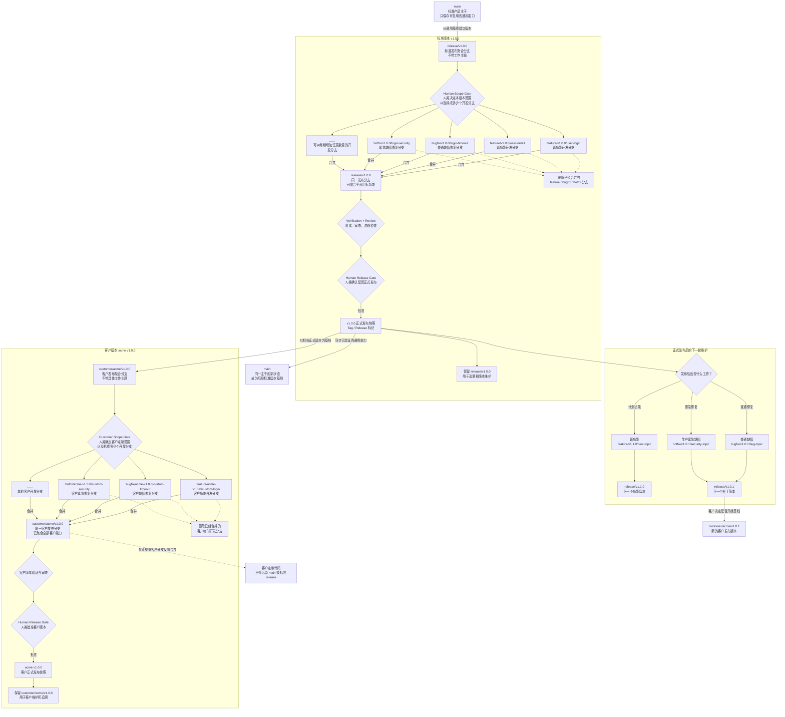

# Agent Loop Usage

**版本：** 1.5.1

这是一份给人类使用的触发指南。你不需要记住 Agent Loop 的阶段名；只要说明目标、边界和你希望 Agent 自主推进到哪里，Agent 负责判断项目状态、选择流程、维护产物并在真正的 Human Gate 停下。

## 安装和升级

### 外部环境：GitHub

外部用户统一通过 `npx skills` 从 GitHub 安装 Agent Loop。下面的命令会把它安装给 Codex、Kimi Code CLI、Claude Code 和 OpenCode：

```bash
npx -y skills add Shadow-linux/agent-loop \
  --global \
  --skill agent-loop \
  --agent codex \
  --agent kimi-code-cli \
  --agent claude-code \
  --agent opencode \
  --yes
```

以后升级和检查安装状态：

```bash
npx skills update agent-loop -g
npx skills list -g
```

不指定分支时，安装与升级读取 `main`；Agent Loop 的正式发布流程会让 `main` 与最新稳定版本保持同一提交。`alpha/*` 只用于明确指定版本的预发布验证，不会成为默认安装来源。

### 兼容安装：Git clone

无法使用 `npx`，或者需要从 Git 镜像安装时，从下面两个来源中选择一个：

```bash
# Public GitHub
git clone --branch stable-v1.5.1 --depth 1 \
  https://github.com/Shadow-linux/agent-loop.git \
  ~/.local/share/agent-loop-source

# Private Git mirror
git clone --branch stable-v1.5.1 --depth 1 \
  <git-mirror-url> \
  ~/.local/share/agent-loop-source
```

macOS/Linux：

```bash
mkdir -p ~/.agents/skills/agent-loop
rsync -ac --delete \
  --exclude='.git' \
  --exclude='.DS_Store' \
  --exclude='__pycache__/' \
  ~/.local/share/agent-loop-source/ \
  ~/.agents/skills/agent-loop/
```

Windows PowerShell：

```powershell
$Source = "$HOME\.local\share\agent-loop-source"
$Target = "$HOME\.agents\skills\agent-loop"
New-Item -ItemType Directory -Force $Target | Out-Null
robocopy $Source $Target /MIR /XD .git __pycache__ /XF .DS_Store
if ($LASTEXITCODE -ge 8) { exit $LASTEXITCODE }
```

升级时执行 `git fetch --tags`，明确切换到新的 `stable-v<version>`，再重复同步。默认安装目标是 `~/.agents/skills/agent-loop`；如果运行时不读取该目录，将同一份已验证源码同步到它配置的 Skill 目录，不要手工维护内容不同的副本。

### 升级后刷新项目 guidance

全局 Skill 更新不会自动修改已有项目的 `AGENTS.md`。进入仍在维护的 Agent Loop 项目后，对 Agent 说：

```text
Agent Loop 版本已更新，请更新项目的 AGENTS.md。
```

Agent 应先检查差异，只更新过期的 Agent Loop managed blocks，并保留人类编写的内容；实际写入仍需 Human Review。

## 最重要的用法：让 Agent 真正拥有项目

### 接管并持续维护

把下面这段直接发给 Agent：

```text
用 Agent Loop 帮我接管这个项目。
先看看现在做到哪了，之后在已经确认的范围内继续推进；需要我决定时再问我。
```

这会授权 Agent 做安全的只读检查和当前任务范围内的正常实现工作，但不会授权生产、付费、外部副作用、Git 提交或发布等独立门禁。

### 从一个已接受需求自主开发

```text
产品方案已经确认了，先准备这个功能。
范围让我确认一次；实现方案、任务和测试都准备齐以后，再一起给我确认。
```

### 只让当前任务自动跑完

```text
这个任务已经说清楚了，你把它做完并验证。
先不要开始别的任务，有变化再问我。
```

Auto-Loop 不是无限授权。Agent 仍然必须停在需求变化、关键设计、安全/数据/公共接口变化、不可用环境、重复失败、无关 dirty work、生产或外部动作、Git、提交、发布、pause 和 close 等边界。

## Agent 会怎样选择执行通道

| 人类意图 | 默认路径 | 不会发生什么 |
|---|---|---|
| 问问题、解释规则、查看状态 | Chat | 不默认创建 Requirement 或 Feature |
| 测试、部署准备、运行、诊断、切换环境 | Operational Support | 不默认写代码或碰生产 |
| 需求目标、范围、概念或产品行为仍在形成 | Requirements Discussion | 不提前创建 Feature |
| 已明确、低风险、边界小、可回滚的普通非 Bug 变更 | Lightweight Change Lane | 不为了形式创建完整 Feature |
| 行为/API/状态/数据/权限/安全/架构/迁移或影响不明 | Feature | 不走轻量旁路 |
| 人类明确称为 Bug | Bug Management → Feature repair | 不把 Bug 降级成轻量 Change |
| 代码已合并，已观察到 `.agent-loop/` 记忆冲突 | Post-Merge Memory Reconciliation | 无冲突不扫描、不写报告；有冲突只处理受影响事实 |

如果 Agent 无法确定 Lightweight 与 Feature 的边界，它应零写入地给出少量真实选项、一个推荐及证据，然后问你。

## 项目接管、恢复与理解

### 初始化或接管

```text
这是个新项目，用 Agent Loop 帮我建起来，再告诉我建议先做什么。
```

```text
帮我接管这个已有项目，先看看现在的真实状态，再告诉我从哪里继续。
```

Agent 会区分新项目、已有项目、远程项目、恢复、re-adopt 和 stale-memory，并只接受一个真实 memory root。`.agent-loop/` 与 legacy `agent-loop/` 同时存在时会停止并要求处理双根冲突。

### 恢复中断的工作

```text
继续上次的工作。先看看现在是什么状态，再从合适的位置接着做。
```

### 远程项目

```text
代码在远程机器或容器里，先找到真实的项目和运行环境，再帮我接管。
```

### 让新人看懂

```text
帮新人整理一份项目说明，让他能看懂业务、主要流程、代码放在哪，以及怎么跑起来。
```

Onboarding 是项目理解资料，不替代 Requirement、Feature、任务状态或项目记忆。

Agent 会检查核心流程完整性，并按需要使用架构/边界图、ASCII 状态图、Timeline / 时序图（Timeline / Sequence）帮助新人理解证据链。遇到 Visual Trigger 时仍按 active project-local visual skill → installed Archify → materially useful recommendation → Mermaid/ASCII fallback 选择；已有或 fallback 内嵌图可以保留 Mermaid flowchart / sequenceDiagram 或 ASCII 文本源，长期 Archify 图则保留经验证的 `source-render-v1` 对。

## 版本更新和使用帮助

### 我想知道版本更新或用法

这些说法都会路由到人类文档，而不是凭 Agent 记忆回答：

```text
1.5.1 更新了什么？
当前 1.5.1 使用的是什么流程？
和 1.2.2 比有什么变化？
现在 agent-loop 怎么用？
```

版本变化以 `CHANGELOG.md` 为准，触发方式以 `Usage.md` 为准，总览、安装和 quick start 以 `README.md` 为准。

## 需求沟通到产品文档

### 开始需求设计前

```text
我有个需求还没想完整，先别写代码。
帮我把用户、主要流程和边界聊清楚；如果完整设计会比较耗 token，先提醒我。
```

Agent 应先检查现有产品、代码、领域材料和历史决策，激活相关产品案例、模式和理论，形成候选 Product Frame，而不是让人类从空白开始设计。

Requirement Product Definition 起草后，Requirement `product.md` 会承接术语、主流程、异常路径、事实源、历史冲突、验收场景和 Decision Candidates。新 PRD 只在 `.agent-loop/requirements/<date>-<topic>/product.md`；已有 legacy Feature `product.md` 继续可读。

### 完整产品共识循环

```text
按完整产品设计来。
你先给出框架和推荐方案，再按模块和我逐步确认，直到流程、状态、数据和异常都说清楚。
```

Standard depth 可以触发：

- Concept Foundation：概念 ID、规范名称、身份、所有权、生命周期和边界
- Roles and Permissions：角色、可见性、授权与责任
- Commands and Events：人类/系统动作、反馈与事件
- Business Flow：主流程、分支、前置和终止条件
- State Model：状态、转移、终态、失败与恢复
- Product Data and Facts：产品对象、关系、事实来源和不变量
- Exceptions and Recovery：异常、重试、补偿、人工处理
- Cross-block Impact：一个决定影响的其他模块

不适用的视图写具体原因，不制造空表。Agent 每次先给推荐，不把设计工作推回给人类。

### 视觉辅助

```text
这里光看文字不太好懂，画张图给我确认。
图里确认下来的结论也记进产品文档。
```

Agent 优先使用 active project-local visual skill，然后使用已安装 Archify。不要因为 Archify 尚未安装就先把 Mermaid 当成默认画图方案：如果 Archify 能实质改善本次审核，Agent 先推荐 [Archify](https://github.com/tt-a1i/archify)，单独展示来源、revision、命令、目标、影响、doctor 和 fallback，并请求明确授权。只有 Archify 不值得安装、人类拒绝、环境不支持或安装/使用失败时，才降级到 Mermaid/ASCII。

每次生成前先给出一个有边界的 Visual Scope Grant，说明要回答的问题、权威 source IDs、图类型、工作输出、review 目的和同一问题的迭代边界。

视觉规则是 `render to converge, text to record`。工作图帮助达成共识；`product.md` 才是产品语义权威。要长期保存的图必须是带 source/render digest 和验证证据的 `source-render-v1` 对。

在 Feature Spec 中，图只能解释已接受的 Product Slice、Feature 责任和 Feature-local 实现/验收路径。已接受的局部澄清回写 `spec.md`；如果图暴露新产品含义，停止 Feature Spec 并返回 Requirements Discussion，不在该阶段直接修改 Requirement `product.md`。

### 大需求分阶段

```text
这个需求比较大，帮我拆成几个可以逐步交付的阶段，但要保留完整产品方案。
```

一个 Feature 默认只实现一个已确认 phase 或更小切片。合并多个 phase 需要回到 Requirement lifecycle 重新确认。

### 确认产品方案并记录

```text
这版产品方案符合我的想法。帮我收好最终结论和还没解决的问题，先不要开发。
```

```text
确认，就按这版产品方案记录。
```

Product Review、Requirement Record / Archive、ADR acceptance、Feature start 和 implementation 是独立门禁，不能互相代替。人类原始文字、图片、PRD 和原型保持 byte-stable；Agent 在新的 `product.md` 中解释和固化，不自动改写原件。

Product Human Review 确认“这份产品定义准确”，但不会自动接受 Requirement lifecycle、创建 Feature、执行代码或授权 Git。

## 产品方案确认后还要不要做 ADR

```text
产品方案已经确认，看看开发前还缺不缺整体技术设计。
```

你也可以直接问：

```text
这个需求会拆成多个功能，开发前先看看整体设计够不够。
有重要的技术取舍再单独找我确认。
```

简单工作可记录 `design-not-needed`。需要共享技术落地时：

```text
需要整体技术设计。根据已经确认的产品方案给我一个推荐方案，先让我看看。
```

Decision & Design / ADR 消费产品语义，不重新定义产品。新的 decision draft 默认是 `proposed`。发现产品歧义时回到 Requirements Discussion；发现既有 accepted 技术决策不兼容时保留原记录并通过 Human Review supersede。

ADR 先用 `Effective Requirement Snapshot` 锁定已确认的 Product Definition，再用 Requirement Model Scope Inventory 和 Requirement Model Technical Landing Trace 把产品流程、状态、数据、权限与异常逐项落到技术设计，避免只凭摘要重新解释需求。

## 做一个边界明确的小修改

```text
把生产脚本中的旧域名替换为新域名。
这是个小改动，用最轻但可靠的方式处理就行。
```

执行卡位于：

```text
.agent-loop/changes/YYYY-MM/YYYY-MM-DD-<topic>.md
```

它必须在第一次目标写入前记录背景、完成标准、范围、旁路理由、风险、Plan、进度、验证、回滚、Human Gates、结果和 Memory Review。事实/路径/域名/文档变更优先做语法、解析、引用、旧值残留和限定 dry-run；可隔离行为逻辑仍做最小有意义 RED/GREEN。

以下任一情况升级 Feature：公共接口、数据、状态、权限、安全、架构、依赖、迁移、未知消费者、跨会话计划、handoff/subagent、长期观察、复杂证据或范围扩大。

三张 `completed + Memory Review: pending` 卡，或最早 pending 超过七个完整日历日，会触发 Agent 主动整理稳定项目事实。高置信度事实可在精确披露 owner、证据和 rollback 后写入现有可靠记忆；语义不确定时保留给人类确认。

## 开始实现一个功能

```text
这份需求已经确认，先把其中的【具体范围】做出来。
```

典型产物：

```text
.agent-loop/features/YYYY-MM-DD-<feature>/
  spec.md
  tasks.md
  tests.md
  plan.md
  notes.md
  contracts.md        optional
```

Feature `spec.md` 只选择产品切片，不重新定义产品。复杂任务可按触发条件使用 `tasks/`、`tests/`、`plans/`、`handoffs/` 和 `contracts/` 子目录；不要默认展开。

Feature 工作从 `spec.md` 里的本地 **Feature Context Snapshot** 开始。Agent 会自动从 Requirement README 找到真正的 `product.md`，检查适用 ADR 和摘要是否仍然一致；来源未变时走快速路径，来源变化时先刷新语义或停在已有 Human Gate。人类不需要手动定位、重开或反复指定 `product.md`。Snapshot 只是派生执行上下文，不是第二份产品真相；只有复杂且长期运行的 Feature 才会在现有 Complex Artifact Human Gate 后增加可选 `context.md`。

你不需要记住 Feature 的内部阶段。正常只会在两个时点找你：

1. **确认做什么**（Feature Definition Review）：你确认功能范围和验收结果。
2. **确认怎么做**（Implementation Readiness Review）：Agent 把实现方案、任务、测试、风险和回滚一次准备齐，你看完整包后决定是否开工。

第一次确认后，Agent 会自行完成任务拆分、测试设计、E2E 判断、代码理解和实施计划，不会每写一份文档就停下来问一次，也不会提前改目标代码。

#### 第一次：范围没问题

```text
范围没问题。把实现方案、任务和测试都准备齐，再一起给我看。
```

#### 第二次：方案没问题，直接开始

```text
方案没问题，开始做吧。
```

如果这次只想把方案留好，可以说：

```text
方案没问题，先把文档保存好，暂时不要写代码。
```

以后要继续，不必重新解释全部背景：

```text
继续做这个功能。开始前先确认需求和方案没有变化。
```

Agent 会核对保存的范围、产品来源、技术决策和完整实施包。内容没变就直接继续；范围、任务或稳定方案发生变化时，才会再次请你确认。

任务拆分、测试设计、E2E、技术设计和 Plan 仍然会完成，只是不再逐项打断你。Delivery Contract、subagent、Git、外部系统、生产、提交、关闭和发布仍各自需要确认。同一时间最多一个 Active Feature；切换时会先保存恢复点。

### 判断是否需要交付约定

```text
这个改动会影响其他模块或调用方吗？有必要再补交付约定，不要为了形式加文档。
```

Delivery Contract 不是默认 artifact。创建、接受和 breaking change 各自需要 Human Gate。

## Bug 管理与修复

```text
这是一个 Bug：【描述现象】。
先帮我查清楚正确行为和问题可能在哪，暂时不要改代码。
```

```text
确认，按你推荐的方式修复这个 Bug。
```

Bug Record 管身份、来源、事实、证据、生命周期、Resolution Path、reopen 和 close；Requirement 管产品目标与预期行为；所有代码修复由 Feature 工作流承担。

Bug 与 Requirement 是可选多对多关系。产品含义不清时回到 Requirements Discussion。默认 Feature ownership metadata scan 为 90 个日历日，但不是硬边界；路径、符号、验收、回归或归档 locator 有证据时继续向更早历史查找。Bug Close、Feature Close、commit 和 release 是独立门禁。

## 运行、测试和排障

```text
先帮我弄清楚这个项目怎么启动和测试，不要改代码。
```

```text
帮我看看这个线上故障该怎么排查。要碰生产或外部系统时先问我。
```

```text
这个操作已经重复做过几次了，看看能不能整理成项目里的固定能力。
```

Operational Support 默认先只读检查代码、配置、脚本、部署流程和环境事实。需要代码变更时再路由 Lightweight、Feature 或 Bug；不会用“运维”名义绕过写入门禁。

### 临时修正 Agent Loop Checker

如果校验器本身可能有问题，可以说：

```text
这个 Agent Loop Checker 可能有问题。
先保留原始失败并判断是文档、环境还是 Checker；
如果确实是 Checker 缺陷，给我一个隔离临时修复方案，
我确认后只用于当前 Gate。
```

Agent 会先重跑原命令并缩小问题。确认为 Checker 缺陷后，它会展示原 Checker 路径和 digest、最小复现、规则依据、补丁范围、RED/GREEN、反例检查、临时目录、回滚和失效条件。人类确认前不会写补丁；默认只修改隔离副本，不会静默改全局 Agent Loop。

临时结果只能作为当前指定 Gate 的人类批准替代证据。原始 canonical 结果仍记录为失败，换了文件、Checker、命令或 Gate 就失效；正式修复仍需回到 Agent Loop 源码、补回归测试并通过正式验证。

## 把重复操作变成项目能力

```text
这套操作以后还会重复，帮我看看是否值得做成项目技能。
```

Gate 1 批准后，Agent 才可创建：

```text
.agent-loop/skills/
  INDEX.md
  <skill-name>/
    SKILL.md
    validation.md
```

验证通过可把 Skill 从 `proposed` 变为 `active`，但每次真实调用仍需要与本次范围绑定的 Execution Gate。发现 Skill 不等于授权执行；上次成功也不授权下一次。

项目 Skill 不一定显示在运行时原生 Skill 列表中；Agent 必须先检查 `.agent-loop/skills/INDEX.md` 再声称没有项目能力或进入通用 fallback。

## 分支管理

### 我想让 Agent 推荐分支管理方式



```text
这个项目还没有分支规范，先看看现状并推荐一套；我确认前不要动分支。
```

可选推荐模型：

```text
main
release/v1.0.0
customer/acme/v1.0.0
feature/v1.0.0/user-login
bugfix/v1.0.0/login-timeout
hotfix/v1.0.0/login-security
```

规范模式也可概括为 `feature|bugfix|hotfix/vX.Y.Z/<topic>`；客户专属开发分支使用 `feature|bugfix|hotfix/<customer>-vX.Y.Z/<topic>`。

`release` 和 `customer` 是长期聚合/发布分支；`feature`、`bugfix`、`hotfix` 是合入目标版本后删除的临时开发分支。Agent 只在现有规范混乱、目标版本不清或客户隔离有风险时推荐；清晰的既有规范优先。

采用策略、创建、切换、merge、删除、push、tag、release 和 publish 都是不同 Human Gate。

## 按月份归档已关闭功能

```text
帮我看看 2026 年 5 月和 6 月有哪些已关闭功能可以归档，先给我方案，不要直接移动。
```

确认精确 plan SHA-256 后，Agent 才把完整 Feature 目录移动到：

```text
.agent-loop/features/YYYY-MM/<feature-id>/
```

`features/archive.md` 用稳定 Feature ID 定位当前位置。Archive 不压缩、不删除、不改变产品或决策权威。需要再次修复时先独立 rehydrate scan 和 Human Gate；rehydrate 不自动 reopen Feature。

## 代码合并后校准项目记忆

代码必须先完成 merge 并验证。之后说：

```text
代码已经合并并验证。只处理已经观察到的项目记忆冲突：
事实足够就用最新验证结果定向修正，无法判断时再给我少量选项。
如果没有冲突，不要扫描全部记忆，也不要创建报告。
```

普通流程是：

```text
发现真实冲突？
├─ 否 → reconciliation-not-needed；不扫描、不写文件、不增加 Human Gate
└─ 是 → 只查看冲突事实、语义 owner、直接引用和最少证据
         ├─ 最新验证事实能确定唯一结果 → Agent 定向重写、验证并保留窄回滚
         └─ 仍有多个合理含义 → 在会话内给出少量选项和一个推荐
```

Target 是当前理解的起点，不是永远正确的一方；Source 经验已经由 Git 合入。Agent 用最新且适用于当前问题的代码、测试、配置或环境证据修正 Agent 维护的当前事实，同时保留人类原始材料、已接受的 Product Definition、ADR、Human Decision 和追加式历史。代码能证明“现在实现了什么”，不能静默改写“产品本应是什么”。

小冲突优先在当前会话里核对，不为了一个答案创建文件。只有多个相互关联的冲突、工作需要跨会话延续、回滚/恢复证据较复杂，或人类明确要求留档时，才创建精简的 `memory-merges/MM-<merged-code-short-sha>-<topic>/README.md`；它只记录真实冲突、证据、实际改写、定向验证、回滚和仍待决定的问题。

如果确实需要取证式全量检查，要明确说：

```text
请执行 Full Memory Audit / Recovery。
对整个 Agent Loop memory root 做四快照和全路径核对，先给我审计范围与计划，不要直接 Apply。
```

只有这条显式授权的 Recovery 路径才使用 Base / Source / Target-before / Result 四快照、全路径清单、Desired Target Memory、精确 Plan Hash、事务 Apply / Post-check / Restore 和对应工具。普通无冲突或小冲突处理不会自动升级成 Full Memory Audit。

确定性、边界明确且可回滚的定向修正由 Agent 负责，不额外制造 reconciliation Human Gate；只有无法从事实判断的语义选择才交给人类。Full Memory Audit / Recovery 的审计范围和 Apply/Restore、memory commit、push、release 与 Source cleanup 仍是相互独立的 Human Gate。

## 提交、暂停与关闭

```text
这些改动准备提交了，先帮我完整检查一遍，暂时不要提交。
```

提交前 Agent 应同时复核 feature 文档、requirement 记录、代码 diff、验证证据、drift、project memory、root/directory guidance 影响和 unrelated changes。

```text
确认，提交刚才审阅过的这些改动。
```

第二句话只有在前面的精确范围仍然有效时才授权 commit；push、PR、merge、tag、release 和 publish 仍需分别授权。

```text
帮我看看这个功能是不是真的可以关闭，还有没有风险或后续工作。
```

Feature Close Review 先确认所有任务、验收、测试、决策切片、Bug、drift、memory、残余风险和后续工作。关闭需要人类确认，不能由测试通过自动推导。

## 常用产物

| 路径 | 作用 |
|---|---|
| `.agent-loop/project.md` / `project/*.md` | 长期项目事实、当前工作与恢复动作 |
| `.agent-loop/onboarding-db/` | 新人项目理解和证据图 |
| `requirements/<set>/product.md` | Human-reviewed Brief/Standard 产品定义 |
| `decisions/*.md` | 条件触发、Human-accepted 的共享技术决策 |
| `changes/YYYY-MM/*.md` | 持久轻量执行卡 |
| `bugs/<bug>/README.md` | Bug identity、证据、Resolution Path 和 close |
| `features/<feature>/spec.md` | Feature Context Snapshot、Product Slice 与行为规范 |
| `features/<feature>/context.md` | 仅复杂 Feature 可选的扩展派生上下文，不拥有产品真相 |
| `features/<feature>/tasks.md` | 任务分解和状态 |
| `features/<feature>/tests.md` | 测试设计和验收矩阵 |
| `features/<feature>/plan.md` | 当前 task/story 的实施计划 |
| `features/<feature>/notes.md` | 决策、证据、drift、恢复和 review |
| `skills/INDEX.md` | project-local Skills 的状态、触发和范围 |
| `memory-merges/<merge>/README.md` | 仅在复杂、跨会话或显式要求时保存精简冲突、证据、改写、验证和回滚 |

`project.md` 记录当前工作和当前恢复动作，不承担需求待办；未来、deferred 和 backlog 项进入 Requirement lifecycle 与可选 `requirements/INDEX.md`。

## 检查项目根目录的 AGENTS.md

```text
帮我看看项目根目录的 AGENTS.md 有没有落后。先告诉我差异，不要直接覆盖。
```

当脚本可用时，Agent 使用 Python 3.10+ 运行 `scripts/check-root-agents-blocks.py`，把结果作为 Human Review Summary 证据；写入仍需单独确认。

## 你不需要记住阶段名

这些自然语言都应该被正确路由：

```text
接管并持续维护这个项目。
先别写代码，帮我把需求聊清楚。
这个需求比较复杂，先告诉我需要讨论多久、会不会比较耗 token。
先提出产品框架，再按模块和我逐步确认。
用图帮助我确认流程和状态。
产品方案已经确认，看看开发前还缺什么整体设计。
这个改动很小，请选最轻但可靠的方式处理。
这是一个 Bug，先确认正确行为和可能归属。
这个功能的范围已经确认，接下来你自主推进。
帮我跑通测试和部署流程，但先不要碰生产。
这套操作以后还会重复，请帮我整理成项目能力。
给这个项目推荐分支规范。
把两个月前已经关闭的功能按月份归档。
代码合并完了；无记忆冲突就不处理，有冲突只按最新验证事实定向校准。
提交前做一次完整检查。
检查这个功能是否真的可以关闭。
```

Agent 的责任是把人类目标翻译为正确的下一步，并保持项目可验证、可恢复、可继续。

## Human Gate 原则

以下授权永不因为 Auto-Loop、历史批准或其他门禁而自动获得：

- 改写人类原始需求材料
- 接受 Product Definition、ADR 或 Delivery Contract
- 合并 Delivery Phases 或改变已接受范围
- 创建或实质更新 project-local Skill，以及每次实际执行
- 生产、预发、secret、付费、外部调用、配置写入或破坏性操作
- branch create/switch/merge/delete
- commit、push、PR、tag、release、publish
- Feature pause/close、Bug close、archive/rehydrate Apply、Full Memory Audit / Recovery Apply/Restore

Agent 可以完成安全检查、形成推荐并准备精确计划；人类只处理真正需要判断或授权的部分。
