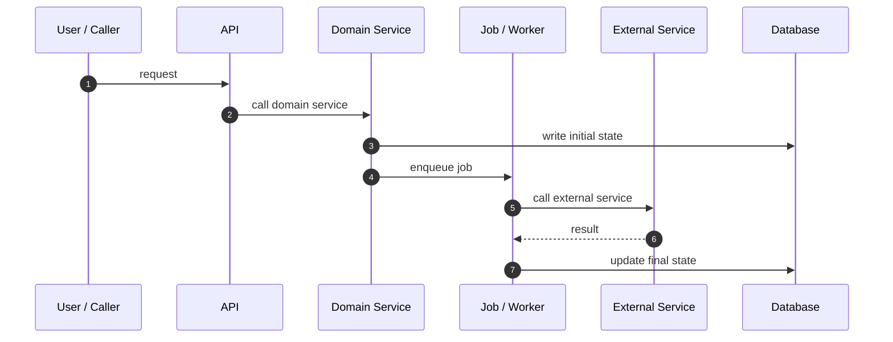

# Human-Readable Flow Documents Proposal

Status: proposal
Date: 2026-06-08
Target Version: v1.2.x
Scope: Project Onboarding Scan / onboarding-db flow documents

## Background

Current `templates/onboarding-db/flow-template.md` is structurally useful for agents, but it can still read like a generic field checklist.

A stronger onboarding-db flow document should help a newcomer understand a real business flow quickly:

- first see the whole chain,
- then memorize the main path,
- then inspect exact files/functions/tasks,
- then understand state, async behavior, verification, and risks.

The example that triggered this proposal:

```text
/Users/shaodowyd/Desktop/workspace/yuanjing/jingshu@meeting/ai-meeting-minutes-backend/.agent-loop/onboarding-db/flow-meeting-minutes-generation.md
```

It works well because it combines:

- one readable Mermaid diagram,
- a short linear "main flow" memory aid,
- detailed call-chain tables,
- API/task/service/state sections,
- compensation and retry notes,
- reading order,
- common misunderstandings,
- verification hints,
- risks.

## Problem

The existing flow template is too abstract:

```text
Purpose
Flow Summary
Diagram
Steps
Entrypoints And Exits
Data / State Changes
Async / Job / External Behavior
Verification
Risks
Project Memory Backfill
```

This is enough for agents to fill fields, but not enough to guarantee a high-quality human onboarding document.

Common failure modes:

| Failure | Impact |
|---|---|
| Diagram exists but is too generic | Human still cannot see the actual path |
| Steps table lacks file/function details | Agent cannot guide code reading |
| Async tasks are mentioned but not sequenced | Human cannot debug delayed state changes |
| State fields are listed but not tied to writers | Human cannot answer "who changed this status?" |
| Verification is generic | Human cannot know which tests prove this flow |
| Misunderstandings are not captured | Newcomer repeats the same wrong reading path |

## Proposed Direction

Make onboarding-db flow docs human-readable first, agent-verifiable second.

All generated human-readable onboarding-db documents should default to Chinese unless the human or project explicitly prefers another language. Keep file paths, commands, API names, code symbols, stage names, and stable artifact names in English/as-is.

Flow documents should use this preferred order:

1. Metadata
2. Purpose
3. One Diagram To Understand The Flow
4. Main Flow Quick Notes
5. Call Chain Details
6. API Entrypoints
7. Task / Job Entrypoints
8. Module / Service Responsibility Boundaries
9. Key State Changes
10. Retry / Compensation / Failure Paths
11. Code Reading Order
12. Common Misunderstandings
13. Verification Hints
14. Risks
15. Project Memory Backfill

## Proposed Template Shape

```md
# Flow: <business flow name>

Document Language:
Last Verified:
Confidence:
Source Evidence:
Human Review Status:

## Purpose

<One or two sentences explaining the business outcome.>

## One Diagram To Understand The Flow



## Main Flow Quick Notes

```text
Start
-> Step 1
-> Step 2
-> Async / external wait if any
-> Final state
```

## Call Chain Details

| Stage | Trigger | File | Function | What It Does | Next Step |
|---|---|---|---|---|---|
| TBD | TBD | TBD | TBD | TBD | TBD |

## API Entrypoints

| API | File | Function | Purpose |
|---|---|---|---|
| TBD | TBD | TBD | TBD |

## Task / Job Entrypoints

| Task / Job | File | Queue / Scheduler | Service | Purpose |
|---|---|---|---|---|
| TBD | TBD | TBD | TBD | TBD |

## Module / Service Responsibility Boundaries

| Module / Service | Responsibility In This Flow | Not Responsible For |
|---|---|---|
| TBD | TBD | TBD |

## Key State Changes

| Object | Field | Common Transitions | Writer / Owner |
|---|---|---|---|
| TBD | TBD | TBD | TBD |

## Retry / Compensation / Failure Paths

| Failure / Delay | Where It Happens | Retry / Compensation | Evidence |
|---|---|---|---|
| TBD | TBD | TBD | TBD |

## Code Reading Order

1. `path/to/file.py:function()`
2. `path/to/next_file.py:function()`

## Common Misunderstandings

- TBD

## Verification Hints

| Check | File / Command / Scenario | What It Proves |
|---|---|---|
| TBD | TBD | TBD |

## Risks

| Risk | Why It Matters | Suggested Verification |
|---|---|---|
| TBD | TBD | TBD |

## Project Memory Backfill

| Candidate Fact | Backfill Target | Reason | Evidence | Confidence |
|---|---|---|---|---|
| TBD | TBD | TBD | TBD | low |
```

## Rules For Diagrams

The diagram should answer one flow question, not show the whole repository.

Recommended diagram types:

| Flow Type | Preferred Diagram |
|---|---|
| request -> service -> DB | sequenceDiagram |
| queue / worker / callback | sequenceDiagram |
| state lifecycle | stateDiagram-v2 |
| branching business process | flowchart |
| module boundary | flowchart |

Avoid:

- full function-level graphs,
- every import edge,
- diagrams without file/function details elsewhere,
- diagrams that hide async callbacks or delayed jobs.

## Relationship To Existing Templates

This proposal should update:

- `templates/onboarding-db/flow-template.md`
- `references/onboarding-db-templates.md`
- `references/project-onboarding-scan.md`
- `references/validation-scenarios.md`

It may also add a validation scenario:

```text
Use agent-loop. Deep Project Onboarding Scan generated a core business flow doc.
The doc has a diagram and generic steps, but lacks quick notes, call-chain details,
API/task entrypoints, responsibility boundaries, state changes, code reading order,
common misunderstandings, and verification hints.
```

Expected behavior:

- reject the flow doc as incomplete for human onboarding,
- require the human-readable flow structure,
- keep evidence and confidence fields,
- keep diagrams small and scoped,
- use Batch Human Review before writing or replacing the onboarding-db flow file.

## Open Questions

1. Should every core flow require this full structure, or only `Expanded` and selected `Standard` flows?
2. Should `Compact` mode include a shorter version of this structure inside `flows-and-data.md`?
3. Should existing flow docs be upgraded automatically during refresh, or only after human confirmation?
4. Should call-chain tables require function names, or allow module-level entries when function evidence is uncertain?

## Recommendation

Adopt this as the default shape for core business flow documents.

For small projects, keep the same logic but allow shorter sections.

For large projects, require this structure for each core business flow because it is the most useful onboarding artifact for humans and future agents.
