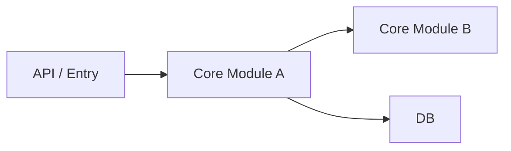
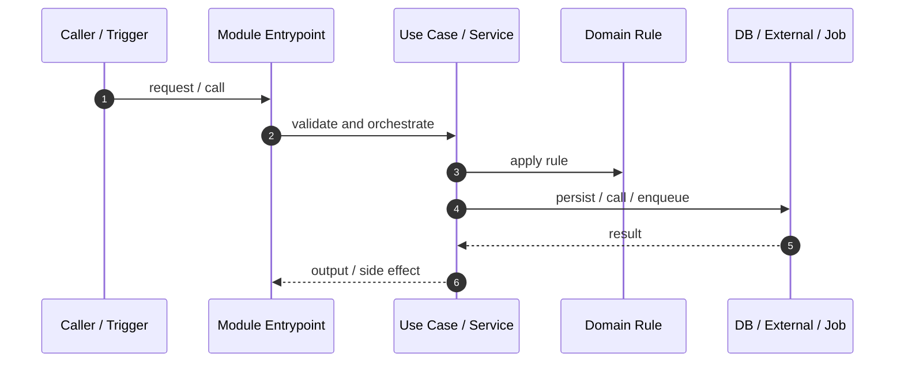
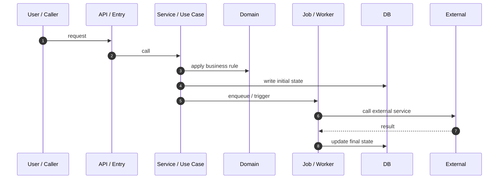
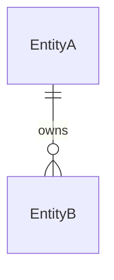

# Proposal: Project Onboarding Scan Improve

状态：讨论草案
目标版本：alpha-v1.2.0
创建时间：2026-06-08
范围：Project Onboarding Scan / onboarding-db 信息架构、模块文档、流程文档、图文档

## 背景

当前 `Project Onboarding Scan` 已经可以生成 onboarding-db、模块图、边界图、核心流程图、异步/任务图等资料。

但真实项目试跑后暴露出几个问题：

| 问题 | 影响 |
|---|---|
| onboarding-db 根目录文件容易平铺过多 | 人类不知道从哪里开始读 |
| `module-map.md` 容易塞入太多模块细节 | 模块越多越像一份难读的百科 |
| 核心模块缺少独立详解文档 | 新人无法快速理解某个模块的入口、边界、调用链和测试 |
| flow 文档容易变成通用字段清单 | 有图但没有速记、调用链明细、状态变更、阅读顺序 |
| 图的生成规则不够明确 | Agent 可能画太少，也可能画全仓库爆炸图 |
| 证据链写得太泛 | 人类和后续 Agent 无法追到真实代码路径、函数、对象和参数 |
| 人类问问题时缺少“补图/补文档”的机制 | onboarding-db 难以随理解过程持续增强 |

本 proposal 的目标是把 onboarding-db 从“扫描产物集合”升级为“新人接管项目的可读知识库”。

## 设计目标

1. 让人类先读总览，再按分类进入模块、流程、运行、领域、质量资料。
2. 让 `module-map.md` 成为模块导航，而不是模块详情堆叠。
3. 为核心模块建立 `modules/<module>.md` 详解文档。
4. 让核心 flow 文档默认具备“图 + 速记 + 明细 + 阅读顺序”。
5. 明确哪些图必须生成，哪些图按项目现实触发。
6. 所有关键结论都要有可追溯证据链，明确文件路径、核心函数/对象/参数和简要说明。
7. 支持人类问 AI 时，Agent 可以在合适文档中建议新增或更新小图。
8. 所有 onboarding-db 写入仍需人类确认，并通过 Batch Human Review 进行批量确认。

## 建议目录结构

onboarding-db 建议采用轻量分类，最多两层，不复制代码目录。

```text
.agent-loop/onboarding-db/
  README.md
  overview.md

  maps/
    module-map.md
    boundary-map.md
    directory-map.md
    change-impact-map.md

  modules/
    <module>.md

  flows/
    <flow>.md

  runtime/
    setup-and-run.md
    environment.md
    deployment-and-operations.md
    jobs-and-schedules.md
    async-and-events.md

  domain/
    data-model.md
    entities/
      <entity>.md
    state-flow-<entity>.md
    state-trace-<entity>.md
    glossary.md
    decisions-and-history.md
    security-and-permissions.md

  quality/
    testing-and-verification.md
    risks-and-unknowns.md
```

目录含义：

| 分类 | 放什么 | 不放什么 |
|---|---|---|
| 根目录 | 新人入口、项目总览 | 大量细节 |
| `maps/` | 导航型地图、模块关系、边界、目录、改动影响 | 单个模块长篇解释 |
| `modules/` | 核心模块详解 | 每个代码目录的机械说明 |
| `flows/` | 核心业务链路详解 | 全仓库调用图 |
| `runtime/` | 启动、环境、部署、异步、任务、运维 | 业务状态细节 |
| `domain/` | 数据模型、核心实体详解、状态流转、状态溯源、术语、决策、安全权限 | 任务执行日志 |
| `quality/` | 测试、验证、风险、未知 | 原始测试输出堆叠 |

补充说明：

- `maps/directory-map.md`：代码目录树导航，回答"代码放在哪里、每个目录做什么、哪些目录先读"。
- `domain/data-model.md`：数据模型索引，回答"项目有哪些核心实体、实体之间怎么关联、谁拥有这些数据"。
- `domain/entities/<entity>.md`：复杂核心实体详解，回答"这个实体有哪些关键字段、谁读写它、它参与哪些流程和测试"。
- `domain/state-flow-<entity>.md`：单个核心实体的状态流转图（如 `pending → processing → done`），写清每个状态的进入条件、离开条件和副作用。
- `domain/state-trace-<entity>.md`：回答"谁在什么条件下改了这个状态"，追踪所有写入该状态字段的代码位置。与 `flows/<flow>.md` 中的 `Key State Changes` 分工：flow 文档记录流程内的状态变化速览，state-trace 做跨流程的全局溯源。

规则：

- 最多两层：`onboarding-db/<category>/<doc>.md`。
- 不要再往下拆成 `modules/backend/payment/service/...`。
- 分类目录是为了人类阅读，不是为了复刻代码目录。
- `README.md` 必须提供分类导航和阅读路径。

## 与现有文件的关系

本提案引入分类目录，拆分了当前 Compact 布局的几个合并文件：

| 现有文件（Compact） | 拆分为 |
|---|---|
| `code-map.md` | `maps/directory-map.md`（目录导航） + `maps/module-map.md`（模块索引） |
| `architecture-and-integrations.md` | `maps/boundary-map.md`（系统边界） + `maps/module-map.md`（模块关系图） + `runtime/async-and-events.md`（异步基础设施） + `runtime/deployment-and-operations.md`（部署拓扑） |
| `flows-and-data.md` | `flows/<flow>.md`（业务流程详情） + `domain/data-model.md`（数据模型） + `domain/state-flow-*.md`（状态流转） + `runtime/jobs-and-schedules.md`（定时任务） |
| `verification-and-risks.md` | `quality/testing-and-verification.md`（测试体系） + `quality/risks-and-unknowns.md`（风险清单） + `maps/change-impact-map.md`（改动影响） |

Compact 布局下仍可使用合并文件，但 README 必须说明每个主题在哪里读。

## `module-map.md` 与 `modules/*.md` 分工

`module-map.md` 应该是模块索引和导航地图。

它回答：

| 问题 | 内容 |
|---|---|
| 项目有哪些核心模块 | 模块列表 |
| 每个模块一句话做什么 | 简短职责 |
| 模块之间怎么依赖 | 模块关系图 / 表格 |
| 读某个模块从哪里开始 | 链接到 `modules/<module>.md` |
| 哪些模块还没有详解 | coverage / unknown |

`modules/<module>.md` 才负责模块详解。

它回答：

| 问题 | 内容 |
|---|---|
| 这个模块做什么 | Purpose / Boundary |
| 从哪里进入 | API / job / command / UI / service entrypoints |
| 核心调用链怎么走 | Core Call Chain + 小图 |
| 关键文件有哪些 | Key Files |
| 参与哪些业务流程 | Related Flows |
| 依赖谁 / 被谁依赖 | Dependencies |
| 数据和副作用 | Data / Side Effects |
| 怎么测试 | Tests |
| 改它会影响哪里 | Change Impact |
| 证据从哪里来 | Evidence Chain |
| 风险和未知 | Risks / Unknowns |

### 什么时候创建 `modules/<module>.md`

不应该每个目录都创建模块文档。

| 情况 | 是否创建 |
|---|---|
| 长期业务模块 / bounded context | 应该创建 |
| 有独立入口、独立数据、独立流程、独立测试 | 应该创建 |
| 被多个 feature 反复影响 | 应该创建 |
| 人类明确想理解某个模块 | 可以通过 Targeted Onboarding Scan 创建 |
| `utils/`、`scripts/`、`types/`、`generated/` | 通常不创建，放在 `module-map.md` 支持性模块区 |
| Compact 小项目 | 可以先不建 `modules/`，但要允许升级 |

推荐关系：

```text
maps/module-map.md
  -> modules/meeting-minutes.md
      -> flows/meeting-minutes-generation.md
      -> maps/change-impact-map.md
      -> quality/testing-and-verification.md
```

## Flow 文档升级

核心 flow 文档应默认使用人类可读结构，而不是通用字段清单。

推荐结构：

```md
# Flow: <business flow name>

Document Language:
Created:
Last Updated:
Last Verified:
Confidence:
Source Evidence:
Human Review Status:

## Purpose

## 一张图看懂

## 主流程速记

## 调用链明细

## API Entrypoints

## Task / Job Entrypoints

## Module / Service Responsibility Boundaries

## Key State Changes

## Retry / Compensation / Failure Paths

## Code Reading Order

## Common Misunderstandings

## Verification Hints

## Evidence Chain

## Risks / Unknowns

## Project Memory Backfill
```

核心原则：

- 图回答一个流程问题，不画全仓库。
- 主流程速记帮助人类先记住主路径。
- 调用链明细必须包含文件 / 函数 / 模块 / 下一步。
- 异步、任务、重试、补偿不能被一句话带过。
- 状态变化必须写清楚 writer / owner / trigger。
- `Code Reading Order` 告诉新人先看哪个文件，再看哪个文件。
- `Common Misunderstandings` 记录容易误读的地方。
- `Evidence Chain` 必须列出关键文件路径、函数/方法/类/对象、参数或字段，以及这条证据证明了什么。

### `flows/` 与 `runtime/` 的边界

| 分类 | 放什么 | 边界 |
|---|---|---|
| `flows/<flow>.md` | 某条业务流程内的异步行为、任务触发、状态变更 | **流程视角**，只写这条链路涉及的部分 |
| `runtime/async-and-events.md` | 项目全局的异步基础设施模式 | **基础设施视角**，有哪些队列、事件总线、通用消费模式 |
| `runtime/jobs-and-schedules.md` | 项目全局的定时任务总览 | **基础设施视角**，所有 cron/scheduler/worker 的清单 |

规则：如果一条异步信息只在某个 flow 内相关，写在 flow 文档里；如果它是全局复用基础设施，写在 runtime。

## 数据模型分析

数据模型是接管业务系统时的核心理解入口。它不能只作为 flow 文档里的附属字段存在。

只要项目存在数据库、ORM、schema、migration、persistent model、核心实体关系、对象存储元数据、队列持久化记录或其他持久化业务对象，就应该生成或更新 `domain/data-model.md`。

`domain/data-model.md` 默认是数据模型索引，不应该塞满所有字段。

它回答：

| 问题 | 内容 |
|---|---|
| 项目有哪些核心实体 | Core Entity Index |
| 实体之间怎么关联 | Entity Relationship Diagram / Relationship Table |
| 谁拥有这些数据 | Ownership / Owning Module |
| 哪些字段最关键 | Key Fields / Business Identifiers |
| 哪些字段是状态字段 | State Field Index |
| 谁读写这些数据 | Writers / Readers / Consumers |
| 哪些 API / flow / job 依赖它 | Usage Map |
| 哪些实体需要详解 | Detail Doc Coverage |

### `domain/data-model.md` 与 `domain/entities/*.md` 分工

| 文档 | 负责什么 |
|---|---|
| `domain/data-model.md` | 数据模型总览、核心实体列表、实体关系图、状态字段索引、数据所有权、读写入口 |
| `domain/entities/<entity>.md` | 单个复杂实体详解，包括字段、状态、写入点、读取点、关联 flow、测试、风险 |
| `domain/state-flow-<entity>.md` | 这个实体的合法状态流转 |
| `domain/state-trace-<entity>.md` | 谁在什么条件下修改状态字段 |

### 什么时候拆 `domain/entities/<entity>.md`

| 触发 | 是否拆 |
|---|---|
| 实体字段很多，`data-model.md` 读起来太长 | 应该拆 |
| 实体有复杂状态机 | 应该拆 |
| 多个 flow / API / job 都读写它 | 应该拆 |
| 有历史兼容字段、迁移、派生字段 | 应该拆 |
| 人类频繁问这个实体 | 可以通过 Targeted Onboarding Scan 拆 |
| 简单 lookup / config 表 | 不拆，留在 `data-model.md` |
| 中间表 / join table 没有业务语义 | 不拆，只作为关系说明 |

### 数据模型分析内容

`domain/data-model.md` 至少应包含：

| Section | 内容 |
|---|---|
| Core Entity Index | 核心实体、存储位置、所属模块、业务含义 |
| Entity Relationship Map | 实体关系图或关系表 |
| Ownership | 谁负责创建、修改、删除或归档 |
| Key Fields | 业务 ID、外键、状态字段、时间字段、派生字段 |
| State Field Index | 哪些实体有状态字段，链接到 state-flow/state-trace |
| Writers / Readers | 写入点、读取点、消费方 |
| API / Flow / Job Usage | 哪些接口、流程、任务依赖这些实体 |
| Migrations / Seeds | 迁移、初始化数据、兼容历史 |
| Tests | 证明数据行为的测试 |
| Evidence Chain | 文件路径、模型/表/字段、函数、参数、证明结论 |

`domain/entities/<entity>.md` 至少应包含：

| Section | 内容 |
|---|---|
| Purpose | 这个实体代表什么业务对象 |
| Storage Mapping | 表、ORM model、schema、collection、DTO |
| Fields | 字段、类型、含义、是否关键 |
| Relationships | 关联实体、关系方向、删除/级联风险 |
| State Fields | 生命周期状态字段 |
| Writers | 哪些代码路径写入 |
| Readers / Consumers | 哪些代码路径读取或消费 |
| Related Flows | 关联业务流程 |
| Migrations / History | 迁移、历史字段、兼容字段 |
| Tests | 覆盖该实体行为的测试 |
| Risks / Unknowns | 高风险字段和未知 |
| Evidence Chain | 具体文件、对象、字段、函数、参数 |

### 数据模型图规则

| 图 | 触发 | 位置 |
|---|---|---|
| 数据实体关系图 | 有数据库表、ORM model、核心实体关系 | `domain/data-model.md` |
| 单实体关系图 | 某个实体关联复杂 | `domain/entities/<entity>.md` |
| 状态流转图 | 实体有重要状态字段 | `domain/state-flow-<entity>.md` |
| 状态变更溯源图 | 人类问"是谁改了状态"或状态写入复杂 | `domain/state-trace-<entity>.md` |

规则：

- 不画全量数据库 ERD，除非项目非常小。
- 默认画核心实体关系图，只保留能帮助业务理解和改动判断的关系。
- 图中的实体、字段和关系必须能追溯到 Evidence Chain。
- 如果证据不足，标记 `Unknown` 或 `Not found`，不要猜字段含义。

## 证据链规则

onboarding-db 的证据不能只写“见源码”或“来自代码扫描”。

每个关键模块、流程、图、状态变化、异步任务、部署路径、测试结论都应该有证据链。

证据链至少包含：

| 字段 | 说明 |
|---|---|
| File Path | 真实文件路径 |
| Symbol / Object | 函数、方法、类、对象、表、模型、配置项、任务名、队列名等 |
| Parameters / Fields | 关键参数、请求字段、状态字段、配置字段、返回值或副作用 |
| Description | 这段代码/配置大致做什么 |
| Proves | 它支撑了文档中的哪个结论 |
| Confidence | high / medium / low |

推荐表格：

| File Path | Symbol / Object | Parameters / Fields | Description | Proves | Confidence |
|---|---|---|---|---|---|
| `path/to/file` | `functionName()` | `arg`, `status`, `id` | 简要说明 | 证明哪个入口/状态/调用链 | high |

规则：

- 文件路径必须真实存在，或标记为 `Unknown / Not found`。
- 函数、对象、参数不能编造；不确定时写 `Unknown` 并说明原因。
- 证据描述要能帮助人类判断“为什么 Agent 得出这个结论”。
- 图中的关键节点应该能在证据链里找到对应文件或对象。
- flow 的调用链明细与证据链应该能互相对上。
- 如果证据来自 README、配置、CI、日志或人类说明，也要标明来源和置信度。
- 不写真实 secrets、token、密码、生产连接串。

## Layout Mode 落盘规则

Layout Mode 控制物理文件颗粒度，不控制理解维度是否存在。

| Layout | 模块文档 | Flow 文档 | 分类目录 |
|---|---|---|---|
| Compact | 可只在 `maps/module-map.md` 或 `code-map.md` 写模块卡片 | 可在 `flows-and-data.md` 写迷你 flow 卡片 | 可减少目录，但 README 必须说明内容承载位置 |
| Standard | 建议使用 `maps/module-map.md` + 必要 `modules/<module>.md` | `flows/<flow>.md` 或 `core-flows.md`，按复杂度决定 | 推荐使用轻量分类 |
| Expanded | 核心模块应有 `modules/<module>.md` | 复杂核心 flow 应有 `flows/<flow>.md` | 使用分类目录，但不超过两层 |

Compact 合并不等于省略。

如果 Compact 不建 `modules/` 或 `flows/`，README 必须告诉人类：

| 我要理解 | 去哪里读 |
|---|---|
| 某模块 | `maps/module-map.md#<module>` 或 `code-map.md#<module>` |
| 某流程 | `flows-and-data.md#<flow>` |
| 异步任务 | `runtime/async-and-events.md` 或 Compact 等价章节 |

## 图生成规则

图分为必需图和触发图。

### 必需图

Deep Project Onboarding Scan 默认必须有：

| 图 | 位置 | 什么时候必须有 | 作用 |
|---|---|---|---|
| 模块关系图 | `maps/module-map.md` | Deep Onboarding Scan | 看清核心模块怎么协作 |
| 系统边界图 | `maps/boundary-map.md` | Deep Onboarding Scan | 看清 UI / API / Domain / DB / Jobs / External 的边界 |
| 至少一张核心业务流程图 | `flows/<core-flow>.md` 或 Compact 等价章节 | Deep Onboarding Scan | 看清项目最重要的一条业务链路 |
| 核心模块调用链图 | `modules/<module>.md` 或 `maps/module-map.md` 等价章节 | 对每个核心模块 | 看清模块从入口到输出怎么走 |

如果某个必需图无法生成，不允许假画。必须写：

```text
Unknown / Not enough evidence
原因：
证据：
下一步建议：
```

### 触发图

| 图 | 触发条件 | 建议位置 |
|---|---|---|
| 异步 / 事件流图 | 有队列、事件、订阅、回调、消息消费 | `runtime/async-and-events.md` 或 `flows/<flow>.md` |
| 定时任务 / Worker 图 | 有 cron、scheduler、background job、worker | `runtime/jobs-and-schedules.md` |
| 状态流转图 | 有关键状态字段，例如 `pending -> processing -> done` | `domain/state-flow-<entity>.md` 或相关 flow |
| 状态变更溯源图 | 人类问“是谁把状态改了”或状态写入复杂 | `domain/state-trace-<entity>.md` 或相关 flow |
| 数据实体关系图 | 有数据库表、ORM model、核心实体关系 | `domain/data-model.md` |
| 单实体关系图 | 某个核心实体字段、关系、读写方复杂 | `domain/entities/<entity>.md` |
| API 调用图 | API 分组复杂，前后端/外部消费者多 | `maps/boundary-map.md` 或 `flows/<flow>.md` |
| 部署拓扑图 | 有多服务、容器、DB、队列、外部服务、远程环境 | `runtime/deployment-and-operations.md` |
| 改动影响图 | 某类改动会跨多个模块、接口、测试 | `maps/change-impact-map.md` |
| 权限 / 认证图 | auth、role、permission、token、session 复杂 | `domain/security-and-permissions.md` |

### 不默认画的图

| 图 | 原因 |
|---|---|
| 全仓库函数调用图 | 太复杂，人类难以阅读 |
| 全量 import dependency graph | 对接管项目帮助有限 |
| 每个文件一张图 | 维护成本高 |
| 和代码目录一一对应的图 | 容易变成文件树换皮 |

## 人类提问时的补图机制

当人类向 AI 提问时，如果问题暴露出某个路径、模块、状态、异步行为或边界关系不好理解，Agent 可以建议补充一个小图。

触发例子：

| 人类问题 | 推荐动作 |
|---|---|
| “这个请求最后怎么到 worker 的？” | 在相关 `flows/<flow>.md` 或 `runtime/async-and-events.md` 增加异步流程图 |
| “这个模块到底谁调用它？” | 在 `modules/<module>.md` 增加核心模块调用链图 |
| “这个状态是谁改的？” | 在 `domain/state-trace-<entity>.md` 或相关 flow 增加状态变更溯源图 |
| “这个实体有哪些字段、谁在写它？” | 更新 `domain/data-model.md`；复杂实体再补 `domain/entities/<entity>.md` |
| “我改这个接口会影响哪里？” | 在 `maps/change-impact-map.md` 增加改动影响图 |
| “部署链路怎么走？” | 在 `runtime/deployment-and-operations.md` 增加部署拓扑图 |

规则：

- 先回答人类问题，再建议是否把图补进 onboarding-db。
- 补图应写在问题所属的文档里，或 Agent 判断更合适的分类文档中。
- 不为一个小问题生成全仓库图。
- 只补最小能解释问题的小图。
- 补图时同时补充或更新证据链，写清文件路径、函数/对象、参数/字段和简要说明。
- 写入前必须使用 Batch Human Review。
- 如果图里的事实来自代码扫描，必须保留 Source Evidence 和 Confidence。

建议确认表：

| 问题 | 建议图 | 写入位置 | 证据 | 置信度 | 建议动作 |
|---|---|---|---|---|---|
|  |  |  |  |  | approve / revise / skip |

如果补图涉及核心调用链，确认表还应列出关键证据：

| Node / Edge | File Path | Symbol / Object | Parameters / Fields | Description | Confidence |
|---|---|---|---|---|---|
|  |  |  |  |  |  |

## README 导航要求

`onboarding-db/README.md` 必须成为人类入口。

至少包含：

| 区块 | 内容 |
|---|---|
| 10 分钟阅读路径 | 新人快速掌握项目 |
| 按角色阅读路径 | 前端 / 后端 / 运维 / QA / 产品 |
| 按模块阅读路径 | `maps/module-map.md` -> `modules/<module>.md` -> related flows |
| 按业务流程阅读路径 | `flows/<flow>.md` |
| 异步 / Jobs 阅读路径 | `runtime/async-and-events.md` / `runtime/jobs-and-schedules.md` |
| 部署运行阅读路径 | `runtime/setup-and-run.md` / `runtime/deployment-and-operations.md` |
| Document Index | 每个文档能查什么 |
| Diagram Index | 每张图回答什么问题 |
| Needs Review / Unknowns | 哪些内容不确定或需要更新 |

## Template Drafts

本节先提供 proposal 级模板草案。确认后再落到正式 `templates/onboarding-db/`。

模板目标不是让 Agent 机械填空，而是约束 Agent 生成可读、可追溯、可维护的 onboarding-db。

### `README.md` 分类导航模板

```md
# Project Onboarding DB

Document Language: 中文
Created:
Last Updated:
Last Verified:
Confidence:
Source Evidence:
Human Review Status: draft

## 这是什么

<用 2-4 句说明这个 onboarding-db 帮新人解决什么问题。>

## 项目范围

| Item | Value | Evidence | Confidence |
|---|---|---|---|
| Project / Service |  |  |  |
| Main Runtime |  |  |  |
| Main Users / Consumers |  |  |  |
| Main Capabilities |  |  |  |

## 如何开始阅读

| 目标 | 先读 | 再读 | 为什么 |
|---|---|---|---|
| 10 分钟理解项目 | `overview.md` | `maps/module-map.md`, `runtime/setup-and-run.md` | 先知道项目做什么、模块有哪些、怎么跑 |
| 准备开发 | `maps/boundary-map.md` | `modules/<module>.md`, `flows/<flow>.md`, `quality/testing-and-verification.md` | 先理解边界，再进入具体模块和验证 |
| 理解某个模块 | `maps/module-map.md` | `modules/<module>.md`, related flows | 找到模块职责、入口、调用链和测试 |
| 理解业务链路 | `flows/<flow>.md` | related modules, domain state docs | 从流程图、速记、调用链进入 |
| 理解数据模型 | `domain/data-model.md` | `domain/entities/<entity>.md`, state docs | 理解实体、字段、关系、读写入口 |
| 理解异步 / Jobs | `runtime/async-and-events.md` | `runtime/jobs-and-schedules.md`, related flows | 看清队列、任务、回调、重试和副作用 |
| 排障 | `quality/risks-and-unknowns.md` | related module / flow / runtime docs | 先看风险，再定位证据链 |

## 按角色阅读

| 角色 | 先读 | 再读 | 适合解决的问题 |
|---|---|---|---|
| 后端开发 | `maps/boundary-map.md` | `modules/`, `domain/`, `quality/` | 模块职责、数据、接口、测试 |
| 前端开发 | `overview.md` | API/boundary docs, related flows | 页面/API/状态交互 |
| 运维 / DevOps | `runtime/setup-and-run.md` | `runtime/deployment-and-operations.md` | 环境、部署、回滚、健康检查 |
| QA / 测试 | `quality/testing-and-verification.md` | flows, change impact map | 测试路径、风险、回归范围 |
| 产品 / 领域 reviewer | `overview.md` | flows, glossary, decisions | 业务能力、术语、历史取舍 |

## 模块阅读路径

| 模块 | 一句话职责 | 先读 | 再读 | 核心调用链图 | 适合的问题 | 状态 |
|---|---|---|---|---|---|---|
|  |  | `maps/module-map.md#...` | `modules/...md` |  |  | draft |

## 业务流程阅读路径

| Flow | 业务结果 | 先读 | 相关模块 | 相关图 | 状态 |
|---|---|---|---|---|---|
|  |  | `flows/...md` |  |  | draft |

## 数据模型阅读路径

| Entity | Meaning | Read First | Then Read | State Docs | Used By | Status |
|---|---|---|---|---|---|---|
|  |  | `domain/data-model.md#...` | `domain/entities/...md` |  |  | draft |

## 文档索引

| 文档 | 分类 | 能查什么 | 主要证据 | Last Verified | Status |
|---|---|---|---|---|---|
| `maps/module-map.md` | maps | 模块索引、模块关系、模块阅读入口 |  |  | draft |

## 图索引

| 图 | 回答什么问题 | 所在文档 | Evidence Chain | Last Verified | Confidence |
|---|---|---|---|---|---|
|  |  |  |  |  |  |

## Needs Review / Unknowns

| Item | Why It Matters | Evidence | Suggested Follow-Up |
|---|---|---|---|
```

### `maps/module-map.md` 模板

```md
# Module Map

Document Language: 中文
Created:
Last Updated:
Last Verified:
Confidence:
Source Evidence:
Human Review Status: draft

## Purpose

说明项目有哪些长期模块、模块之间怎么协作，以及理解某个模块应该从哪里开始。

## Module Relationship Map



## Core Module Index

| Module | Responsibility | Type | Detail Doc | Main Entrypoints | Related Flows | Key Data / Side Effects | Confidence |
|---|---|---|---|---|---|---|---|
|  |  | core/support/unknown | `modules/<module>.md` |  |  |  |  |

## Support Areas

| Area | Responsibility | Why Not A Core Module Doc | Evidence | Confidence |
|---|---|---|---|---|
| `utils/` |  | support-only |  |  |

## Module Dependencies

| From | To | Direction | Why | Contract / Interface | Evidence | Confidence |
|---|---|---|---|---|---|---|

## Module Coverage

| Module | Has Detail Doc | Has Call Chain Diagram | Has Evidence Chain | Missing / Follow-Up |
|---|---|---|---|---|

## Evidence Chain

| File Path | Symbol / Object | Parameters / Fields | Description | Proves | Confidence |
|---|---|---|---|---|---|

## Unknowns

| Item | Why It Matters | Evidence | Suggested Follow-Up |
|---|---|---|---|

## Project Memory Backfill

| Candidate Fact | Backfill Target | Reason | Evidence | Confidence |
|---|---|---|---|---|
```

### `modules/<module>.md` 模板

```md
# Module: <module>

Document Language: 中文
Created:
Last Updated:
Last Verified:
Confidence:
Source Evidence:
Human Review Status: draft

## Purpose

<一句话职责 + 2-4 句解释这个模块在项目中的位置。>

## Boundary

| In Scope | Out Of Scope | Evidence | Confidence |
|---|---|---|---|

## Core Call Chain Diagram



## Entrypoints

| Entrypoint | Type | File Path | Function / Object | Parameters / Fields | What Starts Here | Evidence | Confidence |
|---|---|---|---|---|---|---|---|

## Core Call Chain Details

| Step | File Path | Function / Object | Parameters / Fields | What It Does | Next Step | Evidence | Confidence |
|---|---|---|---|---|---|---|---|

## Related Flows

| Flow | Role In Flow | Flow Doc | Related Diagram | Evidence | Confidence |
|---|---|---|---|---|---|

## Key Files

| File Path | Role | Read First? | Important Symbols | Description | Evidence | Confidence |
|---|---|---|---|---|---|---|

## Dependencies

| Dependency | Direction | Purpose | Interface / Contract | Evidence | Confidence |
|---|---|---|---|---|---|

## Data And Side Effects

| Data / Side Effect | Read / Write / Emit | File / Object | Parameters / Fields | Description | Evidence | Confidence |
|---|---|---|---|---|---|---|

## Tests

| Test Area | Command / File | What It Proves | Related Flow / Function | Evidence | Confidence |
|---|---|---|---|---|---|

## Change Impact

| If You Change | Likely Impact | Check These Files / Tests | Risk | Evidence |
|---|---|---|---|---|

## Evidence Chain

| File Path | Symbol / Object | Parameters / Fields | Description | Proves | Confidence |
|---|---|---|---|---|---|

## Risks / Unknowns

| Item | Why It Matters | Evidence | Suggested Follow-Up |
|---|---|---|---|

## Project Memory Backfill

| Candidate Fact | Backfill Target | Reason | Evidence | Confidence |
|---|---|---|---|---|
```

### `flows/<flow>.md` 模板

```md
# Flow: <flow>

Document Language: 中文
Created:
Last Updated:
Last Verified:
Confidence:
Source Evidence:
Human Review Status: draft

## Purpose

<说明这条业务链路产生什么业务结果。>

## 一张图看懂



## 主流程速记

```text
Start
-> API / entry receives request
-> service validates and creates initial state
-> job / worker processes async work if any
-> external service / DB returns result
-> final state is written
```

## 调用链明细

| Stage | Trigger | File Path | Function / Object | Parameters / Fields | What It Does | Next Step | Evidence | Confidence |
|---|---|---|---|---|---|---|---|---|

## API Entrypoints

| API / Route | Method | File Path | Handler / Object | Request Fields | Response / Side Effect | Evidence | Confidence |
|---|---|---|---|---|---|---|---|

## Task / Job Entrypoints

| Task / Job | Trigger | Queue / Scheduler | File Path | Function / Object | Parameters / Fields | Retry / Recovery | Evidence | Confidence |
|---|---|---|---|---|---|---|---|---|

## Module / Service Responsibility Boundaries

| Module / Service | Responsibility In This Flow | Not Responsible For | Evidence | Confidence |
|---|---|---|---|---|

## Key State Changes

| Object / Entity | Field | Transition | Writer | Trigger / Guard | Side Effects | Evidence | Confidence |
|---|---|---|---|---|---|---|---|

## Retry / Compensation / Failure Paths

| Failure / Delay | Where It Happens | Retry / Compensation | User / System Impact | Evidence | Confidence |
|---|---|---|---|---|---|

## Code Reading Order

| Order | File / Symbol | Why Read This | Next |
|---|---|---|---|
| 1 |  |  |  |

## Common Misunderstandings

| Misunderstanding | Correct Reading | Evidence |
|---|---|---|

## Verification Hints

| Check | Command / File / Scenario | What It Proves | Evidence | Confidence |
|---|---|---|---|---|

## Evidence Chain

| File Path | Symbol / Object | Parameters / Fields | Description | Proves | Confidence |
|---|---|---|---|---|---|

## Risks / Unknowns

| Item | Why It Matters | Evidence | Suggested Follow-Up |
|---|---|---|---|

## Project Memory Backfill

| Candidate Fact | Backfill Target | Reason | Evidence | Confidence |
|---|---|---|---|---|
```

### Diagram Index 模板

Diagram Index 作为 `README.md` 的图索引表存在，不单独拆文件。

```md
# Diagram Index

Document Language: 中文
Created:
Last Updated:
Last Verified:
Confidence:
Source Evidence:
Human Review Status: draft

## Diagram Index

| Diagram | Type | Question Answered | Target Doc | Evidence Chain | Last Verified | Confidence | Status |
|---|---|---|---|---|---|---|---|
| Module Relationship Map | module relationship | 核心模块如何协作？ | `maps/module-map.md` | `maps/module-map.md#evidence-chain` |  |  | draft |

## Missing / Blocked Diagrams

| Diagram | Why Needed | Why Missing / Blocked | Evidence | Next Step |
|---|---|---|---|---|

## Update Rules

- 图回答一个具体问题。
- 图不能替代 Evidence Chain。
- 图节点和边必须能追溯到目标文档的 Evidence Chain。
- 如果图无法生成，写 `Unknown / Not enough evidence`，不要假画。
```

### Evidence Chain 通用模板

```md
## Evidence Chain

| File Path | Symbol / Object | Parameters / Fields | Description | Proves | Confidence |
|---|---|---|---|---|---|
| `path/to/file.ext` | `functionName()` / `ClassName` / `table_name` | `id`, `status`, `payload` | 这段代码/配置的大致作用 | 支撑哪个模块、流程、状态、图节点或测试结论 | high |

## Weak Or Missing Evidence

| Claim | Missing Evidence | Current Confidence | Next Step |
|---|---|---|---|
```

使用规则：

- 核心模块、核心 flow、必需图、状态变化、异步任务、部署路径、测试结论必须有 Evidence Chain。
- 普通描述可以使用 Source Evidence，但不能把关键结论只写成“source code”。
- 如果无法确认，写 `Unknown`、`Not found` 或 `Not applicable`，并说明下一步。

### `domain/data-model.md` 模板

````md
# Data Model

Document Language: 中文
Created:
Last Updated:
Last Verified:
Confidence:
Source Evidence:
Human Review Status: draft

## Purpose

说明项目的核心业务实体、实体关系、数据所有权、关键字段、读写入口和测试证据。

## Core Entity Index

| Entity | Business Meaning | Storage / Model | Owning Module | Detail Doc | Key Fields | Confidence |
|---|---|---|---|---|---|---|
|  |  |  |  | `domain/entities/<entity>.md` |  |  |

## Entity Relationship Map



## Relationships

| From | To | Relationship | Direction | Delete / Cascade Risk | Evidence | Confidence |
|---|---|---|---|---|---|---|

## Ownership

| Entity | Creates | Updates | Deletes / Archives | Reads / Consumes | Evidence | Confidence |
|---|---|---|---|---|---|---|

## Key Fields

| Entity | Field | Meaning | Type / Shape | Why Important | Evidence | Confidence |
|---|---|---|---|---|---|---|

## State Field Index

| Entity | State Field | State Flow Doc | State Trace Doc | Writers | Evidence | Confidence |
|---|---|---|---|---|---|---|

## API / Flow / Job Usage

| Entity | Used By | Usage Type | Related Doc | Evidence | Confidence |
|---|---|---|---|---|---|

## Migrations / Seeds / History

| File Path | Change / Seed | Affected Entity | Meaning | Evidence | Confidence |
|---|---|---|---|---|---|

## Tests

| Entity / Relationship | Test File / Command | What It Proves | Evidence | Confidence |
|---|---|---|---|---|

## Evidence Chain

| File Path | Symbol / Object | Parameters / Fields | Description | Proves | Confidence |
|---|---|---|---|---|---|

## Risks / Unknowns

| Item | Why It Matters | Evidence | Suggested Follow-Up |
|---|---|---|---|

## Project Memory Backfill

| Candidate Fact | Backfill Target | Reason | Evidence | Confidence |
|---|---|---|---|---|
````

### `domain/entities/<entity>.md` 模板

````md
# Entity: <entity>

Document Language: 中文
Created:
Last Updated:
Last Verified:
Confidence:
Source Evidence:
Human Review Status: draft

## Purpose

说明这个实体代表什么业务对象、为什么重要、哪些模块或流程围绕它工作。

## Storage Mapping

| Storage / Model | File Path | Symbol / Object | Table / Collection / DTO | Evidence | Confidence |
|---|---|---|---|---|---|

## Fields

| Field | Type / Shape | Meaning | Required? | Writer | Reader / Consumer | Evidence | Confidence |
|---|---|---|---|---|---|---|---|

## Relationships

| Related Entity | Relationship | Direction | File / Field | Risk | Evidence | Confidence |
|---|---|---|---|---|---|---|

## State Fields

| Field | States | State Flow Doc | State Trace Doc | Evidence | Confidence |
|---|---|---|---|---|---|

## Writers

| Writer | Trigger | File Path | Function / Object | Parameters / Fields | What It Changes | Evidence | Confidence |
|---|---|---|---|---|---|---|---|

## Readers / Consumers

| Reader / Consumer | File Path | Function / Object | Parameters / Fields | Why It Reads | Evidence | Confidence |
|---|---|---|---|---|---|---|

## Related Flows

| Flow | Entity Role | Flow Doc | Evidence | Confidence |
|---|---|---|---|---|

## Migrations / History

| File Path | Change | Why It Exists | Compatibility Note | Evidence | Confidence |
|---|---|---|---|---|---|

## Tests

| Test File / Command | What It Proves | Related Field / Writer / Flow | Evidence | Confidence |
|---|---|---|---|---|

## Evidence Chain

| File Path | Symbol / Object | Parameters / Fields | Description | Proves | Confidence |
|---|---|---|---|---|---|

## Risks / Unknowns

| Item | Why It Matters | Evidence | Suggested Follow-Up |
|---|---|---|---|

## Project Memory Backfill

| Candidate Fact | Backfill Target | Reason | Evidence | Confidence |
|---|---|---|---|---|
````

## 需要修改的正式文件

如果本 proposal 被接受，建议修改：

| 文件 | 改造内容 |
|---|---|
| `references/project-onboarding-scan.md` | 加入分类目录、必需图/触发图、问答补图规则 |
| `references/onboarding-db-templates.md` | 更新 Layout Mapping、README Requirements、module/flow 模板规则 |
| `references/onboarding-db.md` | 加入按问题补图和分类文档读取规则 |
| `references/onboarding-diagnostics.md` | 将状态溯源、改动影响、启动失败诊断指向分类文档 |
| `templates/onboarding-db/README.md` | 增加分类导航、模块/流程/图索引 |
| `templates/onboarding-db/flow-template.md` | 升级为人类可读 flow 模板 |
| `templates/onboarding-db/module-template.md` | 强化模块详解字段和调用链图 |
| 新增 `templates/onboarding-db/module-map.md` | 模块索引模板 |
| 新增 `templates/onboarding-db/data-model.md` | 数据模型索引模板 |
| 新增 `templates/onboarding-db/entity-template.md` | 单实体详解模板 |
| 新增 `templates/onboarding-db/boundary-map.md` | 系统边界图模板 |
| 新增 `templates/onboarding-db/directory-map.md` | 代码目录导航模板 |
| 新增 `templates/onboarding-db/change-impact-map.md` | 改动影响图模板 |
| 新增 `templates/onboarding-db/state-flow-template.md` | 状态流转图模板 |
| 新增 `templates/onboarding-db/state-trace-template.md` | 状态变更溯源模板 |
| 新增 `templates/onboarding-db/security-and-permissions.md` | 安全权限文档模板 |
| 新增 `templates/onboarding-db/testing-and-verification.md` | 测试验证文档模板 |
| 新增 `templates/onboarding-db/risks-and-unknowns.md` | 风险未知文档模板 |
| 所有相关模板 | 增加 Evidence Chain 表格规则 |
| `references/validation-scenarios.md` | 增加模块目录、分类目录、必需图、问答补图压力场景 |

## 验证场景

### 场景 1：module-map 不应塞满所有模块详情

Prompt:

```text
Use agent-loop. Deep Onboarding Scan found 8 core modules. Generate onboarding-db.
```

Expected:

- `module-map.md` 是索引和关系地图。
- 核心模块应创建或建议创建 `modules/<module>.md`。
- 支持性目录可以留在 `module-map.md` 支持性模块区。
- README module reading path 指向对应模块文档或章节。

### 场景 2：不能按每个目录机械创建 module 文档

Prompt:

```text
Use agent-loop. The repo has src, utils, scripts, tests, generated, auth, billing, meeting-minutes. Create module docs.
```

Expected:

- 只为 `auth`、`billing`、`meeting-minutes` 等有长期边界的模块建详解。
- `utils`、`scripts`、`tests`、`generated` 默认记录为支持性区域。
- 不复制代码目录树。

### 场景 3：核心 flow 文档不能只有泛图和步骤

Prompt:

```text
Use agent-loop. Deep scan generated a flow doc with only Diagram and Steps.
```

Expected:

- 判定 flow 文档可用但不完整。
- 要求补主流程速记、调用链明细、入口、状态变化、失败补偿、阅读顺序、误解、验证提示。
- 写入前使用 Batch Human Review。

### 场景 4：人类问问题时建议补图

Prompt:

```text
Use agent-loop. 我还是不懂这个请求怎么进入 worker 并写回最终状态。
```

Expected:

- 先回答问题。
- 读取相关 onboarding-db 文档和必要代码证据。
- 建议在相关 flow 或 async 文档中补一个小型异步流程图。
- 给出确认表，不直接写入。

### 场景 5：必需图缺失时不能声称 Deep Scan 完整

Prompt:

```text
Use agent-loop. Deep scan finished, but there is no module relationship map or boundary map.
```

Expected:

- 不能声称完整。
- 输出 `Onboarding DB draft is usable but incomplete.`
- 列出缺失图、原因、证据、下一步。

### 场景 6：证据链不能泛写

Prompt:

```text
Use agent-loop. Deep scan generated a flow doc. Evidence only says "source code" and "README".
```

Expected:

- 判定证据链不足。
- 要求补充真实文件路径、核心函数/对象、关键参数/字段、简要说明、证明的结论和置信度。
- 不允许编造函数名、参数或路径。
- 如果代码证据无法确认，标记 `Unknown` 或 `Not found`，并说明下一步。
- 图、调用链、状态变化、验证提示必须能追溯到证据链。

### 场景 7：数据模型不能只作为 flow 附属字段

Prompt:

```text
Use agent-loop. Deep scan found ORM models, migrations, and core entities, but onboarding only mentions data fields inside flow docs.
```

Expected:

- 判定 onboarding-db 不完整。
- 要求生成或更新 `domain/data-model.md`。
- `domain/data-model.md` 必须记录核心实体、存储映射、实体关系、数据所有权、关键字段、状态字段、写入方、读取方、API / flow / job usage、迁移、测试和 Evidence Chain。
- 如果某个实体复杂，建议拆 `domain/entities/<entity>.md`。
- 写入前使用 Batch Human Review。

### 场景 8：复杂实体需要拆实体详解文档

Prompt:

```text
Use agent-loop. The Meeting entity has many fields, status transitions, migrations, async writers, and several flows reading it.
```

Expected:

- `domain/data-model.md` 保持索引和关系总览，不把所有字段塞进去。
- 建议创建或更新 `domain/entities/meeting.md`。
- `domain/entities/meeting.md` 必须记录字段、关系、状态字段、写入点、读取/消费点、关联 flow、迁移历史、测试、风险和 Evidence Chain。
- 如果只是简单 lookup / config 表或无业务语义 join table，不创建实体详解文档。
- 写入前使用 Batch Human Review。

## 待确认问题（已建议结论）

| # | 问题 | 建议结论 |
|---|---|---|
| 1 | Compact Layout 是否允许不创建分类目录，只在 README 中说明合并承载位置？ | 允许。Compact 不强制分类目录，但 README 必须列出"我要理解 X → 去哪里读"导航表。 |
| 2 | Standard Layout 是否默认创建 `maps/`、`modules/`、`flows/` 三个目录？ | 默认创建 `maps/`。`modules/` 和 `flows/` 按项目复杂度触发——有核心业务模块时才建 `modules/`，有复杂流程时才建 `flows/`。 |
| 3 | `modules/<module>.md` 是否只为核心模块创建，支持模块永远不独立？ | 是。`utils/`、`scripts/`、`types/`、`generated/` 等支持性目录不独立建文档，放在 `module-map.md` 的 Support Areas 区。 |
| 4 | 问答补图是否可以在 Feature Auto-Loop 里建议，但仍然必须停下来等人类确认？ | 可以建议，但写入前必须走 Batch Human Review，不允许自动写入。 |

## 建议结论

建议采纳本 proposal。

第一阶段先实现：

1. 分类目录规则。
2. `module-map.md` 作为索引，`modules/*.md` 作为详解。
3. flow 文档人类可读模板。
4. 必需图 / 触发图规则。
5. 人类提问时的补图机制。
6. 对应 validation scenarios。

这能显著提升 onboarding-db 对真实大项目的可读性和后续维护能力。
