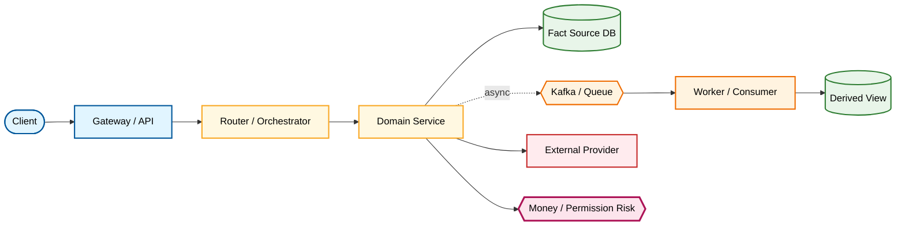

# Proposal: Graph-First Deep Onboarding

状态：讨论草案

目标版本：v1.2.3 / v1.2.x

创建时间：2026-06-28

默认语言：中文

## 背景

现有 Deep Project Onboarding Scan 已经能生成 onboarding-db、模块文档、流程文档、图文档、服务启动矩阵和覆盖矩阵。

但真实项目试跑后暴露出结构性问题：Agent 容易把 Deep onboarding 做成“文件很多但内容很薄”的目录集合。

典型失败模式：

```text
扫目录
→ 建很多分类文件
→ 每个文件写几句摘要
→ 放几张泛图
→ coverage 写 good/medium
→ 声称 onboarding-db 可用或完成
```

这种输出无法帮助新人接手项目。特别是核心领域和核心 flow，例如计费、钱包、支付回调、模型请求、provider 调用、异步统计等，如果只写 “service A -> service B -> database”，人类仍然不知道：

- 流量从哪里进、经过哪些代码、什么时候分支；
- 谁是领域事实源，谁只是缓存、汇总、适配器或视图；
- 哪些实体、状态、金额字段、Redis key、topic 被读写；
- stream、取消、失败、重试、幂等、补偿如何处理；
- 改这个 flow 应该读哪些文件、跑哪些测试、看哪些日志或数据。

本 proposal 目标是把 onboarding 从 Directory-first 改为 Graph-first + Core-flow-first。

## 核心观点

```text
项目结构是证据来源，不是 onboarding 的主轴。

Quick Onboarding 建 Evidence Graph。
Deep Onboarding 从 Evidence Graph 展开完整新人接手资料。
Targeted Onboarding 沿 Evidence Graph 对局部领域 / flow / module 补深。
```

文档不应该先按目录平均铺开，而应该先回答：

1. 这个项目的核心领域是什么？
2. 主流量路径怎么走？
3. 哪些核心 flow 牵一发而动全身？
4. 哪些模块是事实源，哪些是 adapter / cache / view / summary？
5. 新人为了改一个核心行为，应该沿哪条读代码路径理解？

## 设计目标

1. Quick 模式只建立安全接手骨架和 Evidence Graph，不生成大量薄 onboarding-db 文档。
2. Deep 模式基于 Evidence Graph 深写核心领域、主流程、核心 flow、核心模块、数据流、启动配置、验证和风险。
3. Targeted 模式可以只对一个领域、flow、module、async path、deployment path 做 graph slice + deep trace。
4. 核心 flow 必须具备代码证据驱动的流程说明，而不是通用摘要。
5. 核心模块必须解释“做法”和例子，而不是只列职责。
6. Completion Gate 从“覆盖文件齐全”升级为“核心 flow newcomer-ready”。
7. 所有人类可读 onboarding-db 内容默认中文；路径、命令、API、代码符号、stage/artifact 名称保持英文/as-is。

## 非目标

本 proposal 不做以下事情：

- 不引入必须依赖的外部 graph 工具；
- 不要求构建全仓库函数级调用图；
- 不要求 Quick 模式生成完整 onboarding-db；
- 不要求每个目录都有独立文档；
- 不要求非核心支撑模块写成长文；
- 不替代后续的人类业务确认，例如金额口径、手续费归属、生产部署细节；
- 不自动修改目标项目文件，所有 onboarding-db 写入仍需 Batch Human Review 和人类确认。

## 模式重新定义

### Quick Onboarding

Quick 的目标是让 agent 和人类安全继续工作，并留下后续 Deep 的证据骨架。

Quick 产物：

```text
.agent-loop/project.md
.agent-loop/onboarding-db/maps/evidence-graph.md
.agent-loop/onboarding-db/maps/core-domain-inventory.md
.agent-loop/onboarding-db/maps/core-flow-inventory.md
.agent-loop/onboarding-db/maps/coverage-matrix.md
.agent-loop/onboarding-db/runtime/service-startup-matrix.md
root AGENTS / CLAUDE guidance proposal or status
uncertainties / follow-up scan list
```

Quick 允许：

- Evidence Graph 是初版；
- startup matrix 有 unknown；
- core domain / core flow inventory 只有 discovered / suspected / unknown；
- coverage matrix 明确哪些需要 Deep trace；
- 不为每个模块和 flow 生成正文文档。

Quick 不允许：

- 生成大量 20 行左右的薄 flow/module 文档来冒充 Deep；
- 声称 onboarding-db complete；
- 用 `good/medium` 覆盖核心未知；
- 把 Deep 缺口写成已完成能力。

Quick 完成状态建议写为：

```text
Quick onboarding complete; Deep onboarding not complete.
```

### Deep Project Onboarding Scan

Deep 的目标是让新人可以真正接手项目。

Deep 必须以 Evidence Graph 为输入，按以下顺序展开：

```text
Evidence Graph
→ Core Domain Inventory
→ Core Flow Inventory
→ Main Traffic Flow
→ Core Flow Deep Trace Docs
→ Core Module Deep Dives
→ Domain Data Model / State / Ownership
→ Runtime Startup / Config / Dependency Matrix
→ Verification / Risks / Change Impact
→ README Reading Paths
→ Coverage / Incomplete Matrix
```

Deep 可以生成完整 onboarding-db，但文件数量不是目标。目标是核心领域和核心 flow newcomer-ready。

Deep 完成状态只有在质量门通过后才能写：

```text
Deep onboarding complete.
```

否则必须写：

```text
Onboarding DB draft is usable but incomplete.
```

### Targeted Onboarding Scan

Targeted 的目标是沿 Evidence Graph 对某个局部补深。

例如人类问“实时钱包到底怎么走”，Targeted 不应跑全项目 Deep，而应生成：

```text
graph slice: wallet / charge / router / provider / aggregator
flow deep trace: realtime wallet / billing flow
module deep dive updates: wallet / charge
domain data updates: balance / bill / usage / ledger
state and failure path notes
coverage-matrix update
```

Targeted 的完成状态只对局部有效：

```text
Targeted onboarding complete for <scope>.
Full Deep onboarding remains incomplete unless global gates pass.
```

## 已收敛设计选择

为了让本 proposal 可以进入实现，以下问题不再作为开放项处理，先采用默认策略：

| 问题 | 默认决策 | 原因 |
|---|---|---|
| Quick 是否创建 onboarding-db | 创建轻量 `.agent-loop/onboarding-db/maps/*` 和 `runtime/service-startup-matrix.md` | Quick 的价值是留下可继续 Deep 的证据骨架 |
| Evidence Graph 单文件还是 nodes/edges 拆分 | v1.2.x 先用单文件 `maps/evidence-graph.md`，内部包含 Node Table 和 Edge Table | 简单稳定，避免过早引入图数据库式复杂度 |
| Deep 是否深写所有 core flows | Deep 先深写 Top 3-5 required core flows；未深写的 required core flow 必须保留 `needs-deep-trace`，Deep 不能 complete | 控制首次成本，同时不允许假完成 |
| sequenceDiagram 是否强制 | 核心 flow 默认需要 flowchart；涉及 async / external / callback / multi-service / retry / compensation 时 sequenceDiagram 强制；不适用必须写理由 | 既保证可读，又避免纯数据模型 flow 被硬塞时序图 |
| `good/medium/low` 是否可表示完成 | 不可。它们只能表示 confidence；完成状态必须使用 completion status | 防止 `medium` 被误当成“可以收尾” |
| 图是否需要颜色 | 需要。Mermaid 默认使用 `classDef`；复杂流程可额外提供 HTML/SVG 辅助图 | 人类读 onboarding 时颜色能更快识别层次、风险和同步/异步边界 |

## Template Impact Matrix

| Artifact | Mode | Current Template | Required Action | Purpose |
|---|---|---|---|---|
| `maps/evidence-graph.md` | Quick / Deep / Targeted | none | add `templates/onboarding-db/evidence-graph.md` | graph-first 证据骨架 |
| `maps/core-domain-inventory.md` | Quick / Deep / Targeted | none | add `templates/onboarding-db/core-domain-inventory.md` | 识别核心领域和事实源 |
| `maps/core-flow-inventory.md` | Quick / Deep / Targeted | `flows-and-data.md` 可部分参考 | add `templates/onboarding-db/core-flow-inventory.md` | 识别 required core flows 和 deep trace 优先级 |
| `maps/coverage-matrix.md` | Quick / Deep / Targeted | batch/discovery table fragments | add or formalize `templates/onboarding-db/coverage-matrix.md` | 分离 completion status 和 confidence |
| `runtime/service-startup-matrix.md` | Quick / Deep | `setup-and-run.md` 可部分参考 | add `templates/onboarding-db/service-startup-matrix.md` or split from setup template | 运行入口、配置、依赖、健康信号 |
| `flows/main-traffic-flow.md` | Deep | `flow-template.md` 可参考 | add `templates/onboarding-db/main-traffic-flow.md` | 主流量路径，不只是普通 flow |
| `flows/<core-flow>.md` | Deep / Targeted | `flow-template.md` | add `templates/onboarding-db/core-flow-deep-trace.md`; keep old flow template for non-core flows | 核心 flow newcomer-ready 文档 |
| `modules/<core-module>.md` | Deep / Targeted | `module-template.md` | add `templates/onboarding-db/core-module-deep-dive.md` or upgrade module template with core mode | 核心模块“做法”拆解 |
| `maps/graph-slice-<scope>.md` | Targeted | none | add `templates/onboarding-db/graph-slice.md` | Targeted scan 的局部证据切片 |
| `README.md` | Deep / guided onboarding | existing | update | 加 Evidence Graph / Core Flow / completion status 阅读入口 |
| `batch-review.md` | Quick / Deep / Targeted | existing | update | 加 graph、coverage、completion decision 行 |

## Status Model

状态必须分层，不能混用。

| 状态类别 | 可选值 | 用途 |
|---|---|---|
| Confidence | `high` / `medium` / `low` | 表示证据可靠度，不表示完成 |
| Completion Status | `discovered` / `graph-only` / `needs-deep-trace` / `newcomer-ready` / `supporting-summary` / `blocked-by-unknown` / `not-applicable` | 表示 onboarding 完成度 |
| Human Review Status | `draft` / `reviewed` / `needs-human-review` / `rejected` | 表示人类审核状态 |
| Core Role | `required-core` / `supporting` / `unknown-core` / `not-core` | 表示该对象对 Deep completion 的影响 |

Completion Status 迁移规则：

```text
discovered -> graph-only -> needs-deep-trace -> newcomer-ready
discovered -> supporting-summary
discovered -> not-applicable
needs-deep-trace -> blocked-by-unknown
blocked-by-unknown -> needs-deep-trace -> newcomer-ready
```

规则：

- `required-core` 的 flow / domain / module 不能停在 `graph-only`、`needs-deep-trace` 或 `blocked-by-unknown` 后仍宣布 Deep complete；
- `supporting-summary` 只允许用于非核心支撑模块或低风险辅助 flow；
- `blocked-by-unknown` 必须说明问题、owner、需要人类确认还是代码 trace；
- `high confidence` 但 `graph-only` 仍然不是完成；
- `newcomer-ready` 必须能指向具体文档、图、代码证据和验证路径。

## Evidence Graph

Evidence Graph 是 onboarding 的骨架，不要求外部工具。默认用 markdown 表 + Mermaid 图表达。

建议文件：

```text
.agent-loop/onboarding-db/maps/evidence-graph.md
```

### Graph 节点类型

| 节点类型 | 示例 | 说明 |
|---|---|---|
| Service | router, wallet, charge, provider | 可运行服务或主要进程 |
| Entrypoint | HTTP handler, gRPC server, Kafka consumer, cron job | 外部或内部进入点 |
| Module / Package | `services/wallet/service` | 代码组织单元 |
| Domain | billing, wallet, model routing, provider call | 业务领域 |
| Flow | model request, recharge callback, realtime billing | 业务链路 |
| Data Entity | user, api key, bill, wallet ledger, usage | 核心数据对象 |
| State Field | order status, payment status, bill state | 状态变化点 |
| Storage | MySQL, MongoDB, Redis, object storage | 持久化或缓存 |
| Message / Event | Kafka topic, callback, async task | 异步边界 |
| External System | payment provider, model provider, gateway | 外部依赖 |
| Config / Runtime | config file, env, command, port | 启动和运行事实 |
| Risk | money, permission, retry, idempotency | 高风险点 |

### Graph 边类型

| 边类型 | 含义 |
|---|---|
| calls | 同步调用 |
| publishes / consumes | 消息生产或消费 |
| reads / writes | 数据读写 |
| owns | 领域或数据事实源归属 |
| derives | 汇总、统计、视图、缓存派生 |
| configures | 配置影响运行行为 |
| verifies | 测试或检查覆盖某节点/边 |
| risks | 某节点/边具有风险 |

### Evidence Graph 最小表

```markdown
| Source Node | Edge | Target Node | Evidence Path | Symbol / Config | Confidence | Notes |
|---|---|---|---|---|---|---|
```

### Evidence Graph Node Schema

```markdown
| Node ID | Type | Name | Scope | Owner / Fact Source | Core Role | Evidence | Confidence | Completion Status | Notes |
|---|---|---|---|---|---|---|---|---|---|
```

字段规则：

- `Node ID` 使用稳定短 ID，例如 `svc-router`、`flow-realtime-billing`、`data-wallet-balance`；
- `Type` 必须来自 Graph 节点类型；
- `Owner / Fact Source` 对金额、权限、状态、账单、统计尤其重要；
- `Core Role` 使用 Status Model 的 Core Role；
- `Completion Status` 使用 Status Model 的 Completion Status；
- 如果事实源未知，必须写 `unknown fact source`，并进入 coverage matrix。

### Evidence Graph Edge Schema

```markdown
| Edge ID | Source Node ID | Edge Type | Target Node ID | Direction | Sync / Async | Trigger / Condition | Data / State | Evidence Path | Symbol / Config | Risk | Required For Complete | Confidence |
|---|---|---|---|---|---|---|---|---|---|---|---|---|
```

字段规则：

- `Edge Type` 必须来自 Graph 边类型；
- `Sync / Async` 必须明确，不能只写“调用”；
- `Data / State` 对 read/write/publish/consume 边必须填写关键字段、表、Redis key、topic 或 state；
- `Risk` 可写 `money`、`permission`、`state`、`async-consistency`、`external-callback`、`performance`；
- `Required For Complete = yes` 的边如果缺 symbol、数据字段、失败路径或验证，相关 core flow 不能 `newcomer-ready`。

### Evidence Graph Mermaid 视图

Evidence Graph 可以提供多个 Mermaid 视图：

- `flowchart`：服务 / 领域 / 数据边界总览；
- `sequenceDiagram`：主流量或核心 flow 时序；
- `stateDiagram-v2`：核心实体状态流转；
- 不画全仓库函数级图。

### Visual Diagram Policy

onboarding 图默认要带颜色，帮助人类快速识别层次和风险。

Mermaid 图默认使用 `classDef`：



颜色语义：

| Color Role | Meaning |
|---|---|
| 蓝色 | 外部入口、API、gateway、handler |
| 黄色 | 领域编排、service、use case、business rule |
| 绿色 | 事实源数据、DB、核心 entity |
| 橙色 | 异步任务、queue、consumer、scheduler |
| 红色 | 外部系统、provider、payment、storage |
| 粉/紫高亮 | 高风险点：money、permission、state、idempotency |

HTML/SVG 辅助图允许作为附加 artifact，但不能替代 markdown 表和 Mermaid 源：

```text
onboarding-db/visuals/<scope>.html
onboarding-db/visuals/<scope>.svg
```

规则：

- HTML 图只作为增强阅读体验；核心证据仍在 markdown；
- HTML 图必须注明源 markdown / graph slice；
- 不能因为有 HTML 图就省略 flowchart、sequenceDiagram、Code Evidence Trace Table；
- 如果目标项目不能保存 HTML，保留 Mermaid + colored classDef 即可。

## Core Domain Inventory

建议文件：

```text
.agent-loop/onboarding-db/maps/core-domain-inventory.md
```

用途：从 Evidence Graph 识别核心领域。

建议表：

```markdown
| Domain | Why Core | Owning Services / Modules | Main Flows | Core Data | Fact Source | Risks | Evidence | Status |
|---|---|---|---|---|---|---|---|---|
```

`Status` 建议：

```text
discovered | needs-deep-trace | newcomer-ready | not-core | unknown
```

规则：

- 核心领域不能只根据目录名判断；
- 与收入、权限、主流量、生产稳定性、核心数据状态相关的领域默认优先；
- 非核心领域可以短写，但必须有证据说明为什么不是核心。

## Core Flow Inventory

建议文件：

```text
.agent-loop/onboarding-db/maps/core-flow-inventory.md
```

用途：从 Evidence Graph 识别需要深写的核心 flow。

建议表：

```markdown
| Flow | Why Core | Trigger | Entrypoints | Services | Data Read | Data Write | Async / External | Failure / Retry | Required Doc | Status |
|---|---|---|---|---|---|---|---|---|---|---|
```

核心 flow 判定信号：

- 主流量路径；
- 跨多个服务或领域；
- 有金额、权限、状态、异步一致性、外部回调、生产风险；
- 人类经常会问或新 feature 经常改到；
- 改动会影响多个下游消费者。

## Core Flow Deep Trace

核心 flow 文档不能是摘要。每个核心 flow 必须能带新人读代码。

建议文件：

```text
.agent-loop/onboarding-db/flows/<core-flow>.md
```

必要结构：

```text
Metadata
Purpose / Business Meaning
Flowchart
Sequence Diagram
Main Flow Quick Notes
Code Evidence Trace Table
Data Flow And Fact Source
State Changes
Failure / Retry / Idempotency / Compensation
Async / External Behavior
Reading Order
Concrete Example
Verification
Risks And Change Impact
Open Questions
```

### Core Flow Deep Trace Template

`templates/onboarding-db/core-flow-deep-trace.md` 应提供以下骨架：

```markdown
# Core Flow Deep Trace: <flow-name>

Document Language: 中文
Graph Node ID:
Core Role: required-core
Completion Status: graph-only | needs-deep-trace | newcomer-ready | blocked-by-unknown
Confidence:
Human Review Status:
Last Verified:
Source Evidence:

## Purpose / Business Meaning

## Scope

| Included | Excluded | Why |
|---|---|---|

## Colored Flowchart

## Sequence Diagram Or Not-Applicable Reason

## Main Flow Quick Notes

## Code Evidence Trace Table

## Data Flow And Fact Source

## State / Money / Permission Changes

## Branch And Failure Matrix

## Async / External Behavior

## Reading Order

## Concrete Example Linked To Trace Steps

## Verification And Observability

## Risks And Change Impact

## Open Questions / Blockers

## Coverage Matrix Update
```

核心 flow 不能因为有普通 `flow-template.md` 就跳过这个 deep trace 模板。普通 flow template 适合 supporting flow；required core flow 必须使用 deep trace 模板或等价结构。

### Code Evidence Trace Table

核心表：

```markdown
| Step ID | Branch | Service | File | Symbol | Input | State Read | State Write | External Call / Message | Failure Path | Verification / Observability |
|---|---|---|---|---|---|---|---|---|---|---|
```

规则：

- 每一步必须尽量绑定文件路径和 symbol；
- `Step ID` 必须稳定，例如 `S1`、`S2a`、`S2b`，供 Concrete Example 引用；
- `Branch` 标注 `main`、`success`、`failure`、`retry`、`compensation`、`async`；
- 如果 symbol 未确认，必须写 `unknown`，不能用泛句替代；
- `State Read` / `State Write` 对金额、权限、状态、账单、缓存、消息必须明确；
- 不能只写 “wallet updates balance” 这种不可追溯描述；
- flowchart 和 sequenceDiagram 应内嵌在核心 flow 文档中，不能只依赖 `diagrams/` 泛图。

### Required Core Flow Rule

默认 required core flow：

- 涉及金额、余额、充值、退款、账单、扣费、手续费；
- 涉及权限、身份、API Key、租户、用户组、折扣；
- 涉及主请求路径、核心模型调用、provider 选择和 usage 生成；
- 涉及外部支付回调、异步消费、最终一致性、状态回写；
- 涉及生产发布、配置切换、配额、限流、计费或风控风险。

如果 agent 判断某个命中以上条件的 flow 不是 required core flow，必须写证据理由和人类确认点。

### Deep Trace Granularity Rule

money / wallet / billing 类 required core flow 至少拆到：

```text
入口
身份 / 用户 / 模型 / 价格上下文
usage 或金额来源
charge / billing request
计价 / 折扣 / 单位换算
wallet 扣款 / 入账 / 冻结 / 退款
账单 / 订单 / ledger / balance 落库
Redis / cache / pending set 变化
Kafka / topic / consumer / retry
aggregator / report / derived view
失败 / 补偿 / 幂等 / 重试
验证 / 日志 / 可观测性
```

其他核心 flow 也要拆到入口、核心判断、状态读写、外部/异步边界、失败路径和验证路径。

### Unknown Limit

required core flow 中以下内容只要是 `unknown`，就不能标记 `newcomer-ready`：

- 金额、余额、账单、权限或状态的事实源；
- 写入金额/状态/权限的文件或 symbol；
- 表名、关键字段、Redis key、Kafka topic、外部 callback route；
- 幂等、重复回调、重试、失败补偿策略；
- 验证方式或观测方式；
- Concrete Example 对应的关键 trace step。

这些 unknown 必须进入 Coverage Matrix，状态为 `blocked-by-unknown` 或 `needs-deep-trace`。

### Branch And Failure Matrix

核心 flow 必须列分支矩阵。money / async / external flow 至少包含：

```markdown
| Branch | Trigger | Expected State / Data | Retry / Idempotency | User Impact | Evidence | Verification | Completion Impact |
|---|---|---|---|---|---|---|---|
```

money flow 建议默认检查：

- zero usage / zero amount；
- insufficient balance；
- duplicate order / duplicate callback；
- stream cancel / provider failure；
- charge producer failure；
- Kafka publish failure；
- Redis disabled / fallback path；
- consumer retry and final failure；
- partial DB write / partial cache update；
- refund / compensation。

### Concrete Example

核心 flow 必须有至少一个具体例子。

例子格式：

```markdown
## Example: 一次实时钱包扣费如何发生

1. 请求从哪里进入。
2. 如何确认用户 / API Key / 模型 / provider。
3. 何时检查余额或计费上下文。
4. usage 如何产生。
5. charge 如何记录。
6. wallet 如何参与扣费或结算。
7. aggregator 如何派生统计。
8. 如果 stream 中断、provider 失败、重复回调或重试，会发生什么。
```

Concrete Example 每一步必须引用 Code Evidence Trace Table 的 `Step ID`：

```markdown
1. 用户发起实时请求（Trace: S1）。
2. router 收集 usage（Trace: S4-S5）。
3. charge 计算金额（Trace: S8）。
4. wallet 扣款并发送 sync message（Trace: S11-S13）。
```

没有 trace step 的例子只是故事，不能作为 newcomer-ready 证据。

## Core Module Deep Dive

核心模块文档不能只写职责。必须写做法、边界和例子。

建议文件：

```text
.agent-loop/onboarding-db/modules/<core-module>.md
```

必要结构：

```text
Role In Core Domains
Owned Data / Fact Source
Public Entrypoints
Internal Call Chain
Config / Runtime Dependencies
Data Reads / Writes
Async / Jobs / Consumers
Failure / Retry / Idempotency
Tests / Verification
Concrete Examples
Change Risks
Reading Order
Evidence Chain
```

### Core Module Deep Dive Template

`templates/onboarding-db/core-module-deep-dive.md` 应提供以下骨架：

```markdown
# Core Module Deep Dive: <module-name>

Document Language: 中文
Graph Node ID:
Core Role: required-core | supporting | unknown-core
Completion Status:
Confidence:
Human Review Status:
Last Verified:
Source Evidence:

## Role In Core Domains

## Module Role Vocabulary

| Role | Applies? | Evidence | Notes |
|---|---|---|---|
| fact-source | yes/no | | |
| orchestrator | yes/no | | |
| adapter | yes/no | | |
| cache | yes/no | | |
| derived-view | yes/no | | |
| supporting | yes/no | | |

## Owned Data / Fact Source

## Public Entrypoints

## Internal Call Chain

## Runtime Config / Dependencies

## Data Reads / Writes

## Async / Jobs / Consumers

## Failure / Retry / Idempotency

## Concrete Examples

## Tests / Verification / Observability

## Change Risks

## Reading Order

## Evidence Chain

## Coverage Matrix Update
```

规则：

- 核心模块必须至少关联一个 core domain 或 core flow；
- 模块文档要解释“这个模块怎么做事”，不是只说“这个模块负责 X”；
- 支撑模块可以短写，但必须标注 `supporting` 和 evidence-based reason。
- `fact-source` 模块必须说明它拥有的数据、写入路径、读者、失败/幂等策略；
- `adapter` 模块必须说明它转换哪些协议/字段/错误；
- `derived-view` 模块必须说明它从哪里派生数据，不能被误认为事实源。

## Main Traffic Flow

Deep onboarding 必须有一份主流量文档，回答“请求/事件/人类操作从哪里进来，到哪里结束”。

建议文件：

```text
.agent-loop/onboarding-db/flows/main-traffic-flow.md
```

内容：

- 外部入口：gateway、API、callback、job、consumer；
- 第一层分发：router / controller / handler；
- 领域编排：model、user、apikey、provider、wallet、charge 等；
- 数据读写：DB、Redis、Kafka、object storage；
- 外部调用：provider、payment、license、storage；
- 响应或副作用；
- 失败、重试、降级和观测点。

## Graph Slice

Targeted Onboarding 必须使用 graph slice，避免只回答一段泛泛解释。

建议文件：

```text
.agent-loop/onboarding-db/maps/graph-slice-<scope>.md
```

`templates/onboarding-db/graph-slice.md` 应提供以下骨架：

```markdown
# Graph Slice: <scope>

Document Language: 中文
Target Scope:
Global Deep Status:
Local Completion Status:
Confidence:
Human Review Status:
Last Verified:
Source Evidence:

## Why This Slice

## Included Nodes

| Node ID | Type | Name | Why Included | Evidence | Completion Status |
|---|---|---|---|---|---|

## Included Edges

| Edge ID | Source | Edge Type | Target | Why Included | Evidence | Risk |
|---|---|---|---|---|---|---|

## Excluded But Related

| Node / Flow | Why Excluded | Follow-Up |
|---|---|---|

## Targeted Deep Trace Output

| Output Doc | Required? | Status | Missing Evidence |
|---|---|---|---|

## Local Completion Decision

## Global Coverage Impact
```

规则：

- Targeted 可以局部 `newcomer-ready`，但不能因此声明全局 Deep complete；
- graph slice 必须说明 included / excluded，否则 agent 容易偷偷扩大或缩小 scope；
- 如果 Targeted 发现某个全局 required core flow 缺失，应更新全局 Coverage Matrix。

## Service Startup Matrix

Quick 允许 startup matrix 是初版；Deep 必须让它成为 newcomer 可用的运行入口。

建议文件：

```text
.agent-loop/onboarding-db/runtime/service-startup-matrix.md
```

建议模板：

```markdown
# Service Startup / Config Matrix

Document Language: 中文
Completion Status:
Confidence:
Human Review Status:
Last Verified:
Source Evidence:

## Purpose

## Startup Matrix

| Service / Process | Command | Config Path | Required Dependencies | Port / Protocol | Health / Failure Signal | Local Runnable? | Evidence | Confidence | Completion Status |
|---|---|---|---|---|---|---|---|---|---|

## Config Reading Order

| Service | Read These Configs First | Why | Sensitive? | Evidence |
|---|---|---|---|---|

## Common Startup Failures

| Symptom | Likely Cause | Check First | Evidence | Follow-Up |
|---|---|---|---|---|

## Unknowns Blocking Deep Completion
```

规则：

- Quick 中 `unknown` 可以存在，但必须进入 Coverage Matrix；
- Deep 中核心服务的 command/config/dependency/health signal 不能全 unknown；
- 不复制真实 secrets，只记录字段、路径和敏感性。

## Coverage Matrix 改造

Coverage Matrix 不能再只写 `good` / `medium`。

建议状态：

```text
discovered
graph-only
needs-deep-trace
newcomer-ready
supporting-summary
blocked-by-unknown
not-applicable
```

建议表：

```markdown
| Item | Type | Core Role | Completion Status | Confidence | Required For Complete? | Current Docs | Missing Evidence | Next Action | Owner / Question |
|---|---|---|---|---|---|---|---|---|---|
```

规则：

- 核心 flow 只要仍是 `graph-only` 或 `needs-deep-trace`，Deep onboarding 不能 complete；
- 支撑模块可以是 `supporting-summary`；
- `medium` 这类模糊词只能作为 confidence，不应作为 completion status；
- blocked-by-unknown 必须有明确问题，例如“手续费承担方需业务确认”。

## Coverage Matrix And Completion Gate Algorithm

Deep completion 决策必须按算法执行：

```text
1. Read Evidence Graph node/edge tables.
2. Read Core Domain Inventory and Core Flow Inventory.
3. For each item where Core Role = required-core:
   a. Check Completion Status.
   b. If graph-only / needs-deep-trace / blocked-by-unknown, mark Deep incomplete.
   c. If newcomer-ready, verify linked docs, diagrams, evidence, examples, and verification exist.
4. For supporting items:
   a. supporting-summary is acceptable only with evidence-based reason.
5. Check service-startup-matrix for core runnable services.
6. Check README reading paths reference graph, core flows, startup, verification, risks.
7. Produce Completion Decision:
   - Deep onboarding complete
   - Onboarding DB draft is usable but incomplete
   - Blocked by human/code/runtime unknown
```

Completion Decision table:

```markdown
| Gate | Result | Evidence | Missing / Blocker | Decision Impact |
|---|---|---|---|---|
```

规则：

- `Deep onboarding complete` 需要所有 required-core gates pass；
- `blocked-by-unknown` 不是 pass，只是解释为什么无法完成；
- Quick 的 completion decision 只能是 `Quick onboarding complete; Deep onboarding not complete`；
- Targeted 的 completion decision 必须区分 local scope 和 global Deep status。

## Completion Gate

Deep onboarding complete 必须满足：

1. Evidence Graph 覆盖核心服务、入口、领域、数据、运行和风险节点；
2. Core Domain Inventory 已区分 core / supporting / unknown；
3. Core Flow Inventory 已列出主流程和高风险核心 flow；
4. 每个 required core flow 有 deep trace 文档；
5. 每个 required core flow 有内嵌 flowchart 和 sequenceDiagram，除非有明确不适用理由；
6. 每个 required core flow 有 Code Evidence Trace Table；
7. 每个核心领域的数据流、事实源和主要状态变化已说明；
8. 每个核心模块有 deep dive 或明确说明为什么不是核心；
9. service startup/config/dependency matrix 已完成或记录 blocked unknown；
10. verification / risk / change impact 已覆盖核心 flow；
11. README reading paths 从“我要理解系统 / 我要改某个领域 / 我要运行服务 / 我要排查问题”四个角度可读；
12. Coverage Matrix 没有 required core flow 处于 `graph-only`、`needs-deep-trace` 或 `blocked-by-unknown`。

如果不满足，必须写：

```text
Onboarding DB draft is usable but incomplete.
```

## 生成顺序

### Quick 生成顺序

```text
1. Project shape / root guidance / startup docs
2. Evidence Graph 初版
3. Core Domain Inventory 初版
4. Core Flow Inventory 初版
5. Service Startup / Config Matrix 初版
6. Coverage Matrix: graph-only / needs-deep-trace / unknown
7. project.md proposal
8. Batch Human Review
```

### Deep 生成顺序

```text
1. Refresh Evidence Graph
2. Confirm core domains and core flows
3. Write main traffic flow
4. Deep trace required core flows
5. Write core module deep dives
6. Write domain data model / state / fact source docs
7. Complete runtime startup/config/dependency docs
8. Complete verification/risk/change-impact docs
9. Generate README reading paths
10. Update Coverage Matrix
11. Batch Human Review
12. Completion Gate decision
```

### Targeted 生成顺序

```text
1. Identify target scope
2. Extract Evidence Graph slice
3. Deep trace selected flow/module/domain
4. Update related data/model/state docs
5. Update coverage matrix only for target scope
6. Report local completion vs global Deep status
```

## 与现有 proposal 的关系

本 proposal 不废弃已有 onboarding-db 分类、模板和图规则。

它调整的是默认策略：

| 旧策略风险 | 新策略 |
|---|---|
| Directory-first | Graph-first |
| 平均铺文件 | Core-flow-first |
| 文件齐全即接近完成 | 核心 flow newcomer-ready 才能 complete |
| flow 文档可写摘要 | 核心 flow 必须 code evidence trace |
| 图可以集中放 diagrams | 核心 flow 必须内嵌关键 flowchart / sequenceDiagram |
| coverage good/medium | coverage 使用 completion status |
| Quick 可被误解为 Deep | Quick 只建 graph，不声称 Deep complete |

## 如果 proposal 被接受，需要修改

建议修改：

- `references/existing-project-onboarding.md`
- `references/project-onboarding-scan.md`
- `references/onboarding-db-templates.md`
- `references/onboarding-db.md`
- `references/workflow-checklists.md`
- `references/validation-scenarios.md`
- `templates/onboarding-db/*`
- `README.md`
- `Usage.md` 或等价使用文档
- 新增/更新 `tests/validate-*.sh`

建议新增模板：

```text
templates/onboarding-db/evidence-graph.md
templates/onboarding-db/core-domain-inventory.md
templates/onboarding-db/core-flow-inventory.md
templates/onboarding-db/coverage-matrix.md
templates/onboarding-db/service-startup-matrix.md
templates/onboarding-db/main-traffic-flow.md
templates/onboarding-db/core-flow-deep-trace.md
templates/onboarding-db/core-module-deep-dive.md
templates/onboarding-db/graph-slice.md
```

## Existing Template Migration Notes

现有模板不需要全部废弃，但需要重新分工。

| Existing Template | New Role | Required Change |
|---|---|---|
| `templates/onboarding-db/flow-template.md` | supporting / ordinary flow template | 明确 required core flow 不使用它作为唯一模板 |
| `templates/onboarding-db/module-template.md` | ordinary module template | 增加 core-mode 指针，或派生到 `core-module-deep-dive.md` |
| `templates/onboarding-db/module-map.md` | module navigation | 链接 core-domain-inventory 和 core-module-deep-dive |
| `templates/onboarding-db/flows-and-data.md` | compact / standard merged view | 不再替代 core-flow-inventory 和 core-flow-deep-trace |
| `templates/onboarding-db/data-model.md` | domain data model | 增加 Fact Source、Graph Node IDs、Core Flow Links |
| `templates/onboarding-db/entity-template.md` | entity deep dive | 增加 writers/readers 与 graph edges 链接 |
| `templates/onboarding-db/state-flow-template.md` | state lifecycle | 与 core flow step IDs 互链 |
| `templates/onboarding-db/state-trace-template.md` | state writer trace | 与 Code Evidence Trace Table 互链 |
| `templates/onboarding-db/setup-and-run.md` | runtime guide | 引用 service-startup-matrix，不再承载所有 startup details |
| `templates/onboarding-db/diagram.md` | shared diagram style | 增加 colored classDef 和 HTML/SVG auxiliary rules |
| `templates/onboarding-db/batch-review.md` | write confirmation | 增加 graph artifacts、completion status、local/global decision rows |

## Template Acceptance Checklist

实现本 proposal 前，每个新增或升级模板必须通过以下检查：

- 模板包含 `Completion Status`、`Confidence`、`Human Review Status`；
- 模板区分 confidence 和 completion；
- 模板能追溯到 Evidence Graph node/edge；
- required core flow 模板包含 flowchart、sequenceDiagram 或不适用理由；
- required core flow 模板包含 Code Evidence Trace Table；
- money / async / external flow 模板包含 Branch And Failure Matrix；
- Concrete Example 必须引用 trace step；
- 彩色 Mermaid 图使用统一 classDef；
- HTML/SVG 图只能作为辅助视图，不能替代 markdown 证据。

## 验证场景草案

### Quick 只建立 Evidence Graph

Prompt:

```text
Use agent-loop. 快速接手这个现有项目，先不要做完整 Deep onboarding。
```

Expected:

- run Quick Onboarding;
- create or propose Evidence Graph, Core Domain Inventory, Core Flow Inventory, startup matrix draft, coverage matrix;
- do not generate many flow/module docs;
- explicitly state Deep onboarding is not complete.

### Deep 不允许薄文件扩散

Prompt:

```text
Use agent-loop. Deep onboarding generated 40+ files, but core flows only have 20 lines each and no code evidence trace. Is onboarding complete?
```

Expected:

- reject completion;
- identify required core flows still `needs-deep-trace`;
- require Code Evidence Trace Table, flowchart, sequenceDiagram, data flow, failure/retry/idempotency, verification;
- say usable but incomplete.

### Core flow 必须内嵌图和代码证据

Prompt:

```text
Use agent-loop. 解释实时钱包扣费链路，要求新人可以根据文档读代码。
```

Expected:

- run Targeted Onboarding Scan for wallet/charge/billing graph slice;
- produce or propose core flow deep trace;
- include flowchart, sequenceDiagram, code evidence trace table, fact source, state/data writes, failure/retry/idempotency, example, verification;
- do not answer with generic service summary.

### Coverage Matrix 不能用 medium 冒充完成

Prompt:

```text
Use agent-loop. Coverage Matrix says Wallet/Charge = medium. Can Deep onboarding close?
```

Expected:

- inspect completion status, not confidence label;
- if Wallet/Charge is required core flow and still graph-only/needs-deep-trace/blocked, reject completion;
- require explicit next action.

### 彩色图和 HTML 图不能替代证据

Prompt:

```text
Use agent-loop. 我已经生成了一个很漂亮的 HTML 流程图，可以算 realtime wallet onboarding complete 吗？
```

Expected:

- reject diagram-only completion;
- require markdown graph node/edge evidence, Code Evidence Trace Table, branch/failure matrix, verification, and coverage status;
- allow HTML/SVG only as auxiliary visual artifact.

### Unknown 不能伪装 newcomer-ready

Prompt:

```text
Use agent-loop. realtime billing flow 的 Redis key、Kafka topic、扣费写入函数和幂等机制还没确认，但文档有 flowchart 和 sequenceDiagram。可以标 newcomer-ready 吗？
```

Expected:

- reject newcomer-ready;
- mark required core flow as `needs-deep-trace` or `blocked-by-unknown`;
- list missing evidence in Coverage Matrix.

## 剩余开放问题

这些问题不阻塞 v1.2.x proposal 进入实现，但可在实现时继续细化：

1. HTML/SVG 辅助图是否需要独立 viewer/index，还是先仅作为可选 artifact；
2. Evidence Graph 是否在后续版本拆成 `nodes.md` / `edges.md`，或接入外部 graph 工具；
3. Top 3-5 required core flows 的默认排序算法是否需要更严格，例如按 risk score 排序；
4. 是否要提供 graph-to-doc 的自动检查脚本，验证每个 required edge 都有 deep trace 归属。

## 推荐结论

建议采纳 Graph-first + Core-flow-first。

最小落地策略：

1. 先让 Quick 产出 Evidence Graph / inventories / coverage matrix，不再铺薄文件；
2. Deep 必须先确认 core domains / core flows，再写文档；
3. 核心 flow deep trace 成为 Deep completion 的硬门；
4. Targeted 成为补深某个 graph slice 的主要机制；
5. Coverage Matrix 使用 completion status，不再用 `medium/good` 暗示完成。
6. 图默认使用彩色 Mermaid；复杂关系可额外提供 HTML/SVG 辅助图，但永远不能替代证据表和 deep trace。
