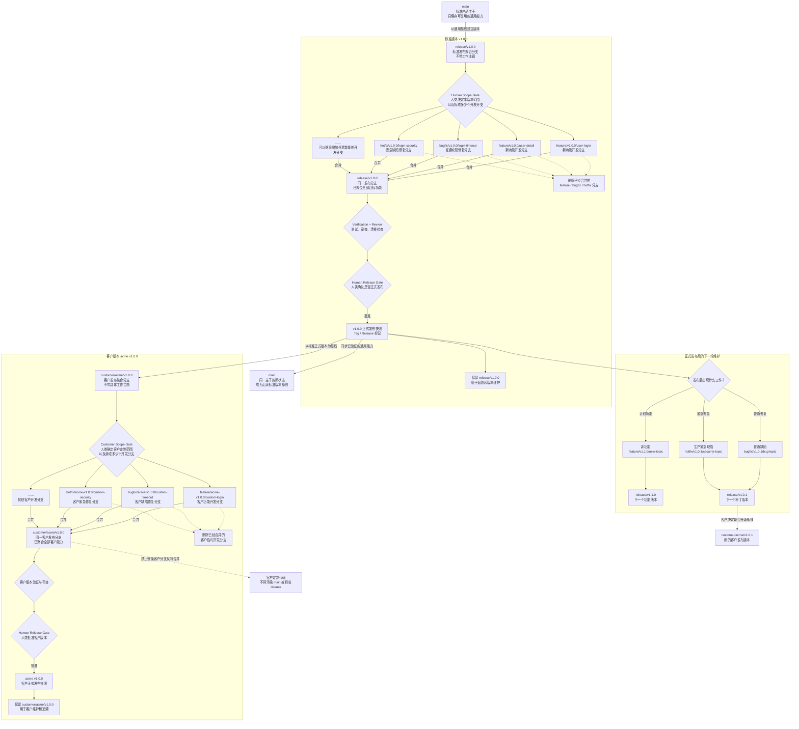

# Proposal: Human-Guided Branch Management

状态：Proposal、核心设计、实现、Human Review 修复、v1.4.0 版本对齐与全量验证已完成，待最终 Commit Human Gate
目标版本：v1.4.0
创建时间：2026-07-15
默认语言：中文

## 摘要

Agent Loop 当前严格管理 Submit / Integrate、commit、PR、merge、release 和 publish 的人类门禁，但还没有一套完整的分支概念、命名语法、生命周期、目标分支判断和客户代码隔离规则。

本 proposal 建议增加一套供人类选择的 `Human-Guided Branch Management`：

```text
main
├── release/v1.0.0
│   ├── feature/v1.0.0/user-login
│   ├── feature/v1.0.0/user-detail
│   ├── bugfix/v1.0.0/login-timeout
│   └── hotfix/v1.0.0/login-security
└── customer/acme/v1.0.0
    ├── feature/acme-v1.0.0/custom-login
    ├── bugfix/acme-v1.0.0/custom-timeout
    └── hotfix/acme-v1.0.0/custom-security
```

这里有两类长期发布分支：

- `release/v1.0.0`：标准产品发布聚合分支；
- `customer/acme/v1.0.0`：客户发布聚合分支。

这里有三类临时开发分支：

- `feature/<target-release-context>/<topic>`；
- `bugfix/<target-release-context>/<topic>`；
- `hotfix/<target-release-context>/<topic>`。

发布分支只表达“哪个版本”，不携带具体工作主题。开发分支表达“工作类型、目标发布版本、具体主题”，在验证和 Human Gate 后合并到对应发布分支，合并完成后删除。

这套策略是 Agent Loop 的推荐 Profile，不是对所有仓库的强制 Git Flow。Agent 必须先发现项目已有规则、向人类解释建议及影响，并由人类确认是否采用、采用到哪个版本和客户范围。

## 背景与问题定义

### 当前已经具备的能力

当前 Agent Loop 已经要求：

- commit、PR、merge、release、publish 必须由人类明确确认；
- Submit / Integrate 前检查 diff、验证、review、drift、项目记忆和无关改动；
- 外部 finishing / branch helper 只能辅助分支卫生，不能覆盖 Agent Loop 的 Human Gate；
- 项目根 `AGENTS.md` 可以记录提交与集成约束；
- `project.md` 可以记录长期开发规则和当前工作。

这些规则能防止 Agent 越权提交，却没有回答“应该在哪条分支工作、最终合并到哪里、发布后如何继续维护、客户代码能否回到标准主干”。

### 当前结构性缺口

#### 1. 分支身份没有统一模型

Agent 可能只根据名字猜测分支用途，也可能把 `release`、`feature`、`customer` 都理解成同一层级。缺少模型时，分支名称虽然可读，合并关系仍可能错误。

#### 2. 版本分支和开发分支容易混淆

`release/v1.0.0` 是一个发布版本，不应该再带 `user-login` 之类的第三段工作主题。

`feature/v1.0.0/user-login` 才是开发分支，它必须指向一个明确的发布版本。分支是否长期保留不能仅靠斜杠数量判断，必须由前缀和语义共同决定。

#### 3. 人类没有稳定的版本拆分决策点

同一个发布版本可以只有一个开发分支，也可以拆成几十个 feature、bugfix、hotfix 分支。拆多少、如何切片、哪个版本承载哪些工作，应由人类决定，Agent 不能按固定数量自动拆分。

#### 4. 客户代码缺少隔离边界

如果客户定制直接进入 `main` 或标准 `release/*`，标准产品主干就会被客户差异污染。反过来，如果标准版本升级不能作为客户新版本的基线，客户分支又会长期脱离标准产品。

#### 5. 已发布版本可能被继续修改

如果 `v1.0.0` 已经正式发布，后续 bugfix 或 hotfix 仍然合入 `release/v1.0.0`，相同版本号会对应多个代码事实。版本无法复现，也无法可靠审计。

#### 6. 分支事实没有进入项目记忆

未来 Agent 即使看到多个 worktree、release 或 customer 分支，也可能不知道当前 Feature 的目标发布版本、允许的合并方向和客户隔离规则。后续的 worktree / branch memory merge 也缺少稳定的 Branch Context 输入。

## 目标

本 proposal 的目标是：

1. 明确定义标准主干、标准发布分支、客户发布分支和临时开发分支。
2. 让开发分支始终携带明确的目标发布上下文。
3. 让人类决定一个版本包含多少开发分支以及每个分支的工作切片。
4. 让标准版本和客户版本拥有清晰、可验证的合并方向。
5. 防止客户定制代码无意进入 `main` 或标准发布分支。
6. 让已发布版本保持可复现，后续工作进入新的语义版本。
7. 让 Agent 在适当时机主动建议分支管理方式，而不是要求人类先知道 Agent Loop 术语。
8. 把人类确认后的 Branch Strategy 记录为可恢复的项目事实。
9. 为后续 Bug Management 和 worktree / branch memory merge 提供稳定的目标版本与分支上下文。
10. 保留现有项目规则的优先级，不强制迁移一个已经清晰、可靠的分支模型。

## 非目标

本轮不做以下事情：

- 不在 proposal 阶段修改已发布 `SKILL.md`、runtime、reference、template 或测试行为；
- 不强制所有项目使用 `release/*` 或 `customer/*`；
- 不创建 Git 托管平台、保护分支或 CODEOWNERS 配置；
- 不自动创建、切换、合并、删除或推送任何分支；
- 不自动创建或删除 worktree；
- 不自动创建 tag、PR、release 或 publish 动作；
- 不定义完整的 Bug 生命周期、Bug 与 Requirement / Feature 的绑定模型；
- 不实现 worktree / branch memory merge；
- 不允许客户定制分支直接覆盖标准产品事实；
- 不把分支名当成 Requirement、Feature、ADR 或验证证据的替代品；
- 不引入 `state.json`、分支数据库或必须由脚本维护的机器可读 Schema；
- 不移除任何现有 Submit / Integrate、commit、merge、release 或 publish Human Gate。

Bug Management 和 Memory Merge 是相邻能力，但应分别提案。本 proposal 只提供它们需要消费的 `Target Release Context` 和 `Branch Context`。

本 proposal 面向未来分发到目标项目的人类参考和 Agent 运行规则，不会反向覆盖 Agent Loop 源码仓库自己的维护规范。当前源码仓库的 alpha、稳定发布分支和 tag 命名仍以根 `AGENTS.md` 为准；如两者不同，维护 Agent 必须遵守源码仓库规则。

## 方案比较

### 方案 A：只观察现有分支

Agent 读取当前分支和远端分支，只在提交前报告当前分支，不推荐统一命名或合并方向。

优点：

- 改动最小；
- 不干预现有项目。

限制：

- 无法解决目标版本不清楚、客户代码污染、已发布版本被继续修改等问题；
- Agent 每次都要重新猜测分支含义；
- 无法为后续 memory merge 提供稳定上下文。

### 方案 B：Human-Guided Branch Management Profile

Agent 先发现项目已有规则；当复杂度或风险触发时，向人类推荐本文的标准 Profile。人类确认目标版本、客户范围和拆分方式后，Agent 才记录策略并在后续 Plan、Execute、Submit / Integrate 中检查分支上下文。

优点：

- 同时提供专业约定与人类控制；
- 兼容标准产品、客户版本和多分支聚合；
- 不要求简单项目迁移；
- 能为 Bug Management 和 Memory Merge 提供稳定输入。

代价：

- 正式实施需要协调 runtime / design、项目记忆模板、Submit / Integrate、root guidance、Usage 和回归测试；
- Agent 必须处理已有项目规则与推荐 Profile 的兼容判断。

### 方案 C：强制并自动执行 Git Flow

所有项目都必须采用本文命名，Agent 自动创建 release、feature、customer 分支并执行合并和清理。

优点：

- 行为高度统一；
- 自动化程度高。

限制：

- 会破坏已有仓库约定；
- 分支创建、合并、删除、推送属于高风险外部状态变更；
- 与 Agent Loop 的 Human Gate 和单人优先原则冲突；
- 第一版实现和恢复成本过高。

### 推荐

采用方案 B。

推荐 Profile 是 Agent 的专业建议，不是未经确认的强制规则。发现已有可靠策略时，Agent 应记录并遵循已有策略；缺少策略或存在明显风险时，才推荐本文模型。

## 核心概念

### Main Branch

`main` 是标准产品主干基线：

- 只保存所有客户都可复用的通用能力；
- 不承载任何客户专属实现；
- 接收已经验证并通过发布门禁的标准版本能力；
- 是后续标准版本的通用起点。

项目如果使用 `master` 或其他主干名，可以记录实际名称，不要求重命名。

### Release Aggregation Branch

发布聚合分支代表一个可发布版本，而不是一项具体工作。

标准版本：

```text
release/v1.0.0
```

客户版本：

```text
customer/acme/v1.0.0
```

它们可以聚合任意数量的开发分支。数量和切片方式由人类决定。

### Development Branch

开发分支是临时执行单元：

```text
<work-type>/<target-release-context>/<topic>
```

标准版本示例：

```text
feature/v1.0.0/user-login
bugfix/v1.0.0/login-timeout
hotfix/v1.0.0/login-security
```

客户版本示例：

```text
feature/acme-v1.0.0/custom-login
bugfix/acme-v1.0.0/custom-timeout
hotfix/acme-v1.0.0/custom-security
```

开发分支合入对应发布分支后删除。`feature`、`bugfix`、`hotfix` 描述工作性质，不改变 Human Gate 和验证要求。

### Target Release Context

开发分支第二段表示目标发布上下文：

| 目标类型 | 第二段格式 | 目标发布分支 |
|---|---|---|
| 标准版本 | `v1.0.0` | `release/v1.0.0` |
| 客户版本 | `acme-v1.0.0` | `customer/acme/v1.0.0` |

客户上下文使用 `<customer-slug>-v<semver>`，因此同一仓库同时服务多个客户时不会出现 `feature/v1.0.0/custom-login` 到底属于哪个客户的歧义。

### Sealed Release

正式发布并经过 Human Release Gate 后，版本进入 `released / sealed`：

- 保留发布分支和不可变发布标记用于追溯；
- 不继续向相同版本聚合新代码；
- 普通或紧急修复进入下一个 patch 版本；
- 新功能进入下一个由人类确认的 minor、major 或其他目标版本。

例如：

```text
v1.0.0 已发布

普通缺陷：
bugfix/v1.0.1/login-timeout
→ release/v1.0.1

紧急缺陷：
hotfix/v1.0.1/login-security
→ release/v1.0.1

新功能：
feature/v1.1.0/account-center
→ release/v1.1.0
```

## 分支命名语法

| 分支类别 | 格式 | 示例 | 生命周期 |
|---|---|---|---|
| 标准主干 | `<main-branch>` | `main` | 长期保留 |
| 标准发布 | `release/v<semver>` | `release/v1.0.0` | 长期保留 |
| 客户发布 | `customer/<customer-slug>/v<semver>` | `customer/acme/v1.0.0` | 长期保留 |
| 标准开发 | `<work-type>/v<semver>/<topic>` | `feature/v1.0.0/user-login` | 合并后删除 |
| 客户开发 | `<work-type>/<customer-slug>-v<semver>/<topic>` | `feature/acme-v1.0.0/custom-login` | 合并后删除 |

字段规则：

- `work-type`：第一版允许 `feature | bugfix | hotfix`；
- `semver`：使用 `MAJOR.MINOR.PATCH`；
- `customer-slug`：小写 kebab-case，能够稳定标识客户；
- `topic`：小写 kebab-case，只描述一个可审查的工作主题；
- `topic` 不得再包含 `/`；
- 客户目标上下文从末尾的 `-v<semver>` 解析，前面全部属于 `customer-slug`；
- 分支前缀决定分支类别，不能仅靠段数判断；
- 已有项目如果使用其他合法格式，记录为项目策略，不静默重命名。

反例：

| 分支名 | 问题 |
|---|---|
| `release/v1.0.0/user-login` | 把发布版本分支误写成开发分支 |
| `feature/user-login` | 缺少目标发布上下文 |
| `customer/acme/user-login` | 缺少客户发布版本 |
| `feature/v1.0.0/acme/custom-login` | 多出路径段，不能稳定解析 |
| `feature/v1.0.0` | 缺少具体工作主题 |
| `customer/acme/v1.0.0/login-fix` | 在客户发布分支后追加工作主题 |

## 完整分支逻辑图

这张图是本 proposal 的完整解释图。正式落地后，行为规则由 `references/branch-management.md` 管理；面向人类的 `Usage.md` 应保留这张完整图或其同步版本，使人类不需要先理解 Git Flow 术语也能判断每条分支的职责和方向。



图中虚线表示生命周期清理或禁止方向，不代表自动执行。任何 merge、branch deletion、push、tag、release 或 publish 仍然需要现有 Human Gate。

## 分支状态模型

### 发布聚合分支

```text
proposed
→ open
→ aggregating
→ release-candidate
→ released / sealed
→ retained

proposed | open | aggregating | release-candidate
→ abandoned only after human decision
```

状态含义：

| 状态 | 含义 |
|---|---|
| `proposed` | Agent 已提出版本分支，但人类尚未确认 |
| `open` | 人类确认版本目标，分支可接收开发工作 |
| `aggregating` | 一个或多个开发分支正在合入 |
| `release-candidate` | 目标工作已聚合，等待完整验证和发布确认 |
| `released / sealed` | 已正式发布，不再接收相同版本的新工作 |
| `retained` | 分支和发布标记保留用于追溯 |
| `abandoned` | 人类取消尚未发布的版本 |

### 临时开发分支

```text
proposed
→ active
→ review-ready
→ merged
→ deleted

active
→ blocked
→ active

proposed | active | blocked | review-ready
→ abandoned
→ deleted after human confirmation
```

状态含义：

| 状态 | 含义 |
|---|---|
| `proposed` | 工作类型、目标版本或 topic 尚待确认 |
| `active` | 当前正在开发 |
| `blocked` | 分支工作因决策、依赖或验证问题暂停 |
| `review-ready` | 实现和必要验证完成，等待集成审查 |
| `merged` | 已通过 Human Gate 合入唯一目标发布分支 |
| `abandoned` | 人类确认取消工作 |
| `deleted` | 已合并或已放弃的临时分支完成清理 |

分支状态不替代 Feature 和 Task 状态。`feature/v1.0.0/user-login` 可以承载一个或多个已确认执行单元，但 Feature 的 spec、task、test、review 和 close 仍由 Agent Loop artifacts 管理。

## 合并与继承规则

### 标准版本

1. 从当前标准主干基线建立 `release/vX.Y.Z`。
2. 人类决定目标版本包含哪些工作以及拆成多少开发分支。
3. 标准开发分支从目标版本认可的基线开始，只合回对应 `release/vX.Y.Z`。
4. 发布聚合完成后运行 fresh verification、Review、Drift Check 和 Human Release Gate。
5. 通过后形成不可变发布快照，并把通用能力同步到标准主干。
6. 发布分支保留，临时开发分支在合并和清理确认后删除。

### 客户版本

1. 人类选择一个已经验证的标准版本作为客户版本基线。
2. 建立 `customer/<customer>/vX.Y.Z`。
3. 客户开发分支只合入匹配客户和版本的客户发布分支。
4. 客户版本独立验证并经过 Human Release Gate。
5. 客户发布分支长期保留，客户临时开发分支合并后删除。
6. 客户定制分支不能整条反向合入 `main` 或标准 `release/*`。

如果客户实现被证明具有通用产品价值：

```text
客户反馈 / 客户实现
→ Human Product Decision
→ 新的标准 Requirement / Feature 或 Bug Flow-back
→ 标准开发分支
→ 标准 release
```

不得以“已经在客户分支实现”为理由，直接把整条客户分支合入标准产品。

### 发布后维护

已发布版本不重新打开：

| 变化 | 新目标示例 |
|---|---|
| v1.0.0 后普通修复 | `bugfix/v1.0.1/topic` → `release/v1.0.1` |
| v1.0.0 后紧急修复 | `hotfix/v1.0.1/topic` → `release/v1.0.1` |
| v1.0.0 后新增功能 | `feature/v1.1.0/topic` → `release/v1.1.0` |
| acme v1.0.0 升级标准基线 | 新建 `customer/acme/v1.0.1` 或人类确认的其他版本 |

具体 patch / minor / major 选择由人类根据兼容性和发布计划确认，Agent 只能提出建议。

## Branch Context 概念模型

第一版不要求 JSON 或数据库。Agent 需要能够从人类确认和项目证据中恢复以下概念：

### Branch Strategy

| 字段 | 含义 |
|---|---|
| `Adoption Status` | `accepted`、`declined` 或 `not-needed`；只记录已经过人类确认的结论 |
| `Profile` | `existing-project`、`human-guided-release` 或仅供 `declined` 使用的 `not-applicable` |
| `Decline Reason` | `declined` 时必须记录的具体原因；其他状态为 `not-applicable` |
| `Main Branch` | 实际标准主干名 |
| `Standard Release Pattern` | 例如 `release/v<semver>` |
| `Customer Release Pattern` | 例如 `customer/<customer>/v<semver>` |
| `Development Pattern` | 例如 `<type>/<target-release-context>/<topic>` |
| `Release Immutability` | 正式发布后是否 sealed；推荐 `required` |
| `Customer Isolation` | 客户定制是否禁止进入标准主干；推荐 `required` |
| `Deletion Policy` | 临时开发分支何时删除 |
| `Evidence` | CONTRIBUTING、AGENTS、项目记忆或人类确认记录 |
| `Human Confirmation` | 确认人、日期和范围 |

### Current Branch Context

| 字段 | 含义 |
|---|---|
| `Branch Class` | `main`、`standard-release`、`customer-release`、`development` 或 `unknown` |
| `Work Type` | `feature`、`bugfix`、`hotfix` 或 `not-applicable` |
| `Target Kind` | `standard` 或 `customer` |
| `Target Version` | `vX.Y.Z` |
| `Customer Slug` | 客户目标时必填 |
| `Topic` | 开发分支时必填 |
| `Target Branch` | 唯一允许的聚合目标 |
| `Lifecycle State` | 当前分支生命周期状态 |
| `Source Evidence` | Git reality 与人类确认来源 |

这个模型是后续 worktree / branch memory merge 的输入，不代表本 proposal 已经定义 memory merge 冲突解决方式。

## Artifact Ownership 与事实优先级

本 proposal 不新增默认 `.agent-loop/branches/` 目录。

建议的事实优先级：

1. 人类确认的仓库原生策略，例如 `CONTRIBUTING.md`、受维护的 root `AGENTS.md` 或发布规范；
2. `.agent-loop/project.md` 中记录的 Branch Strategy 快照和证据指针；
3. 当前本地和远端 Git 分支现实；
4. Agent 根据名字做出的推断。

Git reality 证明“当前存在什么”，不能单独证明“应该如何合并”。如果已有规则与实际分支冲突，应报告 drift 并向人类提出一个最小修正建议。

### `project.md` 记录持久策略数据

人类明确接受方案后，正式实施应在 `.agent-loop/project.md` 写入持久的 `Branch Strategy` 数据，使后续 Agent 不需要重新猜测项目是否采用了该方案。

建议结构：

```md
## Branch Strategy

Adoption Status: accepted | declined | not-needed
Profile: existing-project | human-guided-release | not-applicable
Decline Reason: required when Adoption Status is declined | not-applicable
Main Branch:
Standard Release Pattern:
Customer Release Pattern:
Development Pattern:
Release Immutability:
Customer Isolation:
Deletion Policy:
Human Confirmed:
Evidence:
```

记录规则：

- `accepted`：记录人类接受后的完整实际策略；
- `declined`：记录 `Profile: not-applicable`、日期和具体 Decline Reason，不把推荐方案写成现行规则；
- `not-needed`：记录项目保持轻量的原因，避免 Agent 每次进入项目都重复推荐；
- 推荐尚未获得人类答复时，不得在 `project.md` 标记为 `accepted`；
- 策略发生变化时，通过 Drift Check 和 Human Gate 更新，不允许 Agent 根据新分支名字静默改写。

`project.md` 保存长期策略和当前目标版本指针。单次开发分支的完整 `Current Branch Context` 保存在当前 Feature 的 `notes.md`、`plan.md` 或 Submit / Integrate 记录中；`project.md` 的 Current Work 只需指向当前 Feature 和 Target Release Context，避免把频繁变化的 Git 状态复制成长久记忆。

简单项目或没有发布分支需求的项目可以记录：

```text
Adoption Status: not-needed
Profile: existing-project
Reason: single maintained branch and no customer release line
```

不应为了填写模板而强迫简单项目创建 release 或 customer 分支。

### `AGENTS.md` 只保留一句路由提醒

root `AGENTS.md` 不复制命名表、状态机或完整流程图，只让未来 Agent 知道何时加载这项非主线能力。默认英文模板使用：

```md
When existing branch rules are confused, the target version is unclear, or customer isolation is at risk, load `references/branch-management.md`, recommend one optional strategy, and adopt it only after explicit human acceptance.
```

中文项目可按 `references/project-guidance.md` 翻译这句话，但仍只保留同一条发现、推荐与采用确认路由。

完整规则属于 `references/branch-management.md`，人类解释图属于 `Usage.md`，项目最终采用的数据属于 `.agent-loop/project.md`。

## Agent 何时应该向人类提议

Branch Strategy Check 是现有阶段内的方法，不新增 canonical stage。

### 应主动提议

出现以下任一信号时，Agent 应检查并推荐分支策略：

- Project Entry 发现多个长期版本分支，但没有清晰规则；
- 人类准备一个包含多个 Feature 的正式版本；
- 人类首次提出客户定制版本；
- Feature、Bugfix 或 Hotfix 已明确，但目标发布版本不清楚；
- Submit / Integrate 时当前开发分支与目标分支不匹配；
- 已发布版本仍在接收新提交；
- 客户分支存在反向合入标准主干的风险；
- 多个 worktree 或并行分支缺少稳定的目标版本上下文；
- 现有命名无法唯一解析工作类型、客户和目标版本；
- 人类直接询问分支维护、发布轨道或客户版本管理方式。

普通 branch create/switch 请求本身不强制重新推荐或采用策略；只有同时出现上述风险信号，或人类直接询问分支管理方式时，才进入可选推荐。不论是否推荐，create/switch 都仍需要对一条精确开发分支的 Branch Action Gate。

### 不应主动扩大范围

以下情况默认不推荐迁移：

- 项目已有清晰、被人类维护且没有明显风险的分支策略；
- 仓库只有一个主干且没有版本聚合或客户定制需求；
- 人类只是在普通 chat 中询问 Git 基础概念；
- 当前工作只是 proposal-doc，没有授权运行时实施；
- Agent 尚未获得足够 Git reality 或项目规则证据。

### 推荐交互

Agent 应先说明观察到的事实、风险和推荐方案，然后一次只问一个阻塞问题。

示例：

```text
Current state:
- 当前存在 main、release/v1.0.0 和两个客户分支；
- 仓库没有记录开发分支的目标版本语法；
- feature/user-login 无法判断应合入标准版还是客户版。

Recommendation:
- 采用 Human-Guided Branch Management；
- 标准开发分支使用 feature/v1.0.0/user-login；
- 客户开发分支使用 feature/acme-v1.0.0/custom-login。

Blocking question:
这项工作最终属于标准 release/v1.0.0，还是 customer/acme/v1.0.0？
```

## Human Gate

以下决策或动作必须由人类确认：

| Gate | 人类确认内容 |
|---|---|
| Strategy Adoption Gate | 是否采用推荐 Profile，或继续使用已有规则 |
| Release Scope Gate | 目标版本以及拆成多少开发分支 |
| Customer Scope Gate | 客户标识、标准基线和定制边界 |
| Long-Lived Branch Gate | 创建新的 release 或 customer 发布分支 |
| Branch Action Gate | 创建或切换一条明确的临时开发分支 |
| Target Branch Gate | 开发分支唯一允许的合并目标 |
| Integration Gate | merge / PR / commit 的具体范围 |
| Cleanup Gate | 删除本地或远端临时分支 |
| Release Gate | tag、release、push、publish 和版本 sealed |
| Upgrade Gate | 客户是否升级到新的标准基线 |

已有 Submit / Integrate 两阶段确认继续生效。人类说“按这个策略开发”不等于授权未来所有 branch create、switch、merge、delete、push、tag、release 或 publish 动作。

## Fail-Closed 条件

以下条件仅在已采用 Branch Strategy 或 versioned/customer delivery 适用时阻断依赖的分支动作、合并或发布。人类已确认的简单 `not-needed` 路径不需 Target Release Context 或 Target Branch，并继续普通非版本化工作流。在适用上下文中，以下任一情况存时，Agent 必须 fail closed：

- 无法判断当前分支类别；
- 无法唯一解析目标版本；
- 客户开发分支缺少客户标识；
- 开发分支的目标发布分支不存在或与人类确认不一致；
- 目标版本已经 `released / sealed`；
- 客户代码将进入 `main` 或标准 `release/*`，但没有独立的产品通用化决策；
- 当前 worktree 与目标分支被其他 worktree 占用或状态不明；
- 工作区存在会被意外包含的无关改动；
- 仓库原生策略与 Agent Loop 推荐 Profile 冲突；
- 必要验证、Review、Drift Check 或 Human Gate 缺失；
- branch create、switch、merge、delete、push、tag、release 或 publish 未得到明确授权。

Agent 应报告具体冲突、证据和一个最小下一步，不得通过重命名、force、跳过验证或修改 sealed 版本来绕过。

## 与 Bug Management 的边界

`bugfix` 和 `hotfix` 只表达分支工作性质与优先级，不决定 Bug 的产品归属。

后续 Bug Management proposal 应负责：

- Bug 是否 flow back 到最近 Feature；
- 是否创建 linked new feature；
- 是否创建独立 `maintenance-fix`；
- Bug 与 Requirement、Feature、测试和修复证据如何绑定；
- Bug 修复应进入哪个 Delivery Phase 或版本。

当 Bug Management 确认 `Target Release Context` 后，本 proposal 的分支规则负责产生可追踪的开发分支和唯一合并目标。

## 与 Worktree / Branch Memory Merge 的边界

本 proposal 只提供：

- Source Branch；
- Target Branch；
- Target Release Context；
- Customer Boundary；
- Branch Lifecycle State；
- 允许的合并方向。

后续 Memory Merge proposal 应负责：

- 多 worktree 的 Agent Loop artifacts 如何发现；
- 同一 Requirement / Feature / Task / notes 的并发更新如何合并；
- append-only evidence、状态冲突和 Human Decision 如何处理；
- branch merge 前后的 memory diff、冲突矩阵和 post-check；
- 合并失败时如何恢复。

Memory Merge 不应重新发明分支身份，应直接消费本文的 Branch Context。

## 实施影响面

正式实施属于 coordinated workflow change，不能只修改一份参考文档。

建议影响面：

| 文件 / 区域 | 计划变化 |
|---|---|
| `references/design.md` | 增加 Branch Strategy、发布分支与开发分支核心约束 |
| `references/runtime.md` | 增加 Branch Strategy Check 路由、阻塞条件和 Human Gate |
| `references/branch-management.md` | 新增完整运行规则、命名、状态、合并方向和失败处理 |
| `SKILL.md` | 在 package map、required behavior 和 stop rules 中接入新 reference |
| `references/stage-guides.md` | 在 Project Entry、Plan、Submit / Integrate、Release 边界接入检查 |
| `references/submit-and-integrate.md` | 增加 source / target branch、sealed version、customer isolation 检查 |
| `references/project-guidance.md` | 规定 root guidance 只保留一句发现与推荐路由，不复制完整策略 |
| `templates/project.md` | 增加可选 Branch Strategy 数据和 Current Work 的 Target Release Context 指针 |
| `templates/root-AGENTS.md` | 增加一句分支策略发现、推荐与采用确认提示 |
| `references/human-review-summary.md` | 为分支创建、目标合并、清理和发布提供表格字段 |
| `Usage.md` | 放置本文完整分支逻辑图和人类触发示例 |
| `README.md` | 增加能力概览并链接 Usage |
| `references/validation-scenarios.md` | 增加标准版、客户版、sealed version 和错误合并压力场景 |
| `tests/` | 增加跨文件契约、命名、门禁和图示一致性回归测试 |
| `CHANGELOG.md` | 记录 v1.4.0 新能力 |

如果根 Stage Map 的信号、引用或 Submit / Integrate 路由发生变化，应按仓库维护规则同步 root guidance 和对应回归测试。

## 分阶段实施建议

### Phase 1：Branch Strategy Contract

- 新增 `references/branch-management.md`；
- 定义命名语法、Branch Context、生命周期、合并方向和 fail-closed 条件；
- 协调 `design.md`、`runtime.md` 和 `SKILL.md`。

### Phase 2：Project Memory And Stage Integration

- 更新 `project.md` 模板；
- 接入 Project Entry、Plan、Execute 前检查与 Submit / Integrate；
- 保持已有项目策略优先和简单项目轻量路径。

### Phase 3：Human Guidance

- 更新 root `AGENTS.md` 模板、`README.md` 和 `Usage.md`；
- 在 `Usage.md` 保留完整 Mermaid 图；
- 增加标准版、客户版和发布后维护的示例对话。

### Phase 4：Regression And Pressure Validation

- 先补 proposal / runtime RED 测试；
- 覆盖命名解析、错误目标、sealed release、客户隔离和 Human Gate；
- 运行 focused validation；
- 因 coordinated workflow change 触发 full validation，保存中文报告。

## 验收场景

### 1. 标准版本聚合多个 Feature

人类确认 `release/v1.0.0`，并把登录和用户详情拆成两个开发分支。Agent 推荐：

```text
feature/v1.0.0/user-login
feature/v1.0.0/user-detail
```

两者只能合入 `release/v1.0.0`。

### 2. 人类只需要一个开发分支

一个版本只有一项工作时，Agent 不得为了“看起来完整”强迫拆成多个分支。

### 3. 客户版本隔离

`feature/acme-v1.0.0/custom-login` 只能合入 `customer/acme/v1.0.0`。Agent 在它准备合入 `main` 时必须停止并报告客户污染风险。

### 4. 多客户并行

仓库同时存在：

```text
feature/acme-v1.0.0/custom-login
feature/contoso-v1.0.0/custom-login
```

Agent 能唯一解析它们的客户目标，不会因为 topic 相同而混淆。

### 5. 已发布版本修复

`v1.0.0` 已 sealed。人类报告安全问题后，Agent 推荐 `hotfix/v1.0.1/login-security` 和 `release/v1.0.1`，不得继续修改 `release/v1.0.0`。

### 6. 客户升级标准基线

`customer/acme/v1.0.0` 基于标准 `v1.0.0`。标准 `v1.0.1` 发布后，Agent 先问人类是否建立 `customer/acme/v1.0.1`，不得自动覆盖旧客户版本。

### 7. 已有项目采用不同规范

项目 `CONTRIBUTING.md` 已定义清晰的 trunk-based development。Agent 记录 `Profile: existing-project` 并遵循它，不强迫迁移。

### 8. 错误分支名

当前分支是 `feature/user-login`。Agent 能指出缺少 Target Release Context，提出一个推荐名称并询问目标版本，不自动重命名。

### 9. 合并后清理

开发分支已经验证并合入目标 release。Agent 可以推荐删除，但必须在删除本地或远端分支前取得确认。

### 10. 客户能力通用化

客户实现看起来可以进入标准产品。Agent 不直接合并客户分支，而是路由到产品决策和标准 Requirement / Feature 或 Bug Flow-back。

### 11. 简单项目保持轻量

仓库只有 `main`，没有多版本、客户或正式发布轨道。Agent 记录 structured profile 不需要，不制造 release 分支。

### 12. Memory Merge 只消费 Branch Context

后续 memory merge 能识别 source、target、version 和 customer boundary，但分支 proposal 的测试不假装已经解决 artifact 冲突。

## 完成标准

正式实现只有在以下条件全部满足后才能声明完成：

1. 分支分类、命名、状态和合并方向在 runtime / design / reference 中一致；
2. `release/vX.Y.Z` 和 `customer/<customer>/vX.Y.Z` 被明确建模为发布聚合分支；
3. `feature | bugfix | hotfix` 使用目标发布上下文和 topic；
4. 人类决定版本拆分数量，Agent 不固定分支数；
5. 已发布版本 sealed，后续工作进入新版本；
6. 客户代码隔离规则在 Plan、Submit / Integrate 和验证场景中生效；
7. 简单项目和已有可靠策略可以不采用推荐 Profile；
8. 分支创建、切换、merge、删除、push、tag、release、publish Human Gate 均被保留；
9. `project.md` 能记录人类确认后的 Branch Strategy、采用状态和当前 Target Release Context 指针，且不会把未确认的推荐写成现行规则；
10. `Usage.md` 向人类展示完整分支逻辑图；
11. RED 测试证明旧行为缺少关键契约，GREEN 后 focused / full validation 通过；
12. 中文验证报告明确区分 proposal、implemented runtime 和真实 Git side effects。

## Proposal Boundary

本文件是 v1.4.0 的设计与实施记录；已落地的运行时权威仍由 `SKILL.md`、`references/runtime.md`、`references/design.md` 和 `references/submit-and-integrate.md` 持有，不能以 proposal 文字替代。

- 本 proposal 中的分支创建、合并、清理和发布示例都不构成 Git 操作授权；
- Bug Management 和 Memory Merge 仍需独立 proposal；
- v1.4.0 版本对齐来自人类在实现与 Human Review 完成后的显式批准，不是由 proposal 文件自动触发；
- commit 仍需 staged diff 与验证摘要后的最终 Human Gate；push、tag、PR、merge、release、publish 和 Agent CLI 安装同步均不在本次授权范围。

## 推荐结论

建议在 v1.4.0 实现 `Human-Guided Branch Management Profile`：

```text
先发现已有策略
→ 必要时向人类推荐 Profile
→ 人类确认发布版本与分支切片
→ 开发分支携带 Target Release Context
→ 只合入唯一发布聚合分支
→ 验证、Review、Drift、Human Gate
→ 正式版本 sealed 并保留
→ 临时开发分支经确认后删除
```

这套模型把“发布版本”和“开发工作”彻底分开，同时允许标准产品与客户版本并行演进。它也为下一步 Bug Management 和 worktree / branch memory merge 提供了不会混淆的分支身份基础。
