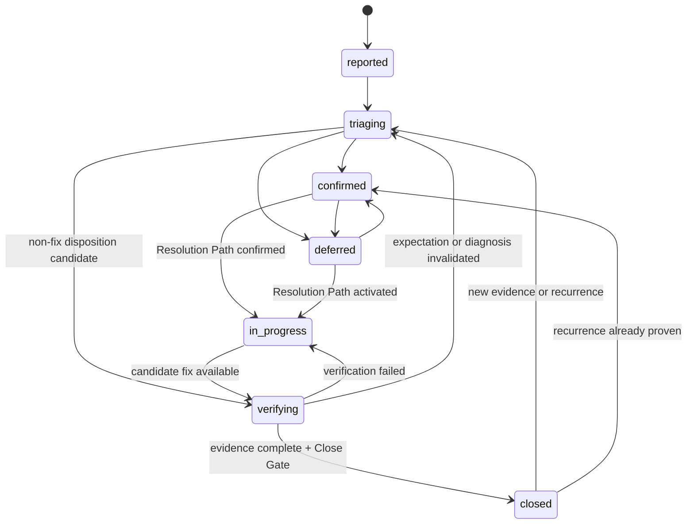
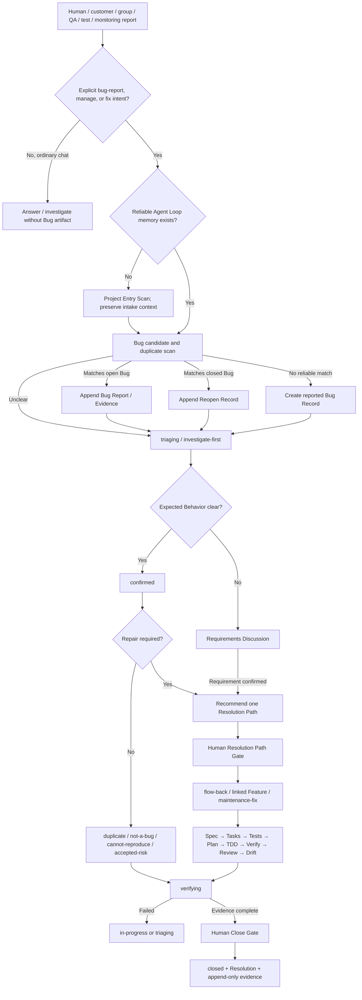

# Proposal: Human-Guided Bug Management

状态：Proposal、核心设计、实现、focused validation 与全量验证已完成，待最终 Human Review
目标版本：v1.4.0 候选
创建时间：2026-07-15
默认语言：中文

## 摘要

Agent Loop 已经具备 `Feature Follow-up / Flow-back`、Requirement Lifecycle、`maintenance-fix`、验证、Review、Drift Check 和 Human Gate，但 Bug 目前仍主要作为一个“触发修复流程的输入”存在，没有独立、稳定、可去重、可恢复的 Bug 身份和生命周期。

本 proposal 建议引入 `Human-Guided Bug Management`：

- Bug 使用独立的 `.agent-loop/bugs/` 管理线；
- Bug Record 负责问题事实、来源、复现、影响、证据、状态、处理路径和解决结论；
- Requirement 继续负责产品目标与预期行为；
- Feature 继续负责修复范围、任务、测试、实现和验证；
- 已确认且预期行为明确的 Bug，经人类确认处理路径后进入已有或新建 Feature；
- 只有产品预期缺失、冲突或需要改变时，Bug 才返回 Requirements Discussion；
- Bug 不创建自己的 `tasks.md`、`tests.md` 或 `plan.md`，避免形成第二套实施管理系统。

核心模型：

```text
Bug Report
→ Bug Record
→ triage / deduplicate / confirm expected behavior
→ Human-confirmed Resolution Path
→ Feature repair workflow or Requirements Discussion
→ Bug-specific verification
→ Human-confirmed close
```

## 背景与现有能力

### 当前已经具备

Agent Loop 当前能够：

- 将 Bug、regression、测试失败、QA 反馈和 post-close correction 路由到 `Feature Follow-up / Flow-back`；
- 在默认 30 天窗口和扩展证据扫描中寻找 owning Feature；
- 推荐 `flow-back`、linked new Feature、`maintenance-fix` 或 `investigate-first`；
- 将持久 Bug source 以 `Intake Type: bug-report` 归档到 Requirement Set；
- 在预期行为改变时更新 Requirement / Feature Spec，而不是直接裸改代码；
- 让窄修复仍然经过 spec、tasks、tests、plan、TDD、Verify、Review、Drift、Memory 和 Close；
- 使用 Human-Guided Branch Management 为已确认的修复选择 `bugfix` / `hotfix` 工作类型、Target Release Context 和唯一 Target Branch。

### 当前结构性缺口

现有能力主要回答“这次修复应该流向哪里”，但没有完整回答：

1. 多个用户、客户、群组、测试或监控报告是否属于同一个 Bug；
2. Bug 在修复 Feature 产生前如何保持稳定身份；
3. Bug 当前处于报告、调查、确认、修复、验证还是关闭状态；
4. `fixed`、`duplicate`、`not-a-bug`、`cannot-reproduce` 等结论如何与处理进度分离；
5. Bug 如何关联 Requirement、Feature、ADR、测试、分支与验证证据；
6. Bug 关闭后再次出现时如何 reopen 而不丢失历史；
7. 多个报告、多个 Requirement 与一个修复 Feature 之间如何保持可追踪关系；
8. 项目如何查看 open、deferred、verifying 和 reopened Bug，而不把 Bug backlog 塞进 `project.md`。

## 已确认的 Concept Foundation

Concept Foundation Status：`accepted`

### Concept Candidate Inventory

| Concept ID | Canonical Name | Kind | 已确认边界 |
|---|---|---|---|
| `C-BUG-REPORT` | Bug Report | intake evidence | 一次原始报告，不自动等于一个新 Bug |
| `C-BUG` | Bug Record | stable entity | 去重后的稳定缺陷身份，可在修复路径未知时存在 |
| `C-BUG-ORIGIN` | Report Origin | provenance | 来源上下文，不是人员 owner、assignee 或权限角色 |
| `C-BUG-EVIDENCE` | Bug Evidence | evidence | 复现、日志、截图、失败测试、环境与观察事实 |
| `C-BUG-EXPECTATION` | Expected Behavior Evidence | evidence relationship | 判断“是否为 Bug”的产品或行为依据 |
| `C-BUG-RESOLUTION-PATH` | Resolution Path | workflow relationship | Bug 当前通过哪条 Agent Loop 路径处理，不表示谁负责 |
| `C-BUG-LIFECYCLE` | Bug Lifecycle | state model | `Status` 管处理进度，`Resolution` 管最终结论 |
| `C-BUG-REOPEN` | Reopen Record | history event | 新证据或复发后追加历史并恢复处理中状态 |
| `C-BUG-LOOKBACK` | Bug Ownership Lookback | discovery rule | 全量 Bug Index 去重；默认 90 天 Feature metadata scan；证据驱动深读和超期扩展扫描 |

### `C-BUG` 定义

Bug Record 是一个经过归并、可持续追踪的“预期行为与实际行为不一致”声明。

它拥有：

- 稳定 Bug ID；
- 原始报告与来源关系；
- Observed Behavior；
- Expected Behavior Evidence；
- 复现、影响、环境和调查证据；
- Bug Status 与 Resolution；
- Requirement、Feature、Decision / ADR、Contract、测试和验证关系；
- Resolution Path；
- append-only 状态与 reopen 历史。

它不拥有：

- 产品需求定义；
- Requirement lifecycle；
- Feature Spec；
- 修复 tasks、tests 或 plan；
- 人员 owner / assignee；
- 分支创建、merge、push、tag、release 或 publish 权限。

### 身份边界

以下情况优先视为同一个 Bug：

- Expected Behavior 相同；
- Observed Behavior 属于同一失败语义；
- 影响同一产品边界或同一修复根因；
- 新报告是已关闭 Bug 的同范围复发。

以下情况应拆成不同 Bug：

- Expected Behavior 不同；
- 修复一个问题不会改变另一个问题；
- 用户影响、产品边界或验证闭环独立；
- 同一表象来自不同、需要独立修复和验证的原因。

Agent 不得仅凭相似标题自动合并 Bug。证据不够时保持 `triaging`，推荐 `investigate-first`。

## 设计原则

1. **Bug、Requirement、Feature 三线分离**：Bug 管问题事实，Requirement 管产品意义，Feature 管修复交付。
2. **报告不等于 Bug**：多个 Bug Report 可以归并到一个 Bug Record。
3. **Bug 不等于 Requirement**：只有产品预期缺失、冲突或改变时才进入 Requirements Discussion。
4. **Bug 不等于 Feature**：Bug 确认后仍需 Human Gate 才能创建或重新激活 Feature。
5. **没有裸修复**：所有代码修复必须通过 existing Feature、linked new Feature 或 `maintenance-fix` Feature。
6. **Status 与 Resolution 分离**：进度和结论不能压进一个不断膨胀的枚举。
7. **来源允许未知**：Report Origin 不完整不能阻塞调查或修复。
8. **预期行为必须有证据**：不能只凭 Agent 猜测把异常定性为 Bug。
9. **关闭不是测试自动结果**：测试通过只能进入 `verifying`；关闭需要完整证据和 Human Gate。
10. **历史不可覆盖**：duplicate、close、reopen 和 Resolution 变化必须保留 append-only 记录。
11. **一个 Bug 一个当前处理路径**：一个 Bug 同一时刻只有一个有效 Resolution Path；一个 Feature 可以解决多个相关 Bug。
12. **不污染项目记忆**：Bug backlog 属于 `bugs/INDEX.md`，不写入 `project.md`。
13. **90 天不是全量深读**：默认窗口只扫描 Feature metadata / summary；只深读有证据重叠的候选，超过 90 天仍可按明确证据扩展。

## Artifact Layout

Bug Management 在第一个被明确要求记录、管理或修复的 Bug 出现时按需创建，不作为 Project Entry 的空目录。

```text
.agent-loop/
  bugs/
    INDEX.md
    YYYY-MM-DD-<bug-slug>/
      README.md
      evidence/                 # optional
```

建议稳定身份：

```text
Bug ID: BUG-YYYYMMDD-<slug>
Bug Path: .agent-loop/bugs/YYYY-MM-DD-<bug-slug>/
```

同日同 slug 冲突时追加稳定序号，不覆盖旧记录：

```text
BUG-20260715-login-timeout-02
```

### `bugs/INDEX.md`

`INDEX.md` 是 inventory / backlog / locator，不是 Bug 详情的 source of truth。

```md
# Bug Index

| Bug ID | Title | Status | Resolution | Severity | Priority | Resolution Path | Target | Last Updated |
|---|---|---|---|---|---|---|---|---|
```

规则：

- 每个 Bug ID 只能有一行；
- 当前状态必须与 Bug README 一致；
- `closed` Bug 保留索引行；
- `deferred` 仍属于 open inventory；
- 不把完整复现、日志、讨论或 Feature tasks 复制进 INDEX；
- Bug 目录未来如需归档，应另行提案，不复用 Feature Archive 规则做隐式移动。

### Bug `README.md`

Bug README 是该 Bug 的协调 source of truth，建议结构：

```md
# Bug: <title>

Bug ID:
Created:
Last Updated:
Status: reported | triaging | confirmed | in-progress | verifying | deferred | closed
Resolution: unresolved | fixed | duplicate | not-a-bug | cannot-reproduce | accepted-risk | superseded

## Summary

## Report Origin
- Origin Type: person | customer | group | qa | monitoring | automated-test | agent | external-ticket | other | unknown
- Origin Reference:
- Intake Channel: chat | issue | ticket | test-run | alert | api | other | unknown
- Source Link:

## Observed Behavior

## Expected Behavior
- Expected Behavior:
- Expected Behavior Evidence:

## Impact And Triage
- Affected Users / Scope:
- Environment:
- Severity: unknown | low | medium | high | critical
- Priority: unset | low | medium | high | urgent
- Reproduction Status: not-attempted | reproducible | intermittent | cannot-reproduce

## Relationships
- Related Bugs:
- Duplicate Of:
- Related Requirements:
- Requirement Impact: none | violates-accepted-behavior | ambiguity-found | change-required
- Affected Delivery Phase:
- Related Features:
- Related Decisions / ADRs:
- Related Contracts:

## Resolution Path
- Path: investigate-first | flow-back | linked-feature | maintenance-fix | requirement | no-fix
- Target:
- Human Decision:
- Decision Evidence:
- Target Release Context:

## Evidence

## Verification And Close
- Fix Feature:
- Fix Revision / Commit:
- Verification Evidence:
- Review Evidence:
- Drift Result:
- Resolution:
- Close Decision:

## Status History

| Time | From | To | Resolution | Reason | Evidence | Human Decision |
|---|---|---|---|---|---|---|

## Reopen History

| Time | Prior Close | Trigger Report | New Evidence | Return Status | Human Decision |
|---|---|---|---|---|---|
```

`Origin Reference`、`Source Link` 和来源细节均可缺省。`Origin Type: unknown` 是合法值，不能成为调查或修复 blocker。

## Report Origin 模型

Report Origin 描述来源上下文，不表示责任人、权限、客户 owner 或 assignee。

```text
Origin Type: customer
Origin Reference: acme
Intake Channel: chat
Source Link: <support-message-link>
```

或者：

```text
Origin Type: automated-test
Origin Reference: checkout-e2e
Intake Channel: test-run
Source Link: <CI-job-url>
```

规则：

- 不要求来源一定是一个人；
- 群组、客户、系统、测试、监控和外部工单都可以成为来源；
- 不根据 Origin 推断优先级、权限、客户边界或修复责任；
- 后续补充来源时追加证据，不覆盖原始报告历史；
- 不把 token、secret、个人敏感信息或完整生产 payload 复制进 Bug Record。

## Status 与 Resolution 双轴模型

### Status

```text
reported | triaging | confirmed | in-progress | verifying | deferred | closed
```

| Status | 含义 | 进入条件 | 允许的主要下一步 |
|---|---|---|---|
| `reported` | 已形成稳定 Bug Record，尚未完成初步调查 | 明确 bug-report / manage / fix intent | `triaging` |
| `triaging` | 正在调查复现、Expected Behavior、重复关系或处理范围 | 有最小报告或新 reopen 证据 | `confirmed`、`verifying`、`deferred` |
| `confirmed` | 预期与实际偏差已经由证据确认 | Expected Behavior 与 Observed Behavior 均可解释 | Resolution Path Gate |
| `in-progress` | 已有 Human-confirmed Feature 修复路径正在执行 | Resolution Path 与 Fix Feature 有效 | `verifying`、`deferred` |
| `verifying` | 候选修复或非修复结论等待 Bug-specific 验证 | Feature/调查提供候选结果 | `closed`、`in-progress`、`triaging` |
| `deferred` | Bug 已知但暂不处理 | 具体原因、风险和 Human Decision | 回到 `confirmed` / `in-progress` |
| `closed` | Resolution 与证据完成，并经人类确认关闭 | Close Gate | reopen 后回到 `triaging` 或 `confirmed` |

### Resolution

```text
unresolved | fixed | duplicate | not-a-bug | cannot-reproduce | accepted-risk | superseded
```

| Resolution | 必需证据 |
|---|---|
| `unresolved` | 非关闭状态默认值 |
| `fixed` | Fix Feature、fresh verification、Review、Drift 与 Bug-specific acceptance evidence |
| `duplicate` | 唯一 canonical Bug ID；不得只写“看起来一样” |
| `not-a-bug` | Expected Behavior Evidence，证明 observed behavior 符合已接受规则 |
| `cannot-reproduce` | 环境、输入、尝试方式、次数与仍缺失的证据 |
| `accepted-risk` | 影响、风险、替代措施和显式 Human Decision |
| `superseded` | 替代 Bug、Requirement 或产品范围记录 |

### 状态图



状态与 Resolution 的约束：

- `closed` 不得使用 `Resolution: unresolved`；
- 非 `closed` 状态不得伪装为最终完成；
- `deferred` 不等于 `closed`；
- `cannot-reproduce` 不能仅由一次失败复现得出；
- `duplicate` 不得删除或覆盖原始报告；
- reopen 时追加 Reopen Record，将 Resolution 恢复为 `unresolved`，保留旧 Close Record。

## Severity 与 Priority

Severity 和 Priority 是两个不同维度：

- `Severity`：当前证据显示的产品、用户、数据、安全或运行影响；
- `Priority`：人类决定的处理顺序。

规则：

- Agent 可以基于证据推荐 Severity；证据不足时使用 `unknown`；
- Priority 默认 `unset`，不得从客户身份、报告语气或 Severity 自动推导；
- `critical` 不自动授权 `hotfix`、branch create、deploy、release 或 publish；
- `urgent` 必须来自明确人类优先级决定；
- 安全漏洞、数据破坏、生产中断等高风险报告仍遵守最小暴露和 Human Gate。

## Bug、Requirement 与 Feature 的关系

### 三条独立管理线

| Artifact | Authority | 不拥有 |
|---|---|---|
| Requirement | 产品目标、预期行为、业务规则、验收方向、Delivery Phase | Bug 调查和修复进度 |
| Bug Record | 异常事实、来源、复现、影响、证据、状态、处理路径、解决结果 | 产品需求定义和实现计划 |
| Feature / maintenance-fix | 修复范围、spec、tasks、tests、plan、实现与验证 | Bug 原始报告和长期缺陷身份 |

### 关系模型

```text
Bug Report 1..N -> 1 Bug Record
Bug Record 0..N -> Requirement
Bug Record 0..N -> Related Feature / Decision / Contract
Bug Record 1 -> current Resolution Path
Bug Record 0..1 -> Fix Feature while repair is active
Feature 0..N -> Bug Record
Bug Record 0..1 -> Duplicate Of canonical Bug Record
```

一个 Bug 同一时刻只有一个当前 Resolution Path；一个 Feature 可以在范围一致、验证闭环完整时修复多个 Bug。

`flow-back`、`linked-feature`、`maintenance-fix` 和 `requirement` 必须填写唯一有效 Target；`investigate-first` 与 `no-fix` 可以暂时没有 Target，但必须有具体调查动作或候选 Resolution 证据。

### Requirement 关联

Requirement 是可选的 `0..N` 关系：

| 场景 | Requirement 处理 |
|---|---|
| 违反已接受 Requirement | 关联并记录 `violates-accepted-behavior` |
| 暴露 Requirement 含糊或缺失 | 关联原 Requirement，进入 Requirements Discussion |
| 实际提出新产品行为 | 创建并关联新 Requirement；确认后再形成 Feature |
| 纯内部实现、性能或技术缺陷 | 可以没有 Requirement，引用 Feature、test、ADR、Contract 或 runtime evidence |
| 影响多个 Requirement | 允许多条关联，不制造虚假的唯一 Requirement |

Bug 不自动修改 Requirement lifecycle。只有证据证明 Requirement 的验收或交付状态已经失真时，运行 Requirement Reconciliation，由人类确认是否从 `implemented` 调整为 `partially-implemented`、`in-progress` 或其他合法状态。

原始 Requirement source 保持 immutable。产品语义改变使用 append-only follow-up 或新的 Requirement Set。

### Feature 修复

所有代码修复必须进入 Feature workspace：

| Bug 判断 | Resolution Path | Feature 动作 |
|---|---|---|
| 属于已有 Feature 承诺 | `flow-back` | Human Gate 后重新激活 owning Feature |
| 独立修复范围 | `linked-feature` | Human Gate 后创建 linked new Feature |
| 无产品 Feature 归属的窄修复 | `maintenance-fix` | Human Gate 后创建 `Feature Type: maintenance-fix` |
| 产品预期缺失、冲突或改变 | `requirement` | 先 Requirements Discussion；Requirement 确认后再创建 Feature |
| 证据不足 | `investigate-first` | 不创建 Feature，继续 targeted investigation |
| duplicate / not-a-bug / cannot-reproduce / accepted-risk | `no-fix` | 候选 Resolution 进入 verification / Close Gate |

Bug 目录禁止创建自己的 `tasks.md`、`tests.md`、`plan.md` 或代码执行单元。Bug README 只保存 `Fix Feature` 与证据链接。

## 端到端处理流程



## Intake 与去重

### Artifact creation boundary

- 普通问题、讨论或对错误信息的解释不创建 Bug Record；
- 人类明确要求记录、管理、调查或修复 Bug 时，允许创建 `reported` Bug Record 作为正常工作流产物；
- 如果信息太少，Bug 保持 `reported` / `triaging`，不得为了创建 Feature 而猜测 Expected Behavior；
- Feature 创建、Feature reopen、Requirement 创建/变更和任何 Git action 仍保持独立 Human Gate。

### Duplicate scan

创建新 Bug 前，按以下顺序检查：

1. `bugs/INDEX.md` 中 open / deferred / verifying Bug；
2. 标题之外的 Expected Behavior、Observed Behavior、路径、API、模型、测试、环境和 evidence overlap；
3. closed Bug 的 recurrence evidence；
4. recent / archived Feature Follow-up evidence；
5. Requirement、Decision / ADR、Contract 和 test authority。

如果在新记录落盘前确认 duplicate，将新 Bug Report 追加到 canonical Bug；不制造空 duplicate record。

如果 Bug Record 已经存在后才确认 duplicate：

- 设置 `Resolution: duplicate`；
- 填写唯一 `Duplicate Of`；
- 保留原始 Report Origin 和 Evidence；
- 经 Close Gate 后关闭；
- 不自动合并或删除两个目录。

## 归属窗口与分层扫描

Bug duplicate / reopen 与 Feature ownership 使用不同边界。

### Bug identity scan

Bug identity 不受时间窗口限制：

- 扫描完整 `bugs/INDEX.md` 的 Bug ID、Status、Resolution、Expected / Observed 摘要和 duplicate/reopen pointers；
- 优先匹配 open、deferred、in-progress 和 verifying Bug；
- closed Bug 仍参与 recurrence scan；
- 只读 metadata 不等于加载全部 evidence 或历史正文；
- ambiguous match 不得自动合并，进入 `triaging` / `investigate-first`。

### Feature ownership scan

默认 Feature ownership lookback：**90 calendar days**。

```text
all Bug Index metadata
→ recent 90-day Feature metadata / summary scan
→ evidence-ranked candidate deep read
→ evidence-triggered extended scan beyond 90 days
```

分层规则：

1. 先读取 Active / Paused Feature pointers、flat Feature metadata 和 `features/archive.md` locator；
2. 对最近 90 天 Feature 只比较 Feature ID、状态、scope summary、paths、APIs、models、tests 和 verification references；
3. 只深读与 Bug wording、Expected / Observed Behavior、代码路径、API、模型、UI、job、错误或测试证据存在重叠的 Feature；
4. 多个候选均为 medium/high match 时保持 `investigate-first`，不因时间接近强行选择；
5. 人类明确提到旧 Feature，或路径、API、模型、测试、UI、job、Requirement / ADR evidence 指向 90 天外 Feature 时，运行 extended scan 并标记 `outside-default-window`；
6. 不使用第 91 天作为停止 ownership analysis 的理由；
7. archived Feature 只在 locator 唯一有效后读取；只有确认 flow-back 且准备执行时才走 Human-gated rehydrate。

Archive-specific rules：

- Feature Monthly Archive 只改变目录位置，不改变 Feature identity、ownership、close evidence 或 Bug match eligibility；
- 90 天按 Feature 的 `Last Updated / Closed` 事实计算，不按 archive month、目录 mtime 或归档执行时间计算；
- `features/archive.md` 只是 Feature ID 到当前路径的 locator / ledger，不是 scope、acceptance 或 ownership authority；
- locator 唯一有效后，Agent 可以只读 archived `spec.md`、`tests.md`、`notes.md` 和 close / verification evidence 完成候选匹配；
- discovery、duplicate scan、ownership classification 和 Human Review 不要求 rehydrate；
- 只有人类确认 `flow-back`、且即将重新激活或执行 owning Feature 时，才运行 read-only rehydrate scan、Batch Human Gate、transaction apply 和 post-check；
- locator 缺失、路径冲突、flat/archived collision、rehydrated row 指向 month path 或 stranded transaction 时，停止 ownership mutation 并进入 Recovery，不猜测路径。

项目可以在 `project.md` 明确覆盖默认窗口：

```text
Feature Follow-up Lookback: 90 days
```

高频仓库可以由人类确认缩短到 30 天，低频或长发布周期项目也可以延长。覆盖值只改变默认 metadata scan，不限制 evidence-driven extended scan。

## Expected Behavior Evidence

Expected Behavior 可以来自：

- accepted Requirement 或 Delivery Phase acceptance；
- owning Feature Spec / tests；
- accepted Decision / ADR；
- accepted Delivery Contract；
- stable product/domain rule；
- previously verified behavior；
- explicit current human clarification。

证据优先级遵循：

```text
current explicit human product decision
> accepted Requirement / effective follow-up
> accepted Decision / ADR / Contract
> accepted Feature Spec and tests
> current verified code/runtime behavior
> Agent inference
```

代码现实可以证明 observed behavior，但不能单独证明该行为就是正确的产品预期。Expected Behavior 冲突时进入 Requirements Discussion、Requirement Conflict Review 或 Drift Check，不允许 Agent 静默选择。

## Human Gates

| Gate | 需要确认的动作 |
|---|---|
| Resolution Path Gate | flow-back、linked Feature、maintenance-fix、Requirement route、no-fix disposition |
| Feature Reopen / Creation Gate | 重新激活 closed Feature 或创建新 Feature workspace |
| Requirement Gate | 创建 Requirement、改变产品语义、调整 Requirement lifecycle |
| Delivery Contract Gate | 创建、接受或 breaking-change Contract |
| Branch Action / Integration / Cleanup / Release Gate | create、switch、merge、delete、push、tag、release、publish |
| Bug Close Gate | Resolution、证据、风险和最终关闭 |
| Bug Reopen Gate | closed Bug 恢复为 `triaging` / `confirmed` 并重置当前 Resolution |

同一个 Human Review Summary 可以同时展示并请求多个明确动作，但每个授权项必须单独命名，不能用“同意修复”“继续”“自动模式”推断所有 Gate 均已通过。

Auto Mode 不得越过：

- Bug close / reopen；
- Feature create / reopen；
- Requirement create / lifecycle change；
- Delivery Contract action；
- branch create / switch / merge / delete / push / tag；
- commit、PR、release 或 publish。

## Branch Management 集成

Bug Management 决定产品与修复路径；Branch Management 只消费已确认结果。

```text
confirmed Bug
→ Human-confirmed Resolution Path
→ Fix Feature
→ Target Release Context
→ bugfix or hotfix development branch recommendation
→ independent Branch Action Gate
```

规则：

- Severity / Priority 不自动决定 `bugfix` 或 `hotfix`；
- formally released / sealed 版本不接受 same-version repair；
- 修复进入人类确认的新 patch Target Release Context；
- customer Bug 保持 customer isolation，不得整条反向合入标准产品；
- Branch Strategy adoption、Bug confirmation 和 Feature plan 均不授权 Git mutation；
- Bug Record 可以保存 Target Release Context 摘要，但 mutable Current Branch Context 仍由 Feature notes/plan/submit record 拥有。

## Project Memory 与恢复

- `bugs/INDEX.md` 是 Bug inventory / backlog；
- `project.md` 不保存 open Bug 列表、临时 triage、复现日志或 deferred Bug backlog；
- Feature notes 记录当前修复执行与 Bug links；
- Requirement README 只在有关联时记录 Bug refs 或 Reconciliation 结果；
- durable domain behavior 变化仍通过 Project Memory Update 和 Human Gate；
- Project Entry / Re-Adopt 读取 Bug Index 以发现 `in-progress`、`verifying` 和 `deferred` 事实，但不让 Bug 状态覆盖 Active Feature invariant；
- 一个时刻仍只允许一个 Active Feature；多个 open Bug 可以并存。

恢复时 fail closed：

- INDEX 与 Bug README 状态不一致；
- duplicate target 不存在或形成循环；
- Fix Feature 路径失效且没有 archive locator；
- `closed` 使用 `Resolution: unresolved`；
- `in-progress` 没有有效 Resolution Path / Target；
- Requirement、Feature、ADR、Contract 与 Expected Behavior 冲突；
- verifying evidence 只存在于已过期外部 URL，且本地没有可理解摘要。

## 与现有 Feature Follow-up 的关系

Bug Management 不新增 canonical stage。它作为 `Feature Follow-up / Flow-back` 的内部 Bug Intake / Triage 方法：

```text
Bug report signal
→ Feature Follow-up / Flow-back
→ load Bug Management
→ deduplicate and triage Bug Record
→ recommend one Resolution Path
→ return to existing Requirement / Feature / Verify / Close stages
```

Feature Follow-up 继续处理：

- same-feature adjustment；
- behavior tweak；
- post-close correction；
- regression；
- new feature / maintenance-fix / investigate-first 判断。

Bug Management 增加：

- stable Bug identity；
- Bug Report aggregation；
- origin、severity、priority、status、resolution；
- duplicate / reopen；
- Requirement / Feature / evidence graph；
- Bug-specific verification and close。

## 非目标

第一版不做：

- 人员 owner、assignee、团队、排班或责任分派；
- SLA、工时、story points、迭代容量或绩效统计；
- 自动创建 GitLab / GitHub / Jira Issue；
- 双向同步外部 Issue Tracker；
- 自动判断 Priority、自动触发 hotfix 或自动发布；
- Bug 自己的 tasks/tests/plan 实施体系；
- 默认 YAML/JSON database 或强制脚本维护的 executable schema；
- Bug Archive、压缩、删除或 retention automation；
- 自动修改 Requirement lifecycle；
- 自动 reopen / create Feature；
- 自动创建、切换、merge、删除或 push 分支；
- 自动 commit、PR、release、tag 或 publish；
- 完整 Security Incident、Production Incident 或 Customer Support 管理；
- worktree / branch memory merge。

外部 Issue Tracker 可以成为 Report Origin 和 Source Link；后续 GitLab 团队协作 proposal 可以消费 Bug ID、Status、Resolution Path 与 Evidence，但不得替代 Agent Loop artifact authority。

## 方案比较

### 方案 A：独立轻量 Bug Record，与 Feature / Requirement 建立关系（采用）

优点：

- 稳定 Bug 身份；
- 支持 duplicate、reopen、跨来源和跨 Feature；
- 不污染 Requirement lifecycle；
- 不复制 Feature 实施体系；
- 可被后续 Issue Tracker、分支和 memory merge 消费。

代价：

- 增加 `.agent-loop/bugs/` 与同步规则；
- 需要维护 Bug/Feature/Requirement link consistency；
- 需要新增 lifecycle 与 validation contract。

### 方案 B：只增强 Feature Follow-up，不创建 Bug Artifact（不采用）

优点是最轻；缺点是 independent Bug、duplicate、reopen、deferred inventory 和跨 Feature 追踪继续分散在 Feature notes 或聊天中。

### 方案 C：所有 Bug 都先进入 Requirement Set（不采用）

优点是入口统一；缺点是把产品需求与实现偏差混在同一 lifecycle，纯技术 Bug 也被迫制造 Requirement，容易造成 Requirement 状态失真。

## 分阶段实施建议

### Phase 1：Bug Contract 与 Artifact

- 发布 `references/bug-management.md`；
- 增加 Bug Record / Index templates；
- 定义 ID、Status、Resolution、Origin、Evidence、Relationship 与 Resolution Path；
- 将 Feature Follow-up 路由到 Bug Management；
- 保持 canonical stage order 不变。

### Phase 2：Requirement / Feature / Branch Integration

- 同步 Requirement Reconciliation；
- 同步 Feature Spec / notes / tests 的 Bug references；
- 同步 maintenance-fix 与 archived Feature rehydrate；
- 同步 Branch Strategy Check 与 Target Release Context；
- 增加 Human Review Summary 与 Auto Mode stops。

### Phase 3：Validation 与 Human Guidance

- 增加 RED/GREEN focused contract；
- 增加生命周期、duplicate、reopen、90-day ownership、outside-window、low-information、Requirement ambiguity、sealed release 和 customer isolation 压力场景；
- 更新 README、Usage、CHANGELOG 与 root routing；
- 按 full-validation method 做六域审计和全量回归。

本 proposal 获批不等于上述 Phase 已获实施授权。Implementation Plan、代码/文档修改、版本变更、commit 和 push 仍需各自 Human Gate。

## 验收场景

### 1. 已有 Feature 的回归

Bug 违反最近 Feature 的 accepted behavior。Agent 创建/更新 Bug Record，确认 Expected Behavior，推荐 flow-back；人类确认后重新激活 Feature，并在修复验证后关闭 Bug。

### 2. 无 Feature 归属的窄修复

Bug 是内部 correction，不创造新产品能力。Agent 推荐 `maintenance-fix` Feature，不进行裸改。

### 3. 新产品行为伪装成 Bug

人类说“这是 Bug”，但目标行为从未被 Requirement / Feature / Decision 接受。Agent 保持 triaging，进入 Requirements Discussion，不直接创建修复 Feature。

### 4. 多来源重复报告

客户、聊天群和自动化测试分别报告相同 Expected/Observed mismatch。Agent 将三个 Bug Report 关联到一个 canonical Bug，不创建三个并行修复 Feature。

### 5. 已落盘 Bug 后确认 duplicate

保留原 Bug Record，设置 `Resolution: duplicate` 与 `Duplicate Of`，经 Close Gate 关闭，不删除历史。

### 6. Closed Bug 复发

新 evidence 与旧 Bug identity 相同。Agent追加 Reopen Record，将状态恢复为 `triaging` 或 `confirmed`，不覆盖原 Close Record。

### 7. 来源未知

报告无法确认来自个人、群组还是客户。记录 `Origin Type: unknown`，继续调查，不把 provenance 缺失当成 blocker。

### 8. 无法复现

Agent记录环境、输入、尝试和证据；一次失败复现不能直接 `cannot-reproduce`。候选结论进入 verification 和 Close Gate。

### 9. Requirement 关联但不自动回滚

Bug 违反 implemented Requirement。Agent记录 relationship 和 impact，只有证据证明交付状态失真时才运行 Requirement Reconciliation；不自动修改 lifecycle。

### 10. 多 Requirement 影响

一个 Bug 影响两个 Requirement。允许关联两者，但保持一个当前 Resolution Path 和一个 coherent Fix Feature scope。

### 11. 一个 Feature 修复多个 Bug

多个 Bug 根因和交付范围一致。人类确认一个 linked Feature；每个 Bug 保持独立 identity、verification 和 Resolution。

### 12. 普通 Chat 不创建 Bug

人类只问错误含义或让 Agent 解释日志。Agent可以只读调查，不自动创建 `.agent-loop/bugs/`。

### 13. 项目没有可靠 Agent Loop memory

Agent先做 Project Entry Scan，保留 intake context，再执行 Bug candidate scan；不凭空创建 Feature 或关联不存在的 Requirement。

### 14. Owning Feature 已归档

Agent 按 Feature Archive locator 解析 owner，只读 archived spec/tests/notes 和 close evidence 完成匹配；发现与 Human Review 不要求 rehydrate。只有 flow-back 获得确认并准备执行时才走 Human-gated rehydrate；Bug identity 不因 feature path 移动而改变。

### 15. Sealed release 修复

Bug 已确认，但原 Target Release 已 sealed。Bug Management 不修改旧版本；Branch Management 推荐人类确认的新 patch context。

### 16. 测试通过但证据未闭环

Feature tests 通过后 Bug 进入 `verifying`。缺少 Bug-specific reproduction/acceptance evidence 或 Human Close Gate 时不得关闭。

### 17. Accepted risk

人类决定暂不修复。Bug 必须记录影响、风险、替代措施和显式决定，才能使用 `Resolution: accepted-risk` 关闭；不得将 `deferred` 伪装为 accepted risk。

### 18. Customer Bug

Bug 来自客户 acme，但来源不自动决定修复线。确认 customer-specific scope 和 Target Release Context 后，Feature / Branch Management 保持 customer isolation。

### 19. 60 天前 Feature 仍在默认窗口

QA 报告 60 天前关闭 Feature 的回归。Agent 在 90 天 metadata scan 中发现 scope / path / test overlap，只深读该候选并推荐 flow-back；不得因超过旧 30 天规则而直接创建 maintenance-fix。

### 20. 120 天前 Feature 由证据触发扩展扫描

人类明确给出 120 天前 Feature ID 与失败 API。Agent 运行 extended scan，标记 `outside-default-window`，确认 ownership 后仍可推荐 flow-back；90 天不是 hard cutoff。

## 完成标准

正式实现只有在以下条件全部满足后才能声明完成：

1. Bug Report、Bug Record、Report Origin、Evidence、Resolution Path、Status、Resolution 与 Reopen 的定义跨 runtime/design/reference/template 一致；
2. `.agent-loop/bugs/` 是独立管理线，但不形成第二套实施体系；
3. Bug 代码修复只能通过 Feature workflow；
4. Requirement relationship 为可选 `0..N`，且不会自动改变 Requirement lifecycle；
5. Expected Behavior ambiguity 能返回 Requirements Discussion；
6. duplicate、cannot-reproduce、not-a-bug、accepted-risk 和 reopen 均有证据与历史规则；
7. `Status` 与 `Resolution` 双轴状态验证生效；
8. Bug close、reopen、Feature create/reopen、Requirement change 和 Git actions 的 Human Gates 均保留；
9. `bugs/INDEX.md` 与 Bug README 能恢复 open/deferred/verifying 状态；
10. Project Memory 不被 Bug backlog 污染；
11. Branch Management 只消费 confirmed Bug / Fix Feature 的 Target Release Context，不获得隐式 Git 授权；
12. 至少覆盖本 proposal 的 20 个压力场景；
13. focused RED/GREEN、full validation、Markdown/YAML/JSON/Shell checks 和 `git diff --check` 全部通过；
14. 中文验证报告明确区分 Bug 记录能力、Feature 修复能力和真实 Git side effects。

## Proposal Boundary

本文件是 v1.4.0 Bug Management 的设计输入，不是当前 runtime authority。

在正式实施并通过 Human Review、Implementation Plan、回归测试和 full validation 之前：

- Agent Loop 不能声称已经提供 first-class `.agent-loop/bugs/` runtime；
- 当前 Bug 仍由 `references/feature-follow-up.md` 与现有 Requirement / Feature 规则处理；
- 当前 runtime 的默认 Feature Follow-up lookback 仍为 30 天；只有 Proposal 获批并完成 coordinated implementation / validation 后才改为 90 天；
- 不创建源码仓库根 `.agent-loop/bugs/`；
- 不因本 proposal 存在而修改 skill version；
- 不自动创建 Bug、Requirement、Feature、branch、commit、PR、tag、release 或 publish；
- 不把本 proposal 的模板草案当成已发布 artifact contract；
- worktree / branch memory merge 仍需独立 proposal。

## 推荐结论

建议在 v1.4.0 采用方案 A：独立轻量 Bug Record + Human-confirmed Resolution Path + Feature-based repair。

```text
稳定 Bug identity
→ 可选、宽松的 Report Origin
→ 全量 Bug metadata 去重 + 90 天 Feature ownership metadata scan
→ Expected vs Observed evidence
→ Status / Resolution 双轴生命周期
→ optional Requirement relationships
→ Human-confirmed Feature repair path
→ fresh verification / Review / Drift
→ Bug-specific Close Gate
→ append-only reopen history
```

该设计补齐“问题如何被长期管理”，同时复用 Agent Loop 已有 Requirement、Feature、Branch、Verification 和 Human Gate 能力，不重复建立第二套开发流程。
