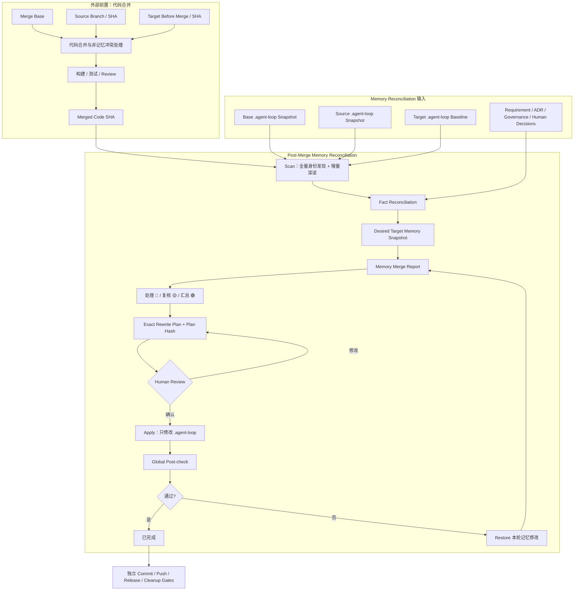

# Proposal: Post-Merge Agent Loop Memory Reconciliation

状态：Proposal 已批准；Human Review 发现已修复并完成再验证，待新的 Human Review
目标版本：v1.4.0 候选
创建时间：2026-07-16
默认语言：中文

## 摘要

同一个项目在多个分支或 worktree 中开发时，每条分支都可能更新自己的 `.agent-loop/`：新增 Requirement、Feature、Bug、Decision，记录测试、状态、环境、项目能力和当前工作。代码合并完成后，这些记忆不能依赖 Git 的 Markdown 文本合并结果，也不能简单选择 `ours`、`theirs` 或两边内容的并集。

本 Proposal 建议引入 `Post-Merge Agent Loop Memory Reconciliation`，中文名称为“代码合并后记忆校准与重写”。`Memory Merge` 可以作为人类易懂的简称，但运行模型必须明确：

> 代码负责合并；Memory Reconciliation 在代码合并完成后，以 Target Memory 为重写基线，核对 Base、Source、Target 的记忆声明与合并后真实事实，生成并落实一份正确的 Desired Target Memory。

核心链路为：

```text
Code Merge Complete
→ Scan
→ Fact Reconciliation
→ Desired Target Memory
→ Exact Rewrite Plan
→ Human Review
→ Apply
→ Post-check
→ Restore on failure
```

该能力不参与代码合并，不解决业务代码冲突，不自动创建 merge commit、push、release 或删除 Source 分支。它只负责 `.agent-loop/` 的正确重写，并保持原始需求、人类决策和 append-only 历史不可被静默覆盖。

## 已确认的核心设计

本轮讨论已经确认：

1. Memory Reconciliation 与代码合并是两个不同能力；代码先完成合并，记忆最后校准和重写。
2. Target Memory 是重写基线，不是天然事实来源；Source、Target 和 Base 记忆都是需要验证的 Memory Claims。
3. 最终输出不是两边 Markdown 的拼接，而是 `Desired Target Memory Snapshot`。
4. Source 独有且身份无冲突的 Requirement / Feature 通常可以引入，但仍要核对实施、引用和生命周期事实。
5. 每个需要引入、重写、重算或移除的记忆项，都要根据适用的代码、测试、环境、产品、规范、Git 或人类决策事实进行定向核对。
6. 不建立全局事实优先级；不同问题使用不同 authority。
7. 代码只能证明“实际实现了什么”，不能自动证明“这样实现符合产品要求”。
8. 当代码与 Requirement、Accepted ADR 或明确 Human Decision 冲突时，必须进入人类关注项，不能自动把权威来源改成代码现状。
9. Agent 先调查、排除无效选项、给出推荐和影响；人类只处理不能由事实唯一确定的选择。
10. 人类关注等级只有 `🟢 / 🟡 / 🔴`；动作使用中文，不增加复杂的 item 状态系统。
11. 人类逐条或分组处理 🔴，批量复核 🟡，🟢 只看汇总；所有 🔴 解决后再确认完整 Rewrite Plan。
12. 每次真实重写按需创建一份独立 Memory Merge Report，不在项目初始化时创建空目录。
13. 一个合并后代码结果只对应一份报告和一次成功重写；未完成时允许恢复，完成后禁止再次 Apply。
14. 扫描采用“全量发现身份与索引、增量深读变化和影响、重写后全局检查”。
15. 本地代码合并可以先完成；Memory Reconciliation 完成前，不允许 push、release 或删除 Source 分支。
16. 实际 Target 分支的 canonical memory 和目录结构是主要扫描骨架；合入 `main` 时它就是主干记忆，合入 release / customer target 时使用对应 Target 的记忆骨架。
17. 主要扫描骨架只决定发现顺序，不构成覆盖边界；Base、Source、Target-before 和 Result 中发现的每个 `.agent-loop` path 都必须按语义合并原则得到处理结论。

## 背景与问题

### 当前已具备的输入

Agent Loop v1.4.0 已经提供：

- Human-Guided Branch Management 的 Source Branch、Target Branch、Target Release Context、Customer Boundary、Branch Lifecycle State 和允许合并方向；
- Requirement Set、Feature、Bug、Decision / ADR 的稳定身份和事实归属；
- `project.md` 与 enterprise `project/*.md` 的长期项目记忆边界；
- Feature `notes.md` 的 Current Branch Context、验证、Review、Drift 和 Submit evidence；
- `bugs/INDEX.md`、`features/archive.md` 与可选 `requirements/INDEX.md` 的 inventory / locator 责任；
- Human Gate、Batch Human Review、Plan Hash、Post-check 和 Restore 等安全模式；
- Feature Monthly Archive 的“身份不随位置变化”、精确计划、事务日志和恢复经验。

Branch Management 已明确声明：它只提供未来 Memory Merge 所需的 Branch Context，不处理 `.agent-loop` 冲突。本 Proposal 消费这些输入，不重新发明分支命名、Target Release Context 或 Git mutation 权限。

### 结构性缺口

代码合并后，目标分支可能出现：

- Source 独有 Requirement / Feature / Bug / Decision 没有进入 Target memory；
- Target `project.md` 保留了已经失效的 Active Feature、能力、命令、环境或 Target Release Context；
- Source 和 Target 对同一项目事实给出不同描述；
- 两边记忆都与合并后的代码事实不符；
- 同一个 Feature / Bug / Decision 的 append-only evidence 被覆盖或重复；
- Branch-local Current Work 被错误提升为 Target 的当前项目状态；
- `bugs/INDEX.md`、`features/archive.md`、Requirement Mapping 或 Project Memory Index 与 canonical artifacts 不一致；
- 代码实现违反 Accepted Requirement / ADR，但 Agent 把文档改成代码现状，掩盖真实 drift；
- Source 分支被过早删除，导致原始 `.agent-loop` 快照和审计证据难以恢复；
- Git 自动文本合并没有冲突，但产生了语义错误的 Markdown。

Git 冲突是否为零，不能证明记忆正确。

## 目标

1. 在代码合并完成后，为 `.agent-loop/` 生成可审计、可确认、可恢复的 Desired Target Memory。
2. 保留 Source 与 Target 中所有有效、独立、可追踪的 Requirement、Feature、Bug、Decision 和历史证据。
3. 根据合并后真实代码、测试、配置、环境、规范和人类决策重写当前事实与派生索引。
4. 将可由事实唯一确定的工作交给 Agent，将真正的产品、规范、环境和人类决策冲突交给人类。
5. 通过一份 Memory Merge Report 展示事实、动作、关注等级、Human Decision、Apply 和 Post-check。
6. 保证同一输入可重复扫描但只成功 Apply 一次；成功后再次扫描应得到零变更。
7. 在 Apply 失败时只恢复本轮 `.agent-loop` 修改，不擅自回滚或修改已完成的代码合并。
8. 保持 commit、push、release、Source branch cleanup 与 Memory Apply 的 Human Gate 相互独立。

## 非目标

本 Proposal 不负责：

- 执行或规划业务代码合并；
- 解决非 `.agent-loop` Git 冲突；
- 选择 Source / Target 的代码实现；
- 创建、切换、合并、删除或 push Git branch；
- 创建 merge commit、PR、tag 或 release；
- 自动修改原始 Requirement、Prototype、Feedback 或 Human Decision；
- 用代码现实覆盖 Accepted Requirement / ADR 的含义；
- 引入通用 Markdown merge driver；
- 引入 branch database、多人任务调度或外部 Issue Tracker；
- 默认创建 `.agent-loop/memory-merges/` 空目录；
- 将 Memory Merge Report 当成新的项目百科、Bug backlog 或 Feature execution system；
- 自动修复环境或生产系统；
- 在本 Proposal 阶段实现脚本、runtime、template 或测试。

## 核心概念

### Post-Merge Memory Reconciliation

代码合并后，对 Target `.agent-loop` 做事实核对、语义重写、派生数据重算和全局一致性验证的过程。它不是 Markdown merge，也不是代码 merge 的隐式副作用。

### Memory Claim

Base、Source 或 Target 中某条 Agent Loop 记忆对项目事实、产品意图、状态、环境、历史或引用关系的声明。Memory Claim 必须通过适用 authority 验证后才能进入 Desired Target Memory。

### Memory Record

具有稳定身份、事实归属和重写策略的最小语义单元。它不统一等同于一个 Markdown 文件；可以是：

- 一个不可变 Requirement source；
- 一个 Requirement Set、Feature、Bug、Decision 或 Project Skill；
- 一个稳定 section / fact key；
- 一条 append-only history event；
- 一个 Index / Locator row；
- 一个 Current Work 或 Target Release Context 指针。

### Target Canonical Memory Spine

实际 Target 分支中由当前 Agent Loop artifact ownership、`project.md`、enterprise indexes、stable IDs 和 canonical locators 组成的主要记忆骨架。

当 Target 是 `main` 时，它对应人类所说的“主干记忆和目录”；当允许的合并目标是 release 或 customer branch 时，以该 Target 自己的 canonical memory 为骨架。它用于：

- 决定 Scan 的主要读取顺序；
- 提供 Target 输出结构基线；
- 定位 canonical owner、index、locator 和 current pointers；
- 发现缺失、断链和不再成立的 Target claims。

Memory Spine 不是事实优先级，也不是路径白名单。Source-only、新版本、project-local 或未来新增 artifact 不得因为不在骨架中而被忽略。

### Semantic Artifact Role

每个发现的 path 或 Memory Record 都必须根据内容、稳定身份、引用、所有者、历史和适用规范归入一个语义角色。目录名只是证据，不单独决定处理动作。

### Branch Fact Snapshot

某个 Git SHA 下的代码、测试、配置、Agent Loop artifacts、已确认人类决策和适用规范组成的分支事实快照。Branch Fact Snapshot 用于验证 Memory Claims，但不同事实类型仍有不同 authority。

### Desired Target Memory Snapshot

根据合并后项目现实推导出的目标 `.agent-loop` 期望状态：

```text
Desired Target Memory
= merged code / test / config reality
+ immutable human sources
+ accepted product / technical decisions
+ valid Source and Target history
+ target-appropriate current state
+ rebuilt derived indexes and locators
```

Source、Target 和 Base 内容是推导证据，不是必须逐段拼接到输出的文本。

### Memory Merge Report

一次代码合并结果对应的持久审计记录，包含 Merge Context、事实核对、关注项、Human Decisions、Exact Rewrite Plan、Apply、Post-check 和 Restore evidence。

### Memory Rewrite Plan

对每个 Memory Record 给出预期动作、目标值、事实依据、文件路径、preimage hash、post-check 和 restore 范围的确定性计划。Apply 只能消费已确认且未过期的 Plan Hash。

## 端到端流程



## Entry Preconditions

Memory Reconciliation 只能在以下条件满足后进入：

1. 代码合并已经在本地形成稳定 `Merged Code SHA`；
2. 所有非 `.agent-loop` 代码冲突已经解决；
3. 适用的构建、测试和 Review 已完成或明确记录缺口；
4. Merge Base SHA、Source SHA、Target Before Merge SHA 和 Merged Code SHA 可解析；
5. Source / Target Branch Context 和允许合并方向已知；
6. Source commit 仍可读取，且 Source 分支尚未清理；
7. 没有另一个未恢复的 Memory Apply transaction；
8. Target `.agent-loop` 不含无法归属的无关 dirty work；
9. 当前代码结果尚未 push、release，Source 分支尚未删除。

Merged Code 可以来自 merge、squash、rebase 或项目原生集成方式，但必须保留明确的 Base、Source、Target-before 和 Result evidence。Memory Reconciliation 不从分支名猜测这些 SHA。

`Merged Code SHA` 中已有的 `.agent-loop` 内容仅作为 Target 重写基线，不代表 Git 文本合并已经产生正确记忆。

## 事实模型

### 没有全局 authority 排名

不同问题使用不同事实权威：

| 要判断的问题 | 主要 authority | 辅助证据 | 冲突处理 |
|---|---|---|---|
| 代码实际实现了什么 | merged code、配置、数据模型 | tests、build、CI | 重写实现事实；不能反向改 Requirement |
| 产品原本要求什么 | original Requirement、Prototype、Feedback、Human Decision | Product Brief、Feature acceptance | 冲突标记 🔴 |
| 技术方案为何如此 | Accepted ADR、Delivery Contract、Human Decision | code、tests | 代码违反 decision 时标记 🔴 |
| 当前环境运行在哪里 | 最新部署配置、运行时或只读现场证据 | runbook、project memory | 证据不足时 🟡/🔴 |
| Feature 是否完成 | tasks、tests、Review、Drift、Close evidence | merged code | 缺少 gate 不得推导 closed |
| Bug 是否解决 | Bug-specific verification、Bug Close Decision | Feature tests、merged code | tests 不自动 close Bug |
| 当前分支事实 | Git reality、Source/Target SHA | accepted Branch Strategy | 策略冲突时 🔴 |
| Agent 应遵守什么 | applicable `AGENTS.md`、项目规范、Human Gates | branch policy、accepted decisions | 不自动绕过或改写规范 |

### Fact Type

每个待处理 Memory Record 标记适用 Fact Type，不要求无意义地扫描所有证据：

```text
Git / Branch Fact
Code Fact
Delivery Fact
Environment Fact
Product Fact
Governance Fact
Human Authority
```

环境事实必须记录 evidence timestamp 和 confidence。无法取得最新现场证据时，不能仅按文档更新时间自动选边。

### 代码现实的边界

代码现实可以证明：

- capability 是否存在；
- 接口、数据模型、配置和依赖实际是什么；
- 测试是否覆盖并通过；
- Source 工作是否进入 merged target。

代码现实不能自动证明：

- 实现符合 Requirement；
- Human Decision 应被推翻；
- Accepted ADR 可以被原地改写；
- Bug 可以关闭；
- branch、push、release 或 cleanup 已获授权。

## 三方差异与稳定身份

扫描必须比较：

```text
Base -> Source changes
Base -> Target changes
Source / Target -> Merged Reality compatibility
```

匹配优先使用：

- Requirement Set stable path / identity；
- Feature ID；
- Bug ID；
- Decision / ADR ID；
- Project Skill name + manifest；
- stable section / fact key；
- append-only event identity；
- Index / Locator canonical target identity。

相似标题、相似描述、相同文件名或相同日期都不足以自动判定为同一 Memory Record。

## 扫描策略

### 主记忆骨架优先

Scan 先沿 Target Canonical Memory Spine 读取：

1. `project.md`、Memory Mode、Current Work、Target Release Context 和 index pointers；
2. canonical Requirement、Decision、Bug、Feature、Project Skill 和 onboarding owners；
3. enterprise `project/*.md`、Index、Locator、archive 和 manifest targets；
4. 当前或历史 Memory Merge Report identity。

这条主路径优化读取顺序和上下文建立，但不能替代全路径发现，也不能让 Target 记忆自动胜出。

### 全路径记账

随后枚举 Base、Source、Target-before 和 Result 四个快照中 `.agent-loop/` 下的全部 paths，并建立 Path Accounting Ledger：

```text
every discovered path
→ semantic role
→ stable identity / owner
→ applicable authority
→ changed / unchanged / absent claim
→ Chinese action
→ Desired Value or preserved bytes
→ post-check
```

规则：

- Source-only 或未来新增目录不能因不在 canonical layout 中而遗漏；
- Target-only 的 path 不能因 Source 不认识就被删除；
- path absence 也是一个 claim，不能自动解释为删除授权；
- 未变化 path 也必须得到 `保留` 或适用的派生校验结论；
- 每个 path 必须被某个 Memory Record 或 package owner 覆盖，不能出现 unaccounted path；
- 多个文件构成一个具备 manifest / index 的 package 时，可以按 package 校验，但报告仍保留其成员路径清单和 hash。

### 语义角色分类

Agent 不等待目录白名单更新，而是按以下原则处理任何当前或未来 artifact：

| 语义角色 | 判断依据 | 默认处理原则 |
|---|---|---|
| 人类原始来源 | requirement、prototype、feedback、recording 或明确 human-authored source | 保留或完整引入；禁止语义改写 |
| Accepted Authority Record | accepted Decision / ADR、Contract、明确 Human Decision | 保留 accepted meaning；冲突进入 Human Review |
| Append-only History / Evidence | notes event、verification、Review、close / reopen、handoff、bounded evidence | 按稳定事件身份引入或去重；不覆盖、不丢失 |
| Current Semantic State | project fact、current pointer、lifecycle、branch context、environment claim | 根据适用事实和 authority 重写或移除过时声明 |
| Derived Index / Locator | INDEX、archive locator、mapping、可重建 summary | 从 canonical owners 重算，不合并文本 |
| Validated Package | Project Skill 等具有 index / manifest / validation 边界的文件集合 | 按 package identity 引入或校验；成员仍全路径记账 |
| Transaction / Temporary Data | 未完成 apply/archive transaction、临时 payload、可恢复 journal | 不提升为长期记忆；未恢复 transaction 阻止 Apply |
| 尚未分类 | 内容、引用、历史和 owner 仍不能唯一确定 | Agent 继续调查并给出推荐；仍不明确则标记 🔴，不得忽略或删除 |

该表是通用语义协议，不是目录枚举。新 artifact 只要能确定语义角色、stable identity、owner 和 authority，就可以进入同一 Reconciliation 链路；不要求先发布新版目录清单。

### 全量身份与索引扫描

每次 Scan 都完整读取摘要和身份：

- Requirement Set identity、lifecycle 和 effective source pointer；
- Feature ID、lifecycle、位置和关联；
- Bug ID、Status、Resolution、Resolution Path 和 canonical path；
- Decision / ADR ID、status、supersession 和 requirement coverage；
- Project Skill index、status 和 manifest；
- `project.md` Current Work、Memory Mode 和 index pointers；
- `bugs/INDEX.md`、`features/archive.md` 与可选 `requirements/INDEX.md`；
- existing Memory Merge Report identity。

### 增量深读

只深读：

- Source 相对 Base 新增或修改的 records；
- Target 相对 Base 新增或修改的 records；
- 两边修改了同一稳定身份的 records；
- 引用这些 records 的 Requirement / Feature / Bug / Decision；
- 可能受 merged code 影响的 `project.md` 和 `project/*.md`；
- 需要重算的 Index、Locator、Current Work 和 Feature Mapping；
- 🟡 或 🔴 项的完整 evidence chain。

### 默认不做语义深读

以下内容默认只做 hash、存在性和引用完整性检查：

- 大型截图或二进制证据；
- 原始日志；
- 未受影响的历史 Feature detail；
- 未变化的 original Requirement material；
- 与本次变更无 evidence overlap 的 archived history。

## 处理动作

动作使用中文，不使用动作图标：

| 动作 | 含义 | 允许对象 |
|---|---|---|
| 保留 | 目标内容正确或属于不可变历史 | original source、accepted history、正确 Target fact |
| 引入 | Source 独有且事实成立 | Requirement Set、Feature、Bug、Decision、Project Skill、evidence |
| 重写 | 根据 Desired Target Memory 修改当前或持久事实表达 | `project.md`、`project/*.md`、agent-maintained summaries |
| 重算 | 从 canonical records 重建派生状态 | Index、Locator、Current Work、Feature Mapping |
| 移除过时声明 | 删除错误的当前/派生声明，不删除合法历史 | stale pointer、不存在的 capability、旧 branch-local projection |
| 暂不处理 | 事实不足或存在未解决冲突 | 所有 🔴 unresolved records |

Apply 前不得存在 `暂不处理` 的 🔴 项。

动作名同时是可执行计划约束：`引入` 必须从 Result absence 变为普通文件；`重写` 必须绑定 Result 中普通文件的精确 preimage；`重算` 可以从 absence 创建派生文件，或替换已有派生文件的精确 preimage；`移除过时声明` 必须从精确 preimage 变为 absence。人类原始来源和 accepted authority 的 `引入` 只能逐字复制四快照中同路径的普通 Git blob，不能用 inline 内容、tree、symlink 或改名路径伪装为引入。

## Artifact Rewrite Matrix

下表是常见 artifact 的语义分类示例，不是完整目录白名单。未列出的 path 仍必须通过 Target Canonical Memory Spine、全路径记账和 Semantic Artifact Role 得到处理结论。

| Artifact | 默认策略 | 必须保持的边界 |
|---|---|---|
| original Requirement / Prototype / Feedback | 保留或完整引入 | 不改写人类原始内容 |
| Requirement README / lifecycle / phase / mapping | 语义重写或重算 | 需要相应 Human Gate；代码合并不自动接受或完成 Requirement |
| Decision / ADR | 保留或完整引入 | accepted meaning 不原地改写；不兼容时提出 superseding decision |
| Delivery Contract | 保留、引入或冲突报告 | breaking change 需要独立 Human Gate |
| Source 独有 Feature | 完整引入并核对目标语义 | 保留历史证据；Current Branch Context 转为 integration evidence |
| 两边同 ID Feature | 基于 Base 做语义重写 | 不覆盖 verification、Review、Human Decision 和 close history |
| Feature tasks/tests/plan | 根据 merged reality 校准 | 不把两边“当前任务”机械并集；done 仍受 Task Done Gate |
| Feature notes | append valid evidence + integration record | Human Decisions、verification、Review、close history 不丢失 |
| Bug README | append and reconcile | Feature tests 不自动 close Bug；close/reopen history append-only |
| `bugs/INDEX.md` | 重算 | 每个 Bug ID 一行并与 README 一致 |
| `features/archive.md` | 重算 / 校验 | stable Feature ID 与真实 path 唯一一致 |
| `requirements/INDEX.md` | 重算 / 校验 | lifecycle 和 source pointer 来自 canonical set |
| `project.md` | 以 Target 为基线语义重写 | Branch Strategy / Target Release / Current Work 按 authority 重算 |
| `project/*.md` | 按持久事实重写 | 只记录 merged target 中成立的 durable facts |
| Project Skills | 引入、保留或冲突报告 | active manifest 必须有效；合并不授权执行 |
| onboarding-db | 定向重写 / 标记 drift | 不能替代 Project Memory；无受影响证据时不全量重写 |
| Memory Merge Reports | 保留 | completed report 不再次 Apply |

## `project.md` 重写规则

两个 `project.md` 不做文本拼接：

1. Target `project.md` 是输出结构基线；
2. Source 中已进入 merged code 的 durable capability / architecture / command / environment fact 可以引入或重写；
3. Source 的 Active Feature、branch lifecycle、plan、temporary path 和 Current Branch Context 只作为 integration evidence，不直接覆盖 Target Current Work；
4. Target 中仍成立的事实保留；
5. 两边新增不同且兼容的持久事实可以语义并集；
6. 两边对同一个 fact key 冲突时，根据适用 authority 判断；无法唯一确定则标记 🔴；
7. 两边都与 merged reality 不符时，生成 Candidate Desired Value，不能选择 ours / theirs；
8. Current Work、Active / Paused pointers、Next Suggested Action 和 Target Release Context 根据 merged target 重算；
9. Bug backlog、Feature archive rows、Requirement backlog 和 execution logs 仍不得复制到 `project.md`。

示例：

| Memory Key | Target Claim | Source Claim | Merged Reality | 目标动作 |
|---|---|---|---|---|
| Capability/payment | absent | implemented | code + tests present | 重写为 implemented |
| Active Feature | F-01 | F-02 | both delivered | 重算为 none |
| Production URL | URL-A | URL-B | live evidence unavailable | 暂不处理，🔴 |
| Branch Strategy | standard | customer | two Human Decisions conflict | 暂不处理，🔴 |

## 关注等级

仅保留三个人类关注等级：

| 关注等级 | 含义 | 人类处理方式 |
|---|---|---|
| 🟢 | 事实明确，Agent 已完成核对 | 查看汇总并批量确认 |
| 🟡 | Agent 有推荐结论，但涉及持久语义、低置信度或值得复核 | 批量或分组复核 |
| 🔴 | 冲突、双方都错、身份不明、环境不可验证或缺少 authority | 必须获得明确 Human Decision |

动作和关注等级互相独立。报告不增加 `verified / candidate / blocked` 等 item 状态。

## Agent 与人类的职责

### Agent 必须先完成

- 读取 Base / Source / Target / Result evidence；
- 匹配稳定身份；
- 定向核对适用事实；
- 排除无法成立的选项；
- 给出一个推荐 Desired Value；
- 说明接受和拒绝推荐的影响；
- 标记关注等级；
- 生成完整 Rewrite Plan 和 post-check；
- 将人类问题写成产品、环境或治理语义，不要求人类理解 `ours / theirs`。

### 人类只处理

- Requirement、ADR、Human Decision 与实现现实冲突；
- 多个合理产品语义；
- 无法可靠验证的环境事实；
- 身份无法唯一确定；
- 会否定重要历史或 accepted meaning 的重写；
- 真实取舍和高风险恢复；
- Exact Rewrite Plan 的最终确认。

### 决策分组

Memory Merge Report 一次展示全部 🔴 队列。Agent 可以：

- 对强依赖或高风险问题逐条提问；
- 将同一 evidence context、互不改变结论的问题组成一组；
- 将简单独立问题批量确认；
- 在人类要求时完整展开全部问题。

Agent 不强制“一次只能一个”，也不把大量无关问题塞进同一批次。所有 🔴 解决后，再进行一次完整 Plan Review。

## Memory Merge Report

### 按需布局

```text
.agent-loop/
  memory-merges/                         optional; first real run only
    MM-<merged-code-short-sha>/
      README.md
```

完整 `Merged Code SHA` 是 canonical identity；目录使用经过碰撞检查的短 SHA。若短 SHA 冲突，扩展长度并 fail closed，不能覆盖已有报告。

一个 `Merged Code SHA` 对应一份 Memory Merge Report。Source / Target branch 名、日期和 worktree path 只是上下文，不是身份。

### 报告总体状态

报告只使用三个正常状态：

```text
待确认
已完成
已恢复
```

- `待确认`：Scan / Plan / Human Decisions 尚未形成一次成功 Apply；
- `已完成`：Apply 和 Post-check 成功，禁止再次 Apply；
- `已恢复`：Apply 失败且本轮 `.agent-loop` 修改已经完整恢复，可在新 Plan Revision 和新 Human Review 后回到 `待确认`。

存在未完成 transaction journal 或 Restore 失败不是新的普通状态；它是 Recovery blocker，必须 fail closed 并报告具体残留。

### 报告顺序

```text
1. 合并概要
2. 🔴 必须决定
3. 🟡 建议复核
4. 🟢 普通变更汇总
5. 完整事实与重写矩阵
6. Human Decisions
7. Exact Rewrite Plan
8. Apply 与 Post-check
9. Restore / Remaining Risk
```

### 报告字段

```md
# Memory Merge Report

Memory Merge ID:
状态: 待确认 | 已完成 | 已恢复
创建时间:
更新时间:

## Merge Context

Merge Base SHA:
Source Branch:
Source SHA:
Target Branch:
Target Before Merge SHA:
Merged Code SHA:
Code Verification:
Customer Boundary:
Target Release Context:

## Human Attention Summary

| 关注 | 数量 | 说明 |
|---|---:|---|
| 🔴 |  |  |
| 🟡 |  |  |
| 🟢 |  |  |

## 必须决定

## 建议复核

## 普通变更汇总

## Memory Record Matrix

| 关注 | Memory Key | Target Claim | Source Claim | 处理动作 | Fact Sources | Agent 判断 | Desired Value | Human Decision |
|---|---|---|---|---|---|---|---|---|

## Exact Rewrite Plan

Plan Revision:
Plan Hash:
Expected Preconditions:
Expected File Changes:
Expected Unchanged Paths:
Post-check:
Restore Scope:
Human Confirmed:

## Apply Result

## Post-check Result

## Restore / Remaining Risk
```

## Report Identity 与单次成功规则

正常流程：

```text
one Merged Code SHA
→ one Memory Merge Report
→ one successful Memory Rewrite
```

允许恢复，不允许重复成功执行：

- Agent session 中断时恢复同一份 `待确认` 报告；
- Human Review 暂停时继续同一 Plan Revision 或生成新 revision；
- Apply / Post-check 失败且 Restore 成功后，报告为 `已恢复`；
- 修复原因后生成新 Plan Revision，并重新 Human Review；
- 一旦 `已完成`，任何 Apply 请求都必须拒绝，只允许只读 Post-check；
- completed 后如果代码或记忆再次变化，进入 Drift 或新的 integration event，不重放旧计划。

一个已确认 Plan Hash 最多成功 Apply 一次。

## Human Gates 与授权边界

### Memory Reconciliation Start

代码 merge approval 不自动授权 Memory Reconciliation。人类明确要求“合并记忆、校准 `.agent-loop`、完成分支记忆整合”或在 Human Review 中确认开始后，Agent 才能创建 / 更新该次 Memory Merge Report。

Start 授权允许：

- read-only Scan；
- 创建一份对应 Merged Code SHA 的 report；
- 写入事实核对、关注项和 Plan draft。

Start 不允许 Apply、commit、push、release 或 cleanup。

### Exact Rewrite Plan Gate

所有 🔴 已解决后，Agent 展示：

- 🔴 Decisions；
- 🟡 Reviews；
- 🟢 Summary；
- every file add / update / remove；
- expected unchanged paths；
- preimage hashes；
- Plan Hash；
- Post-check；
- Restore scope。

人类确认 exact Plan Hash 后才允许 Apply。

### 独立 Git Gates

以下授权不能互相复用：

```text
Code Merge Gate
Memory Reconciliation Start
Memory Rewrite Plan Gate
Memory Commit Gate
Push Gate
Release Gate
Source Branch Cleanup Gate
```

Memory Reconciliation 完成前：

- 不允许 push merged target；
- 不允许 release / publish；
- 不允许删除 Source branch；
- 不声称 integration complete。

## Deterministic Plan

Plan 必须确定性生成并包含：

- Merge Context full SHAs；
- report identity；
- Base / Source / Target Memory Snapshot hashes；
- 每个 Memory Record 的 identity、关注等级、动作和 Desired Value；
- exact target paths；
- preimage hash 或 expected absence；
- expected postimage hash 或 deterministic content source；
- expected unchanged paths；
- unresolved count 必须为 zero；
- post-check commands / invariants；
- restore scope；
- normalized Plan Hash。

任何 SHA、file hash、Human Decision、branch context 或 Target Release Context 在 Review 后变化，Plan 都视为 stale，必须重新 Scan / Plan / Review。不存在 `--force`。

## Apply 与 Restore

### Apply

Apply 只修改 exact plan 中列出的 `.agent-loop` paths：

1. 复核 Merge Context 和 Plan Hash；
2. 检查 Source / Target / Base snapshots 仍可读取；
3. 检查 preimage hashes 和 expected absence；
4. 创建仅属于本次 report 的 transaction journal；
5. 按 deterministic order 写入 Desired Target Memory；
6. 校验每个 postimage；
7. 运行 Global Post-check；
8. 成功后更新 report 为 `已完成`；
9. 保留审计证据，清理临时 transaction payload。

Apply 不修改业务代码、root `AGENTS.md`、branch ref、commit、push 或外部环境。

### Restore

任何 file apply 或 Post-check 失败时：

1. 停止后续写入；
2. 根据 transaction journal 恢复本次修改前的 `.agent-loop` bytes / absence；
3. 验证恢复后 hashes；
4. 更新 report 为 `已恢复`；
5. 记录失败步骤、残留风险和一个最小下一步。

Restore 只恢复 Memory Apply，不回滚代码 merge、不执行 `git reset`、不删除 branch。Restore 自身失败时进入 Recovery，禁止继续 Apply、commit、push、release 或 cleanup。

## Global Post-check

Post-check 必须检查：

- Base、Source、Target-before 和 Result 中发现的全部 `.agent-loop` paths 均已记账；
- 每个 path 都已解析到 semantic role、stable identity / owner 和一个处理结论；
- 不存在因 canonical layout 未列出而被静默忽略、覆盖或删除的 Source-only / Target-only path；
- Requirement Set、Feature、Bug、Decision、Project Skill identity 唯一；
- Source 独有且应引入的 records 没有遗漏；
- original human sources bytes 未被改写；
- accepted Decision / ADR 没有原地改变已接受含义；
- append-only evidence、Human Decisions、verification、close / reopen history 没有丢失；
- `bugs/INDEX.md` 与 Bug README 一致；
- `features/archive.md` 与真实 Feature path / archive state 一致；
- Requirement Mapping / INDEX 与 canonical sets 一致；
- `project.md` 与 enterprise index targets 可解析；
- Current Work 不残留 Source branch-local active state；
- merged code 中成立的 durable capability 没有缺失；
- 不成立的 capability / environment / path claim 已移除或标记；
- Requirement / ADR / Contract conflicts 没有被静默合理化；
- 没有未处理 🔴；
- report counts 与 matrix 一致；
- plan 列出的 unchanged paths 没有变化；
- 第二次 read-only Scan 对同一 Merged Code SHA 得到 zero-change result。

Zero-change Scan 证明收敛性，不授权第二次 Apply。

## Fail-Closed 条件

出现以下任一情况停止：

- Base / Source / Target-before / Merged Code SHA 缺失、歧义或不可读取；
- Source branch 已删除且 Source SHA 不能稳定解析；
- Branch Strategy / Customer Boundary / allowed direction 冲突；
- merged code verification 缺失或代码结果仍不稳定；
- Target `.agent-loop` 有无法归属的 dirty work；
- 存在未恢复 transaction；
- Memory Record stable identity 碰撞或循环引用；
- 任一发现 path 没有 Path Accounting Ledger row、semantic role 或 owner；
- 新增 / custom artifact 经内容、引用、Git 历史和适用规范调查后仍无法分类；
- original Requirement / Human Decision / accepted ADR 将被改写；
- 两边对同一产品、环境或治理事实冲突且 authority 不足；
- 任一 🔴 未解决；
- Plan Hash、preimage hash 或 Merge Context stale；
- apply 范围越出 `.agent-loop`；
- report 已经 `已完成`；
- Post-check 无法验证；
- Restore 失败或存在残留。

Agent 必须报告事实、已排除选项、推荐答案、影响和一个最小 Human Decision / Recovery action，不能通过 ours、theirs、force、跳过 post-check 或删除历史来绕过。

## 与现有能力的关系

### Branch Management

直接消费：

- Source Branch；
- Target Branch；
- Target Release Context；
- Customer Boundary；
- lifecycle；
- allowed direction。

Memory Reconciliation 不修改 Branch Strategy。完成后只为后续 Memory Commit / Push / Cleanup Gate 提供证据。

### Requirement Management

- original source 保持不可变；
- Source 独有 Requirement Set 可完整引入；
- lifecycle、Delivery Phase 和 Feature Mapping 只有在事实与 Human Gate 支持时更新；
- code reality 不能自动 accept、close 或改写 Requirement。

### Decision / ADR

- accepted decision 保留历史；
- Source 独有且作用域仍适用的 Decision 可引入；
- merged code 与 accepted decision 不兼容时标记 🔴；
- 修复使用已有 superseding ADR 规则，不在 Memory Apply 中原地重写。

### Bug Management

- Bug identity、Report Origin、Status / Resolution、verification 和 close / reopen history 保留；
- Source 独有 Bug 可引入；
- `bugs/INDEX.md` 重算；
- merged fix code 和 passing tests 最多支持 Bug 进入 `verifying` evidence，不自动 close。

### Feature Monthly Archive

- Feature ID 不随 location 变化；
- Scan 通过 `features/archive.md` 解析 archived owner；
- Memory Reconciliation 不移动 Feature 目录来规避 locator 冲突；
- archive / rehydrate 保持自己的 exact plan 和 Human Gate；
- 如果真实 path 与 locator 冲突，先 Recovery 或单独 archive reconciliation。

### Project Memory Mode

- simple mode 重写 `project.md` 的持久事实和当前指针；
- enterprise mode 重写对应 `project/*.md`，保持 `project.md` 为 index / current summary；
- 不把 Requirement backlog、Bug backlog、Feature history、raw logs 或 report detail 复制进 `project.md`；
- `project.md` 可以保存当前 `待确认` Memory Merge Report pointer，完成后只保留必要的最近 integration locator，不复制 matrix。

### Submit / Integrate

代码 merge 后，Submit / Integrate 检查是否存在本次 code result 对应的 Memory Merge Report：

- 没有 report：推荐并进入 Memory Reconciliation；
- `待确认`：阻止 push / release / cleanup；
- `已恢复`：阻止 push / release / cleanup，返回新 Plan 或 Recovery；
- `已完成`：允许进入独立 Memory Commit / Push / Release / Cleanup gates。

## 建议的 Runtime 位置

Memory Reconciliation 不新增顶层 canonical development stage。它作为 Submit / Integrate 内部的 post-code-merge method：

```text
Review / Drift / Project Memory Update
→ Code Merge through existing Git Gate
→ Post-Merge Memory Reconciliation if `.agent-loop` participates
→ Memory Commit Gate
→ Push / Release / Cleanup if requested
```

如果项目没有 `.agent-loop`，或 Source 相对 Base 没有任何 `.agent-loop` 变化且 Target memory 与 merged reality 已通过 zero-change Scan，则报告可以记录“无需重写”并直接 `已完成`，不制造空 memory commit。

## 建议实施阶段

### Phase 1：Canonical Model 与 Report

- 增加 Memory Reconciliation reference；
- 增加 report template；
- 将 Branch Management / Submit / Project Memory / artifact ownership 接入；
- 增加 read-only Scan / Plan contract；
- 保持 runtime stage order 不变。

### Phase 2：Read-Only Scan 与 Plan

- 使用 Python 3.10+ 标准库；
- 从 Git SHAs 读取 Base / Source / Target snapshots，不要求多个 worktree；
- 构建 inventory、Memory Record Matrix、fact-check tasks 和 Plan Hash；
- 输出中文关注报告；
- 默认不写目标 memory。

### Phase 3：Human-Gated Apply / Post-check / Restore

- 精确 Plan Hash Gate；
- preimage / postimage 验证；
- transaction journal；
- `.agent-loop` bounded apply；
- Global Post-check；
- exact restore；
- completed replay protection。

### Phase 4：Workflow Integration 与压力测试

- Submit / Integrate blocker；
- branch cleanup boundary；
- project memory / requirement / bug / decision / archive compatibility；
- root guidance routing-only 提示；
- focused validation、full validation 和跨平台 checker tests。

## 预计影响面

正式实施时至少评估：

| 文件 / 区域 | 预计变化 |
|---|---|
| `SKILL.md` | package map、required behavior、stop rules、report / script inventory |
| `references/design.md` | Desired Target Memory、fact authority、artifact rewrite invariants |
| `references/runtime.md` | Submit 内部路由、Gates、fail-closed、recovery |
| `references/memory-reconciliation.md` | 完整 canonical procedure |
| `references/branch-management.md` | 从“未来输入”升级为实际 consumer boundary |
| `references/project-memory-mode.md` | project memory rewrite / pointer ownership |
| `references/artifact-rules.md` | report ownership、artifact-specific rewrite policy |
| `references/submit-and-integrate.md` | report status、push/release/cleanup blocker |
| `references/human-review-summary.md` | 三档关注和 exact plan review |
| `references/stage-guides.md` | post-code-merge entry / recovery |
| `references/workflow-checklists.md` | scan / plan / apply / post-check / restore checklist |
| `references/validation-scenarios.md` | semantic rewrite、conflict、restore、replay pressure cases |
| `templates/memory-merge-report.md` | report template |
| `templates/project.md` | optional current report pointer |
| `templates/root-AGENTS.md` | 仅 routing 提示，不复制算法或状态表 |
| `scripts/` | Python stdlib scan / check / apply / restore tools；文件名由 Implementation Plan 确定 |
| `tests/` | focused contract、fixture、cross-platform、full regression |
| `README.md` / `Usage.md` / `CHANGELOG.md` | human trigger、能力说明、版本历史 |

Proposal 和历史报告不是 runtime authority。正式实现必须协调 runtime、design、reference、template、root guidance、scenario 和 executable contract。

## 压力场景

### 1. Source 独有 Requirement 与 Feature

Source 新增 Requirement R-02 和 Feature F-02；merged code 与 tests 都包含 F-02。Agent 完整引入 R-02 / F-02，保留 original source，并重算 mapping。

### 2. Target 独有工作保持不变

Target 独有 F-03，Source 未触碰。Agent 保留 F-03，不因 Source merge 重写其历史。

### 3. 两边修改同一 Feature 的不同部分

Base 有 F-01；Source 添加 verification，Target 添加 Review evidence。两者兼容，Agent 语义重写并保留两份 append-only evidence。

### 4. 两边修改同一当前状态

Source 和 Target 都把不同 Feature 设为 Active，但 merged result 中两者均已交付。Agent 重算 Current Work 为 none，而不是 ours / theirs。

### 5. 两边记忆都错

Source 和 Target 都声称 capability absent，merged code 已实现且 tests 通过。Agent 给出 Candidate Desired Value 和 🟡/🔴 级别，不选任一旧值。

### 6. Code 与 Requirement 冲突

merged code 实现 B，Accepted Requirement 明确要求 A。Agent 不改 Requirement，不把 project memory 写成“B 正确”，而是标记 🔴 产品实现 drift。

### 7. Accepted ADR 冲突

Source 和 Target code 共同违反 accepted ADR。Agent 保留 ADR，标记 🔴，推荐恢复实现或走 superseding ADR。

### 8. 环境事实无法验证

两个 `project.md` 记录不同生产 URL，部署文件也不充分。Agent 暂不处理并请求人类决定，不按时间戳选边。

### 9. 环境事实有可靠现场证据

Target 记录旧 URL，最新只读环境证据支持 Source URL。Agent 推荐重写并标记适用关注等级，保存 timestamp / confidence。

### 10. Branch-local Current Work 不提升

Source notes 记录 active branch context。合并后 Agent 把它保存为 integration evidence，不覆盖 Target Current Work。

### 11. Bug verification 不自动 close

Source 修复代码进入 merged target。Agent 引入 Bug evidence、重算 Index，Bug 保持 `verifying`，等待 Bug Close Gate。

### 12. Feature Archive locator 重算

Source 引入 archived Feature，Target locator 不含该行。Agent 根据 stable Feature ID 和真实 path 重算 locator，不移动目录。

### 13. Original Requirement 保护

Git 文本合并修改了 original Requirement bytes。Memory Scan 检测并阻止 Apply，要求恢复原始来源或 Human-gated append-only follow-up。

### 14. Human Decisions 冲突

Source 和 Target 对同一事实有不同已确认决定。Agent 展示证据、推荐和后果，标记 🔴，不按“较新”自动选边。

### 15. Project Skill 同名冲突

两边修改同一 active Project Skill。Agent 检查 manifest 和 validation，不能简单拼接；冲突未解决时 🔴，且 merge 不授权执行该 skill。

### 16. Index 自动文本合并无冲突但语义错误

Git 合并后的 `bugs/INDEX.md` 出现重复或遗漏。Agent 从 canonical Bug records 重算，而不是保留文本结果。

### 17. Source 分支过早删除

Source ref 已删除且 Source SHA 不能解析。Memory Reconciliation fail closed，不从残留 Target memory 猜测。

### 18. Dirty Target Memory

Target `.agent-loop` 有与本次 merge 无法归属的本地修改。Agent 停止并请求先归属、提交、暂存或恢复，不覆盖用户变更。

### 19. Plan stale

Human Review 后任一 SHA、preimage、decision 或 report content 变化。Apply 拒绝旧 Plan Hash 并重新 Scan。

### 20. Apply 中断并成功恢复

部分文件已写入后失败。Agent 按 journal 恢复所有 bytes / absence，验证 hash，并记录 `已恢复`。

### 21. Restore 失败

恢复 hash 不一致。Agent 进入 Recovery，阻止 commit、push、release 和 cleanup，不谎称恢复成功。

### 22. Completed Replay

同一 report 已完成后再次请求 Apply。Agent 拒绝，只允许运行 read-only Post-check。

### 23. Zero-Change Merge

Source 没有 `.agent-loop` changes，Target memory 与 merged reality 已一致。Agent 生成零变更完成报告，不创建空 memory commit。

### 24. 多个 🔴 同一语义批次

Active Feature、Target Release、Next Action 共享同一 evidence context。Agent 可以分组询问，仍记录每个 Desired Value。

### 25. 多个 🔴 相互依赖

Requirement meaning 会决定 ADR 与 Current Work。Agent 先处理 Requirement 决策，不把三个问题一次混在一起。

### 26. Fast-forward / Squash Integration

没有典型双父 merge commit，但 Base、Source、Target-before 和 Result SHA 均已记录。Agent 正常工作，不从 Git graph 猜测缺失上下文。

### 27. Push Before Memory Complete

Report 为 `待确认` 或 `已恢复`。Submit / Integrate 阻止 push、release 和 Source cleanup。

### 28. Customer Boundary Conflict

Source customer memory 试图进入 standard target，Branch Context 不允许。Agent fail closed，不把 customer-specific facts 提升为标准产品事实。

### 29. Source 引入未来目录

Source 新增当前版本目录清单中不存在的 `.agent-loop/domain-snapshots/`，其内容有稳定 ID、明确 owner，并被 accepted Requirement 和 Feature 引用。Agent 不因目录未知而忽略；它根据语义将记录分类为 Current Semantic State 或 Append-only Evidence，核对事实后引入或重写。若 Result 中父目录原本不存在，Desired Target Memory 根据已计划的子文件引入派生父目录 post-state，Apply、zero-change 和 Restore 对该派生状态保持一致。

### 30. 未知目录无法分类

Source 新增 `.agent-loop/misc/`，内容没有 owner、稳定身份或可靠引用。Agent 检查内容、Git 历史和相邻 artifacts，给出候选分类；仍不能唯一判断时标记 🔴，不得直接复制、删除或跳过。

### 31. Target 主记忆骨架不是 `main`

Source 合入 `customer/acme/v1.4.0`。Agent 使用该 customer Target 的 canonical memory 作为主要扫描骨架，同时执行 Customer Boundary 检查；不能读取 Git `main` 的 Current Work 并覆盖 customer target。

## 完成标准

正式实现完成后应满足：

1. Agent 能在代码合并后识别是否需要 Memory Reconciliation。
2. Scan 能从 Base / Source / Target / Result SHAs 读取 `.agent-loop` snapshots，不要求多个 worktree。
3. Target Canonical Memory Spine 明确只是主要扫描路径和重写基线，不是路径白名单或事实优先级。
4. Base / Source / Target / Result 的每个 discovered path 都进入 Path Accounting Ledger，未变化与 absence claims 也有明确结论。
5. 新增、custom 或未来 artifact 能按 Semantic Artifact Role 处理；无法分类时 fail closed 而不是静默忽略。
6. 输出为 Desired Target Memory，每个变更都有 stable identity、中文动作、关注等级、fact sources、Agent 判断和 Desired Value。
7. 原始 Requirement、Human Decision、accepted ADR 和 append-only history 不被静默改写或丢失。
8. Source 独有且有效的 Requirement / Feature / Bug / Decision 能被发现和引入。
9. `project.md`、enterprise memory、Index、Locator 和 Current Work 能根据 merged reality 正确重写或重算。
10. Agent 先调查和推荐，人类只处理真正需要选择的 🟡/🔴 项。
11. 报告只有 `待确认 | 已完成 | 已恢复` 三个正常状态。
12. 所有 🔴 解决后才允许 exact Plan Review；Apply 绑定 Plan Hash 和 preimage。
13. Apply 只修改 `.agent-loop`，不修改代码、branch 或外部环境。
14. Post-check 覆盖全路径记账、身份、引用、状态、authority、history、Index、Locator、Current Work 和 zero-change convergence。
15. Apply / Post-check 失败能精确 Restore；Restore 失败 fail closed。
16. completed report 不能重复 Apply。
17. Memory Reconciliation 完成前，push、release 和 Source cleanup 被阻止。
18. 不新增代码 merge authorization，不复用任何 Git / Bug / Requirement / Decision gate。
19. focused validation、full validation、Markdown/YAML/JSON/脚本语法、cross-platform checker tests 和 `git diff --check` 全部通过。
20. 中文验证报告区分代码合并事实、记忆重写、真实 Git side effects 和未获授权动作。

## Implementation Evidence

本节只刷新实施证据，不改变已批准语义。正式 runtime authority 位于 `SKILL.md`、`references/`、`templates/` 和 `scripts/`；本 Proposal 仍是设计来源。

| Proposal 范围 | Runtime / artifact evidence | Executable / review evidence |
|---|---|---|
| 目标、边界、核心模型、内部方法 | `references/memory-reconciliation.md`、`references/design.md`、`references/runtime.md` | `tests/validate-post-merge-memory-reconciliation.sh` |
| Entry、四快照、Target spine、全路径 ledger（完成标准 1–5） | `SKILL.md`、`references/concepts.md`、scanner/support module | scan/support/check tests |
| Desired Target、semantic roles、中文动作、attention、authority（6–10） | canonical reference、report template、human review summary | checker negative matrix、scenario A–O |
| 报告状态、Plan Hash、Apply 范围、post-check、restore、one-success（11–16） | report template、check/apply/restore commands | check/apply/restore tests，包括 Task 10 新增安全 RED |
| Git Gate 分离与 owner compatibility（17–18） | runtime、Submit / Integrate、Recovery、Branch、Requirement、ADR、Contract、Bug、Archive、Project Skill、onboarding references | focused owner/root regressions |
| 验证与报告（19–20） | focused/full reports、cross-platform CI contract | `102/102` focused Python、`9/9` affected shell、`180/180` full Python、`38/38` full shell |

Proposal 原始压力场景与 `references/validation-scenarios.md` 第 73 节映射如下：

- 场景 1–7 → `A–G`；
- 场景 8–9 → `H` 的 environment unverifiable/verifiable 双路径；
- 场景 10–23 → `I–V`；
- 场景 24–25 → `W` 的 grouped/dependent red decisions 双路径；
- 场景 26–31 → `X–AC`；
- 实施计划增加的 legacy memory root 与 case/Unicode/symlink safety → `AD–AE`；
- Human Review 修复中的 report identity、action mutation、context、restore crash window 与 Git object type 压力 → `AF–AJ`。

验证报告：

- `docs/reports/agent-loop-v1.4.0-post-merge-memory-reconciliation-red-baseline-2026-07-16.md`
- `docs/reports/post-merge-memory-reconciliation-feature-validation-2026-07-16.md`
- `docs/reports/agent-loop-v1.4.0-post-merge-memory-reconciliation-full-validation-2026-07-16.md`

## Proposal Boundary

本文件是 v1.4.0 Post-Merge Memory Reconciliation 的设计输入，不是当前 runtime authority。

Proposal 与 Implementation Plan 已通过 Human Review；首次实现后的补充语义审计发现已用新 RED 修复，并完成 focused/full validation 和 primary-Agent self-review。当前实现停在新的 Human Review：源码仓库已具备发布候选能力，但本轮没有在目标项目创建 `.agent-loop/memory-merges/`，没有执行真实 memory rewrite、Git/发布动作或 installed Skill sync。

下一步仅推荐 Submit / Integrate review。commit、push、tag、PR、merge、release、publish 与 installed Skill sync 仍需各自新的明确授权。
