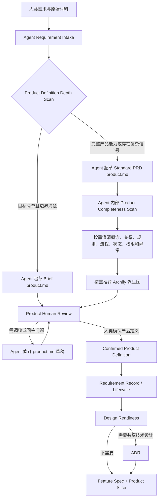

# Proposal: Adaptive Requirement Product Definition

状态：已实施并完成独立评测回流修复与全量验证，等待最终 Human Review；未 commit / push / tag / release / installed-skill sync
目标版本：v1.5.0（本 Proposal 不修改 Skill version）
创建时间：2026-07-22
默认语言：中文

## 摘要

当前 Agent Loop 把人类原始需求和经讨论形成的 `requirement.md` 保存在 Requirement Set 中，同时把可选的 `product.md` 定义为 Feature 级 Product Brief。复杂需求还会在 Requirements Discussion 内触发 Concept Foundation、Requirement Product Model，并由 Feature Product Brief 再次提取产品意图。

这些规则分别解决了原始需求保护、产品语义稳定和 Feature 切片问题，但组合后形成了明显的认知与所有权负担：

- 人类难以判断 Requirement Document、Product Brief 和 Feature Spec 分别负责什么；
- `requirement.md` 已经包含大量 PRD 内容，Feature `product.md` 又重新整理相近内容；
- Concept Foundation、Requirement Product Model 和图形化容易被展示成额外阶段；
- 简单需求可能被完整模型拖重，复杂需求又缺少统一的产品完整性检查；
- 外部 PRD helper 的能力被路由到 Feature `product.md`，无法自然服务 Requirement 阶段；
- accepted Requirement Product Model 与 Feature Product Brief 之间可能产生重复定义和漂移。

本 Proposal 建议把产品定义能力收敛到 Requirement Set：

1. 只保留 `brief | standard` 两种 Product Definition Profile，不设置 `complex` 第三档；
2. 由 Agent 根据人类需求和证据起草 Requirement Set 内的 `product.md`，人类负责产品含义、范围和规则的最终确认；
3. `product.md` 成为新 Requirement Set 唯一的产品定义来源；
4. Concept Foundation、Requirement Product Model、产品完整性扫描和 Archify 图形化继续存在，但都变成 Standard PRD 内部按需方法，不出现在 canonical stage flow 中；
5. 新 Feature 不再创建第二份 `product.md`，Feature `spec.md` 只记录本次 Product Slice 并引用 Requirement `product.md`；
6. 既有 Requirement `requirement.md` 和 Feature `product.md` 保持兼容读取，不批量迁移或重写；
7. 原始人类材料始终按原字节保存，Agent 不在原文件上编辑或覆盖。

本变化重新分配产品定义 artifact ownership，并移除新工作流中的 Feature Product Brief 写入路径，因此属于 coordinated workflow change。实施时必须同步 runtime、design、stage/reference、templates、root guidance、human docs、examples、validators 和 tests。

## 1. 已确认的设计方向

本 Proposal 固化以下已讨论方向，等待维护者对完整边界做最终批准：

| 设计项 | 推荐结论 |
|---|---|
| Product Definition Profile | 只保留 `brief | standard` |
| `complex` Profile | 不引入 |
| 新 Product Definition 位置 | `.agent-loop/requirements/<date>-<topic>/product.md` |
| `product.md` 默认作者 | Agent 根据证据起草和维护 |
| 产品意义最终决定者 | Human |
| 原始材料 | 原字节保存，不能被 `product.md` 覆盖 |
| Concept Foundation | Standard PRD 内部按需方法，不是 stage |
| Requirement Product Model | Standard PRD 内部按需模型，不是独立 artifact/stage |
| Archify | Human-confirmed、按需派生视图，不是产品语义来源 |
| 新 Feature `product.md` | 不再创建 |
| Feature 产品范围 | 写入 `spec.md` 的 Product Slice，并引用 Requirement `product.md` |
| 旧 artifact | 兼容读取，不自动批量迁移 |
| Product Design Hub / Board / Workbench | 不恢复 |

## 2. 最高原则

> Human 提供目标、材料和产品决策；Agent 负责检查证据、推荐定义、生成并维护 `product.md`；Human Review 决定产品定义是否准确。Requirement `product.md` 定义产品，ADR 负责技术落地，Feature `spec.md` 定义实现切片。

对应约束：

- `product.md` 不是要求人类预先写好的输入文件；
- Agent 不凭空创造产品意义，必须把内容追溯到人类材料、项目事实、历史行为或明确的人类确认；
- Product Human Review 不授权开始 Feature、创建 ADR、commit、push、release 或其他独立动作；
- Requirement lifecycle 和 Product Definition review evidence 是不同维度；
- Brief 减少的是建模深度，不减少目标、范围、验收方向、证据或 Human Review；
- Standard PRD 展开的是有证据需要的产品视图，不为了完整性制造空表；
- 原始需求、截图、录音、反馈、原型和外部 PRD 始终是不可改写的 source material；
- 图表只能展示 accepted/confirmed `product.md` 语义，不能成为第二产品事实源；
- ADR 不得重新定义 `product.md` 中已确认的概念、关系、状态、规则、权限、事实归属或终态含义；
- Feature 不得通过局部 Product Slice 覆盖 Requirement 产品定义。

## 3. 问题定义

### 3.1 当前 artifact ownership 重叠

当前运行规则同时存在：

```text
requirements/<set>/requirement.md
  = Requirements Discussion 产生的人类评审需求文档
  = accepted Concept Foundation / Requirement Product Model 的有效来源

features/<feature>/product.md
  = 可选 Feature Product Brief
  = 用户、故事、产品范围和 Feature 级产品理解

features/<feature>/spec.md
  = 实现行为、范围和验收
```

虽然 Feature `product.md` 被要求引用 accepted Requirement Model，而不能重新定义语义，但人类和 Agent 仍需维护三层相近内容。尤其在一个 Requirement 直接映射一个 Feature 时，Feature Product Brief 大量重复 Requirement 产品定义。

### 3.2 `complex` 标签不能降低实际复杂度

产品复杂度不是稳定类别。一个表面很短的需求可能涉及资金、库存、权限、生命周期或补偿；一个页面较多的内容产品可能没有共享状态和事实归属风险。

设置 `Complex PRD` 第三档会带来：

- 人类需要理解和选择内部建模级别；
- Agent 可能用篇幅、页面数或功能数错误分类；
- Standard 与 Complex 内容边界持续漂移；
- Concept Foundation 和 Requirement Product Model 被误解为额外工作流阶段；
- 同一 PRD 在需求演化时需要改变类型，而不是自然展开必要章节。

因此复杂信号应决定 Standard PRD 展开哪些内部视图，而不是创建第三种文档类型。

### 3.3 当前 Requirement 目录被定义为非 PRD 工作区

`references/requirement-management.md` 和 `references/artifact-rules.md` 当前明确把 Requirement Set 定义为原始材料包和 lifecycle record，并排除 working spec / PRD。要让 Requirement `product.md` 成为产品定义来源，不能只复制模板；必须协调修改 artifact authority、source preservation、review、reopen、ADR snapshot 和 Feature handoff。

### 3.4 PRD helper 的落点与产品定义时机不一致

当前 PRD/product helper 被路由到 `Product Brief If Needed`，并在 Feature context 通过 Gate 后写入 Feature `product.md`。但产品目标、用户、场景、能力边界、业务规则、流程、异常和成功指标应当在 Requirement 接受和 Feature 切分前形成。

External helper 应服务 Requirements Discussion 的产品定义方法，同时服从 Agent Loop 的路径、Human Gate 和 source preservation；不能自行创建 native `feature_list.md`、`PRD.md`、原型目录或发布动作。

### 3.5 可视化容易反向创造语义

流程图、状态图和 Sequence 可以显著帮助人类评审，但如果图在产品定义之前创建，或图中节点没有稳定来源绑定，图会反过来决定产品含义。产品变化后不刷新图，也会留下看似权威但已经过期的派生视图。

## 4. 目标

1. 让人类只需要理解 Brief 与 Standard PRD 两种产品定义深度。
2. 让 Agent 主动完成需求采集、完整性检查、推荐定义和 `product.md` 起草。
3. 让一个 Requirement Set 只有一个有效产品定义来源。
4. 保持人类原始材料不可改写，并保留来源追踪。
5. 对简单需求保持短小，对复杂信号自动展开必要产品视图。
6. 把 Concept Foundation 和 Requirement Product Model 保留为内部方法，而不是人类可见 stage。
7. 把 PRD helper 的能力放在 Requirements Discussion 内使用。
8. 让 Feature `spec.md` 消费 Product Slice，不再维护第二份产品定义。
9. 保持 Design Readiness 和 ADR 技术落地边界不变。
10. 让 Archify 成为可选、可追溯、可判 stale 的派生视图。
11. 对现有 Requirement / Feature artifacts 提供保守兼容，不进行破坏性迁移。
12. 通过 TDD 和完整语义审计证明没有丢失 Requirement、ADR、Feature 或 Human Gate 能力。

## 5. 非目标

本 Proposal 不做以下事情：

- 不恢复 Product Design Hub、Product Review Board、Product Workbench 或 Product Baseline lifecycle；
- 不引入 `Complex PRD`、第三种 Product Definition Profile 或新的 canonical stage；
- 不要求所有 Requirement 创建 Standard PRD；
- 不把 ordinary chat、Bug、明确的轻量非产品变更强制转换成 Requirement；
- 不把 Feature Spec、ADR、Test Design 或工程计划写入 `product.md`；
- 不允许 PRD helper 绕过 Agent Loop controller 或 Human Gate；
- 不默认生成交互原型、部署原型或调用外部发布服务；
- 不要求 Archify 可用才能完成 Product Human Review；
- 不让 validator 判断产品语义是否正确，只检查结构、引用、摘要、review evidence 和 freshness；
- 不创建 YAML / JSON executable product schema；
- 不新增 Product lifecycle、Requirement lifecycle 或 Feature lifecycle 状态；
- 不在本技能源码仓库根目录创建目标项目 `.agent-loop/`；
- 不批量迁移、改写或删除旧 `requirement.md`、Feature `product.md` 或原始人类材料；
- 不在本 Proposal 中引入新的稳定 `RULE-*` ID；Product Rules 先作为 Standard PRD 的一等章节，稳定 ID 扩展需要单独批准；
- 不修改 Skill version；
- 不授权 commit、push、tag、PR、merge、release、publish 或 installed-skill sync。

## 6. 推荐运行模型

### 6.1 总体路径



说明：

- `Product Definition Depth Scan`、`Product Completeness Scan`、Concept Foundation 和 Requirement Product Model 都是 Requirements Discussion 内部方法；
- 它们不进入 canonical stage list，不新增 message intent；
- `Product Human Review` 复用 Requirements Discussion / Requirement Archive 的 Human Review 表面，不授权 implementation；
- Requirement lifecycle 仍由 README 管理；产品定义被确认不等于 Requirement 已获准实施；
- Design Readiness 继续在 accepted Requirement 进入 Feature 前运行。

### 6.2 Product Definition Profile

新 `product.md` 记录：

```text
Product Definition Profile: brief | standard
```

Profile 是文档深度，不是 lifecycle、status、stage、Feature Type 或 Human Gate。

#### Brief

Brief 用于产品目标明确、范围单一、产品语义和行为边界可由现有事实直接支持的 Requirement。

Brief 至少包含：

- Problem / Background；
- Target User / Scenario；
- Goal / Expected Product Outcome；
- In Scope；
- Out Of Scope / Non-goals；
- Acceptance Direction；
- Source Evidence；
- Open Questions / Remaining Risk；
- Product Human Review Evidence。

Brief eligibility 是 all-of：

- 目标和预期结果明确；
- 主要用户/角色明确；
- 范围可枚举；
- 没有新增或改变身份、关系、事实归属、生命周期、权限或共享规则；
- 没有需要单独建模的多步骤闭环、异步结果或恢复路径；
- 验收方向可观察；
- 没有未解决的产品语义冲突。

纯文案、样式、配置、已定义行为的小修或明确 Bug 不因此自动进入 Brief；它们仍先服从 Chat、Bug、Lightweight 或现有 Feature ownership 路由。

#### Standard PRD

出现任一 Product Definition trigger 时使用 Standard PRD：

- 新增完整用户能力或多步骤用户旅程；
- 多角色、租户、客户、运营人员或外部系统参与；
- 新增/改变对象身份、关系、事实归属或 source-of-truth 含义；
- 存在权限、资格、定价、额度、库存、审批、配额、有效期或其他业务规则；
- 对象存在生命周期、终态、禁止转换、取消或恢复；
- 存在异步、回调、重试、补偿、对账、人工处理或降级；
- 一个 Requirement 需要多个 Delivery Phase 或多个 Feature；
- 历史产品行为、代码、测试、文档和当前需求发生冲突；
- 成功指标、体验边界、运营路径或验收闭环无法用 Brief 准确表达；
- Product Definition Depth Scan 仍不确定，且简化会隐藏真实风险。

Standard PRD 先包含 Brief 的全部基础内容，再按证据展开：

- Product Capability Scope；
- User Segments / Roles / Scenarios；
- Product Concepts and Terminology；
- Concept Relationships and Product Facts；
- Product Rules and Invariants；
- Commands / Events；
- Primary User / Business Flow；
- Product State Model；
- Role / Permission Matrix；
- Exception / Degradation / Recovery；
- Experience Requirements；
- Notifications / Operations / Manual Handling；
- Success Metrics / Measurement Direction；
- Delivery Phases；
- Product Traceability；
- Decision Candidates / Design Readiness Evidence；
- optional derived visuals。

Standard PRD 不要求每个章节都产生表格。Agent 必须扫描全部维度，并对不适用项给出简短理由；不得制造不存在的状态、权限、事件或恢复流程来填模板。

### 6.3 自适应升级

Brief 可以在同一 Requirement Discussion 中升级为 Standard。升级条件来自新证据，不来自文档长度。

```text
Brief draft
-> new product-definition trigger discovered
-> disclose trigger and affected sections
-> continue as Standard PRD draft
-> Product Human Review
```

Profile 升级不创建新 Requirement Set，不增加 Human Gate，也不丢失已确认来源。已经记录为 immutable source 的 Product Definition 若发生实质产品语义变化，继续走 append-only follow-up / replacement Requirement 规则。

Standard 不自动降级为 Brief。若早期复杂信号被证据证明不适用，Agent 可在 Product Human Review 中推荐以 Brief 记录，但必须说明删除哪些模型、为什么不会丢失产品含义。

## 7. Requirement Set Artifact Contract

### 7.1 新 Requirement Set 推荐布局

```text
.agent-loop/requirements/<record-date>-<topic>/
  README.md
  product.md
  sources/
    <human-original-files>
  visuals/
    <optional-derived-diagrams>
```

`sources/` 和 `visuals/` 都是按需目录：

- 只有引用、附件、截图、录音、外部 PRD、原型或其他原始材料需要复制时才创建 `sources/`；
- 只有人类确认生成派生图时才创建 `visuals/`；
- 纯对话形成的 Requirement 可以只包含 `README.md` 和 `product.md`；
- 不创建空目录占位；
- 现有把原始材料直接放在 Requirement Set 根目录的布局保持合法，不批量移动。

### 7.2 `product.md` ownership

新 Requirement `product.md` 拥有：

- 经证据支持并由人类确认的产品目标；
- 用户、场景和预期结果；
- 产品范围、非目标和阶段；
- 产品概念、关系、事实、规则和不变量；
- 产品动作、流程、状态、权限、异常与恢复；
- 体验、运营、测量和验收方向；
- Product Human Review Evidence；
- 对 source material、stable IDs、visuals、ADR candidates 和 downstream Features 的引用。

它不拥有：

- 原始人类材料；
- Requirement lifecycle / backlog roll-up；
- 技术架构、表、store、topic、provider、transaction 或 migration design；
- Feature 工程范围、task、test、plan 或执行记录；
- Git、发布、部署或外部操作授权。

### 7.3 README ownership

Requirement README 继续拥有：

- Requirement ID、标题、日期和 lifecycle；
- original source inventory；
- Effective Product Definition pointer；
- Delivery Phases status / Feature Mapping；
- Applicable / Triggered Decisions；
- Implemented By / superseded links；
- reopen / follow-up history pointer；
- 推荐下一阶段。

对新 Requirement Set，推荐用下面的有效来源指针替换新写入的 `Effective Concept Foundation` pointer：

```text
Effective Product Definition:
  Source: product.md
  Profile: brief | standard
  Product Review: confirmed
  Last Confirmed: <date>
  Previous Source: none | <path>
```

该 block 是索引和 freshness 路由，不复制产品内容。旧 Requirement Set 的 `Effective Concept Foundation` 继续支持，不能伪造或批量迁移。

### 7.4 Draft、Human Review 与 immutable source

在 Requirement Record / Archive Human Gate 之前，Agent 可以在响应中维护 `product.md` 草稿和 Human Review Summary，但不写目标 Requirement Set。

人类确认记录后：

1. 原始人类文件按原字节写入或引用；
2. 把人类已评审的 Agent 草稿写为 `product.md`；
3. README 记录 lifecycle 和 Effective Product Definition；
4. Product Human Review confirmation 仅证明文档准确，不自动把 Requirement lifecycle 设为 `accepted`，除非人类同时明确接受实施方向；
5. 后续实质产品语义变化不原地改写 confirmed `product.md`。

后续变化使用：

```text
product.md                                  initial confirmed definition
YYYY-MM-DD-product-follow-up-<slug>.md      append-only confirmed follow-up
README Effective Product Definition         current source pointer
```

若目标、核心规则或验收方向已经不再能识别为同一 Requirement，则创建 linked/superseding Requirement Set，而不是继续追加。

## 8. Human Grill、Product Model 与完整性检查

### 8.1 Human Grill Contract 保留

当 Standard PRD 出现产品语义 blocker 时，继续执行：

```text
检查证据
-> 提取候选概念
-> 给出一个推荐定义及影响
-> 一次向人类确认一个阻塞问题
```

调整点：

- 不再把 Concept Foundation 展示为主流程 stage；
- 不要求人类选择是否“进入 Concept Foundation”；
- 阻塞问题被回答后，Agent 继续修订同一 `product.md` 草稿；
- cumulative concept/model summary 合并进入 Product Human Review；
- stable Concept / Model IDs 仍可在 Standard PRD 中使用，供 ADR 和 Feature Spec 引用；
- unresolved blocker 仍然停止下游 Design Readiness、ADR 和 Feature Spec。

### 8.2 Requirement Product Model 变为按需章节集合

Requirement Product Model 不再作为单独人类可见节点。它是 Standard PRD 中下列视图的集合：

| 产品视图 | 当前稳定 ID | 默认表达 |
|---|---|---|
| Concept Definitions | `C-*` | 表格 |
| Relationships | `REL-*` | 表格；复杂时派生关系视图 |
| Role / Permission | `PERM-*` | 权限矩阵 |
| Actions / Outcomes | `CMD-*` / `EVT-*` | 表格；多参与方时可派生 Sequence |
| Primary Flow | `FLOW-*` | 步骤表；复杂时派生 Workflow |
| Product State | `STATE-*` | 状态表；复杂时派生 Lifecycle |
| Product Object / Fact / Invariant | `PM-*` | 产品事实表 |
| Exception / Recovery | `EX-*` | 场景表；复杂时派生异常路径 |
| Product Rules | 本轮不新增稳定 ID | 规则表及现有模型引用 |

这些视图只在适用时出现。ADR Scope Inventory 对新 Requirement 的 stable ID 集合从 Effective Product Definition 解析；没有某类 ID 不表示缺陷，除非 `product.md` 声明该视图适用但缺失内容。

### 8.3 Product Completeness Scan

Standard PRD 在 Product Human Review 前执行内部完整性扫描：

| 视角 | 核心问题 |
|---|---|
| Product Value | 问题、目标、价值、范围和成功方向是否一致 |
| User | 用户能否从场景入口走到可观察结果 |
| Product Semantics | 概念、关系、事实、规则、状态和权限是否自洽 |
| Experience | 关键反馈、空态、错误态、通知和人工路径是否缺失 |
| Operations | 运营、审核、恢复、观测或人工处理是否需要定义 |
| Technical Readiness | 是否存在必须交给 ADR 的共享技术决策信号 |
| Testability | 验收是否可观察、可验证并覆盖失败方向 |

自动检查器只能验证结构、来源链接、稳定 ID 引用、review evidence 和派生图 freshness。它不能因为章节齐全就宣称产品语义完整，也不能替代 Human Review。

## 9. PRD Helper Adapter

PRD/product helper 在新规则中是 Requirements Discussion 的方法提供者：

```text
Agent Loop Requirements Discussion
-> resolve Brainstorming + available PRD helper
-> inspect human sources and project evidence
-> translate helper output into local Brief / Standard product.md draft
-> Product Completeness Scan
-> Product Human Review
-> write only through Requirement Record / Archive Gate
```

Adapter 约束：

- helper 不决定 canonical stage、Profile 或 Requirement lifecycle；
- helper 的 Feature List 输出映射为 `Product Capability Scope`，避免与 Agent Loop Feature workspace 混淆；
- helper 的 PRD 输出映射到 Requirement `product.md`；
- helper 的原型生成、Cloudflare 部署或其他发布能力默认不执行；
- 人类明确请求原型时，原型作为 source/derived evidence 单独设计路径和 Human Gate，不在本 Proposal 中实现；
- helper 不能把技术架构写入产品语义，也不能自动接受 Product Human Review；
- helper 不创建 native `feature_list.md`、`PRD.md`、`docs/superpowers/` 或工具自己的目录树。

## 10. Archify 派生视图

Archify 是 Standard PRD 的可选视觉辅助，不是必需依赖。

推荐映射：

| Product Model 来源 | Archify 视图 |
|---|---|
| `FLOW-*` | Workflow |
| `STATE-*` | Lifecycle |
| `CMD-*` / `EVT-*` | 多参与方或异步时使用 Sequence |
| `EX-*` | Workflow / Lifecycle 的异常与恢复分支 |
| `REL-*` | 仅关系复杂且 renderer 能准确表达时生成关系视图 |
| `PERM-*` / `PM-*` | 默认保留表格，不强制画图 |

每次生成前，Agent 必须向人类说明：

- 推荐的图类型；
- 来源 `product.md` 和涉及的 stable IDs；
- 输出路径；
- 图帮助评审的问题；
- 不生成时的替代方式。

只有人类确认后才调用 Archify。派生图必须：

- 保存到 Requirement Set `visuals/`；
- 标明 source path、source digest、生成时间和 stable ID coverage；
- 节点引用 `FLOW-*`、`STATE-*`、`EX-*`、`CMD-*`、`EVT-*` 等来源 ID；
- 在 Effective Product Definition 变化后标记 stale，重新生成前不能继续声称 current；
- 不允许图中出现 `product.md` 未定义的新产品规则；
- Archify 不可用时退回 Markdown / Mermaid 或人类确认的等价表达，不阻塞 PRD。

本 Proposal 不恢复可交互 Product Review Board，也不要求 HTML 问卷作为 Product Human Review 的唯一界面。

## 11. Feature Product Brief 收敛

### 11.1 新 Feature 不再创建 `product.md`

新 Feature `spec.md` 增加 Product Requirement Source 和 Product Slice：

```markdown
## Product Requirement Source

- Requirement Set:
- Effective Product Definition:
- Product Definition Profile:
- Product Review Evidence:
- Applicable Decisions:

## Product Slice

| Source Section / Model ID | Feature Responsibility | Acceptance Mapping | Coverage |
|---|---|---|---|
| FLOW-... / STATE-... / product.md#... |  |  | in-scope / out-of-scope / not-applicable |
```

Feature `spec.md` 可以选择本 Feature 的用户故事、范围和验收，但不能重新定义来源产品含义。

### 11.2 Product Brief stage/routing

对新工作流：

- PRD/product synthesis 从 `Product Brief If Needed` 移入 Requirements Discussion；
- accepted Requirement 完成 Design Readiness 后直接进入 ADR if needed 或 Feature Spec；
- runtime 完整 leaf-stage order 不再要求新 Feature 经过 Product Brief；
- root guidance 只路由到 Requirements / Decision / Feature owner，不承载详细 PRD 规则；
- external PRD helper 不再以 Feature `product.md` 为默认落点。

这不删除产品思考能力，而是把它放回产品定义的正确所有者。

### 11.3 Legacy compatibility

现有 Feature `product.md`：

- 保持合法、可读、可验证；
- Resume、Feature Follow-up、Close Review 和 historical evidence 继续读取；
- 不自动删除、移动、重命名或回填 Requirement `product.md`；
- 若后续需要改变其产品含义，先定位原 Requirement；没有可靠 Requirement source 时进入 Recovery / Backfill Human Review；
- 新 Feature 默认不复制旧 Feature `product.md` 模板。

现有 Requirement `requirement.md`：

- 继续作为 legacy effective product source；
- `Effective Concept Foundation` pointer 和旧 stable ID 解析继续支持；
- 不把它复制成新的 `product.md` 来制造双源；
- 只有人类明确批准迁移某个 Requirement Set 时，才通过独立 migration plan 处理。

## 12. ADR 与下游追踪

ADR 对新 Requirement：

1. 读取 README `Effective Product Definition`；
2. 验证 `Product Review: confirmed`；
3. 解析 effective `product.md` 的 stable IDs 和产品规则；
4. 建立 Effective Requirement Snapshot；
5. 对适用 stable IDs 建立 Scope Inventory 和 Technical Landing Trace；
6. 对没有 stable ID 的 Product Rules 使用明确 section anchor / rule reference；
7. 若产品语义未确认或发生 drift，返回 Requirements Discussion；
8. ADR 只做技术落地，不重新定义产品。

Feature Spec 对新 Requirement：

- 引用同一 Effective Product Definition；
- 记录 Product Slice；
- 覆盖 in-scope 模型和规则；
- 对 out-of-scope 项给出 Requirement Phase、另一个 Feature、accepted ADR 或 reasoned not-applicable owner；
- 不需要 Feature `product.md` 中转。

Requirement follow-up 更新 Effective Product Definition 后，相关 ADR 和未关闭 Feature 必须重新进行 upstream compatibility / drift 检查。

## 13. Human Gates 与停止规则

本 Proposal 不新增独立 Human Gate。Product Human Review 收敛现有 Requirements Discussion / Product Brief review 责任；Archify 的单次确认作为 Product Human Review 内的 scoped action confirmation，不形成新的 stage、lifecycle 或可复用授权。复用并协调的边界如下：

| 边界 | Human decision | 不授权 |
|---|---|---|
| Requirement Record / Archive | 是否把 sources、reviewed `product.md` 和 README 写入 Requirement Set | Requirement implementation、Feature start、ADR、Git |
| Human Grill blocking answer | 产品含义的一个阻塞决定 | 整份 PRD 接受、implementation |
| Product Human Review | `product.md` 是否准确表达当前产品定义 | Requirement lifecycle acceptance、Feature start、ADR acceptance |
| Requirement lifecycle | proposed / accepted / deferred / rejected 等人类决定 | Feature workspace 或 code execution |
| Archify scoped action confirmation | Product Human Review 内确认本次具体图类型、来源和输出 | 后续自动重绘或其他 Skill 调用 |
| ADR Human Review | 技术落地决定 | Feature execution、Git |
| Feature Spec / Plan / Execute | 各自既有动作 | 其他独立 Gate |

必须停止并交还人类：

- Brief eligibility 无法确定；
- 原始材料与历史 accepted 产品语义冲突；
- `product.md` 草稿会覆盖或重写人类原文件；
- Concept / rule / lifecycle / fact ownership blocker 未解决；
- Standard PRD 的关键用户结果或验收方向仍不可观察；
- Product Human Review 未确认却要进入 ADR 或 Feature；
- 同一 Requirement 存在两个 effective product sources；
- Feature Product Slice 试图重新定义 Requirement 产品含义；
- Archify 图包含无来源节点，或 source digest 已 stale；
- 旧 artifact 无法安全解析，需要破坏性迁移；
- 需要新增 `RULE-*`、可执行 schema、Product Hub、Board 或其他未批准范围；
- dirty work 与实施文件重叠且归属无法确认；
- 需要版本升级、installed-skill sync 或 Git/发布动作。

## 14. 影响面

实施至少检查并协调以下文件，最终以 RED baseline 证明的实际影响面为准。

### 14.1 Runtime / design authority

- `SKILL.md`
- `references/runtime.md`
- `references/design.md`
- `references/concepts.md`

### 14.2 Requirement / product / ADR workflow

- `references/requirement-management.md`
- `references/requirement-product-grill.md`
- `references/product-brief.md`
- `references/project-decisions.md`
- `references/stage-guides.md`
- `references/workflow-checklists.md`
- `references/human-review-summary.md`
- `references/artifact-rules.md`
- `references/document-templates.md`
- `references/skill-routing.md`
- `references/external-skill-adapters.md`
- `references/validation-scenarios.md`
- `references/project-guidance.md`
- `references/feature-completion-check.md`

### 14.3 Templates / examples / scripts

- `templates/requirement-set-README.md`
- `templates/product.md`
- `templates/spec.md`
- `templates/root-AGENTS.md`
- affected Requirement / Feature examples
- `scripts/check-concept-foundation-trace.py`
- `scripts/check-adr-requirement-model-trace.py`
- shared checker support if required

`templates/product.md` 应改为 Requirement Product Definition 模板；不得同时继续作为新 Feature Product Brief 模板。若兼容测试需要旧模板 fixture，应把 legacy fixture 放在 tests/examples 的明确兼容位置，而不是保留双重 runtime ownership。

### 14.4 Human docs / history

- `README.md`
- `Usage.md`
- `CHANGELOG.md`
- 本 Proposal 后续 Implementation Plan
- focused RED report
- full-validation report

## 15. TDD 与 focused contract 方向

实施必须先建立真实 RED，至少覆盖：

1. **Requirement-owned product.md**：当前 runtime/template 把 `product.md` 写到 Feature，focused test 在修改前失败；
2. **Two-profile only**：禁止 `complex` 第三档、禁止 Profile 成为 lifecycle/stage；
3. **Brief eligibility**：简单目标形成最小 product.md，复杂信号不能错误使用 Brief；
4. **Standard adaptive sections**：只展开适用视图，不要求空表占位；
5. **Human original preservation**：原始材料 byte-stable，Agent output 只写 `product.md`；
6. **Product Human Review**：未确认的 product.md 不能进入 ADR / Feature；
7. **Internal method boundary**：Concept Foundation、Product Model、Completeness Scan 和 Archify 不成为 canonical stage/message intent；
8. **One blocking question**：Human Grill Contract 仍保持 evidence-first 和一次一个 blocker；
9. **No new Feature product.md**：新 Feature Spec 直接引用 Requirement product.md 并记录 Product Slice；
10. **Legacy compatibility**：旧 Requirement `requirement.md` 和旧 Feature `product.md` 继续通过读取/验证；
11. **Effective Product Definition**：README pointer、source freshness、stable ID 解析和 append-only follow-up；
12. **ADR landing**：新 product.md 真实 fixture 能通过 proposed/accepted ADR trace，同时产品语义不能被 ADR 重写；
13. **Archify derivation**：Human confirmation、source IDs、digest、stale 检测和 no-Archify fallback；
14. **PRD helper adapter**：helper 输出落在 Requirement product.md，不创建 native PRD/Feature List/部署目录；
15. **Root navigation**：Root First-Hop Gateway 仍能到达 Requirements、Decision 和 Feature，不塞入完整 PRD 规则；
16. **Lifecycle separation**：Product Review confirmation 不等于 Requirement accepted，不授权 Feature start；
17. **Mutation pressure**：删除 source evidence、review evidence、Profile trigger、Product Slice 或 legacy fallback 时 focused test 必须失败。

不得只用关键词测试。至少建立一个 Brief、一个 Standard、多角色状态/异常 Standard、一个 human-provided full PRD source、一个 legacy Requirement、一个 legacy Feature Product Brief，以及一个真实 Standard product.md → ADR → Feature Spec 集成 fixture。

## 16. 验证与压力场景

### 16.1 Brief 场景

人类提出一个目标单一、无新产品语义的用户能力，希望先形成需求文档。Agent 应：

- 先检查已有产品语义和 source；
- 说明为什么 Brief 足够；
- 起草最小 `product.md`；
- Product Human Review 后写入 Requirement Set；
- 不创建 Feature `product.md`、ADR、图或空 Product Model 表。

### 16.2 表面简单但必须 Standard

人类只说“支持退款”，但证据显示涉及资金事实、状态、权限、重复请求、失败补偿和对账。Agent 应：

- 不根据句子短或页面少选择 Brief；
- 推荐 Standard 并说明 trigger；
- 使用 Human Grill 逐个解决 blocker；
- 展开相关事实、规则、FLOW/STATE/EX/PERM；
- 不展示 `Complex PRD` stage。

### 16.3 Human 提供完整 PRD

人类提供一份外部 PRD。Agent 应：

- 原字节保存原文件；
- 审查缺口、冲突和历史事实；
- 生成规范化 Requirement `product.md` 草稿并追溯来源；
- 不直接修改原 PRD；
- 不因为原文件标题叫 PRD 就自动确认产品语义。

### 16.4 Standard 不强制全表

一个多步骤内容发布产品需要 FLOW、PERM 和 EX，但没有独立业务状态机。Agent 应记录状态视图不适用的理由，不制造 `STATE-*` 占位。

### 16.5 Archify fallback

Standard PRD 需要状态图，但 Archify 不可用。Agent 应：

- 说明 capability gap；
- 使用 Markdown / Mermaid 或人类确认的等价表达；
- 继续 Product Human Review；
- 不把 unavailable 当作永久 blocker。

### 16.6 Feature handoff

一个 confirmed Standard `product.md` 映射两个 Feature。每个 Feature `spec.md` 应：

- 引用同一 Effective Product Definition；
- 记录不同 Product Slice；
- 不创建独立 Feature `product.md`；
- 不错误关闭整个 Requirement；
- 对未实现部分保留 Phase / Feature owner。

### 16.7 Legacy resume

Resume 一个只有 `requirement.md` 和 Feature `product.md` 的旧项目。Agent 应继续读取两者，不强制迁移，不把缺少 Requirement `product.md` 当作当前 artifact 损坏。

### 16.8 Upstream drift

append-only product follow-up 改变 `STATE-*` 或产品规则。Agent 应让关联 ADR / open Feature 进入 compatibility/drift review，不静默继续执行旧 Product Slice。

## 17. 实施顺序建议

本 Proposal 获批后，单独编写 construction-grade Implementation Plan。建议顺序：

1. Task 0：分支、HEAD、dirty work、现有全量基线和 reader compatibility inventory；
2. 建立 focused RED contract 和 RED report；
3. 先实现新 Requirement product reader / pointer 与 legacy dual-reader；
4. 更新 runtime/design 的 ownership、两档 Profile 和 Product Brief 收敛；
5. 更新 Requirement/Product/ADR/Feature references；
6. 更新 templates 和 Product Human Review；
7. 更新 Archify/PRD helper adapter、Usage/README/CHANGELOG；
8. 更新 examples 和真实 product.md → ADR → Feature Spec fixture；
9. focused GREEN + mutation pressure；
10. 全部 Shell/Python tests、机械检查和六域 full validation；
11. 刷新 Proposal、Implementation Plan、RED/full report；
12. 停在最终 Human Review，不执行 Git/发布动作。

Reader compatibility 必须先于 writer 切换：在新 runtime 默认写 Requirement `product.md` 前，所有 downstream reader 必须已经能够同时读取新 Effective Product Definition 和 legacy Effective Concept Foundation / Feature Product Brief。

## 18. 验收标准

Proposal 实施完成后必须满足：

- 人类可见 Product Definition 只有 Brief 和 Standard PRD；
- 没有 `Complex PRD` canonical/profile/status；
- 新 Requirement 的产品定义写入 Requirement Set `product.md`；
- 原始人类材料保持不变；
- Agent 默认起草 `product.md`，Human 最终确认产品含义；
- Standard 内部按需使用 Concept Foundation、Product Model、Completeness Scan 和 visuals；
- Human Grill evidence-first / one-blocker contract 保留；
- 新 Feature 不创建第二份 `product.md`；
- Feature Spec 直接引用 Effective Product Definition 并记录 Product Slice；
- ADR 能消费新 product.md，也能兼容旧 requirement.md；
- 旧 Feature product.md 可 Resume / Follow-up / Close，不被自动迁移；
- PRD helper 输出落到 Requirement product.md contract；
- Archify 为 Human-confirmed derived view，具备 source IDs 和 freshness；
- Product Review、Requirement lifecycle、Feature start、ADR、Git 和 release Gates 不互相授权；
- 不新增 canonical stage、message intent、lifecycle、executable schema、Product Hub/Board/Workbench；
- Skill version 保持 1.5.0；
- focused tests、all tests、mechanical checks 和 full validation 全部通过；
- 中文 full-validation report 记录真实命令、测试数量、RED/GREEN、评分和残余风险。

## 19. 风险与缓解

| 风险 | 影响 | 缓解 |
|---|---|---|
| Requirement `product.md` 与旧 Feature `product.md` 同名 | Agent 读取错误文件 | 使用完整路径和 Effective Product Definition pointer；新 Feature 禁止创建同名文件 |
| Product Human Review 与 Requirement `accepted` 混淆 | 未授权进入实现 | 使用独立 review evidence，并在 Summary 中明确“不授权 implementation” |
| 移除 Feature Product Brief 后 Feature 缺少局部产品范围 | Spec 变成纯技术文档 | 在 `spec.md` 增加 Product Slice 和 source coverage |
| Standard PRD 重新变成全量大模板 | 简单/中等需求仍然过重 | 维度全扫描、章节按需展开、禁止空表占位 |
| Concept Foundation 被“内部化”后 Gate 被弱化 | 下游基于未确认语义建模 | 保留 one-blocker stop 和 Product Human Review cumulative coverage |
| 新旧 reader 分裂 | ADR/Feature 无法消费历史 Requirement | reader-first dual compatibility；真实 legacy/new integration fixtures |
| 外部 PRD helper 自带目录或部署行为 | 路径/授权漂移 | Adapter 明确只消费方法，输出翻译到本地 artifact，发布能力默认禁用 |
| Archify 图过期 | 人类根据 stale 图做决定 | source digest、stable ID coverage 和 stale hard stop |
| 原始材料搬入 `sources/` 破坏引用 | 历史链接失效 | 只对新 set 推荐 `sources/`，旧文件不移动；writer 预检查引用 |
| Product Rules 无稳定 ID | ADR/Feature 追踪可能不够细 | 首版使用 section anchor / rule reference；是否增加 `RULE-*` 另行批准 |

## 20. 范围漂移检查

当前 Proposal：

- 没有重新引入 Product Design Hub；
- 没有把 Archify 变成 mandatory dependency；
- 没有增加 Product Review Board 或 HTML 问卷；
- 没有增加 `Complex PRD`；
- 没有增加 `RULE-*` 或 executable schema；
- 没有改变 ADR 的技术落地职责；
- 没有把 Product Human Review 当作 Feature/Git 授权；
- 没有修改版本号；
- 已按获批 Proposal/Implementation Plan 实施；独立评测的 4 High、2 Medium 已通过真实 flow-back RED/GREEN 关闭，并通过 focused/full validation，当前等待最终 Human Review；
- 没有创建目标项目 `.agent-loop/` artifacts；
- 没有 commit、push、tag、PR、merge、release、publish 或 installed-skill sync。

## 21. Human Review 请求

请维护者依据最新的 `docs/reports/agent-loop-v1.5.0-full-validation-2026-07-22.1.md` 做最终 Human Review，确认：

1. reader-first 新旧 source 双兼容实现；
2. Requirement `product.md` ownership 与新 Feature Product Slice 路径；
3. Brief/Standard、Human Grill、Product Human Review 与独立下游 Gates；
4. Archify/PRD helper adapter 边界和不恢复 Hub/Board/Workbench 的范围；
5. `macOS-verified / Windows-test-defined` 的跨平台证据边界；
6. 是否另行授权后续 commit、push 或其他发布动作。

本轮停在最终 Human Review；没有新授权时不执行任何 Git、发布或 installed-skill sync 动作。
