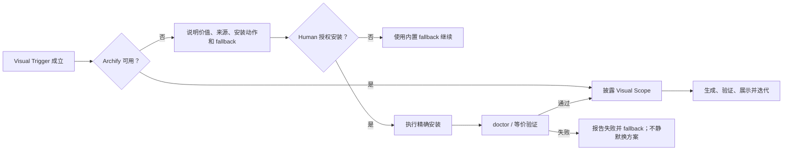

# Proposal: Optional Visual Communication Adapter

状态：Proposal 已确认；核心实施、Human Docs、README Capability Map、Archify-first recommendation 与 Task 14 Feature Spec visual boundary follow-up 均已实施和验证；等待 Human Review；未 commit / push / tag / release / installed Agent Loop sync
目标版本：v1.5.0（本 Proposal 不修改 Skill version）
创建时间：2026-07-23
默认语言：中文

## 摘要

Agent Loop 已经允许在 Adaptive Product Definition 中使用 Archify 生成 Human-confirmed、source-bound、可判 stale 的派生视图，但现有规则只覆盖 Requirement Standard Product Definition 的单次图形生成，没有完整回答以下运行问题：

- Agent 在需求讨论中什么时候应主动用图帮助人类确认产品理解；
- Agent 在 ADR、Onboarding 或 Review 中什么时候应继续使用同一视觉能力；
- Archify 已安装时是否应优先使用；
- Archify 未安装时如何向人类推荐，而不是静默降级；
- 人类授权后，Agent 是否可以直接下载、安装并验证；
- 如何避免每轮微调都重复询问，同时保持安装、持久化、Product Review 和 ADR acceptance 的独立边界；
- Archify JSON IR、HTML/SVG/PNG 与 Agent Loop 产品/技术事实之间如何分层。

本 Proposal 建议把 Archify 定位为 Agent Loop 的 `Optional Visual Communication Adapter`（可选视觉沟通适配器）：

1. 当视觉表达能够显著降低需求、流程、状态、数据或技术方案的误解风险时，Agent 应优先使用 Archify；
2. Archify 已安装时，Agent 在当前已授权阶段内优先加载并使用；
3. Archify 未安装时，Agent 应说明本次视觉价值、安装来源、精确动作和可用替代方案；
4. 人类明确授权后，Agent 可以直接下载、安装、运行 `doctor` 或等价自检，并继续执行已披露的当前视觉范围；
5. 人类拒绝、安装失败或运行环境不支持时，Agent 使用 Markdown、表格、Mermaid、ASCII 或其他已确认等价表达继续，不阻塞 Agent Loop；
6. 图帮助人与 Agent 达成共识，但产品含义最终写入 Requirement `product.md`，技术结论最终写入 ADR，代码事实仍由代码、配置、测试和运行证据承担；
7. Archify HTML、SVG、PNG 等 render 不能单独替代长期 diagram source、Product Definition、ADR、Feature Spec 或代码证据。

该能力不新增 canonical stage、message intent、lifecycle、Auto Mode 或默认目标项目目录。它复用现有 Stage Helper Capability Scan、External Skill Adapter、Requirements Discussion、Decision & Design、Onboarding 和 Human Gate 体系。

## 1. 已确认的设计结论

| 设计项 | 结论 |
|---|---|
| 能力名称 | `Optional Visual Communication Adapter` |
| 首要使用场景 | Requirements Discussion 中的需求与产品共识 |
| 次要使用场景 | Decision & Design / ADR 技术共识 |
| 后续呈现场景 | Evidence-Graph + DDD Onboarding、Review、README 或对外分享 |
| Feature Spec 边界 | 只解释 accepted Product Slice；发现新产品语义必须返回 Requirements Discussion |
| 已安装时 | 在视觉触发成立时优先加载和使用 Archify |
| 未安装时 | 主动推荐，说明价值、安装动作和 fallback，不静默安装 |
| 安装授权后 | Agent 可直接下载、安装、验证，并在已披露范围内继续使用 |
| 人类拒绝或安装失败 | 使用 Markdown / table / Mermaid / ASCII 等继续，不永久阻塞 |
| 与 Superpowers 的关系 | 同样先发现、优先采用、服从路径/Gate override、允许 fallback；但 Archify 不是 mandatory stage helper |
| 产品语义权威 | Requirement `product.md` |
| 技术决策权威 | accepted ADR |
| 图形可重建来源 | Mermaid/ASCII，或 Archify typed JSON IR 等工具源格式 |
| 呈现输出 | HTML / SVG / PNG / JPEG / WebP 等 derived render |
| HTML 单文件 | 可分享，但不能独自满足长期 Diagram Artifact 的可重建与证据约束 |
| 版本 | 不因本 Proposal 自动升级 Skill version |

## 2. 最高原则

> Agent 主动判断什么时候“看图比读字更容易达成正确共识”；Archify 负责把有来源的结构化理解变成可验证视觉表达，Agent Loop 继续负责阶段、事实来源、Human Gate、artifact ownership、新鲜度和下一步。

对应不变式：

- `render to converge, text to record`：用图收敛共识，用 owning text artifact 记录最终含义；
- 图不能创造来源中不存在的产品规则、技术结论、代码事实或验收结果；
- Archify 的可用性不能成为 Product Human Review、ADR、Onboarding 或 Feature 实施的永久依赖；
- 安装授权只覆盖精确披露的 Archify 安装和验证动作，不授权其他 Skill、依赖、外部服务、Git、发布或生产动作；
- Visual Scope Grant 不等于 Product Human Review、Requirement lifecycle、ADR acceptance、Feature start、implementation、commit、push 或 release 授权；
- 一个阶段中的视觉 helper 不能选择下一阶段，也不能改变 Agent Loop artifact 路径、状态或 Gate；
- 人类原始材料保持 byte-stable；图是派生视图，不能覆盖原始 PRD、截图、录音、原型或反馈；
- 持久化图必须能够回到明确 source path、stable IDs、semantic digest、生成器和验证证据；
- source 变化后，旧 render 不能继续声称 `current`。

## 3. 当前基线与缺口

### 3.1 已有能力

当前 v1.5.0 已经实现：

- Requirement `product.md` 的 `Derived Visuals` 表；
- Archify 生成前的 Type、Source、Output、Review use 和 Alternative 披露；
- source IDs、Product Semantic SHA-256、`Status: current` 和 Human confirmation；
- Product Definition 变化后的 stale 检测；
- Archify 不可用时的 Markdown / table / Mermaid / no-visual fallback；
- Product Human Review 中对 current / stale / absent visual 的检查；
- stale visual 的 checker 与 fixture 回归。

### 3.2 仍然存在的缺口

现有规则仍有以下不足：

1. Archify 被描述为 Standard PRD 的派生视图，没有被定义为跨阶段视觉沟通 adapter；
2. “每次生成前确认”会让需求共识中的快速迭代产生重复 Gate；
3. 未安装时只规定 fallback，没有规定 Agent 应在高价值场景主动推荐；
4. 没有精确安装授权、安装后验证和失败后的停止/回退合同；
5. Decision & Design / ADR 没有明确的 Archify 方案评审边界；
6. Onboarding required diagram 与 Archify source/render 的关系没有统一说明；
7. 现有 `Derived Visuals` 主要记录 HTML path，没有明确长期可重建的 Archify JSON IR 所有权；
8. Feature Spec 使用图时，没有明确“发现新产品语义必须回流 Requirements Discussion”；
9. 现有规则没有区分 working preview、durable diagram source 和 presentation render；
10. 没有防止 Agent 把“Archify unavailable”描述成复杂需求无法继续的理由。

## 4. 目标

1. 让 Agent 在视觉确实能降低误解时主动建议并优先使用 Archify。
2. 把需求与产品共识明确为 Archify 的第一使用场景，而不是只在最终汇报时使用。
3. 建立 `available -> preferred use` 与 `unavailable -> recommend -> Human authorization -> install -> verify -> use` 的闭环。
4. 用一次有边界的 Visual Scope Grant 支持同一问题的多轮图形迭代，减少重复确认。
5. 保持安装、Visual Scope、artifact record、Product Review、ADR acceptance 和 Git 动作的独立授权。
6. 建立语义权威、diagram source 和 render 三层模型。
7. 允许 Archify typed JSON IR 成为可重建 diagram source，同时禁止 HTML-only 凑数。
8. 让 Product Definition、ADR 和 Onboarding 各自拥有适合本阶段的视觉使用规则。
9. 提供无 Archify、安装失败、图形 stale、图文冲突和范围扩大的可靠 fallback。
10. 通过 focused regression、mutation pressure 和 full validation 证明没有削弱现有 Human Gate 或 artifact authority。

## 5. 非目标

本 Proposal 不做以下事情：

- 不把 Archify 源码、renderer 或 schema 融合进 Agent Loop 仓库；
- 不复制 Archify 的 SKILL、CLI、schema 或 renderer 实现；
- 不让 Archify 成为所有阶段的 mandatory helper；
- 不把 Archify 加入 mandatory Stage Helper Resolution 表；
- 不新增 `Visual Design` canonical stage、message intent、status、lifecycle 或 Auto Mode；
- 不要求简单 Brief、单路径修改或纯文本即可说明的内容必须画图；
- 不让图替代 Requirement `product.md`、ADR、Feature `spec.md`、tests 或 code evidence；
- 不默认恢复 Product Design Hub、Product Review Board 或 Product Workbench；
- 不把 Archify 变成 UI 原型、页面视觉设计或 E2E Test Skill；
- 不在未授权时下载、安装、升级、同步或执行外部 Skill；
- 不在安装失败后自动更换来源、包管理器、镜像或安装位置；
- 不默认提交 HTML、SVG、PNG、JSON IR 或其他生成物到 Git；
- 不因安装或使用 Archify 自动 commit、push、publish、deploy 或调用付费服务；
- 不修改 Skill version；
- 不自动同步已安装的 Agent Loop 或 Archify 副本。

## 6. 核心概念

### 6.1 Optional Visual Communication Adapter

`Optional Visual Communication Adapter` 是当前 Agent Loop stage 内的可选方法适配器。它不是 stage，也不改变 canonical Stage Order。

它负责：

- 判断当前问题适合哪类视觉表达；
- 从当前 owning artifact 和 evidence 提取有来源的结构；
- 调用可用的 Archify Skill；
- 验证 source definition 和 render；
- 把人类对图的反馈转换回 owning text artifact；
- 保持 source binding、freshness 和 fallback。

### 6.2 Visual Trigger

`Visual Trigger` 是 response-local 判断，不是持久状态。至少一个信号成立且图确实比短文本/表格更容易确认时触发：

- 多角色、租户、系统或服务共同参与；
- 主流程包含分支、失败、重试、恢复、人工处理或未知状态；
- 对象身份、生命周期、权限、事实归属或数据移动不容易用文字确认；
- 调用顺序、异步边界、回调、补偿或一致性窗口影响理解；
- 存在两个或更多真实方案，需要人类比较；
- 人类明确要求画图、表示看不懂文字，或纠正 Agent 对流程的理解；
- Agent 判断一次错误理解会污染后续 Product Model、ADR、Feature Slice 或验证设计。

以下情况通常不触发：

- 五行以内表格可以完整表达；
- 单角色、单路径、无状态、无分支；
- 只为装饰 README 或“看起来专业”；
- 图没有一个明确的 Review Question；
- 当前证据不足，图只能靠 Agent 猜测拓扑或规则。

### 6.3 Visual Scope Grant

`Visual Scope Grant` 是人类对当前视觉问题的一次有边界授权，不是新 stage 或永久权限。

披露内容：

| 字段 | 必需内容 |
|---|---|
| Stage / Review Context | Requirements Discussion、Decision & Design、Onboarding、Review 等 |
| Review Question | 这张图帮助人类确认什么 |
| Diagram Type Family | architecture / workflow / sequence / dataflow / lifecycle |
| Semantic Source | exact `product.md`、ADR、Onboarding evidence 或 code evidence |
| Stable References | Concept / Model / Design Slice / Flow / Slice / Diagram IDs |
| Working Output Boundary | response-local 或 OS temp；不默认写入目标项目 |
| Durable Output If Any | 需要持久化时的精确路径和文件集合 |
| Iteration Boundary | 允许调整的同一问题、来源和图类型范围 |
| Fallback | Markdown / table / Mermaid / ASCII / omit |

同一 Grant 内，人类提出“调整顺序”“增加异常分支”“把审批人放到前面”等反馈时，Agent 可以连续更新、验证和重新展示，不需要每轮重新询问。

以下情况需要新 Grant：

- Review Question 发生实质变化；
- semantic source 或 owning stage 变化；
- 从临时 preview 改为 durable artifact；
- 新增另一类不在原披露范围内的 diagram；
- 输出路径、外部服务、付费能力或安装位置变化；
- 图形修改将创造或改变产品/技术语义；
- 人类先前撤销或限制了授权。

### 6.4 Installation Authorization

安装授权是独立的 external mutation Human Gate。Agent 必须披露：

- 发现结果：Archify 未安装或无法加载；
- 推荐理由：本次图解决的具体 Review Question；
- 来源：官方仓库或人类指定可信来源；
- 精确安装命令与安装目标位置；
- 预期网络、文件和全局/用户级影响；
- 验证命令，例如 `doctor` 或等价只读检查；
- 失败后的停止方式和 fallback；
- 是否同时请求“安装并用于当前已披露 Visual Scope”。

人类只说“安装 Archify”时，授权精确安装和验证；若当前视觉范围已经一并披露，人类可以用一次明确答复授权“安装、验证并用于本次视觉范围”。

安装授权不包含：

- 安装其他 Skill、运行时或包管理器；
- 切换镜像、仓库、安装目录或权限模式；
- 自动升级已有 Archify；
- 未来所有项目/阶段的无限使用授权；
- 生成或持久化未披露的图；
- commit、push、publish、deploy 或 production action。

### 6.5 Diagram Source 与 Render

```text
Human sources / accepted product / ADR / code evidence
  -> semantic authority
  -> reproducible diagram source
       Mermaid / ASCII
       or Archify typed JSON IR
  -> validated render
       HTML / SVG / PNG / JPEG / WebP
```

规则：

- semantic authority 决定含义；
- diagram source 决定图如何可重建；
- render 决定人类如何查看和分享；
- render 不反向覆盖 semantic authority；
- durable Archify 图应保留 typed JSON IR 或等价可重建源；
- HTML-only 可作为临时分享物，但不能单独满足长期 Diagram ID、freshness、可重建或证据要求；
- PNG/JPEG/WebP 是导出物，不是可编辑 source；
- SVG 可以是分享输出，但不替代 owning product/ADR/code evidence。

## 7. Capability Scan 与优先级

### 7.1 与 Superpowers 相同的部分

当 Visual Trigger 成立时，Agent 采用与 external helper 相同的基本纪律：

1. 先检查当前 runtime 可用 Skill；
2. 匹配 Archify 或明确兼容的 visual communication helper；
3. 已发现时加载完整 Skill contract；
4. Agent Loop 覆盖 helper 的路径、Gate、artifact 和 lifecycle 默认值；
5. helper 成功后把结果写回 owning Agent Loop artifact；
6. helper 不可用或失败时进入明确 fallback。

### 7.2 与 mandatory Superpowers helper 不同的部分

Archify 不属于每个匹配 stage 都必须加载的 mandatory helper：

- 只有 Visual Trigger 成立时才扫描和推荐；
- 不要求每个 Requirements Discussion、ADR 或 Onboarding 都生成图；
- 不新增 mandatory Stage Helper Resolution 记录；
- unavailable 或 human-declined 不阻塞 stage；
- 不安装也可以通过 Agent Loop 内置表达完成工作；
- Human 不需要知道 Archify 才能使用 Agent Loop。

### 7.3 优先级

当 Visual Trigger 成立时：

```text
active Human-approved project-local visual skill if matched
-> installed Archify
-> when Archify is unavailable and would materially improve review, recommend exact installation/use authorization first
-> Mermaid / ASCII / table / Markdown fallback
```

Project Skill Discovery Guard 仍在 runtime/global helper 之前。一个 active project-local visual skill 不能因为 Archify 更漂亮而被绕过。

一旦 Visual Trigger 已经成立，不得仅因 Archify 当前不可用就先把 Mermaid / ASCII 当成默认绘图方案。若 Archify 对本次 Review Question 有实质价值，Agent 先提出一次精确、可拒绝的安装/使用建议；只有 Archify 不值得安装、人类拒绝、环境不支持或安装/使用失败时，才进入内置 fallback。

## 8. 未安装时的推荐与安装流程



推荐文案应包含：

```text
当前问题包含 <具体角色/状态/分支/方案>，用图确认可以明显降低 <具体误解风险>。
检测到 Archify 当前不可用。我可以在你授权后通过 <精确来源与命令> 安装，
运行 <doctor/验证命令> 后用于 <本次 Review Question>。
不安装也不影响继续，我会改用 <Mermaid/table/ASCII>。
```

禁止使用：

- “不安装就无法继续复杂需求设计”；
- “这是 Agent Loop 必需依赖”；
- “我已经顺便装好了”；
- 不披露全局/用户级安装影响；
- 安装失败后未经确认改用另一个仓库或提权方式；
- 人类本轮拒绝后在同一范围内反复推荐。

如果人类明确将拒绝设为长期项目偏好，只有在现有可靠 `project.md` 中有合适 owner 且经过 Project Memory Human Review 后才记录；不要仅因一次拒绝自动写项目记忆。

## 9. 阶段使用模型

### 9.1 Requirements Discussion：首要场景

Archify 在 Requirements Discussion 中首先用于确认 Agent 对产品的理解，不是等 Product Definition 完成后才美化。

推荐循环：

```text
human sources / scenario evidence
-> Agent candidate product understanding
-> one named Review Question
-> optional Archify working view
-> Human accept / correct / question
-> Agent rewrites the same Requirement product.md draft
-> source/digest re-check
-> next blocker or Product Human Review
```

适用视图：

| Product question | Archify type |
|---|---|
| Product Frame、能力模块、边界和参与者 | architecture |
| 主业务旅程、角色动作、分支和异常 | workflow |
| 产品状态、等待、失败、恢复和终态 | lifecycle |
| 多系统交互、回调或异步顺序 | sequence |
| 产品事实、数据移动和 ownership 边界 | dataflow |

约束：

- Concept Foundation 为 `candidate | reopened` 时，图只能帮助回答当前一个阻塞问题，不能把未确认下游流程画成既定事实；
- 人类在图上纠正含义后，Agent 必须先更新 Product Definition draft，再继续下游模型；
- Product Human Review 验收 `product.md` 的累计含义，不验收一张孤立图片；
- durable visual 只有在 source binding、digest、validation 和 record disclosure 完整后才能列为 `current`；
- working preview 不需要写入 Requirement Set，也不创建默认 `.agent-loop/tmp/`。

### 9.2 Feature Spec：只解释 Product Slice

Feature Spec 可使用 Archify 解释：

- accepted Product Slice 覆盖哪些流程/状态；
- 本 Feature 与其他 Feature/Design Slice 的边界；
- feature-local implementation behavior 或验收路径。

Feature Spec 不得通过图新增：

- Product Concept、role、permission、state、terminal、invariant 或 fact ownership；
- accepted Requirement 中不存在的产品规则；
- 跨 Feature 的新长期技术约束。

如果图形讨论暴露这些新含义，停止 Feature Spec，返回 Requirements Discussion 或 Decision & Design。

### 9.3 Decision & Design / ADR：技术共识

在 Effective Product Definition 已确认且 Design Readiness 需要 shared design 时，Archify 可用于：

- 方案 A/B/C 的架构边界对比；
- 请求、事件、回调、重试和恢复时序；
- persistence、queue、provider、runtime 和 trust boundary；
- 数据流、source-of-truth、consistency 和 ownership landing；
- lifecycle、failure、rollback、cutover 或 reconciliation。

ADR 使用规则：

- source 同时绑定 accepted Product IDs 和 proposed ADR section / Design Slice；
- working option diagrams 可以是临时的；不要求所有 rejected option 都提交到仓库；
- 人类对图的决策必须写回 ADR 的 Decision、Rationale、Consequences、Technical Landing 和 Verification；
- 图不能让 proposed ADR 自动成为 `accepted`；
- ADR 内容变化后，旧 render 必须重新验证或退出 current view；
- 图暴露产品语义缺口时返回 Requirements Discussion，不允许 ADR 填补。

### 9.4 Evidence-Graph + DDD Onboarding

Onboarding 的 required Diagram ID 继续由 `onboarding-knowledge-base.md` 管理。Archify 可以成为实现格式之一，但必须满足：

- Diagram ID、Covered Slice IDs 和 concrete code evidence 完整；
- typed source 与 render 都可定位；
- Archify validator / check 通过；
- 图附带 narrative explanation；
- architecture、timeline、state、data、recovery 等职责仍按真实复杂度分配；
- HTML-only、漂亮但无证据、generic A→B→C 或一个图凑多个职责均不合格；
- Archify 不可用时用 Mermaid/ASCII 完成同一 Diagram ID，不改变 Completeness Hard Gate。

### 9.5 Review、README 与外部分享

当人类明确需要汇报、README、Slack、Notion、演示或导出时，可从 current accepted artifact 派生 HTML/SVG/PNG。

默认这些是 presentation render：

- 不自动写入项目；
- 不自动发布或上传；
- 不把外部平台链接写入项目记忆；
- 需要 Git 或外部发布时使用独立 Human Gate；
- source 变化后不得继续称为 current architecture / current flow。

## 10. Artifact Ownership 与目录

### 10.1 Working Preview

工作图默认保持 response-local 或 OS temp：

```text
<os-temp>/agent-loop-visuals/<bounded-session-or-topic>/
```

规则：

- 不创建目标项目默认 `.agent-loop/tmp/`；
- 不自动 commit；
- 不把 working preview 写成长期事实；
- 会话结束后没有持久化承诺；
- 人类要求保留时，先转入 Durable Record disclosure。

### 10.2 Requirement Durable Visual

沿用当前 Requirement Set `visuals/`：

```text
.agent-loop/requirements/<record-date>-<topic>/visuals/
  <diagram-id>.<archify-type>.json
  <diagram-id>.html
```

需要在 `product.md` `Derived Visuals` 中记录：

- Diagram ID；
- source definition path；
- render path；
- type；
- source IDs；
- Product Semantic SHA-256；
- generator name/version；
- validation evidence；
- Human confirmation；
- `Status: current`。

有效 `product.md` 只把 digest 匹配的 visual 列为 current。旧文件可以作为历史证据保留，但 stale row 不得留在 current manifest 中继续被消费；必要时通过 append-only follow-up 或 review evidence 说明替换关系。

### 10.3 ADR Durable Visual

ADR 默认不要求持久图。只有人类认为长期设计解释确有价值时，才在 exact-path disclosure 后写到决策拥有的 visual boundary，例如：

```text
.agent-loop/decisions/visuals/<decision-id>/
  <diagram-id>.<archify-type>.json
  <diagram-id>.html
```

ADR 必须引用 Diagram ID、source refs、digest 和 validation evidence。该目录不成为新的 decision authority、index 或 lifecycle owner。

### 10.4 Onboarding Durable Visual

沿用 accepted Onboarding Spec 和 Diagram Plan 的路径，不新增通用根目录。每个 Diagram ID 的 source/render 路径由 Onboarding Tasks 明确列出。

### 10.5 Presentation Export

SVG/PNG/JPEG/WebP 默认不作为 source artifact。若人类要求提交 README image 或发布材料，必须披露：

- 来源 Diagram ID；
- 当前 source digest；
- exact output path；
- 生成/验证命令；
- Git/发布动作仍需独立授权。

## 11. Human Gate 模型

| Gate | 授权内容 | 不授权 |
|---|---|---|
| Archify Installation Authorization | 精确下载/安装/验证动作 | 其他 Skill、升级、Git、发布、未来无限使用 |
| Visual Scope Grant | 当前 Review Question、source、type、working boundary 内的多轮生成与调整 | 新 source/stage、durable record、产品/技术确认 |
| Durable Visual Record | 精确 source/render 文件、manifest 更新和 post-check | Product Review、ADR acceptance、commit/push |
| Product Human Review | Requirement `product.md` 产品含义确认 | Requirement lifecycle、ADR、Feature、implementation、Git |
| Decision & Design Human Review | ADR 技术决策接受或修订 | Feature implementation、Git、release |
| Onboarding Gates | accepted Spec/Tasks 范围内的 onboarding artifacts | Feature、Git、release |
| Git / Publish Gates | 精确 commit/push/publish 动作 | 其他未披露动作 |

允许合并一次确认的条件：

- 表格明确列出每个 Gate；
- 动作、路径、环境、来源和影响全部已披露；
- 人类答复明确覆盖全部列出的动作；
- 不使用“确认画图”推断“同意安装”，也不使用“同意安装”推断“同意持久化”。

## 12. 失败、恢复与 fallback

### 12.1 Skill 不可用

- 记录 response-local capability result；
- 推荐安装仅在 Visual Trigger 有真实价值时发生；
- 人类拒绝后使用 fallback；
- 不把 unavailable 当作 Product/ADR blocker。

### 12.2 安装失败

- 报告执行的精确命令、exit status 和安全错误摘要；
- 不自动提权、换镜像、换仓库、换包管理器或重复重试；
- 给出一个推荐：使用 fallback 继续；
- 人类若要诊断安装，重新进入明确的安装/诊断范围。

### 12.3 Renderer 或 validator 失败

- 保留 last known good preview；
- 不交付未通过的 candidate；
- 修正 typed source 后重新验证；
- 重复失败时回退 Mermaid/ASCII 或请求一个具体的人类判断；
- 不手工编辑生成 HTML 来绕过 renderer/validator。

### 12.4 图与 owning artifact 冲突

- owning semantic artifact 胜出；
- 标记或移出 current manifest；
- 重新生成前不得用于 Product/ADR/Onboarding acceptance；
- 若冲突表明 owning artifact 本身不确定，返回 Human Grill、Product Review 或 Decision & Design Review。

### 12.5 Scope 扩大

Visual Scope 内出现新产品规则、跨 Feature 技术约束、外部服务或 durable path 时立即停止，保留当前证据，并请求对应 Requirements、ADR、installation 或 record Gate。

## 13. 安全与隐私

- 不把 credentials、tokens、客户敏感数据、生产 payload、真实个人信息或受限代码发送到未披露外部服务；
- 优先使用本地 Skill 和本地 renderer；
- 如果某个 Archify 发行方式或未来版本需要远程/付费服务，必须独立披露并获得 external/paid-call authorization；
- working preview 不应包含无需展示的敏感字段；
- 导出分享图前运行敏感信息检查；
- 安装日志和验证报告不得复制 secret；
- 全局安装位置、权限和可执行文件变化必须在 Installation Authorization 中可见。

## 14. Source Of Truth 与兼容性

该 Proposal 是对已实施 `adaptive-requirement-product-definition.md` Archify 边界的后续增强：

- 保留 optional、derived、source-bound、digest freshness 和 no-Archify fallback；
- 把“每次生成前单次确认”升级为一次有边界的 Visual Scope Grant；
- 增加未安装时的 Human-authorized install path；
- 扩展到 ADR、Onboarding、Review 和 presentation；
- 增加 typed JSON IR 与 render 分层；
- 不恢复 Product Design Hub / Board / Workbench；
- 不破坏旧 Requirement `visuals/*.html` reader；
- 旧 HTML-only visual 可继续作为历史派生 evidence，但新长期 Diagram Artifact 使用 source + render contract；
- 不要求批量迁移旧 visual 文件或重写已确认 `product.md`。

## 15. 推荐运行流程

```text
current Agent Loop stage
-> decide whether one Visual Trigger materially improves understanding
   -> no: continue with normal stage method
   -> yes: Project Skill Discovery Guard when applicable
      -> installed Archify: load and disclose Visual Scope
      -> unavailable: recommend install + exact action + fallback
         -> declined: fallback
         -> authorized: install -> doctor -> disclose/use current Visual Scope
-> generate typed source and validated working render
-> Human accept/correct
-> update owning Requirement/ADR/Onboarding artifact
-> rebind source/digest and regenerate when needed
-> durable record only through exact path disclosure
-> continue existing Product/ADR/Onboarding Human Gate
```

## 16. 实施范围

### 16.1 Published runtime/design

- `references/runtime.md`
  - 增加 response-local Visual Trigger、Visual Scope Grant 和 install/fallback 顺序；
  - 保持 canonical Stage Order 不变；
  - 保持 Product Review、ADR、Feature 和 Git Gate 独立。
- `references/design.md`
  - 增加 semantic authority -> diagram source -> render 三层不变式；
  - 声明 Archify preferred-when-triggered but optional。
- `SKILL.md`
  - 只增加简洁的 Stage Skill Routing / package-map 可发现性，不复制完整 adapter 算法。

### 16.2 Owning references

- `references/external-skill-adapters.md`
  - 新增 Optional Visual Communication Adapter；
  - 定义与 mandatory Superpowers helper 的相同点和不同点；
  - 定义 Human-authorized install contract。
- `references/skill-routing.md`
  - 增加视觉触发下的 preferred helper 和 fallback；
  - 不加入 mandatory helper 表。
- `references/product-definition.md`
  - 把 per-generation scoped confirmation 升级为 Visual Scope Grant；
  - 增加 working preview / durable source+render；
  - 保持 digest freshness 和 Product Human Review 边界。
- `references/project-decisions.md`
  - 增加 ADR visual option/comparison/source binding 规则。
- `references/onboarding-knowledge-base.md`
  - 允许 Archify source+render 满足 Diagram ID；
  - 禁止 HTML-only、无 evidence 或 generic diagram 凑数。
- `references/stage-guides.md`
  - Requirements、Feature Spec、Decision & Design、Onboarding、Review 的使用与回流。
- `references/workflow-checklists.md`
  - 增加 capability/install/scope/source/render/fallback 检查项。
- `references/human-review-summary.md`
  - 调整 Derived Visuals 与 ADR visual review 行。

### 16.3 Templates、validators 与 tests

- `templates/product.md`
  - 扩展 Derived Visuals manifest：Diagram ID、source definition、render、generator/version 和 validation evidence。
- Decision template / inline template
  - 增加可选 Visual Evidence，不生成默认空目录。
- Onboarding templates/tasks
  - 明确 Diagram ID source/render pair。
- `scripts/check-requirement-product-definition.py`
  - 验证 source definition path、render path、digest、known IDs、current、Human evidence；
  - 保留旧 reader 兼容。
- Onboarding checker
  - durable Archify Diagram ID 要求 source、render、evidence 和 validation；
  - HTML-only 不通过 required diagram coverage。
- 新增 focused Python/shell contract tests 和 fixtures。

### 16.4 Human-facing docs

- `README.md`：能力定位和首要需求共识场景；
- `Usage.md`：推荐、安装授权、使用和 fallback 示例；
- `CHANGELOG.md`：记录 v1.5.0 未发布能力增强；
- `docs/reports/`：RED baseline、focused validation 和 full validation。

### 16.5 明确不修改

- `templates/root-AGENTS.md`，除非实施审计发现现有 first-hop routing 无法到达 owning reference；默认不改；
- canonical stage/message intent/status/lifecycle；
- Agent Loop Skill version；
- installed Agent Loop / Archify 副本；
- Git branch、tag、remote 或 release。

## 17. RED / GREEN 验证设计

### 17.1 Focused RED 场景

1. Visual Trigger 成立且 Archify installed：Agent 优先加载 Archify；
2. Visual Trigger 不成立：Agent 不为简单内容强制画图；
3. Archify unavailable：Agent 推荐安装、说明 fallback，不直接安装；
4. Human authorizes exact install：Agent 可以安装、doctor 并继续已披露 visual scope；
5. Human declines：Agent fallback，不阻塞、不重复施压；
6. 安装授权没有披露来源/命令/location：必须停止；
7. 安装失败：禁止自动提权、换镜像或替代 installer；
8. 同一 Visual Scope 内多轮微调：不重复 Gate；
9. source、stage、type family 或 durable path 变化：要求新 Grant；
10. 图中出现 Product Definition 未定义规则：拒绝 current；
11. Product Semantic SHA-256 变化：旧 visual stale；
12. HTML-only 被用于 Requirement durable visual：新 writer 拒绝；
13. HTML-only 被用于 Onboarding required Diagram ID：coverage 不通过；
14. Archify JSON IR + render + evidence：符合 durable contract；
15. Feature Spec 图暴露新产品语义：返回 Requirements Discussion；
16. ADR 图帮助比较方案但未获 ADR Human Review：保持 proposed；
17. Onboarding Archify unavailable：Mermaid/ASCII fallback 仍可满足 Diagram ID；
18. 安装/Visual Grant 被错误解释为 commit、push 或 publish：拒绝；
19. 人类只要求“画个图”：不能自动持久化或安装未披露 Skill；
20. Project Skill Discovery Guard 匹配 active visual skill：不能被 runtime Archify 绕过。

### 17.2 Mutation pressure

至少对以下规则做 mutation：

- 删除“Human-authorized installation”要求；
- 把 `preferred when triggered` 改成所有阶段 mandatory；
- 删除 no-Archify fallback；
- 允许 HTML-only 满足 durable Diagram ID；
- 删除 semantic digest / source IDs；
- 让 Feature Spec 图创建新 product meaning；
- 让 ADR visual 自动接受 ADR；
- 让一次安装授权覆盖未来无限 external action；
- 让 Visual Scope Grant 自动授权 durable output；
- 在人类拒绝后继续阻塞或反复推荐。

每个 mutation 必须被 focused contract 或 semantic pressure scenario 检出。

### 17.3 Full validation

本能力会改变：

- external helper routing；
- Requirements Discussion 内 Visual Human Gate；
- Product Definition durable manifest；
- Decision & Design 和 Onboarding 的 cross-file invariants；
- 外部 Skill 安装授权。

因此实施不能只跑 affected tests。必须按 `docs/maintenance/full-validation-method.md` 完成：

- RED baseline；
- focused GREEN；
- 全部 shell/Python tests；
- YAML/JSON/shell/Markdown/diff mechanical checks；
- 六域 semantic audit；
- Human Gate、artifact authority、autonomy、recovery、cross-platform 和 compatibility pressure；
- Chinese report under `docs/reports/`。

## 18. 验收标准

实施只有满足以下条件才可进入 Human Review：

1. Archify 仅在 Visual Trigger 成立时 preferred，不成为 mandatory dependency；
2. Requirements Discussion 明确是首要视觉共识场景；
3. installed Archify 被优先加载，仍服从 Project Skill 与 Agent Loop controller；
4. unavailable 时 Agent 能主动推荐，但未经授权不安装；
5. 人类授权后 Agent 能执行精确安装、doctor 和当前已披露使用；
6. declined / unavailable / install-failed 均有无阻塞 fallback；
7. Visual Scope Grant 支持同一问题范围内的多轮迭代；
8. scope、source、stage、durable path 或外部影响变化时重新确认；
9. Product、ADR、Onboarding 和 Feature Spec 的视觉边界没有互相越权；
10. semantic authority、diagram source、render 三层清晰；
11. 新 durable Archify artifact 具备 typed source、render、IDs、digest、generator 和 validation evidence；
12. HTML-only 不能凑 Requirement/Onboarding required diagram；
13. source drift 会阻止 current claim；
14. Product Review、ADR acceptance、Feature start、implementation 和 Git Gates 继续独立；
15. 旧 Requirement HTML visual 和 legacy readers 不被批量迁移或破坏；
16. Root AGENTS 默认不增加 Archify 细节；
17. 所有 focused/full validation 通过；
18. Critical / High / Medium finding 为 0，或未解决项经 Human 明确接受且不违反 Hard Red Lines。

## 19. 风险与缓解

| 风险 | 后果 | 缓解 |
|---|---|---|
| Agent 为了好看过度画图 | token、时间和认知成本上升 | Visual Trigger + one Review Question + simple-content no-trigger |
| 图反向创造产品语义 | PRD 与人类真实意图漂移 | semantic authority、source IDs、Human feedback 回写 `product.md` |
| 每次修改都重新确认 | 共识循环变慢 | bounded Visual Scope Grant |
| 一次授权无限扩张 | 外部安装/写入越权 | Installation、Visual、Record、Product/ADR、Git 独立 Gate |
| HTML 无 source | 无法重建和审计 | typed JSON IR + render pair |
| source 变化后继续分享旧图 | 人类按 stale 图决策 | digest/freshness hard stop |
| Archify 缺失变成阻塞 | Agent Loop 可用性下降 | Human recommendation + built-in fallback |
| 安装失败后自动尝试高风险方案 | 权限或供应链风险 | fail closed、报告、fallback、重新授权 |
| Feature 图创建新产品规则 | ownership 混乱 | 强制回流 Requirements Discussion |
| ADR 图自动形成技术结论 | 绕过 Decision Human Gate | 图只做 review aid，结论回写并单独 acceptance |
| Onboarding 漂亮但无证据 | newcomer 学到错误模型 | Diagram ID + Slice/Evidence + narrative + checker |
| 提交大量 render 污染仓库 | diff 变大、历史难维护 | working preview 临时；durable exact-path Human Gate |

## 20. 推荐实施顺序

1. 先补 external adapter 与 product/ADR/onboarding focused RED contracts；
2. 协调 `runtime.md` / `design.md` 的 Visual Trigger、Scope Grant 和 install authorization；
3. 实现 External Visual Adapter 与 stage routing；
4. 更新 Requirement durable source+render manifest 和 checker；
5. 更新 ADR / Onboarding optional durable visual contract；
6. 更新 templates、checklists、Human Review、README、Usage 和 CHANGELOG；
7. 跑 focused GREEN 与 mutation pressure；
8. 跑完整 full validation 并形成报告；
9. 停在 Human Review，不自动 commit、push、tag、release 或 installed-skill sync。

## 21. Human Review

请维护者确认：

| Review Item | 推荐结论 | Human Decision |
|---|---|---|
| 能力定位 | Optional Visual Communication Adapter | confirm / revise |
| 首要场景 | Requirements Discussion 产品共识 | confirm / revise |
| 已安装行为 | Visual Trigger 成立时优先加载 Archify | confirm / revise |
| 未安装行为 | 主动推荐，未经授权不安装 | confirm / revise |
| 安装授权后 | 精确安装、doctor、继续已披露 Visual Scope | confirm / revise |
| 迭代授权 | 一个 Visual Scope Grant 覆盖同一问题内多轮修改 | confirm / revise |
| Durable source | Archify typed JSON IR + validated render | confirm / revise |
| HTML-only | 不能满足新长期 Diagram Artifact | confirm / revise |
| ADR / Onboarding | 按 owning reference 使用，不新增 stage | confirm / revise |
| Feature Spec | 只解释 Product Slice；新语义回流 Requirements | confirm / revise |
| fallback | Mermaid / ASCII / table / Markdown，不阻塞 | confirm / revise |
| validation | coordinated change，必须 full validation | confirm / revise |

Proposal Review decision：`confirm`

Confirmed By：Human maintainer

Confirmed At：2026-07-23

Evidence：维护者审阅 Proposal 后回复“下一步吧”，同意进入 Implementation Plan；该回复不授权实施、安装 Archify 或 Git / release 动作。

本 Proposal 的确认只授权后续编写 Implementation Plan，不授权实施、安装 Archify、修改 installed Skill、commit、push、tag、release 或 publish。

Implementation Plan：`docs/proposal/v1.5.x/optional-visual-communication-adapter-implementation-plan.md`

## 22. README Capability Map 与 Human Docs 补充设计

维护者在 Human Review 前追加确认：

1. `README.md` 必须展示 Agent Loop 当前全部正式能力，而不是只追加 Optional Visual Communication Adapter 的一段说明；
2. README 使用一张 Archify 总览图表达主路径、能力域、合适的执行通道、持续维护闭环和 Human Gate；
3. 总览图不承担逐项枚举职责，README 的完整 Capability Matrix 才是人类可读的能力清单；
4. `Usage.md` 必须明确告诉人类怎样触发 Agent 通过 Agent Loop 自主接管、持续维护和开发项目；
5. 自动推进不等于越过 Gate：Feature Auto-Loop、Task Auto-Run、Human Gate、Git / production / external action 边界必须同时可见；
6. `CHANGELOG.md` 的 v1.5.0 内容按人类能理解的能力域重组，不修改历史版本和 Skill version。

README 能力地图采用 Archify `workflow` typed JSON source：

```text
Human Goal
  -> Intent / Project Entry
  -> Requirement Product Definition
  -> Design Readiness / ADR
  -> Right-sized Delivery
  -> Verify / Review / Drift / Memory
  -> Human-reviewed Close
```

图中用分支和卡片表达 Lightweight Change、Feature、Bug / Flow-back、Operational Support、Onboarding、Project Skills、Branch Management、Feature Archive 和 Post-Merge Memory Reconciliation。完整能力名称、Human 触发方式和 artifact ownership 仍由 README / Usage 正文承担。

持久化文件：

```text
docs/assets/agent-loop-capability-map.workflow.json
docs/assets/agent-loop-capability-map.html
docs/assets/agent-loop-capability-map.svg
```

- JSON 是可维护 Archify source；
- HTML 是可搜索、可聚焦、可切换主题和可导出的交互版本；
- SVG 是 README 内嵌的双主题静态 render；
- README 文本和 published runtime/design 仍是能力语义权威，图不能创造或提升能力；
- 图使用英文主标签与中文 sublabel，保持 GitHub 可读性和中文理解效率；
- final artifact 使用 Classic visual preset、`showcase` quality profile 和静态输出。

Human decision：`confirm`

Evidence：维护者要求“把我们整个 AgentLoop 的能力都在 README 中展示出来”，并要求 `Usage.md` 引导人类触发 Agent 通过 Agent Loop 自主维护和开发项目；随后确认继续实施。

## 23. 参考

- Existing Proposal: `docs/proposal/v1.5.x/adaptive-requirement-product-definition.md`
- Current adapter: `references/product-definition.md#archify-scoped-confirmation`
- External helper authority: `references/external-skill-adapters.md`
- Decision authority: `references/project-decisions.md`
- Onboarding diagram authority: `references/onboarding-knowledge-base.md#diagram-rules`
- Archify upstream: <https://github.com/tt-a1i/archify>
