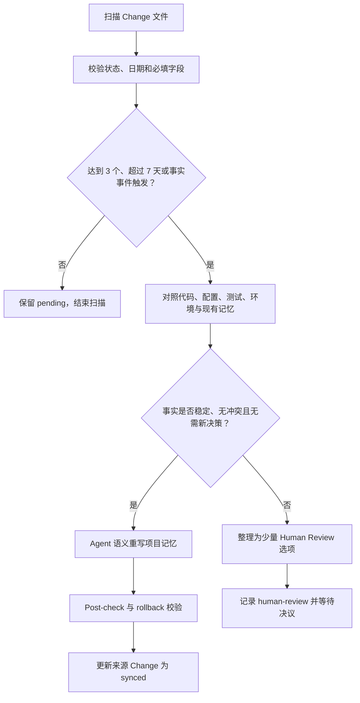

# Proposal: Persistent Lightweight Execution Card And Change Memory Consolidation

状态：Proposal、实施、focused validation 与全量验证已完成，待最终 Human Review
目标版本：v1.5.0
创建时间：2026-07-18
默认语言：中文
前置能力：`docs/proposal/v1.5.x/lightweight-change-lane.md`

## 摘要

v1.5.0 已实现 `Lightweight Change Lane`，使边界明确、低风险、影响范围小、可准确验证的普通非 Bug 修改不必机械创建完整 Feature workspace。当前实现中的 `Lightweight Execution Card` 默认只存在于当前响应上下文，不写入目标项目。

响应内执行卡能降低文档成本，但在对话压缩、任务中断、Agent 重启、后续审计和多分支回看时缺少可靠事实源。轻量通道因此可能出现“执行过程是准确的，但背景、计划、验证和回滚证据没有被项目保留”的连续性缺口。

本 Proposal 建议：

1. 把每次合格的轻量执行卡持久化为一个独立 Change 文件；
2. 创建时直接写入 `changes/YYYY-MM/YYYY-MM-DD-<topic>.md`，用月份分区和日期加 topic 提供稳定、可发现的变更身份；
3. 通过只读扫描脚本从真实 Change 文件计算待整理记忆，不维护独立计数器；
4. 在累计 3 个待整理 Change、最早待整理 Change 超过 7 天或触发事实事件时，由 Agent 主动执行 Change Memory Consolidation；
5. 只把证据充分、稳定、无冲突且不产生新决策的事实直接同步到项目记忆；
6. 把语义、权威、分支适用范围或目标位置不确定的候选集中交给人类确认。

这不是把轻量通道重新做成 Feature，也不是为了可追溯性恢复完整 Feature 的文档负担。

## 1. 最高原则

本能力以以下原则为不可弱化约束：

> 轻量执行卡不是为了效率而放弃准确性，而是在低风险、影响范围小的前提下提高效率。

它在 Agent Loop 中具体解释为：

> Lightweight Change Lane 减少的是流程仪式、文档数量和 Plan 深度，不减少准确性、范围控制、验证强度、回滚能力、事实审查或 Human Gate。只有当风险低、影响范围可枚举且验证能够准确命中失败模式时，才允许通过轻量路径提高效率。

因此：

- 轻量不是根据文件数、代码行数、步骤数或预计耗时判断；
- 持久化记录不能反向扩大轻量通道的适用范围；
- 低风险和小范围是进入条件，不是执行后的主观结论；
- 记录深度可以伸缩，完成证据不能伸缩；
- 无法准确判断时必须停止并交还人类选择；
- 任一 Feature 硬触发器仍然优先于轻量路径；
- commit、push、PR、merge、tag、release、publish、生产访问、付费调用、配置写入和其他既有 Human Gate 不变。

## 2. 问题定义

### 2.1 当前连续性缺口

当前 response-local 执行卡存在以下风险：

- 对话压缩或任务重新进入后，Agent 可能无法恢复原始 Scope、Plan 和 Rollback；
- 人类未立即 commit 时，Git 历史不能替代过程记录；
- 后续 Agent 只能看到代码结果，难以知道修改依据和验证范围；
- 多个小修改积累后，稳定事实没有明确入口进入项目记忆；
- Agent 可能重复扫描已经在轻量修改中确认过的路径、命令或环境事实；
- 项目记忆与已完成小修改发生漂移时，没有可计算的整理触发器。

### 2.2 不能采用的补救方式

以下方式不适合作为默认方案：

- 为每个小改动创建完整 Feature workspace；
- 把所有执行卡历史直接追加到 `project.md`；
- 让多个 Change 共写一个按月日志文件；
- 维护一个需要人工同步的累计数字；
- 只依赖 commit message 作为背景、验证和回滚证据；
- 把所有 Change 都无条件提炼成长期项目记忆；
- 用 Agent 主观“置信度”替代事实验证；
- 在代码合并前把源分支事实写成目标分支事实。

## 3. 设计目标

1. 每次轻量变更都有独立、持久、可恢复的事实源。
2. 保留 Background、Goal、Scope、Plan、Progress、Verification、Rollback、Human Gates、Result 和 Memory Impact。
3. 不创建 Feature 的 spec、tasks、tests、plan、notes 或 lifecycle。
4. 让意外中断可以安全恢复，但不把计划性跨会话和交接工作放入轻量路径。
5. 从 Change 文件真实状态计算记忆整理触发条件。
6. 由 Agent 主动整理高证据稳定事实，减少人类逐条审核负担。
7. 对不确定候选使用中文、少状态、低认知负担的 Human Review。
8. 保持分支事实、代码事实和目标项目记忆之间的语义边界。
9. 在 Windows 和 macOS 上使用 Python 标准库完成确定性扫描。
10. 保持现有 Lightweight / Bug / Feature 路由、验证和所有外部 Human Gate 不变。

## 4. 非目标

本 Proposal 不做以下事情：

- 不创建 `.agent-loop/changes/README.md`；
- 不创建 `.agent-loop/changes/INDEX.md`；
- 不创建一个共享月度 Change 日志；
- 不创建轻量 backlog、任务系统、Feature Type、Bug Resolution Path 或新 Auto Mode；
- 不允许轻量记录替代 Requirement、Bug、Feature、ADR 或 Delivery Contract；
- 不为轻量 Change 增加计划性 handoff、Subagent 执行或长期多会话协作；
- 不自动删除、压缩、搬迁、rehydrate 或二次归档 Change 文件；
- 不创建 Change `archive.md`、Archive Status、归档交易或恢复流程；
- 不自动回填历史 response-local 执行卡；
- 不在扫描脚本中实现语义记忆写入；
- 不把 Change Memory Consolidation 变成后台定时任务；
- 不允许项目记忆成为 Change 历史或 backlog；
- 不改变代码合并完成后再执行目标记忆校准的既有顺序；
- 不从 Change 文件推断新的产品、架构、安全、数据或发布决策。

## 5. 核心概念

### 5.1 Persistent Lightweight Execution Card

`Lightweight Execution Card` 仍是轻量通道的唯一执行控制卡，但从 response-local 临时内容升级为目标项目中的持久 Change 文件。

它在执行期间拥有：

- 当前变更的背景和目标；
- 完整但可伸缩的 Scope 和 Plan；
- 当前进度、验证和回滚；
- 独立 Human Gate；
- 记忆影响判断。

它在完成后拥有：

- 最终结果和残余风险；
- 实际验证证据；
- 记忆整理状态；
- 可选的关联 commit；
- 后续审计和意外恢复所需的最小事实。

它不是 Feature `plan.md`、Bug Record、项目记忆、需求来源或 Git 授权。

### 5.2 Change Memory Consolidation

`Change Memory Consolidation` 是 Agent 对已完成 Change 中稳定事实的周期性语义整理：

```text
已完成 Change
→ 扫描 pending
→ 回看代码、配置、测试、环境与现有记忆事实
→ 分类记忆候选
   ├─ 无长期价值 → none
   ├─ 高证据稳定事实 → synced
   └─ 存在语义或权威不确定性 → human-review
→ 校验项目记忆
→ 更新来源 Change 的 Memory Review
```

它不是把 Change 内容复制进 `project.md`，而是对事实进行去重、合并和重写。项目记忆只保留未来 Agent 需要的稳定当前事实，Change 文件保留过程与证据。

### 5.3 Changes-Only Memory Root

Change 路径必须复用当前唯一已接受的 Agent Loop memory root：默认是 `.agent-loop/`，已有项目只有已接受的 legacy `agent-loop/` 时继续使用 legacy root；两者同时存在时停止并进入 Recovery，不能为了 Change 选择或迁移根。

当目标项目两个 root 都不存在时，一个 clearly eligible 的轻量修改可以创建默认路径：

```text
.agent-loop/changes/YYYY-MM/
```

这只表示项目存在持久轻量变更记录，不表示：

- Agent Loop 项目初始化已完成；
- `.agent-loop/project.md` 存在或可靠；
- root guidance 已接受；
- Project Entry Scan 已完成；
- Feature、Requirement、Bug 或 Decision 目录应被补建。

Project Entry 必须根据 `project.md`、root guidance 和实际 artifact 状态判断可靠性，不能只以 `.agent-loop/` 目录存在作为已初始化证据。

## 6. 持久化布局与命名

### 6.1 默认路径

每次轻量变更创建一个独立文件：

```text
.agent-loop/
  changes/
    YYYY-MM/
      YYYY-MM-DD-<topic>.md
```

示例：

```text
.agent-loop/changes/2026-07/2026-07-18-update-api-domain.md
.agent-loop/changes/2026-07/2026-07-18-adjust-build-script.md
.agent-loop/changes/2026-08/2026-08-02-refresh-doc-links.md
```

### 6.2 Topic 规则

`<topic>`：

- 使用稳定、简短、可读的 kebab-case；
- 描述变更目标，不使用 `misc`、`update`、`change` 等无信息词；
- 不写客户敏感信息、凭证、内部 token 或完整生产标识；
- 同一天同 topic 冲突时追加 `-2`、`-3`，不覆盖旧记录；
- 文件名日期表示记录创建日期，不表示截止时间或发布时间。

### 6.3 月份分区不是归档

月份目录由 `Created At` 的 `YYYY-MM` 确定。它是创建时的稳定存储分区，不是完成后的 Archive 状态：

- Change 创建时直接进入对应月份目录；
- `in-progress`、`completed`、`stopped` 和后续 Memory Review 都留在原创建月份；
- 完成、记忆同步、commit 或版本发布不移动文件；
- pending 统计递归覆盖所有月份，不能只扫描当前月；
- 月份目录、文件名日期和 `Created At` 不一致时，artifact 非法；
- 不创建 `archive.md`、Archive Status、move plan、rehydrate 或 restore transaction；
- 未来只有出现真实规模或扫描性能问题时，才通过独立 Proposal 讨论更深层分区或冷归档。

因此，规范路径一经创建就保持稳定，不需要后续引用重写或归档 Human Gate。

### 6.4 不使用共享索引

本能力不维护 Change INDEX 或计数器。原因是：

- 多分支会集中修改同一索引并增加冲突；
- 索引容易与真实文件状态漂移；
- 计数和最早日期可从文件确定性推导；
- 人类不需要为 Agent 维护一份额外说明文档。

## 7. 执行卡最小契约

每个 Change 文件至少包含：

```markdown
# Lightweight Change: <topic>

Record Version: 1
Status: in-progress | completed | stopped
Created At: YYYY-MM-DD
Updated At: YYYY-MM-DD
Completed At: YYYY-MM-DD | none
Git Context: <branch>@<full-sha> | no-git

## Background

## Goal / Completion Criteria

## Scope

## Lane Rationale

## Impact / Risk

## Plan

## Current Progress

## Verification

## Rollback

## Human Gates

## Result / Residuals

## Memory

Memory Review: pending | complete
Memory Result: pending | none | synced | human-review
Memory Evidence: <evidence locator | pending: concrete reason | none: concrete reason>
Memory Target: <owned target path | pending: concrete reason | none: concrete reason>
```

字段规则：

- 所有核心区块必须存在；
- 不适用项写 `none` 和具体原因，不留空占位符；
- 初始 `in-progress` 卡使用 `Memory Evidence: pending: verification not complete` 和 `Memory Target: pending: classify at completion`，不能为了稍后再判断而保存空字段；
- `completed + pending` 必须把上述初始值替换为实际 verification locator 和候选目标或具体目标未定原因；
- `Memory Review: pending` 时，`Memory Result` 必须为 `pending`；
- `Memory Review: complete` 时，`Memory Result` 必须为 `none | synced | human-review`；
- `completed` 必须有 `Completed At`、实际验证、最终结果和可用回滚；
- `stopped` 必须记录停止原因、当前 diff、已执行验证和后续路由；
- Git 不可用时记录 `no-git`，不能伪造 branch 或 SHA；
- commit 发生后可在 Result 中机械补充 commit locator，但 commit 仍有独立 Human Gate。

## 8. 创建、执行与完成

### 8.1 创建时机

只有 Lightweight Change Assessment 得出 `clearly eligible` 后，才允许创建 Change 文件。

执行顺序：

```text
Project Entry 最小检查
→ Lightweight Change Assessment
→ clearly eligible
→ 披露 Scope、Plan、Verification、Rollback 和 Human Gates
→ 创建 Change 文件
→ 第一次目标代码/配置/文档写入
```

路由为 `uncertain` 时，在人类回答前零写入；路由为 Bug 或 Feature 时，不创建轻量 Change 文件代替其正式 artifact。

创建 Change 文件是已授权轻量变更的必要 Agent Loop artifact，不额外增加一个创建文件 Human Gate。它不能授权目标修改范围之外的写入。

### 8.2 执行更新

Agent 在关键步骤后更新：

- Plan checkbox；
- Current Progress；
- 实际 Scope；
- fresh verification；
- rollback 状态；
- Result / Residuals；
- Memory 候选和证据。

不要求记录逐命令流水账或复制完整测试输出。保存结论、命令、退出状态和必要证据定位即可。

### 8.3 完成门槛

`Status: completed` 需要全部满足：

1. Goal / Completion Criteria 已满足；
2. 每个 Plan 步骤完成或明确取消；
3. fresh targeted verification 已运行；
4. 行为逻辑变化按失败模式保留最小有意义 RED / GREEN；
5. diff review 证明只修改已披露 Scope；
6. 没有未处理的 Feature 硬触发器或 scope expansion；
7. rollback 仍然具体可执行；
8. Result / Residuals 真实说明完成内容和剩余风险；
9. Memory Review 已判断为 `complete`，或保留为可计算的 `pending` 候选；
10. 所有后续 Git、外部、生产和发布动作仍在各自 Human Gate 后。

轻量意味着完成路径短，不意味着完成标准低。

## 9. 意外恢复与计划性跨会话

持久化执行卡支持意外恢复，不自动授权计划性长期工作。

### 9.1 可恢复情形

对话压缩、Agent 重启或非计划中断后，如果 Change 仍为 `in-progress`，新 Agent 可以：

1. 读取 Change 文件；
2. 重新检查当前 branch、HEAD、dirty work 和目标文件；
3. 将记录中的 Scope、Plan 和 Progress 与实际 diff 比对；
4. 重新确认仍满足 lightweight eligibility；
5. 继续原 Scope，或停止并进入 Human Choice。

恢复本身不能继承已失效的外部操作授权。

### 9.2 仍需 Feature 的情形

如果工作在开始时就预计需要：

- 多次计划性跨会话；
- pause/resume 生命周期；
- handoff；
- Subagent；
- 长期观察；
- 复杂证据存储；
- 多任务依赖；

则仍然使用 Feature。持久化 Change 不能成为规避 Feature 的长期任务容器。

## 10. Scope Expansion 与升级

出现以下任一情况时停止轻量执行：

- 新发现 Scope 外调用方、文件、服务或运行环境；
- 需要新的产品或技术决策；
- 验证失败揭示更广泛缺陷；
- 涉及公共接口、事件、数据含义、状态、权限、安全或信任边界；
- 需要依赖、迁移、ADR、Delivery Contract 或跨模块协议；
- rollback 或验证不再可靠；
- 发现应按 Bug 管理；
- 需要计划性跨会话、handoff 或 Subagent。

停止后：

1. `Status` 改为 `stopped`；
2. 保留调查、当前 diff、验证和停止原因；
3. 推荐 Bug、Requirements Discussion 或 Feature 中唯一最合理的路线；
4. 在人类选择前不扩大写入；
5. 人类决定保留、回滚或将当前证据带入新 artifact；
6. 若升级 Feature，在 Result 中记录 Feature locator，但不让 Change 接管 Feature lifecycle。

## 11. 准确性与验证不变量

### 11.1 风险匹配验证

```text
可隔离的行为逻辑变化
→ targeted RED
→ minimal GREEN
→ focused regression

事实、路径、域名、文档或配置变化
→ parse / syntax / reference / residual / bounded dry-run
→ 必要时 focused regression
```

禁止为了形式制造无意义单元测试，也禁止用“轻量”跳过能够准确暴露行为缺陷的 RED / GREEN。

### 11.2 证据要求

完成证据必须说明：

- 验证命令或可复现入口；
- 执行时间或本轮 fresh 性；
- 退出状态；
- 期望与实际结果；
- 未覆盖边界；
- diff 与 Scope 一致性；
- rollback 可用性。

### 11.3 安全记录

Change 文件不得保存：

- 凭证、token、cookie、私钥或签名 URL；
- 完整生产响应或敏感客户载荷；
- 未脱敏日志；
- 可直接重放的付费或生产调用参数；
- 人类没有授权持久化的隐私内容。

只记录脱敏结论、命令结构、证据 locator 和必要摘要。

## 12. Memory Review 模型

### 12.1 每次 Change 的判断

Change 完成时，Agent 必须判断：

```text
没有长期价值
→ Memory Review: complete
→ Memory Result: none

存在稳定事实候选，但尚未整理
→ Memory Review: pending
→ Memory Result: pending

稳定事实已同步且通过检查
→ Memory Review: complete
→ Memory Result: synced

存在需要人类判断的候选
→ Memory Review: complete
→ Memory Result: human-review
```

`human-review` 表示 Agent 的分类已经完成，但人类决议仍未完成。它不再计入自动整理的 `pending` 数量，但每次相关 Project Entry、发布或合并后记忆校准都必须继续显式报告，不能悄悄丢失。人类决议完成后，把 Memory Result 更新为 `none` 或 `synced`，并补充 Memory Evidence、Memory Target 和决议 locator。

### 12.2 什么值得进入项目记忆

候选事实必须同时具有：

- 跨后续任务仍有用的稳定性；
- 当前代码、配置、测试或已验证环境证据；
- 明确的事实所有者和目标记忆位置；
- 当前分支或 Target Release Context 中清楚的适用范围；
- 与现有项目记忆的一致性或可解释重写关系；
- 不属于 backlog、临时进度、原始执行日志或短期排障信息。

项目记忆保留精炼后的当前事实，不复制 Change 的 Plan、命令流水或历史正文。

## 13. 主动记忆整理触发器

Agent 在以下任一条件满足时主动进入 Change Memory Consolidation：

1. `Status: completed` 且 `Memory Review: pending` 的 Change 数量达到 **3 个**；
2. 最早 pending Change 的 `Completed At` 相对扫描基准日期**超过 7 个完整日历日**；
3. 当前代码、配置或测试已经证明项目记忆失真；
4. 正式版本发布前存在 pending Change；
5. 代码合并已经完成并验证，Post-Merge Memory Reconciliation 需要消费合并进来的 Change 事实。

精确定义：

- 数量条件为 `pending_count >= 3`；
- 时间条件为 `as_of_date - oldest_completed_at > 7 days`；
- 恰好 7 天不触发，超过 7 天触发；
- `in-progress`、`stopped`、`Memory Review: complete` 不计入 pending；
- 字段缺失、日期无效或状态组合非法时，扫描失败并要求修复记录，不能猜测；
- 触发器由真实文件推导，不持久化累计数字。

触发后由 Agent 主动扫描和分类。高证据事实无需人类逐条批准即可同步；不确定候选才进入 Human Review。任何 commit、push、release 或目标分支记忆写入仍保留其既有边界。

## 14. 高证据自动同步规则

Agent 只有在以下条件全部满足时，才可以直接同步项目记忆：

1. 来源 Change 已完成并有 fresh verification；
2. 候选是已发生事实，不是计划、建议或未来能力；
3. 代码、配置、测试或已授权环境证据能够直接支持该事实；
4. 事实对未来 Agent 有稳定价值；
5. 目标记忆文件确实拥有该类事实；
6. 与现有记忆、Requirement、Decision、Feature、Bug 和 root guidance 没有语义冲突；
7. 不产生新的产品、架构、安全、数据、权限、环境权威、Branch Strategy 或发布决策；
8. 不覆盖、改写或弱化人类原始要求；
9. 事实适用的 branch、release 或 customer context 明确；
10. 写入后的引用和记忆一致性可以验证；
11. rollback 能只撤销本轮 Agent 写入，不破坏人类或其他工作区改动。

这是一条基于证据的自动同步规则，不是主观置信度评分。

自动同步还要求目标项目已经存在可靠、已接受的项目记忆结构。只有 `changes/` 而没有可靠 `project.md` 时，Agent 不得顺手创建 `project.md`、切换 memory mode 或创建新的 enterprise detail file。此类候选进入 Human Review，并根据价值推荐 Project Entry / Project Memory Init；没有长期价值时直接归类为 `none`。

### 14.1 必须交给人类的候选

以下情况使用 `Memory Result: human-review`：

- 多个权威来源冲突；
- 事实适用范围可能只属于当前开发分支；
- 需要删除或覆盖已有长期事实；
- 涉及产品含义、架构、安全、数据、权限或发布策略；
- 目标记忆位置有多个合理选择；
- 代码事实与主管规范或人类确认事实不一致；
- 证据不足以判断事实是否稳定；
- 多个 Change 对同一事实给出不一致描述。

Human Review 使用中文，只呈现 Agent 已经整理后的少量真实选择，并使用 `高 | 一般` 关注等级。动作和状态保持少量，不输出大段原始 diff 或未经归类的候选清单。

## 15. Change Memory Consolidation 流程



详细顺序：

1. 扫描并校验全部 Change metadata；
2. 选出 `completed + pending`；
3. 计算数量、最早完成日期和事实事件；
4. 对候选按事实主题分组，而不是按文件逐条复制；
5. 回看真实代码、配置、测试、环境和现有记忆；
6. 把候选分类为 `none | synced | human-review`；
7. 在任何记忆写入前，向当前响应披露精确目标路径、拟重写事实、证据、影响和 rollback；这不是新增 Human Gate，但禁止隐藏 Scope；
8. 对 `synced` 候选语义重写正确的项目记忆位置；
9. 运行引用、格式、事实一致性和残余扫描；
10. 失败时只恢复本轮记忆写入，并保留来源 Change 为 `pending`；
11. 更新所有参与候选的 Memory Review、Evidence 和 Target；
12. 在当前响应中报告已同步、无需同步、需要人类关注和剩余风险。

整理自身不再创建新的 Lightweight Change 文件，避免“整理记录又产生待整理记录”的递归。它更新来源 Change 和实际项目记忆即可。

## 16. 分支与合并语义

### 16.1 当前分支事实

Change 文件记录当前 branch 与 base SHA。它描述当前分支已经验证的事实，不自动宣称其他分支或正式版本已经具备该事实。

Agent 直接同步记忆时，必须保证该记忆文件与当前代码处于同一 branch / release context。不能把开发分支事实提前写入目标分支工作区。

### 16.2 合并后记忆校准

分支合并保持既有顺序：

```text
代码合并完成
→ 合并结果验证完成
→ Post-Merge Memory Reconciliation
→ 消费 Base、Source、Target-before、Merged Code 与 Change 证据
→ 重写目标记忆
```

Change 文件是事实证据，不是目标记忆覆盖指令。即使源分支 Change 标记 `synced`，目标分支仍需根据合并后代码事实重新判断。

### 16.3 Git Gate

创建或完成 Change 文件不授权：

- branch create / switch / delete；
- commit；
- push；
- PR；
- merge；
- tag；
- release / publish。

这些动作继续使用各自 Human Gate。Change 文件在获得 commit 授权后与目标修改一起进入 diff review 和提交范围。

## 17. 只读扫描脚本

### 17.1 入口

Skill 提供跨平台只读脚本：

```text
scripts/scan-lightweight-changes.py
```

要求：

- Python 3.10+；
- 只使用 Python 标准库；
- 原生支持 Windows 和 macOS；
- 不调用 shell-specific 工具；
- 不写目标项目文件；
- 递归扫描规范路径 `.agent-loop/changes/YYYY-MM/*.md`，并跨所有月份累计；
- 复用唯一已接受的 `.agent-loop/` 或 legacy `agent-loop/` root；两者并存时失败，都不存在时只读报告零 Change 且不创建目录；
- 支持显式项目 root；
- 支持测试用 `--as-of YYYY-MM-DD`；
- 输出顺序确定；
- 非法 artifact 以非零退出，不静默跳过。

### 17.2 扫描输出

至少输出：

- 扫描根目录；
- Change 文件总数；
- `in-progress | completed | stopped` 数量；
- `completed + pending` 数量；
- `human-review` 数量和路径，使未决人类候选不会因退出 pending 累计而消失；
- 最早 pending 路径和 `Completed At`；
- pending age；
- 命中的触发原因；
- 所有 pending Change 路径；
- 文件名、月份目录、路径深度、必填字段、日期、状态组合和重复身份错误；
- `triggered | not-triggered | invalid` 结果。

扫描脚本只做发现、校验和确定性计算。记忆候选分类与语义重写由 Agent 根据真实事实完成，不能在脚本里用字符串拼接替代。

## 18. Artifact Ownership

| Artifact | Owns | Does Not Own |
|---|---|---|
| `.agent-loop/changes/YYYY-MM/YYYY-MM-DD-<topic>.md` | 单次轻量变更的背景、范围、Plan、进度、验证、回滚、结果和 Memory Review | Feature lifecycle、Bug identity、Requirement meaning、项目长期事实、Archive lifecycle 或 Git 授权 |
| `.agent-loop/project.md` | simple mode 的精炼长期事实与当前入口 | Change 历史、执行流水、backlog 或 pending 候选 |
| `.agent-loop/project/*.md` | enterprise mode 的分类长期事实 | Change 原文或未经确认的候选 |
| `scripts/scan-lightweight-changes.py` | Change metadata 校验、累计和触发判断 | 语义记忆写入、Git 操作或外部副作用 |
| 当前 Human Review 响应 | 不确定候选的少量选择、Agent 推荐和关注等级 | 长期事实源或批量原始 evidence dump |

## 19. 失败、回滚与不完整状态

### 19.1 Change 执行失败

验证失败时：

- 不得标记 `completed`；
- 先诊断是否仍满足轻量边界；
- 不静默扩大 Scope；
- 保留失败证据和当前 diff；
- 需要升级时使用 `stopped` 和 Human Choice；
- 回滚时只撤销 Agent 自己的已披露修改。

### 19.2 记忆整理失败

项目记忆 post-check 失败时：

- 恢复本轮 Agent 写入前的目标记忆内容；
- 不修改无关 dirty work；
- 来源 Change 保持 `Memory Review: pending`；
- 记录失败原因和已尝试证据；
- 不把部分成功写成 `synced`；
- 需要人类判断时改为明确 Human Review，而不是重试猜测。

### 19.3 Artifact 不合法

扫描发现非法状态、日期、字段或重复路径时，先修复 Change artifact。非法 artifact 不能被计为 `none`、`synced` 或自动忽略。

## 20. 迁移与兼容

- 已有 response-local Lightweight Execution Card 不自动回填；
- Proposal 生效后的新轻量修改使用持久文件；
- 当前正在执行但没有文件的轻量修改，在恢复时由 Agent 报告缺口并提出最小补记；
- Proposal 生效前不存在规范化 flat Change 历史，不需要设计批量迁移；未来发现 flat、错误月份或更深路径时先报告非法 artifact，不能静默移动；
- 现有 Feature、Bug、Requirement、Decision 和 memory merge artifact 路径不变；
- `.agent-loop/changes/` 的存在不触发 enterprise memory mode；
- Change 文件数量本身不触发 Feature 或 enterprise memory；
- 当前 `Lightweight Change Lane` 的 eligibility、Feature hard trigger、targeted verification 和 Human Gate 继续有效；
- 本 Proposal 不改变既有已完成 Proposal 的历史文本，而是作为后续决策覆盖 response-local artifact 结论。

## 21. 需要协调更新的运行面

实施时至少检查并协调：

- `references/design.md`：核心概念、artifact ownership 和准确性原则；
- `references/runtime.md`：创建顺序、恢复、触发器和记忆整理路由；
- `SKILL.md`：controller 摘要与 package map；
- `references/lightweight-change-lane.md`：主运行规则；
- `references/artifact-rules.md`：Change artifact、状态和 drift；
- `references/project-memory-mode.md`：高证据同步、pending 候选和 changes-only root；
- `references/project-guidance.md`：Agent bootstrap 提醒；
- `references/memory-reconciliation.md`：合并后消费 Change 证据；
- `references/stage-guides.md`、`references/workflow-checklists.md`：执行与完成检查；
- `templates/lightweight-execution-card.md`：持久化模板；
- `templates/root-AGENTS.md`：一句 Agent-facing 路由提醒；
- `scripts/scan-lightweight-changes.py`：只读扫描；
- `README.md`、`Usage.md`、`CHANGELOG.md`：人类触发与版本说明；
- validation scenarios、focused tests 和 full validation report。

这属于 coordinated workflow change，因为它改变 runtime artifact ownership、Project Entry 状态识别、恢复边界和 Project Memory Update 规则。实施后必须执行 full validation，不能只做 Markdown 或脚本机械检查。

## 22. RED / GREEN 验证场景

实施前应建立能在当前行为下失败的 RED 断言，至少覆盖：

1. clearly eligible 修改在第一次目标写入前创建 `changes/YYYY-MM/YYYY-MM-DD-<topic>.md`；
2. response-local-only 规则被替换，运行面不再禁止 `.agent-loop/changes/`；
3. uncertain、Bug 和 Feature 路由不会错误创建轻量 Change；
4. changes-only root 不被判定为可靠项目初始化；
5. 月份目录必须等于文件名日期和 `Created At` 的 `YYYY-MM`；
6. 完成、记忆整理、commit 和 release 不移动原月份中的 Change；
7. scanner 跨所有月份累计 pending，不只扫描当前月；
8. flat、错误月份、更深路径和同日同 topic 冲突不会被静默接受或覆盖；
9. 不创建 Change archive、move、rehydrate 或 restore artifact；
10. `in-progress` 可以在意外中断后通过 branch、HEAD、dirty diff 重新校准；
11. 计划性 handoff、Subagent 和长期跨会话仍触发 Feature；
12. scope expansion 停止并记录 `stopped`，不继续扩大写入；
13. 行为逻辑变化仍要求最小有意义 RED / GREEN；
14. 事实修改使用 parse、reference、residual、syntax 或 dry-run 证据；
15. 两个 `completed + pending` 不触发数量阈值；
16. 三个 `completed + pending` 触发整理；
17. 最早 pending 恰好 7 天不触发时间阈值；
18. 最早 pending 超过 7 天触发整理；
19. `in-progress`、`stopped` 和 `Memory Review: complete` 不计入 pending；
20. 非法日期、字段缺失和非法状态组合使扫描失败；
21. `--as-of` 产生确定性跨平台结果；
22. 高证据稳定事实可以同步正确记忆位置；
23. 产品、架构、安全、数据、权限、发布或冲突事实进入 Human Review；
24. changes-only root 不允许自动创建 `project.md` 或 enterprise memory file；
25. 高证据同步前披露精确目标路径、事实、证据和 rollback；
26. 高证据同步失败时恢复本轮记忆写入并保持 pending；
27. 记忆整理不会递归创建新的 Change；
28. 源分支 Change 不会在代码合并前覆盖目标分支记忆；
29. 合并后 reconciliation 把 Change 作为证据而非覆盖指令；
30. Change 文件不会写入秘密、完整生产响应或未脱敏载荷；
31. commit、push、merge、release、publish 和外部副作用仍需要独立 Human Gate；
32. 无权限或竞态导致的目录枚举失败返回确定性 JSON，只包含项目相对 POSIX 路径；
33. 生成卡中的 `<replace...>` authoring marker 被拒绝，且无效 Markdown fence 不能隐藏它；
34. 合法 fenced Markdown 证据中的 H2、Memory metadata 和字面模板示例不参与结构解析；
35. `Git Context` 从最后一个 `@` 分隔 full SHA，允许 Git 合法分支名自身包含 `@`。

## 23. 验收标准

Proposal 实施完成后，必须满足：

1. 新的 clearly eligible 轻量修改默认写入 `.agent-loop/changes/YYYY-MM/YYYY-MM-DD-<topic>.md`；
2. 执行卡在第一次目标写入前存在，并在执行期间持续更新；
3. no-memory 项目可以创建 changes-only root，但不会被误判为完整初始化；
4. 唯一 accepted legacy root 被复用，两根并存时失败，零 root 扫描不产生目录；
5. 状态、日期、Memory Review、月份目录、文件命名、authoring marker 和 fenced Markdown 结构可由脚本确定性校验；
6. Change 从创建到完成、记忆整理和发布始终保留原月份路径；
7. scanner 跨全部月份累计，且不依赖 archive、INDEX 或共享计数器；
8. pending 数量达到 3 或最早 pending 超过 7 天时触发；
9. 事实漂移、正式发布前和已验证代码合并后存在相应事件触发；
10. 高证据事实自动同步规则全部可审计且不依赖主观评分；
11. 不确定候选以中文、少状态、低认知负担方式交给人类，并持续出现在 scanner 结果中；
12. 自动同步前披露精确目标路径、事实、证据和 rollback；
13. changes-only root 不会被自动扩展为完整项目记忆；
14. 项目记忆不保存 Change 历史或 pending backlog；
15. planned cross-session、handoff、Subagent 和 Feature 硬触发器仍使用 Feature；
16. scope expansion 停止而不是静默扩张；
17. targeted verification、diff review、rollback 和所有 Human Gate 保持不变；
18. 扫描脚本只用 Python 标准库，通过 Windows / macOS 兼容验证，并把文件系统枚举失败归一化为不泄漏绝对路径的契约错误；
19. focused RED / GREEN、现有 regression 和 full validation 全部通过；
20. Proposal、Implementation Plan 和验证报告停在 Human Review，等待后续 Git 或发布授权。

## 24. 风险与权衡

### 24.1 Change 文件增多

独立文件会增加仓库 artifact 数量，因此从创建时就按 `YYYY-MM` 分区。月份目录限制单目录规模并保持路径稳定，不引入 Archive lifecycle、文件搬迁或引用重写。只有出现真实的跨多年规模或扫描性能问题后，才通过独立 Proposal 讨论更深分区或冷归档。

### 24.2 Agent 自动修改项目记忆

自动同步能降低人类负担，但必须使用第 14 节的全条件规则、真实事实复核、post-check 和 rollback。任何语义不确定性都不能用“高置信度”跳过人类。

### 24.3 changes-only root 可能引起误判

这是允许无现有 memory 项目持久化记录的必要代价。Project Entry 和验证规则必须显式区分目录存在与可靠初始化。

### 24.4 执行卡可能变重

固定字段保证恢复和审计，但每个字段内容仍按风险伸缩。禁止把轻量卡写成 construction-grade Feature plan 或复制完整日志。

### 24.5 分支合并中的记录累积

独立文件降低文本冲突，但不同分支可能描述相近事实。Post-Merge Memory Reconciliation 必须按合并后代码事实语义合并，不能按文件数量或来源优先级机械复制。

## 25. Human Gate 与实施边界

本 Proposal 确认后，仅授权编写 Implementation Plan，不自动授权实现。

后续至少保留：

1. Proposal Human Review；
2. Implementation Plan Human Review；
3. coordinated workflow implementation；
4. focused RED / GREEN validation；
5. full validation 与中文报告；
6. 最终 Human Review；
7. 独立 commit gate；
8. 独立 push、tag、release、publish gate。

实现不得：

- 静默修改已经实施完成 Proposal 的历史状态或原始结论；
- 升级版本号，除非人类另行明确批准；
- 同步已安装 Skill；
- 创建 branch、worktree、commit、push、tag、PR、merge、release 或 publish；
- 用 Proposal 或测试文本冒充真实运行期 Agent 行为证据。

## 26. 推荐下一步

1. 人类审阅本 Proposal；
2. 如有调整，先修正 Proposal；
3. 人类明确接受后，单独编写 construction-grade Implementation Plan；
4. Implementation Plan 再经 Human Review；
5. 获得实施授权后，从 RED 基线开始执行 coordinated workflow change；
6. focused 与 full validation 完成后停在最终 Human Review。
