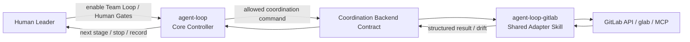
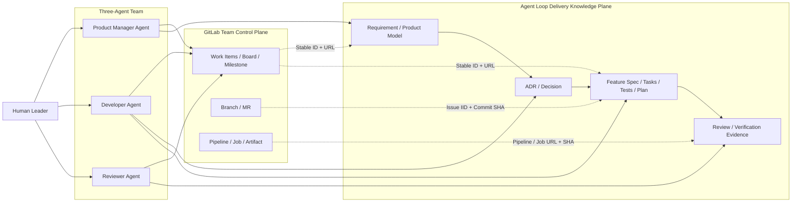
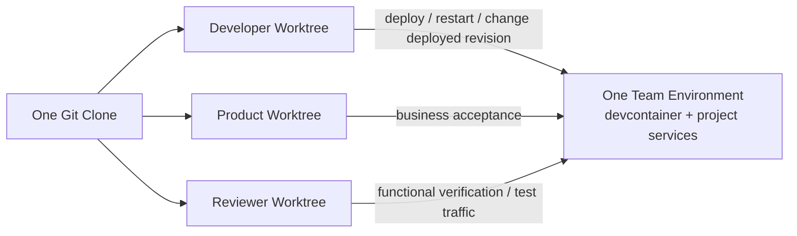

# Proposal: GitLab 协作控制面与三 Agent Team 工作流

状态：详细设计草案（核心架构已确认，协议级开放决策待逐项确认）

目标版本：v2.0.x

创建时间：2026-07-13

提案类型：`proposal-doc`，不是当前运行时规则

## 结论摘要

本提案把 Agent Loop 从当前的 `single-person + CLI agent first` 模式扩展为一个由人类领导、三个角色 Agent 协作的 Team Loop：

```text
Human Leader
├── Product Manager Agent
├── Developer Agent
└── Reviewer Agent
```

核心设计正式锁定为：

> GitLab 是团队协作状态的事实源；Agent Loop / Git 仓库是 Requirement、ADR、Feature 和交付证据正文的事实源。

这不是双写同一份事实，而是把不同类型的事实分别交给最适合的系统：

- GitLab 管优先级、负责人、角色交接、Milestone、Board 状态、阻塞、Branch、MR、Pipeline 和团队可见进度；
- Agent Loop 管人类原始需求、Concept Foundation、Requirement Product Model、ADR / Decision、Feature Spec、Tasks、Tests、Plan、Review 与 Verification Evidence；
- 两个平面只通过稳定 ID、仓库路径、Commit SHA 和 GitLab URL 建立可验证链接；
- GitLab Issue、评论和 Wiki 不复制并重新定义 Agent Loop 正文；
- Agent Loop 不维护 GitLab 协作状态的第二份镜像数据库。

v2.0.x 默认运行普通 Agent Loop。只有人类明确授权后，Agent 才自动完成配置并切换到 Team Loop。安装 `agent-loop-gitlab` 只代表具备 GitLab 协作能力，不等于已经启用 Team Loop。

Team Loop 中默认只有一个 Leader：人类。Product Manager Agent、Developer Agent 和 Reviewer Agent 共用同一套 `agent-loop` 与同一套 `agent-loop-gitlab`，只是运行时角色不同；它们都不能代替 Human Gate，也不能批准自己的产出。

## 已确认的设计决定

| ID | 决定 | 状态 |
|---|---|---|
| `TEAM-SSOT-01` | GitLab 管协作状态；Agent Loop / Git 仓库管需求、ADR、Feature、Review 与证据正文 | accepted-for-proposal |
| `TEAM-ROLE-01` | Team 默认由 Product Manager Agent、Developer Agent、Reviewer Agent 三个角色组成 | accepted-for-proposal |
| `TEAM-LEADER-01` | v2.0.x 默认 Leader 是人类，不增加第四个 Leader Agent | accepted-for-proposal |
| `TEAM-REVIEW-01` | Reviewer Agent 不仅审代码，还必须独立验证 Feature 功能、异常路径、回归风险和证据可复现性 | accepted-for-proposal |
| `TEAM-INDEPENDENCE-01` | Reviewer 默认不能修改被审 Feature 的业务实现；一旦修改业务代码，就失去该变更的独立 Reviewer 身份 | accepted-for-proposal |
| `TEAM-GATE-01` | Requirement、Concept Foundation、ADR、Feature Spec、Delivery Contract、提交、MR、合并、发布和关闭等既有 Human Gate 不被 Team Loop 取消 | accepted-for-proposal |
| `TEAM-MODE-01` | 同一个 Agent Loop Skill 支持 `agent-loop` 与 `team-loop` 两种 Loop Mode；默认是 `agent-loop` | accepted-for-proposal |
| `TEAM-ACTIVATION-01` | Team Loop 必须由人类显式授权开启，具体配置由 Agent 自动执行；安装 GitLab adapter 不触发自动切换 | accepted-for-proposal |
| `TEAM-PACKAGE-01` | Team 核心状态机、角色、Gate 和 Artifact 归 Agent Loop；GitLab API、Board、租约和同步归独立 `agent-loop-gitlab` adapter Skill | accepted-for-proposal |
| `TEAM-SHARED-SKILL-01` | 三个角色加载相同的 `agent-loop` 与 `agent-loop-gitlab`，不为 Product、Developer、Reviewer 复制三套工作流 Skill | accepted-for-proposal |
| `TEAM-ROLE-LOADING-01` | 共享角色定义属于 Agent Loop；当前 Agent 实例的角色绑定不得写进共享 `AGENTS.md`，必须使用不提交到仓库的本地绑定 | accepted-for-proposal |
| `TEAM-WORKSPACE-01` | 一个 Team 默认使用一个 Git clone 和三个独立 worktree，分别承载 Product、Developer、Reviewer 的 Git 工作状态 | accepted-for-proposal |
| `TEAM-ENVIRONMENT-01` | 一个 Team 只拥有一套共享 Team Environment；三个角色不各自启动一套完整开发环境 | accepted-for-proposal |
| `TEAM-ENVIRONMENT-02` | Developer 是唯一可以修改业务实现并改变 Team Environment 当前运行版本的角色 | accepted-for-proposal |
| `TEAM-REVIEW-TEST-01` | Reviewer 可在自己的 worktree / review 分支编写功能、验收和回归测试，但不能直接修改 Developer worktree、业务实现或 Team Environment 的运行版本 | accepted-for-proposal |
| `TEAM-ACCEPTANCE-01` | Product 负责业务验收，Reviewer 负责独立技术与功能验证；两者职责不同，且必须针对可识别的同一交付版本形成记录 | accepted-for-proposal |
| `TEAM-MULTI-TEAM-01` | Team Environment 按 Team 隔离；另一个 Team 使用另一套环境，而不是与当前 Team 共用同一运行栈 | accepted-for-proposal |

这里的 `accepted-for-proposal` 只表示人类已经确认提案方向，不表示 v2.0.x 运行时已经实现或这些规则已经发布。

## 背景与当前缺口

当前 Agent Loop 的公开设计以单个人类和单个 CLI Agent 为核心，并明确把 `multiplayer workflow` 列为首版排除项。现有模型已经能管理：

- Requirement Archive；
- Concept Foundation 与 Requirement Product Model；
- Decision & Design / ADR；
- Feature Spec、Task、Test、Plan；
- TDD、Verification、Review、Drift、Evidence；
- Submit、Pause、Close Human Gate。

但它还没有回答 Team Loop 中的问题：

- 三个 Agent 如何共享同一个需求和 Feature 上下文；
- 谁可以修改哪种正文，谁只能评论或审查；
- Agent 如何领取工作并避免重复执行；
- 产品、开发、Reviewer 之间如何交接；
- 人类如何在一个可视化控制面看到整体进度；
- GitLab Issue、Board、Milestone、Wiki、Branch、MR、Pipeline 分别对应 Agent Loop 的什么概念；
- GitLab 和仓库信息冲突时谁优先；
- Reviewer 的功能验收如何绑定到精确代码版本；
- GitLab 暂时不可用、Agent 崩溃或同步只完成一半时如何恢复。

本提案为这些问题提供 v2.0.x 级别的目标模型，但不在本文件中修改当前运行时。

## 目标

v2.0.x Team Loop 需要满足：

1. 人类能在 GitLab Plan 中看到需求、Feature、Bug、负责人、当前角色、阻塞、Review 和交付进度。
2. 三个 Agent 都通过 Agent Loop 使用同一组被接受的 Requirement、ADR 和 Feature 正文。
3. 每种事实只有一个正文事实源，避免 GitLab Issue、Wiki 和仓库文档互相漂移。
4. 每次角色交接都能追踪到 Agent、Artifact、Commit SHA、GitLab Work Item 和 Human Gate。
5. Reviewer 能在自己的独立 worktree 中，对共享 Team Environment 当前部署的精确 Commit SHA 进行验证，并产出不可被开发者静默覆盖的 Review Evidence。
6. GitLab 协作写入可幂等重试；同步失败不会导致两个 Agent 同时拥有同一任务。
7. 当前 Agent Loop 的 Human Gate、Task Done Gate、Feature Close Review 和证据要求继续成立。
8. GitLab Free / Self-Managed 的基础能力可落地；高级 Work Item 状态或高级 Board 能力只能作为增强项。
9. 没有显式启用 Team Loop 的项目继续使用普通 Agent Loop，行为不因安装 `agent-loop-gitlab` 而改变。
10. 三个角色共享同一控制器和同一 GitLab adapter，避免角色规则分叉。

## 非目标

本提案不做以下事情：

- 不让 GitLab Issue 或 Wiki 成为 Requirement / ADR 正文；
- 不把每一个 Agent Loop 内部 Step 都创建成 GitLab Task；
- 不引入独立 Roadmap Graph 或新的项目管理数据库；
- 不允许 Agent 自动接受需求、ADR、Delivery Contract 或自己的 Review；
- 不允许 Reviewer 的 `review-passed` 自动合并 MR；
- 不允许 MR 合并自动等价于 Agent Loop Feature Close；
- 不要求三个 Agent 共用一个工作目录或一个未隔离的 Git 分支；
- 不为 Product、Developer、Reviewer 分别启动一套完整 devcontainer / 开发服务栈；
- 不把 worktree 隔离误解为三个角色拥有相同的业务代码或环境写权限；
- 不在 v2.0.x 基线中支持一个 Team 同时执行多个 Delivery Feature；
- 不要求使用 GitLab Wiki；
- 不把 GitLab Duo 或任何闭源 Agent 产品作为运行依赖；
- 不把 Product、Developer、Reviewer 分别实现为三套拥有独立状态机的 Skill；
- 不因为检测到 GitLab、安装了 `agent-loop-gitlab` 或发现多个 Agent 就静默启用 Team Loop；
- 不在 proposal 阶段改变版本号、运行时、模板或测试。

## 方案比较

### 方案 A：全部放进 GitLab

把需求、ADR、Feature Spec、测试结论和状态都写进 Epic / Issue / Wiki。

优点：

- 人类只看一个 UI；
- GitLab 搜索、评论和通知天然可用。

问题：

- Wiki 是独立 Git 仓库，不能自然进入产品代码的同一个 MR、Review 和版本历史；
- Issue 描述会和代码仓库内的 Agent Loop 文档形成第二份正文；
- Agent 很难证明执行时使用的是哪一版 Requirement / ADR；
- Feature Close、Drift 和 Evidence 失去与代码 Commit 的强绑定。

结论：不采用。

### 方案 B：全部留在 Agent Loop

三个 Agent 只读写 `.agent-loop/`，GitLab 只保存代码和 MR。

优点：

- 正文模型简单；
- 所有内容与代码一起版本化。

问题：

- 人类无法用 Board、Milestone、Assignee、通知和 Work Item 管理团队；
- Agent 领取、阻塞、催办和跨角色交接不可见；
- 并发 Agent 容易重复领取或覆盖工作。

结论：不采用。

### 方案 C：分域事实源 + 稳定链接

GitLab 作为 Team Control Plane，Agent Loop / Git 仓库作为 Delivery Knowledge Plane。

优点：

- 每类事实只有一个正文所有者；
- 人类拥有成熟的 Plan / Board / Milestone / MR 视图；
- Agent 能从 Commit SHA 还原执行和 Review 上下文；
- 可以渐进实现，先用 `glab` / API 拉取，再引入 Webhook 或调度服务。

成本：

- 需要稳定 Link Contract 和同步漂移检查；
- 必须定义角色权限与状态迁移；
- GitLab 不可用时要有 fail-closed 规则。

结论：采用。

## Loop Mode 与 Skill 包边界

### 同一个 Agent Loop，两种 Loop Mode

v2.0.x 不建立另一套平行的 Team 工作流控制器。所有 Agent 都加载同一个 `agent-loop` Skill，由 Agent Loop 根据项目配置选择 Loop Mode：

```text
Loop Mode: agent-loop | team-loop
```

| Loop Mode | 含义 | 默认值 |
|---|---|---|
| `agent-loop` | 当前单个人类 + 单个主 Agent 的开发循环，不启用团队角色和 GitLab 协作租约 | 是；字段缺失也按此模式处理 |
| `team-loop` | 人类 Leader + Product / Developer / Reviewer 三角色，通过 GitLab 共享协作状态 | 否；必须经过人类显式授权 |

Loop Mode 是项目级协作拓扑，不替代现有 Gate Mode：

```text
Loop Mode: agent-loop | team-loop
Gate Mode: Strict Mode | Feature Auto-Loop | Task Auto-Run
```

Team Loop 中的每个角色仍受 Strict Mode、Feature Auto-Loop、Task Auto-Run 及其 stop conditions 约束。启用 Team Loop 不自动启用任何 Auto Mode。

### Team Loop 的显式开启语义

“显式开启”表示：

> 人类授权是否切换，Agent 负责执行具体设置。

推荐流程：

```text
default Agent Loop
-> Agent detects a team collaboration signal
-> Agent proposes Team Loop and reports planned setup
-> Human explicitly authorizes Team Loop
-> Agent validates agent-loop-gitlab and GitLab access
-> Agent writes Loop Mode configuration
-> Agent configures allowed GitLab labels / board / templates / bindings
-> Team Loop becomes active
```

Agent 可以在以下信号出现时主动建议开启，但不能自行决定：

- 人类要求 Product、Developer、Reviewer 协作；
- 项目已经配置 GitLab coordination backend；
- 人类要求通过 Work Items / Board 管理 Agent Team；
- 当前交付需要跨角色独立 Review；
- 多个 Agent 正在等待共享任务和进度。

安装 `agent-loop-gitlab`、发现 GitLab remote、看到 GitLab Issue 或检测到多个 Agent，都只表示能力或信号存在，不构成模式切换授权。

### Agent 自动配置的范围

Human Leader 确认启用后，Agent 可以按已披露的 bootstrap scope 自动完成：

- 在 `project.md` 写入稳定的 Loop Mode 和 backend 配置；
- 检查并加载兼容的 `agent-loop-gitlab`；
- 验证 GitLab 项目、权限和保护规则；
- 创建或校验 scoped labels、Board、Issue / MR templates；
- 建立 Agent Loop 与 GitLab 的 Link Contract；
- 建立 Product、Developer、Reviewer 角色槽位；
- 记录 Human Leader；
- 为第一个 Feature 提议 Team Run。

推荐的项目级配置只保存稳定设置，不镜像实时协作状态：

```text
## Team Coordination

Loop Mode: agent-loop | team-loop
Coordination Backend: none | gitlab
Coordination Contract Version: <version>
GitLab Project: <group/project or none>
Human Leader: <stable identity or none>
Team Loop Enabled By: <human identity or none>
Team Loop Enabled At: <timestamp or none>
```

当前 Product / Developer / Reviewer Assignee、Board 列、Lease 和 blocker 继续实时读取 GitLab，不写入 `project.md`。

### 恢复与关闭模式

- Team Loop 成功启用后，后续 Agent 在 Project Entry / Resume 时自动识别并恢复，不需要每轮重新确认；
- `agent-loop-gitlab` 暂时不可用时，不得静默降级为普通 Agent Loop，因为这会丢失团队协调事实源；
- adapter 不可用时进入 blocked，并恢复 adapter 或由人类确认模式迁移；
- 切回普通 Agent Loop 必须经过 Human Gate；
- 有 active Team Run、未完成角色交接或 active Delivery Feature 时不能直接关闭 Team Loop；必须先 close、pause 或完成受控 handoff；
- 更换 Human Leader、重分配角色、扩大 GitLab 项目/权限范围或启动新的 Team Run 仍需要对应 Human Gate。

## Skill 包装架构

### `agent-loop`：唯一工作流控制器

Agent Loop Core 负责与 GitLab 无关的 Team 语义：

- Loop Mode 选择和切换 Gate；
- Product / Developer / Reviewer 角色和权限；
- Human Leader；
- Requirement -> ADR -> Feature -> Review -> Close 状态机；
- Team Run 授权模型；
- Reviewer 独立性和 reviewed SHA 规则；
- Artifact ownership、Task Done Gate、Completion Gate；
- GitLab 不可用、adapter 缺失和 drift 时应该停止还是继续；
- 通用 Coordination Backend Contract。

这些规则不能外移到 GitLab adapter，否则 adapter 会成为第二个工作流控制器。

### `agent-loop-gitlab`：共享 GitLab adapter Skill

`agent-loop-gitlab` 是三个角色共同加载的一套可选 adapter，不是 Product / Developer / Reviewer 各自一份。

它负责：

- GitLab Work Items、Epic、Issue、Task 映射；
- Board、scoped labels、Assignee、Milestone；
- Branch、MR、Pipeline、Job、Artifact 查询与链接；
- GitLab API、`glab`、GraphQL、REST 或 MCP 的具体调用；
- Team Run 的 GitLab 投影；
- claim / lease 的原子写入；
- Link Contract 同步；
- Review Verdict 与 reviewed SHA 的 GitLab 投影；
- webhook、幂等键、重试和 sync drift 检查；
- GitLab 版本、tier、权限和 API 兼容处理。

它不能：

- 决定进入哪个 Agent Loop stage；
- 接受 Requirement、Concept Foundation、ADR、Feature Spec 或 Delivery Contract；
- 改变 Task Done Gate 或 Feature Close Gate；
- 自行决定 Reviewer 是否独立；
- 把 GitLab 状态当作缺失 Evidence 的替代品；
- 自动提交、创建 MR、合并、发布或关闭；
- 在 Agent Loop 拒绝迁移时强制修改 workflow 状态。

### 不拆三个角色 Skill

Team Loop 采用相同 Skill + 不同运行时角色：

```text
Product Agent   = agent-loop + agent-loop-gitlab + Team Role: product
Developer Agent = agent-loop + agent-loop-gitlab + Team Role: developer
Reviewer Agent  = agent-loop + agent-loop-gitlab + Team Role: reviewer
```

不推荐建立拥有各自状态机的 `product-agent-skill`、`developer-agent-skill` 和 `reviewer-agent-skill`。角色行为可以拆成 Agent Loop 内的 role references，但 controller、gates、artifact model 和 GitLab adapter 必须共享。

### 依赖方向



依赖只允许单向控制：

```text
Agent Loop decides whether an action is allowed.
agent-loop-gitlab decides how to perform that allowed action in GitLab.
Agent Loop consumes the result and decides the next stage.
```

### Coordination Backend Contract

v2.0.x 首个 backend 是 GitLab，但 Agent Loop Core 只依赖一组通用动作语义：

```text
inspect_team_state
bootstrap_coordination
claim_work_item
renew_or_release_lease
transition_work_item
publish_artifact_link
record_human_gate_event
publish_review_verdict
inspect_reviewed_revision
detect_sync_drift
```

每次 adapter 调用返回结构化结果、远端 revision、执行身份、时间和错误分类。Core 根据结果决定 `continue | blocked | ask-human | retry-safe`；adapter 不决定下一 stage。

## 核心架构



### 两个平面

| 平面 | 核心问题 | 主要写入者 |
|---|---|---|
| GitLab Team Control Plane | 谁在做、做到哪、何时交付、谁被阻塞、哪个 MR / Pipeline 对应这项工作 | 三个 Agent 在授权范围内，人类 Leader 拥有最终控制权 |
| Agent Loop Delivery Knowledge Plane | 为什么做、产品含义是什么、技术决定是什么、实现范围是什么、如何测试、证据是什么 | 按角色分工写入，人类通过 Human Gate 接受关键正文 |

### 最小镜像原则

两个平面可以记录对方的标识和摘要，但不能复制对方的正文所有权：

```text
允许：Feature Issue -> Agent Loop Feature 路径 + Commit SHA
允许：Feature spec.md -> GitLab Issue URL + MR URL
允许：notes.md -> Pipeline URL + Job URL + 结果摘要
允许：Issue -> 当前工作流状态、Assignee、Milestone、阻塞原因

禁止：把完整 Requirement 复制到 Issue 后独立修改
禁止：把 ADR 正文复制到 Wiki 后让 Wiki 成为“最新版”
禁止：在 project.md 镜像当前 GitLab Board 列和 Assignee
禁止：让 GitLab 评论静默改变已接受的 Requirement / ADR
```

## 分域事实源矩阵

| 事实 | 唯一正文事实源 | GitLab 中允许的内容 | 冲突时 |
|---|---|---|---|
| 人类原始需求与附件 | `.agent-loop/requirements/<set>/` | 摘要、链接、优先级、讨论入口 | Agent Loop 原始来源不可被 Issue 覆盖 |
| Concept Foundation | 有效的人类评审 Requirement 文档 | Gate 状态、确认评论链接 | Agent Loop 的 accepted source 为准；缺少 Human Gate Evidence 时阻塞 |
| Requirement Product Model | 有效 Requirement 文档 | ID 列表摘要和文档链接 | Agent Loop 为准 |
| Requirement 生命周期 | Requirement README / INDEX | Board 优先级和协作状态 | 内容生命周期以 Agent Loop 为准；排期以 GitLab 为准 |
| ADR / Decision | `.agent-loop/decisions/*.md` | Decision ID、状态摘要、链接、评审任务 | Agent Loop 为准；GitLab 评论只能形成新候选或 Human Gate Evidence |
| Feature 产品意图 | `product.md` | 一段摘要和链接 | `product.md` 为准 |
| Feature 范围与验收 | `spec.md` | 摘要、Issue 状态和链接 | `spec.md` 为准 |
| 工程任务明细 | `tasks.md` / `tasks/*` | 只同步跨角色、独立负责人、阻塞或人类需要跟踪的任务 | Agent Loop 为准 |
| 测试设计 | `tests.md` / `tests/*` | Pipeline、Test Case 或检查清单链接 | Agent Loop 为准 |
| 当前协作状态 | GitLab Work Item + scoped labels + Assignee | 原生保存 | GitLab 为准；仓库不保存第二份当前状态 |
| 优先级、Milestone、Due Date | GitLab | 原生保存 | GitLab 为准 |
| Branch / MR / Pipeline 状态 | GitLab | 原生保存 | GitLab 为准 |
| 验证与 Review 正文 | `notes.md`、Team Loop 的 `reviews/*` | 结果摘要、链接、MR verdict | Agent Loop 为准，且必须绑定 SHA |
| Human Gate 事件 | 人类可在当前 Agent Loop 会话或 GitLab 明确决定；跨 Agent 交接前必须形成稳定、团队可见的 GitLab 事件记录 | 身份、时间、决定 | GitLab 保存协作事件；Agent Loop 保存 accepted artifact 状态和事件引用；两者不一致时 fail closed |
| Feature Close | Agent Loop Completion Gate + Human Close | Issue 最终关闭状态 | 两边都满足才算 Team Delivery Closed |

## GitLab Plan 概念映射

GitLab Work Items 支持从较大的 Epic 到 Issue、Task 的层级。v2.0.x 不要求每层都必须出现，而是根据交付规模选择最小层级。

| GitLab 概念 | Agent Loop 对应概念 | 使用规则 |
|---|---|---|
| Epic | 一个跨多个 Feature / Milestone 的 Requirement Set、Delivery Initiative 或项目组目标 | 复杂需求推荐；单 Feature 需求可不建 Epic |
| Issue: Feature | 一个 Agent Loop Feature 的团队协作入口 | 默认一对一；必须链接唯一 Feature ID 和路径 |
| Issue: Bug | Feature Follow-up / Flow-back 的输入 | 先归属分析，再决定 flow-back、linked feature、maintenance-fix 或 investigate-first |
| Child Task | 跨角色交接、独立 Assignee、阻塞依赖、并行 lane 或人类必须跟踪的工作包 | 不镜像所有 `tasks.md` 行和内部 Step |
| Test Case | 可选的人类可视化验收入口 | v2.0.x 基线不把它作为 `tests.md` 的第二份正文 |
| Issue Board | GitLab 协作状态投影视图 | 使用 scoped label 列，兼容基础 Board 能力 |
| Milestone | Release、交付窗口或时间盒 | 不表示 Requirement 正文，不等价于 Feature Close |
| Wiki | Team 首页和导航索引 | 只链接 Requirement、ADR、Feature、Board、Milestone；不保存权威正文 |
| Branch | Developer Agent 的隔离实现线 | 关联 Feature Issue；名称带 Issue IID 和 slug |
| Merge Request | 精确代码候选、Review 与提交入口 | 关联 Feature Issue、Feature ID、ADR、Evidence 和 reviewed SHA |
| Pipeline / Job | 可执行验证和构建状态 | Agent Loop Evidence 引用 URL、SHA、命令和结果摘要 |
| Artifact | 大日志、测试报告、构建包、截图等执行产物 | 允许过期；Agent Loop 必须保留可审计的结果摘要和标识 |

### Epic 的创建规则

满足任一条件时推荐创建 Epic：

- 一个 Requirement Set 会拆成两个以上 Feature；
- 跨多个 Milestone 或 Release；
- 跨多个项目 / 子项目；
- 人类需要看到 Feature 级进度汇总；
- Requirement 有明确 Delivery Phases，需要把多个 Feature 映射回同一业务目标。

简单需求只需要一个 Feature Issue 时，不强制创建 Epic。

### Child Task 的创建规则

只有以下任务需要同步为 GitLab Child Task：

- 需要从 Product Agent 交接给 Developer Agent；
- 需要从 Developer Agent 交接给 Reviewer Agent；
- 有独立 Assignee；
- 会阻塞另一个 Work Item；
- 需要单独的人类决定或外部输入；
- 需要作为跨项目 Execution Lane 的可见 Barrier；
- 人类明确要求在 GitLab 跟踪。

纯内部代码步骤、TDD RED/GREEN 小步骤和同一 Agent 内连续执行的细粒度工作保留在 `tasks.md` / `plan.md`。

### Wiki 的边界

GitLab Wiki 是独立 Git 仓库，因此只承担导航 Read Model：

```text
Team Home
├── 当前 Milestone
├── 当前 Board
├── Requirement Index 链接
├── ADR Index 链接
├── Active Feature 链接
└── Agent 操作入口与说明
```

Wiki 页面不得重新定义需求、ADR、Feature 验收标准、测试结论或当前事实源规则。Wiki 缺失不阻塞 Team Loop 运行。

## 稳定 Link Contract

### 标识规则

每个跨平面对象至少要有：

| 对象 | 稳定标识 |
|---|---|
| Requirement Set | 仓库相对路径，例如 `.agent-loop/requirements/2026-07-13-team-mode/` |
| Concept / Requirement Model | 已接受文档内稳定 ID，例如 `CONCEPT-*`、`FLOW-*`、`PM-*` |
| ADR / Decision | Decision 文件路径 + Decision ID |
| Feature | `.agent-loop/features/<feature-id>/` 路径 + Feature ID |
| Agent Loop Task | Feature ID + Task ID |
| GitLab Work Item | Project full path + Work Item IID + canonical URL |
| Branch | Project full path + branch name |
| MR | Project full path + MR IID + canonical URL |
| Review | Feature ID + Review Cycle ID + reviewed Commit SHA |
| Pipeline / Job | Project full path + pipeline/job ID + Commit SHA + URL |

不要只存 GitLab 数字 IID，因为同一个组内不同项目可能出现相同 IID。

### Requirement README 的 GitLab Binding

Requirement README 只保存链接，不缓存 Board 状态：

```text
## GitLab Coordination

GitLab Project: <group/project>
GitLab Epic: <URL or none>
Primary Work Item: <URL>
Milestone: <URL or none>
Last Link Check: <date + checked commit>
```

### Feature Spec 的 GitLab Binding

```text
## GitLab Coordination

GitLab Project: <group/project>
Feature Work Item: <URL>
Parent Epic: <URL or none>
Milestone: <URL or none>
Primary Branch: <branch or none>
Merge Request: <URL or none>
```

这些字段不能增加 `Current GitLab Status` 或 `Current Assignee`。当前协作状态必须实时从 GitLab 读取。

### GitLab Work Item 的 Agent Loop Binding

Issue / Epic 描述只保存：

```text
## Agent Loop Binding

Repository: <canonical repository URL>
Requirement Set: <repo link + commit SHA>
Decision: <repo link + commit SHA or none>
Feature: <repo link + commit SHA or none>
Evidence Index: <repo link + commit SHA or none>
Binding Status: linked | incomplete | drifted
```

Issue 描述中的业务摘要用于人类快速阅读，不是权威验收正文。

### Human Gate 事件落地规则

Human Gate 不强制人类只能在 GitLab UI 操作。人类可以在当前 Agent Loop 会话中明确确认，但在发生跨 Agent 交接前，负责当前阶段的 Agent 必须把该决定持久化为团队可见的 GitLab gate event，并在 Agent Loop artifact 中记录该事件的 URL、确认者、时间和决定。

```text
Human decision origin: Agent Loop conversation | GitLab
GitLab responsibility: team-visible event identity and coordination transition
Agent Loop responsibility: accepted artifact state and immutable event reference
```

如果只有 Agent Loop 中的 accepted 状态而找不到人类决定证据，或者 GitLab 显示已批准但 Agent Loop artifact 仍是 proposed，后续角色不得开始执行，必须进入 `sync::drift`。

## 三个 Agent 的角色模型

### Product Manager Agent

Product Manager Agent 负责把人类意图变成可评审的产品语义，不负责直接进入实现。

主要责任：

- 整理人类需求、原型、反馈和约束；
- 运行 Requirements Discussion；
- 在触发时建立 Concept Foundation；
- 推导 Requirement Product Model；
- 提议 Delivery Phases；
- 编写或维护 Feature `product.md`；
- 提供 Feature 的业务范围、用户价值和验收标准；
- 在交付候选版本上执行业务验收，记录它是否满足人类已接受的产品语义和验收标准；
- 在 GitLab 创建或维护 Epic、Feature / Bug Issue、Milestone 建议、优先级和 Product 状态；
- 发现 Issue 评论中的新范围，并将其路由为 requirement follow-up，而不是静默修改已接受正文。

禁止：

- 接受自己的 Requirement、Concept Foundation 或 Product Brief；
- 替代人类接受 ADR 或 Feature Spec；
- 在未完成 Human Gate 时把 Work Item 标记为 ready for development；
- 直接修改业务实现；
- 部署、重启或改变 Team Environment 的服务版本；
- 替代 Reviewer 给出功能通过结论。

### Developer Agent

Developer Agent 负责把已接受的产品语义落成技术设计、可执行计划、实现和自验证。

主要责任：

- 消费已接受 Requirement、Concept IDs 和 Requirement Product Model；
- 在需要时起草 ADR / Decision 的技术落地；
- 编写 Feature `spec.md` 的技术范围；
- 编写和维护 `tasks.md`、`tests.md`、`plan.md`；
- 执行 TDD、实现、构建、静态检查和自测；
- 记录 Verification Evidence；
- 作为唯一环境版本写入者，把交付候选 Commit 部署到 Team Environment，并发布可验证的 Environment Revision；
- 在获得相应 Human Gate 后创建或更新 Branch、Commit、MR；
- 把精确 MR SHA 交给 Reviewer；
- 根据 `changes-requested` 修复后发起新的 Review Cycle。

禁止：

- 修改人类原始需求；
- 重新定义已接受 Concept / Requirement Product Model；
- 静默重写已接受 ADR；
- 批准自己的 MR 或 Review；
- 从“代码已写完”直接把任务标记为 `done`；
- 在 Reviewer 通过后继续推送并沿用旧 Review 结论。

### Reviewer Agent

Reviewer Agent 是独立质量验证者、需求一致性审查者和合并前守门人，不只是 Code Reviewer。它拥有独立 Git 工作状态，但与本 Team 的另外两个角色共用同一套 Team Environment。

主要责任：

- 检查 Feature 是否满足 Requirement 和 `spec.md` 验收标准；
- 检查实现是否符合 accepted ADR / Decision；
- 在自己的 worktree 中检查精确 MR SHA，并验证 Team Environment 已部署的是对应 Commit；
- 重跑适用的自动化测试和 Pipeline；
- 执行功能验收、异常路径、边界条件和回归测试；
- 检查开发者 Evidence 是否真实、完整、可复现；
- 检查 Requirement -> ADR -> Feature -> Test -> Evidence 的追踪链；
- 记录 `changes-requested` 或 `review-passed`；
- 将 Review 结论绑定到 Commit SHA；
- 将最终通过状态交给人类 Leader，而不是自行合并或关闭。

Reviewer 可以：

- 提出新的测试用例；
- 编写 Reviewer 自有的黑盒、验收或回归测试；
- 在 Review artifact 中记录缺陷和复现证据；
- 在自己的 review 分支或测试覆盖层中提交 test-only 建议性补丁。

Reviewer 默认不能：

- 修改被审 Feature 的业务实现；
- 直接修改 Developer worktree；
- 部署、重启、重建或改变 Team Environment 的运行版本；
- 在同一变更上同时充当 Developer 和独立 Reviewer；
- 绕过失败测试、不可用环境或缺失证据给出 `review-passed`；
- 代替 Human Gate；
- 自动合并 MR 或关闭 Feature。

如果 Reviewer 修改业务代码，它对该变更失去独立 Reviewer 资格，必须由另一 Reviewer 或人类重新审查修改后的 SHA。

## 人类 Leader

v2.0.x 默认 Leader 是人类，不是第四个 Agent。

Leader 负责：

- 决定优先级和 Milestone；
- 组建 Team 并分配三个角色；
- 发出有边界的 Team Run 授权；
- 接受 Requirement、Concept Foundation、ADR、Feature Spec 和必要 Contract；
- 解决角色冲突、范围冲突和事实源漂移；
- 决定 blocked、scope change、pause、submit、merge、release、close；
- 决定 Reviewer 失去独立性后由谁补审；
- 撤销 Agent 的任务租约或 Team Run。

v2.0.x 不允许 Product Manager Agent 自动升级为 Leader。未来如引入 Agent Leader，只能获得协调权限，不能获得人类验收、合并或关闭权限。

## RACI 与写入权限

缩写：`R` 负责起草或执行，`A` 最终接受，`C` 必须被咨询，`V` 独立验证，`I` 被通知。

| Artifact / Action | Product Agent | Developer Agent | Reviewer Agent | Human Leader |
|---|---|---|---|---|
| Requirement source 整理 | R | C | I | A |
| Concept Foundation | R | C | C | A |
| Requirement Product Model | R | C | C | A |
| Delivery Phases | R | C | I | A |
| ADR 技术草案 | C | R | V | A |
| `product.md` | R | C | C | A when required |
| `spec.md` 产品范围 | R | C | V | A |
| `spec.md` 技术落地 | C | R | V | A |
| `tasks.md` / `plan.md` | I | R | V | A through normal gates |
| `tests.md` 基础测试设计 | C | R | V | A through normal gates |
| 实现与开发者自测 | I | R | V | I |
| Reviewer 独立功能测试 | C | I | R/V | I |
| Product 业务验收 | R/V | I | C | A when required |
| Team Environment 部署版本 | I | R | V against deployed revision | I |
| Review Verdict | I | I | R | Human receives gate |
| GitLab 优先级 / Milestone | C | I | I | A |
| GitLab 角色分派 | I | I | I | A |
| Commit / MR / Merge / Close | I | R for preparation | V | A under existing gates |

## 角色定义与本地角色绑定

Team Loop 必须区分两种不同信息：

1. **角色定义**：Product、Developer、Reviewer 分别能做什么、不能做什么，属于所有 Team 共用的 Agent Loop 运行时规则；
2. **角色实例绑定**：当前进程、当前 worktree、当前 GitLab identity 在本次 Team Run 中扮演哪个角色，属于本机运行状态。

角色定义应作为 Agent Loop 的可发布 reference 随 Skill 提交，例如：

```text
references/team-roles/
  product.md
  developer.md
  reviewer.md
```

实际文件名和拆分粒度仍是开放决策，但不能复制成三个拥有独立 controller 的 Skill。

当前角色实例绑定不得写进共享根 `AGENTS.md`。根 `AGENTS.md` 最多只能保存通用 bootstrap 规则，例如：

> Team Loop 中不要从 `AGENTS.md` 推断当前角色；先解析本地角色绑定，再向 GitLab Team Run 校验有效角色、实例和租约。

每个 worktree 使用一个不提交到仓库的本地绑定。以下仅是待确认的候选格式，不是 v2.0.x 已接受 schema：

```yaml
schema_version: team-role-binding/v0
loop_mode: team-loop
team_id: TEAM-001
team_run_id: RUN-014
role: developer
agent_instance_id: dev-local-01
gitlab_identity: agent-developer
worktree: /workspace/project-developer
credential_profile: gitlab-developer
```

候选路径是 `<worktree>/.agent-loop-local/team-role.yaml`，并由 repository ignore、`.git/info/exclude` 或全局 ignore 保证不提交。该文件不能保存 token、password 或其他 secret。

不论最终路径和格式如何，下列权威关系已经确认：

```text
Agent Loop role definition
  = 角色能力和停止规则的事实源

GitLab Team Run + assignment + active lease
  = 当前远端角色分派和工作所有权的事实源

local role binding
  = 当前本地进程的 bootstrap pointer / cache，不是自我任命凭据
```

建议的启动校验顺序是：

1. 读取本地角色绑定；
2. 实时读取 GitLab Team Run、Assignee 和 active lease；
3. 验证 `team_id`、`team_run_id`、role、Agent identity、instance 和 worktree 一致；
4. 加载对应的共享角色定义；
5. 计算本轮允许的 artifact、GitLab mutation、代码和环境边界；
6. 任一不一致时 fail closed，不得由 Agent 自行改成另一个角色。

Human Leader 负责分配或变更角色。Agent 可以在明确授权后生成本地绑定文件，但不能自行选择一个权限更高的角色。路径、schema、ignore 策略、绑定更新与恢复协议列入 `OPEN-ROLE-*` 决策台账。

## Team Run 授权

三个 Agent 可以自主推进被授权的低风险协作动作，但不能从“属于这个 Team”推导出无限授权。

每个 Feature 开始前，Human Leader 创建一个有边界的 Team Run：

```text
Team Run ID: <stable ID>
Team ID: <stable ID>
Feature Work Item: <GitLab URL>
Agent Loop Feature: <path + commit>
Product Agent: <GitLab identity + agent instance>
Developer Agent: <GitLab identity + agent instance>
Reviewer Agent: <GitLab identity + agent instance>
Team Environment ID: <stable environment ID>
Allowed GitLab Mutations: <labels / assignee / comments / links>
Allowed Repository Boundaries: <paths>
Allowed Stages: <bounded stage list>
Human-gated Stops: <explicit list>
Started At: <timestamp>
Expires At: <timestamp or explicit condition>
Status: proposed | active | consumed | revoked | expired
```

### Team Run 能授权的默认动作

- 读取关联 Requirement、ADR、Feature 和 GitLab Work Items；
- 在 GitLab 更新 scoped workflow label；
- 更新当前角色 Assignee；
- 写入结构化进度评论和链接；
- 执行已被现有 Agent Loop gate 允许的分析、测试、验证和 Review；
- 创建 Review Cycle Evidence；
- 在允许边界内准备文件变化。

### Team Run 不能隐含授权的动作

- 接受 Requirement、Concept Foundation、ADR、Feature Spec 或 Delivery Contract；
- 改变 scope、public interface、data/security boundary；
- 创建未经确认的跨边界 Contract；
- 提交、创建 MR、合并、发布或关闭；
- 让 Reviewer 修改业务实现后继续自审；
- 扩大 Agent 文件边界或切换项目；
- 启动第二个 Active Delivery Feature。

这些动作继续使用现有 Agent Loop Human Gate。未来若允许把多个 gate 合并成一次授权，也必须在 Team Run 中逐项明确列出，不能靠默认推断。

## Team 并发模型

v2.0.x 基线采用：

```text
one Team -> one Active Delivery Feature
```

规则：

- 同一 Team 默认只执行一个 Active Delivery Feature；
- Product Agent 可以在获得单独授权后整理下一项 Requirement，但不能静默创建第二个 Active Feature；
- Developer 与 Reviewer 不在同一 Feature 的同一 SHA 上并发写业务代码；
- Reviewer 运行 Review 时，Developer 可以继续编辑自己的 worktree，但不得重新部署、重启或改变被锁定的 Team Environment Revision；
- Developer 推送新 Commit 或重新部署后必须形成新 Environment Revision，旧 Review 不能继续沿用；
- 如需多个 Feature 并发，应创建多个 Team 或在后续版本引入经过确认的 execution lanes；
- 跨项目 Feature 应归属于能完整负责其影响范围的最低层；具体依赖、barrier 和并发规则由后续独立的 Project Group 决策确认，不能引用未接受的历史草案。

## GitLab Board 与标签模型

为了兼容不同 GitLab 版本和 tier，v2.0.x 基线使用 scoped labels，不依赖高级 Status List。

### 主工作流标签

每个 Work Item 同时只能有一个 `workflow::*` 标签：

```text
workflow::backlog
workflow::product
workflow::ready
workflow::development
workflow::review
workflow::human-gate
workflow::done
```

推荐 Board 列顺序：

```text
Open
Backlog
Product
Ready
Development
Review
Human Gate
Done / Closed
```

### 正交标签

这些标签不替代主 workflow：

```text
type::requirement
type::feature
type::bug
type::maintenance-fix

role::product
role::developer
role::reviewer
role::leader

review::changes-requested
review::passed

gate::human
status::blocked
sync::drift

risk::security
risk::data
risk::contract
risk::migration
```

### 为什么 blocked 不是主工作流

`status::blocked` 是覆盖层。Work Item 保留原 `workflow::*`，从而知道阻塞解除后回到 Product、Development、Review 还是 Human Gate。

阻塞评论至少记录：

```text
Blocked Stage:
Blocked Role:
Reason:
Required Unblocker:
Owner:
Evidence:
Entered At:
```

### 主状态迁移权限

| 迁移 | 默认执行者 | 前置条件 |
|---|---|---|
| backlog -> product | Human Leader 或已授权 Product Agent | Requirement intake 已建立 |
| product -> ready | Human Leader | Requirement / needed ADR / Feature Spec gate 已满足 |
| ready -> development | 已分配 Developer Agent | Team Run active，Feature binding 完整 |
| development -> review | Developer Agent | 自测和 Evidence 完整，精确 SHA 可供 Review |
| review -> development | Reviewer Agent | `changes-requested`，Findings 和复现证据完整 |
| review -> human-gate | Reviewer Agent | `review-passed` 绑定当前 MR SHA |
| human-gate -> done | Human Leader 或由人类动作触发的同步器 | Submit / Merge / Close 条件全部满足 |

Product Agent 不能执行 `product -> ready` 的最终迁移；Developer 不能执行 `review -> human-gate`；Reviewer 不能执行 `human-gate -> done`。

## 端到端交付流程

### 1. Requirement Intake

1. Human Leader 或 Product Agent 在 GitLab 建立 Requirement Epic / Issue。
2. Product Agent 创建或更新 Agent Loop Requirement draft。
3. GitLab Work Item 只保存摘要和 Requirement path / commit 链接。
4. Product Agent 完成 Concept Foundation、Requirement Product Model 和 Delivery Phase 建议。
5. Human Leader 在 GitLab 或当前 Agent Loop 会话给出明确 gate 决定。
6. 如果决定来自 Agent Loop 会话，Product Agent 在跨角色交接前把它落成团队可见的 GitLab gate event。
7. Agent Loop 记录 Human Gate 的 GitLab URL、身份、时间和决定，并将有效 Requirement source 固化。
8. 如需求拆成多个 Feature，Epic 管可视化层级；每个 Feature 后续建立独立 Issue。

### 2. Decision & Design / ADR

触发 shared、cross-feature、hard-to-reverse 或现有 Design Readiness 条件时：

1. Developer Agent 从 accepted Requirement Product Model 起草技术落地。
2. Product Agent 检查 ADR 没有重新定义产品语义。
3. Reviewer Agent 检查 Technical Landing Trace、兼容性、可测试性和回滚设计。
4. Human Leader 接受或拒绝 ADR。
5. Agent Loop Decision record 保存 accepted 内容和 Human Gate Evidence 链接。
6. GitLab Work Item 只保存 Decision ID、路径、Commit 和状态摘要。

ADR 未 accepted 或 `Upstream Compatibility: review-required` 时，不得把 Feature Issue 迁移到 `workflow::ready`。

### 3. Feature Construction

1. Product Agent 建立 Feature Issue，并链接 Requirement / Delivery Phase。
2. Developer Agent 创建 Agent Loop Feature，写入 GitLab Binding。
3. Product、Developer、Reviewer 分别完成 scope、technical、testability preflight。
4. Human Leader 接受 Feature Spec 和 Requirement Checklist。
5. Human Leader 发出 Team Run。
6. Developer Agent 领取 Work Item，设置 `workflow::development` 和 `role::developer`。
7. Developer 执行 Work Breakdown、Test Design、Plan Gate、TDD、Verify、Drift。
8. 获得现有 git Human Gate 后，Developer 提交 Branch / MR。
9. MR 描述链接 Feature ID、Requirement、ADR、Issue 和 Evidence。
10. Developer 把候选 Commit 部署到本 Team 唯一的 Team Environment，发布 `Environment ID + Environment Revision + Deployed Commit SHA`。
11. 只有环境健康且部署 SHA 与交付 SHA 一致时，才能请求 Reviewer 验证。

### 4. Reviewer 独立验证

1. Developer 把 Work Item 移到 `workflow::review`，交付精确 MR SHA。
2. Reviewer 领取 Review，设置 `role::reviewer`。
3. Reviewer 在自己的 worktree 中检出或读取精确 SHA，不接管 Developer worktree。
4. Reviewer 核对 Team Environment 的 `Deployed Commit SHA` 与待审 SHA 一致，并进入待确认的 verification-lock 协议。
5. Reviewer 检查 Requirement、ADR、Spec、Tests 和开发者 Evidence。
6. Reviewer 从自己的 worktree / test runner 对共享 Team Environment 运行自动化测试、功能验收、异常路径、边界条件和回归测试。
7. Reviewer 创建一个新的 Review Cycle artifact，同时绑定代码 SHA、Environment Revision 和 Test Suite Revision。
8. 失败时记录 `changes-requested`，Work Item 回到 Development；Developer 修复和重新部署后形成新 revision。
9. 通过时记录 `review-passed`，Work Item 进入 Human Gate。

### 5. Human Merge / Close

1. Product Agent 对可识别的交付候选执行产品业务验收；该记录必须绑定与 Reviewer Evidence 一致的 Commit SHA 和 Environment Revision。
2. Human Leader 查看 Product 业务验收、Human Review Summary、Reviewer Evidence、Pipeline、Drift 和 Project Memory 状态。
3. Human 确认 Submit / Merge。
4. 合并动作必须作用于 Reviewer 已通过、Product 已验收的同一 Commit SHA。
5. 合并后运行 Agent Loop Feature Completion Check。
6. Agent Loop Feature Close 与 GitLab Work Item Close 分别满足后，Team Delivery 才进入 `workflow::done`。

Product 业务验收与 Reviewer 验证的精确先后顺序仍需在 `OPEN-GATE-01` 中确认；不可变约束是两者不能互相替代，最终通过记录必须能证明它们针对同一交付版本。

```text
MR merged != Agent Loop Feature closed
Issue closed != Agent Loop Completion Gate passed

Team Delivery Closed = MR/Submit state recorded
                     + Agent Loop Completion Gate passed
                     + Human close confirmed
                     + GitLab Work Item closed/done
```

## Review Cycle 设计

Team Loop 推荐增加 Feature 局部 Review artifacts：

```text
.agent-loop/features/<feature-id>/
  reviews/
    RV-001.md
    RV-002.md
```

`notes.md` 继续作为 Evidence 索引和时间线；`reviews/*` 保存每轮独立 Review 的正文，避免多人同时改一个大 `notes.md`，也防止 Developer 静默改写 Reviewer 结论。

每个 Review Cycle 至少包含：

```text
Review ID:
Feature ID:
Feature Work Item:
Merge Request:
Reviewed Commit SHA:
Reviewer Identity:
Reviewer Agent Instance:
Independence Statement:
Team Environment ID:
Environment Revision:
Deployed Commit SHA:
Test Suite Revision:
Test Data Namespace:
Requirement / ADR / Spec Sources:
Acceptance Cases:
Commands Executed:
Pipeline / Job Evidence:
Functional Results:
Regression Results:
Findings:
Verdict: changes-requested | review-passed | blocked
Created At:
Supersedes: <review ID or none>
```

### SHA 绑定硬规则

Review 只对一个精确 Commit SHA 有效：

```text
review-passed(SHA-A)
+ Developer pushes SHA-B
= review invalidated
```

新 Commit 出现后：

- 移除 `review::passed`；
- Work Item 回到 `workflow::development` 或 `workflow::review`；
- 创建新 Review Cycle；
- 重新运行受影响验证；
- Human 不得用旧 Review 合并新 SHA。

Pipeline 通过也必须绑定同一 SHA。Reviewer 不得用 SHA-A 的 Pipeline 证明 SHA-B 可以合并。

### Reviewer 修改测试的规则

Reviewer 可以在单独分支提供 test-only patch：

- 如果只增加黑盒、验收或回归测试，并且没有改变产品行为，仍可保留 Reviewer 身份；
- Reviewer 测试代码从自己的 worktree、review 分支或 test overlay 运行，不直接写入 Developer worktree，也不直接改变 Team Environment 服务版本；
- Developer 合入测试补丁后产生新 SHA，Reviewer 必须对新 SHA 重新运行 Review；
- 如果 Reviewer 修改业务代码、生产配置、数据迁移或公共接口，它失去独立性；
- 失去独立性后必须由另一 Reviewer 或 Human Leader 指定的人类完成独立验证。

## Branch、MR、Pipeline 与 Evidence

### Branch 命名

默认建议：

```text
feature/<issue-iid>-<slug>
fix/<issue-iid>-<slug>
maintenance/<issue-iid>-<slug>
```

具体前缀可由目标项目规范覆盖，但必须包含可解析的 GitLab Issue IID 或在 Branch metadata 中提供稳定关联。

### MR 描述最小字段

```text
## Agent Loop Trace

Feature ID:
Feature Work Item:
Requirement Set:
Applicable Decisions:
Feature Spec:
Task / Plan:
Developer Verification Evidence:
Reviewer Evidence:
Drift Decision:
Project Memory Impact:
```

MR 默认使用 `Related to #<iid>`，不要过早使用 `Closes #<iid>`。只有 Feature Completion Check 已满足、Reviewer 通过且人类确认 close alignment 时，才能使用自动关闭语义。

### Evidence 最小字段

Agent Loop 的 Verification / Review Evidence 至少记录：

- Commit SHA；
- 执行时间；
- 环境标识；
- 精确命令或测试入口；
- exit status；
- 结果摘要；
- Pipeline / Job / Artifact URL；
- 失败、跳过和替代验证说明；
- 记录者角色和 Agent instance。

GitLab Artifact 可以按保留策略过期，但 Agent Loop 中的 Evidence 摘要、SHA、命令、结果和 URL 不得仅依赖临时 Artifact 才能理解。

## Bug 管理

GitLab Bug Issue 是用户、QA 或 Agent 的协作入口，不自动等于一个新的 Agent Loop Feature。

收到 Bug 后：

1. Product Agent 或 Human Leader 标记 `type::bug`。
2. Agent Loop 运行 Feature Follow-up / Flow-back。
3. 检查最近 Feature 和当前 Requirement / ADR。
4. Human 确认以下一种归属：
   - flow back 到 owning feature；
   - 创建 linked new feature；
   - 创建 `maintenance-fix` feature；
   - investigate first。
5. GitLab Bug Issue 链接最终 Agent Loop owner。
6. Developer 和 Reviewer 使用与 Feature 相同的实现、证据和独立 Review Gate。

Bug Issue 的描述可以保存复现步骤、用户影响和附件；一旦形成被接受的行为变化，权威范围仍要写回 owning Agent Loop Requirement / Feature artifact。

## 同步协议

### 同步方向

```text
GitLab -> Agent Loop
- Work Item identity
- priority / milestone / assignee
- coordination state
- blocker
- Human Gate event URL
- branch / MR / pipeline identity

Agent Loop -> GitLab
- artifact path / commit link
- requirement / decision / feature IDs
- stage completion summary
- evidence index link
- review verdict summary
- sync drift finding
```

同步器不得从 Issue 摘要自动改写 accepted Requirement / ADR。Issue 中出现新的范围只能生成 Requirement Follow-up Candidate，并停在 Human Gate。

### Agent 间异步消息与反馈

Team Loop 不假设三个 Agent 拥有聊天室。GitLab 同时承担：

```text
asynchronous mailbox
+ append-oriented team event log
+ workflow state machine
+ wake-up signal source
```

GitLab 不是 Requirement、ADR、Feature 或 Evidence 正文所有者。消息只传递“发生了什么、谁需要行动、需要读取哪个正文、处理结果在哪里”，不能把正文重新复制进评论。

候选消息载体映射如下；最终规则仍需通过 `OPEN-MSG-01` 逐项确认：

| 信息类型 | 候选 GitLab 载体 | Agent Loop 正文 |
|---|---|---|
| Product -> Developer 交付 | Feature Issue 的 assigned Child Task + handoff comment | accepted Requirement / ADR / Feature links |
| Developer -> Product 产品歧义 | assigned Child Task 或 Issue discussion | Requirement follow-up / decision source |
| Developer -> Reviewer 请求验证 | MR review request + Feature Child Task | Feature、Developer Evidence、目标 SHA |
| Reviewer 的代码行 finding | MR unresolved thread | Review Cycle 中的 finding index / summary |
| Reviewer 的功能缺陷 | assigned Child Task 或 Bug Issue + `changes-requested` | Review Cycle、复现步骤、Evidence |
| 人类 Gate 决定 | GitLab gate event / comment | accepted artifact 状态和事件引用 |
| 普通通知 | mention、review request、GitLab To-Do | 无；通知不是任务完成或协作状态事实源 |
| Agent 唤醒 | pull polling，后续可加 webhook | 唤醒后重新读取 Team Run、lease 和 artifact |

需要接收者执行动作的信息，候选规则是必须拥有稳定 Message ID、明确 Assignee 和可关闭的 Work Item / Child Task；只有一条普通评论不能被当作可靠任务队列。MR 的代码级 finding 例外地使用 unresolved thread，因为其位置上下文和 resolve 语义属于 MR。

以下是为了后续讨论而记录的消息 envelope 草案，不是已经接受的 wire schema：

```text
Protocol: agent-loop-message/v0
Message ID: AL-MSG-0042
Team ID: TEAM-001
Team Run ID: RUN-014
Feature ID: 2026-07-14-example
From Role: developer
From Agent Instance: dev-local-01
To Role: product
To Assignee: agent-product
Type: decision-request
Requires Ack: yes
Related Work Item: group/project#123
Related Artifact: .agent-loop/requirements/.../requirement.md@<commit>
Related Revision: <code SHA or none>
Environment Revision: <revision or none>
Blocked Work: T008
Summary: <short immutable summary>
Requested Action: <one concrete action>
Expected Response: <decision / evidence / patch / acknowledgement>
Created At: <timestamp>
Expires At: <timestamp or none>
Idempotency Key: <stable logical key>
```

真实正文仍通过 `Related Artifact` 解析。消息中禁止放 token、password、完整日志或大段 Requirement / ADR 内容。

候选生命周期是：

```text
created -> routed -> acknowledged -> resolved
                              \-> rejected
                              \-> superseded
```

建议的处理动作：

1. 发送者创建 assigned Child Task、MR thread 或 gate event，并带唯一 Message ID；
2. GitLab mention / To-Do / webhook 只负责通知或唤醒；
3. 接收者醒来后重新读取 GitLab 当前状态、Team Run、lease 和引用 artifact；
4. 接收者使用同一 Message ID 记录 ACK；
5. 处理完成后追加 resolution，链接新的 artifact revision、Commit、Review 或 Human Gate Evidence；
6. 只有满足消息类型的完成条件后才关闭 Task 或 resolve thread；
7. 不通过编辑旧评论静默改变原问题；若语义变化，追加 `supersedes` 事件。

这是当前推荐方向，但 Message 字段、ACK 强制范围、超时升级、评论可编辑性、Task 创建阈值、MR thread 与 Review artifact 的同步边界仍未确认，分别进入 `OPEN-MSG-*` 决策。

#### 典型信息流候选

Developer 遇到阻塞性产品歧义：

```text
Developer marks Feature coordination state blocked
-> creates assigned decision-request Child Task for Product
-> links accepted Requirement and asks one blocking question
-> Product ACKs
-> Product resolves from accepted source or routes Requirement follow-up / Human Gate
-> Product publishes resolution link and closes Task
-> Developer revalidates source and resumes
```

Reviewer 发现问题：

```text
line-level code issue -> unresolved MR thread
functional failure -> Review Cycle finding + assigned Child Task / Bug Issue
-> workflow returns to development
-> Developer publishes new code SHA and Environment Revision
-> Reviewer creates a new Review Cycle and retests
-> only Reviewer resolves the finding after verification
```

消息传递解决的是角色间异步协调，不产生新的审批权。Webhook、To-Do、mention 或新评论都只能唤醒 Agent；Agent 醒来后仍必须由 Agent Loop 重新分类 stage、校验本地角色绑定和远端 lease，再决定是否允许行动。

### Agent 领取与租约

为避免两个 Agent 重复执行，领取动作需要一个 GitLab 协作租约：

```text
Lease ID:
Work Item:
Role:
Agent Identity:
Agent Instance:
Claimed At:
Expires At:
Expected Workflow State:
Allowed Transition:
```

领取协议：

1. 实时读取 Work Item、Assignee、workflow label 和 active lease。
2. 验证当前 Agent 角色允许领取。
3. 使用带前置条件的 GitLab 更新设置 Assignee、role label 和 lease comment。
4. 再次读取并确认自己是唯一 owner。
5. 确认成功后才开始会产生写入的 stage。

Agent 崩溃后，Human Leader 可以撤销租约；租约过期不能自动证明工作安全完成，只允许重新领取和恢复检查。

### 幂等键

每次同步写入带一个逻辑幂等键：

```text
agent-loop:<project>:<feature-id>:<event-type>:<artifact-revision>
```

重复 webhook、重试或 Agent 恢复时，同一事件不得创建多条相互矛盾的状态评论。

### 推荐的 v2.0.x 实现顺序

1. 先实现 Agent 侧 pull-before-act / push-after-record，使用 GitLab API 或 `glab`。
2. 再实现 CI 检查 Link Contract、reviewed SHA 和 drift。
3. 最后才考虑 Webhook + 中央 Team Orchestrator。

v2.0.x 不需要把中央调度服务作为第一版前置条件。

## 冲突与漂移处理

| 冲突 | 处理规则 |
|---|---|
| Issue 描述与 accepted Requirement 不一致 | Requirement 正文不变；标记 `sync::drift`，Issue 恢复为摘要和链接 |
| Wiki 与 ADR 不一致 | ADR 不变；修复或移除 Wiki 副本 |
| GitLab 显示 Review Passed，但没有 Review artifact | fail closed，移除 passed，回到 Review |
| Review artifact 通过 SHA-A，MR 当前是 SHA-B | Review 失效，重新 Review |
| GitLab Assignee 与 lease 不一致 | 不开始写入；Human Leader 解决或原子重领 |
| Agent Loop 中出现缓存 GitLab 状态 | 删除缓存状态，保留链接；实时读取 GitLab |
| 人类在 Issue 评论改变范围 | 生成 follow-up candidate，返回 Requirement / Spec Human Gate |
| MR 已合并但 Feature Completion Gate 未过 | Issue 保持或恢复 Human Gate；完成 drift/memory/close 检查 |
| Feature 已 close 但 Issue 仍 open | 记录 sync drift，由同步器或人类关闭 Work Item |
| Pipeline 失败或不可用 | Reviewer 不能 pass；进入 blocked 或 changes requested |
| GitLab 暂时不可用 | 禁止新领取和跨角色迁移；当前 Agent 只能在已确认租约和边界内继续到下一个 gate |

### GitLab 不可用时的 fail-closed 规则

- 不创建新的 Team Run；
- 不领取新 Work Item；
- 不开始第二个角色交接；
- 不宣称当前协作状态；
- 已有有效租约的 Agent 可以完成当前已授权、本地可验证的执行单元；
- 到 Review、Human Gate、Submit、Merge 或 Close 前必须恢复 GitLab 同步；
- 所有未同步事件进入本地 pending sync 记录，恢复后按幂等键重放。

## Team Workspace 与 Team Environment

Team Loop 必须把 Git 文件隔离和运行环境隔离视为两个不同维度。

### 一个 clone、三个 worktree

一个 Team 的默认本地拓扑是：

```text
Team Workspace
├── one Git clone / shared object database
├── Product worktree
├── Developer worktree
└── Reviewer worktree
```

三个 worktree 的作用是隔离 HEAD、index、未提交文件、角色本地绑定和 Agent 会话状态，不是给三个角色授予对等的代码能力。

推荐目录形态仅作为示意，最终命名列入 `OPEN-WORKSPACE-01`：

```text
project-main/       # human / workspace control checkout
project-product/    # Product Agent
project-developer/  # Developer Agent
project-reviewer/   # Reviewer Agent
```

文件协作规则：

- 每个 Agent 只在绑定给自己的 worktree 内工作；
- Product 可修改需求、产品模型、业务验收等授权文档，不修改业务实现；
- Developer 是唯一可以修改产品实现的角色；
- Reviewer 只修改 Reviewer-owned Evidence、Review artifact 和 test-only 内容；
- Requirement / ADR / Feature artifact 通过 MR 或明确的 handoff 交付；
- 一个 Artifact 在一个 Review Cycle 内只有一个 active editor；
- Reviewer 的 `reviews/<id>.md` 由 Reviewer 拥有，Developer 不能修改；
- Developer 修复 finding 时创建新的代码 SHA，不改写旧 Review artifact；
- `handoffs/` 可扩展为 Team 角色交接 brief / return，但不能复制正文；
- 合并冲突必须由 Artifact owner 解决，不能让同步器自动选一边；
- Agent 不自行执行影响所有 worktree 的 destructive Git maintenance；worktree 删除、共享 branch 清理和 repository maintenance 由 Human Leader 或明确的 workspace 管理动作负责。

三个完整 clone 不是角色隔离的默认方案。只有需要独立 Git object database、独立 Git 配置/故障域、跨机器运行或目标项目存在不能与 worktree 兼容的 Git 约束时，才把 clone 拓扑作为单独兼容方案。角色权限本身由 Agent Loop、GitLab identity、branch protection、Team Run 和 capability checks 控制，不由 clone 数量控制。

### 一个 Team、一套共享环境

一个 Team 只维护一套完整开发环境，例如一套 devcontainer 拉起的 20 个服务：



环境权限边界：

- Team Environment 的业务服务代码只来自 Developer worktree 的受控部署或对应 Commit 的构建产物；Product / Reviewer worktree 不作为运行服务的代码挂载源；
- Developer 是 Team Environment 运行版本的唯一写入者，可以在授权范围内部署、重启、重建和更新服务；
- Product 只通过 UI、API 或验收入口验证业务语义，不部署、不重启、不改变服务版本；
- Reviewer 可以运行测试、创建隔离测试数据和收集证据，但不部署、不重启、不重建、不修改 Team Environment 的运行版本；
- Reviewer 测试代码从 Reviewer worktree、外部测试进程或同一 Team Environment 内的受控 test runner 执行；即使 test runner 读取 test-only overlay，被测业务服务仍必须保持在已记录的 deployed SHA，不因此复制整套服务；
- Product 与 Reviewer 的通过记录都必须能绑定到 Team Environment 当前部署的同一交付 Commit 和 Environment Revision。

多个 Team 使用不同环境：

```text
Team A -> Product / Developer / Reviewer worktrees -> Team Environment A
Team B -> Product / Developer / Reviewer worktrees -> Team Environment B
```

不同 Team 不共享可变的服务栈、数据库状态或部署 revision。底层镜像缓存、只读依赖缓存或基础设施可以复用，但不能让 Team A 的部署或测试改变 Team B 的运行事实。

### Environment Revision 与验证锁

由于三个角色共享一套环境，Review Evidence 不能只绑定 MR SHA；还要证明测试发生时环境实际运行的是哪个版本。候选 Team Environment 状态如下，字段和存储位置仍由 `OPEN-ENV-01` 决定：

```yaml
team_id: TEAM-001
environment_id: TEAM-001-dev
environment_revision: ENV-017
deployed_commit_sha: abc1234
status: ready-for-review
environment_writer: agent-developer
verification_holder: agent-reviewer
updated_at: 2026-07-14T10:00:00+08:00
```

核心不变量已经确认：

```text
reviewed_commit_sha
  == deployed_commit_sha at verification time

Product acceptance environment revision
  == Reviewer verification environment revision
  == final delivery candidate environment revision
```

建议在 Reviewer 测试期间使用 verification lock：Developer 可以继续编辑自己的 worktree，但不能改变共享环境的部署 revision。若 Developer 重新部署、重启导致运行事实变化，或者推送新的交付 Commit：

- Environment Revision 必须递增；
- 当前 Review 和尚未完成的 Product 验收自动失效或进入 `review-required`；
- Reviewer 必须针对新 revision 重新验证；
- 旧 Evidence 保留，不被覆盖。

verification lock 是环境版本稳定性协议，不代表 Reviewer 获得环境写权限。锁的存储、获取、释放、超时、强制撤销和紧急重部署规则列入 `OPEN-ENV-02`，不能在实现时静默选择。

### 同环境内的测试数据隔离

一套 Team Environment 不等于三个角色共用同一组不可区分的可变测试数据。Reviewer 和 Product 验收可以使用：

- 独立测试账号或 tenant；
- 独立 database schema / logical namespace；
- 唯一 `test_run_id`；
- 可回收 fixture 和明确 cleanup；
- 禁止污染 Product 验收数据的测试前缀和生命周期。

这些是同一环境内的数据隔离，不是第二套开发环境。哪些项目必须提供哪种隔离、测试失败后的清理责任、Product 验收数据是否可复用，列入 `OPEN-ENV-03`。

## 身份与权限

### 推荐身份模型

优先使用三个可审计的 GitLab bot / service identities：

```text
agent-product
agent-developer
agent-reviewer
```

每个 identity 使用独立 token、最小权限和可撤销凭据。Human Leader 使用正常人类账户。

如果实例条件限制只能使用一个技术账户，每条 Agent 评论和 Evidence 都必须包含：

- `Agent Role`；
- `Agent Instance`；
- `Team Run ID`；
- `Lease ID`；
- artifact revision / SHA。

单账户模式审计性较弱，不应允许同一技术身份满足 GitLab 的作者与审批者分离规则。

### 权限原则

- Product Agent：Work Item、产品文档分支和业务验收记录权限；无业务代码、环境部署或 protected branch merge 权限；
- Developer Agent：实现分支、Pipeline、MR 准备和 Team Environment 部署版本写权限；无 protected branch merge 权限；
- Reviewer Agent：读取源码、运行测试、提交 test-only patch、Review 和 MR approval 的权限；无业务实现、环境部署或 protected branch merge 权限；
- Human Leader：管理 Team Run、保护规则、最终 gate、merge 和 close；
- secret 不写入 Issue、评论、Artifact 正文或 Agent Loop 文档；
- 高风险环境测试继续要求单独 Human Gate。

## GitLab 模板建议

v2.0.x 实现时可提供以下模板，但本 proposal 不创建它们：

```text
.gitlab/issue_templates/Requirement.md
.gitlab/issue_templates/Feature.md
.gitlab/issue_templates/Bug.md
.gitlab/issue_templates/Agent_Task.md
.gitlab/merge_request_templates/Agent_Loop_Feature.md
```

模板只收集 GitLab 协作字段和 Agent Loop 链接，不复制 Requirement / ADR / Feature 正文。

### Feature Issue 模板重点

- Outcome summary；
- Agent Loop Binding；
- Parent Requirement / Epic；
- Milestone；
- Team roles；
- current Human Gate；
- blocker；
- Branch / MR；
- latest reviewed SHA；
- Evidence index。

### Bug Issue 模板重点

- observed behavior；
- expected behavior；
- reproduction；
- impact；
- environment；
- screenshots / logs；
- suspected owning feature；
- flow-back decision；
- Agent Loop binding。

## Milestone 规则

Milestone 表示交付目标或时间窗口，不是 Requirement / Feature lifecycle 的替代品。

- 一个 Issue / Epic / MR 选择一个当前 Milestone；
- Milestone 关闭不自动关闭仍未完成的 Feature；
- Feature Close 不自动代表整个 Milestone 完成；
- 跨项目 Team 使用 Group Milestone；
- Requirement Delivery Phase 可以映射到一个或多个 Milestone，但 Phase 的产品含义仍属于 Requirement README；
- Due Date 是排期信息，不能从 Requirement archive date 推导。

## Project Group 对齐

当 Feature 影响多个子项目时：

- Feature 放在能完整负责影响范围的最低层；
- 跨项目 contract、API、event、schema、migration 和发布顺序优先成为 Group Feature；
- GitLab Group Epic / Group Milestone 提供跨项目可见性；
- 每个子项目可以有自己的实现 Issue / MR，但只能有一个 Group Feature 正文 owner；
- Group Feature close 需要 Integration Summary 和每个子项目的 fresh evidence；
- 不在多个子项目复制同一份 Feature Spec；
- 项目组并发规则由后续独立的 Project Group 决策确认；本提案只固定最低完整所有者、单一正文 owner 和 Integration Summary 约束。

## 与当前 Agent Loop 状态机的关系

GitLab Board 是协作投影，不是一比一复制 Agent Loop 每个 stage。

| Agent Loop 阶段范围 | GitLab workflow 投影 |
|---|---|
| Requirement intake / Concept Foundation / Product Model | `workflow::product` |
| Decision & Design / Product Brief / Feature Spec Human Gate | `workflow::product` + `gate::human` |
| Spec accepted / Requirement Checklist passed | `workflow::ready` |
| Work Breakdown through Developer Verify | `workflow::development` |
| Reviewer independent Verify / Review | `workflow::review` |
| Review passed, waiting submit/merge/close gate | `workflow::human-gate` |
| Team Delivery Closed | `workflow::done` + Work Item closed |

Agent Loop Task 状态仍保持：

```text
todo -> in-progress -> review -> done
```

GitLab workflow 是 Feature / Work Item 级协作状态，不能用来跳过 Task Done Gate。Developer 把 Issue 移到 Review，只表示可交给 Reviewer，不表示内部 Task 已经 `done`。

## 提议新增的 Artifact 与配置能力

如果本 proposal 后续获准实施，建议增加：

1. `project.md` 的可选 `Team Coordination` 配置块，保存 Loop Mode、backend contract、GitLab 项目和 Human Leader 等稳定配置，不缓存实时协作状态；
2. Requirement README 和 Feature Spec 的可选 `GitLab Coordination` link block；
3. Team Loop 下的 `reviews/` Review Cycle artifacts；
4. 对现有 `handoffs/` 的 Team role handoff 扩展；
5. `notes.md` 的 Team Run、Lease、Sync、Human Gate Event 和 Review Index 记录；
6. GitLab Issue / MR description templates；
7. Link Contract、reviewed SHA、Environment Revision 和 role authority 的校验脚本；
8. Agent Loop 内共享的 Team Role definitions，以及每个 worktree 的非提交本地 role binding 协议；
9. Team Environment ID、部署 revision、verification lock 和 Product / Reviewer 验收绑定能力；
10. GitLab 异步消息 envelope、ACK / resolution 和 wake-up 协议。

不建议增加：

- `.agent-loop/state.json`；
- GitLab Board 状态镜像文件；
- Requirement / ADR 的 Wiki 副本；
- 每个 Agent 的私有正文副本；
- 把当前角色实例写入共享 `AGENTS.md`；
- 每个角色一套完整 devcontainer / 服务栈；
- Product / Developer / Reviewer 三套相互独立的工作流 Skill；
- GitLab adapter 内部的第二套 Agent Loop 状态机；
- 无 Human Gate 的自动 merge / close 状态机。

## 交付包拆分

### Deliverable A：Agent Loop v2.0 Core

继续在当前 `agent-loop` Skill 中维护：

- `agent-loop` / `team-loop` Loop Mode；
- Team roles、Human Leader、Team Run；
- Team Workspace、local role binding 和 Team Environment 不变量；
- Product 业务验收与 Reviewer 独立验证的双重版本绑定；
- 角色间异步消息语义和 wake-up 后的重新校验规则；
- 通用 Coordination Backend Contract；
- Artifact、Gate、Review、Completion 和 stop rules；
- adapter load / compatibility / failure routing；
- 无 backend 时的普通 Agent Loop 默认行为。

### Deliverable B：`agent-loop-gitlab` Adapter Skill

作为独立、可选、由三个角色共享的 Skill package 维护：

```text
agent-loop-gitlab/
  SKILL.md
  references/
    work-item-mapping.md
    board-label-schema.md
    team-bootstrap.md
    claim-and-lease.md
    review-sha-sync.md
    drift-recovery.md
  templates/
    issues/
    merge-requests/
  scripts/
    inspect-team-state
    bootstrap-coordination
    claim-work-item
    transition-work-item
    publish-review-verdict
    detect-sync-drift
```

具体目录可在实现计划中调整，但 adapter 的责任和控制边界不能改变。`agent-loop-gitlab` 应声明它支持的 Coordination Contract 版本；不兼容时 Agent Loop 必须阻塞 Team Loop，而不是猜测调用。

## 实施分期

### Phase 0：Core Contract 与兼容基线

- 固化 Loop Mode、SSOT、角色权限和 Human Gate；
- 关闭 `OPEN-ROLE-*`、`OPEN-WORKSPACE-*`、`OPEN-ENV-*`、`OPEN-MSG-*` 中会改变 Core Contract 的开放决策；
- 定义 Coordination Backend Contract；
- 定义 Agent Loop Core 与 adapter 的版本兼容声明；
- 明确字段缺失时默认 `Loop Mode: agent-loop`；
- 明确 adapter installation 不等于 Team Loop activation。

### Phase 1：Agent Loop Team Core

- 实现显式启用、Agent 自动配置和安全关闭规则；
- 实现 Product / Developer / Reviewer runtime roles；
- 实现共享 role definitions、本地 role binding 校验和 capability boundary；
- 实现 Human Leader、Team Run、Review Cycle 和 SHA Gate；
- 实现 one-clone / three-worktree / one-Team-Environment 的运行不变量；
- 增加 project / feature artifacts 和通用 adapter routing；
- 保持 Strict / Feature Auto-Loop / Task Auto-Run 为正交 Gate Mode；
- 验证普通 Agent Loop 回归行为不变。

### Phase 2：Pull-based `agent-loop-gitlab`

- Agent 每次行动前读取 GitLab；
- 使用 GitLab API / `glab` 更新 Work Item；
- 定义 GitLab link blocks、Issue / MR templates；
- 定义 Board labels 和状态迁移；
- 实现 Team Run、Lease、role assignment；
- 实现 Product -> Developer -> Reviewer handoff；
- 实现结构化消息、ACK、resolution 与 pull-based wake-up；
- 增加 Review Cycle artifact 和 SHA 绑定；
- 增加 deployed SHA、Environment Revision 和 verification lock 的 GitLab 投影；
- 所有动作仍由当前会话触发，不需要中央服务。

### Phase 3：CI Guard

- 校验 Issue / Feature Binding；
- 校验 MR 当前 SHA 与 Review passed SHA；
- 校验 Pipeline SHA；
- 校验 Requirement -> ADR -> Feature -> Evidence 追踪；
- 阻止缺失 Reviewer Evidence 的 ready-to-merge。

### Phase 4：Event-driven Orchestrator

- GitLab Webhook 触发 Agent wakeup；
- 幂等事件消费；
- Lease timeout 与恢复；
- 人类 Leader Dashboard；
- 多 Team / 多项目并发，并保证一个 Team 一套独立 Team Environment。

Phase 4 不是 v2.0.x 基线交付的前置条件。

## 如果 proposal 被接受，需要修改的源文件

这是 coordinated workflow change，实施时至少需要同步审查两个交付包。

### Agent Loop Core repository

| Surface | 预计变化 |
|---|---|
| `references/design.md` | 增加可选 Team Loop 核心模型，同时保留普通 Agent Loop 默认 |
| `references/runtime.md` | 增加 Loop Mode routing、Team Entry、Team Run、role handoff、adapter failure、Review SHA gate 和 precedence |
| `SKILL.md` | 简洁暴露 Team Loop 入口、默认模式、停止条件和 reference 路由 |
| 新 `references/team-loop.md` | 保存角色、角色绑定、Team Workspace、Team Environment、Team Run、消息语义、Review、Loop Mode 和 Human Gate 核心规则 |
| 新 `references/team-roles/*.md` | 保存 Product、Developer、Reviewer 共享角色定义；不保存当前 Agent 实例角色 |
| 新 `references/coordination-backends.md` | 保存 adapter contract、load、兼容、调用结果和 fail-closed 规则 |
| `references/artifact-rules.md` | 增加 link blocks、reviews、handoffs、message references、environment revision 和 evidence ownership |
| `references/stage-guides.md` | 增加 Product / Developer / Reviewer 的 stage ownership |
| `references/human-review-summary.md` | 增加 Team Run、Review Verdict 和 GitLab drift 审批摘要 |
| `references/submit-and-integrate.md` | 增加 reviewed SHA 与 MR close alignment |
| `templates/` | 增加 Team Coordination、Review Cycle、Team handoff、local role binding 示例和消息模板 |
| `templates/root-AGENTS.md` | 告诉下游 Agent 如何识别 Loop Mode、加载 backend、保持 controller ownership，并禁止从共享 `AGENTS.md` 推断当前角色 |
| `references/validation-scenarios.md` | 增加三角色权限、同步失败和 review invalidation 场景 |
| `README.md` / `Usage.md` | 解释默认 Agent Loop、显式 Team Loop 和 adapter 安装/启用差异 |
| `CHANGELOG.md` | 在人类批准实现后记录行为变化 |

### `agent-loop-gitlab` Skill package

| Surface | 预计变化 |
|---|---|
| `SKILL.md` | 声明 adapter 身份、trigger、Coordination Contract compatibility 和 Agent Loop controller override |
| `references/work-item-mapping.md` | GitLab Epic / Issue / Task / Milestone 映射 |
| `references/board-label-schema.md` | scoped labels、Board 和状态投影 |
| `references/team-bootstrap.md` | Agent 自动配置 GitLab 的 bootstrap 流程和幂等规则 |
| `references/claim-and-lease.md` | claim、lease、renew、release 和冲突恢复 |
| 新 `references/team-messages.md` | GitLab 消息载体、envelope、ACK、resolution、poll / webhook wake-up 和幂等规则 |
| 新 `references/team-environment.md` | Environment ID、deployed SHA、revision、verification lock、同环境数据隔离和多 Team 边界 |
| `references/review-sha-sync.md` | MR、Pipeline、reviewed SHA 和 verdict 投影 |
| `references/drift-recovery.md` | GitLab outage、partial write、webhook replay 和 sync drift |
| `templates/` | Requirement / Feature / Bug / Agent Task / MR 模板 |
| `scripts/` | GitLab read/write、validation 和 idempotent sync helpers |
| adapter tests | API fixtures、权限失败、并发领取、重复事件和版本兼容测试 |

由于它会改变 canonical routing、Human Gate 交接、status lifecycle、Review 和 cross-file invariants，实施后必须按 `docs/maintenance/full-validation-method.md` 运行完整验证并保存中文报告。

本 proposal 不批准版本 bump。只有人类后续明确批准实现和版本升级时，才执行仓库 Version Sync Checklist。

## 验证场景

### P0：必须通过

1. 项目未声明 Loop Mode 时继续运行普通 Agent Loop。
2. 安装 `agent-loop-gitlab` 后没有人类授权，不能自动启用 Team Loop。
3. 人类明确启用 Team Loop 后，Agent 按披露的 bootstrap scope 自动完成配置。
4. 项目声明 `team-loop` 但 adapter 缺失或不兼容时 fail closed，不能静默降级。
5. Product、Developer、Reviewer 加载同一 `agent-loop` 与 `agent-loop-gitlab`，角色规则来自同一 controller。
6. active Team Run 存在时尝试切回普通 Agent Loop，被阻止并要求 close / pause / handoff。
7. 单 Requirement、单 Feature、三 Agent 顺序交付。
8. Requirement 触发 Concept Foundation 和 ADR 后再进入 Feature。
9. Product Agent 尝试接受自己的 Requirement，被阻止。
10. Developer 尝试跳过 Reviewer 直接进入 Human Gate，被阻止。
11. Reviewer 只做代码浏览但没有功能测试，不能 `review-passed`。
12. Reviewer 功能测试失败，生成 `changes-requested` 并回到 Development。
13. Reviewer 通过 SHA-A 后 Developer 推送 SHA-B，旧 Review 自动失效。
14. Reviewer 修改业务代码后尝试继续自审，被独立性规则阻止。
15. GitLab 标记 passed 但 `reviews/*` 缺失，fail closed。
16. MR 合并但 Feature Completion Gate 未通过，Work Item 不能 done。
17. Issue 评论改变 scope，只形成 follow-up candidate，不改 accepted Requirement。
18. GitLab 不可用时不能领取新任务或跨角色交接。
19. 两个 Developer Agent 同时领取同一 Work Item，只有一个 lease 成功。
20. Bug Issue 正确进入 Feature Follow-up / Flow-back，而不是直接创建裸修复。
21. 共享 `AGENTS.md` 中出现当前角色声明时，Agent 不把它当作有效角色绑定。
22. 本地 role binding 与 GitLab Team Run / lease 不一致时 fail closed，Agent 不能自行换角色。
23. 一个 Team 能以一个 clone、三个 worktree 同时恢复三个角色，且没有共享 index / uncommitted state 冲突。
24. Product 或 Reviewer 尝试部署、重启或改变 Team Environment 运行版本时被阻止。
25. Reviewer 请求验证的 SHA 与 Team Environment `deployed_commit_sha` 不一致时不能开始或通过 Review。
26. Developer 改变部署 revision 后，旧 Reviewer Evidence 和未完成 Product 验收失效。
27. Product 业务验收和 Reviewer 技术验证不能互相替代，最终记录绑定同一交付 Commit 和 Environment Revision。
28. 需要行动的跨角色消息缺少 Message ID、接收角色、Assignee 或 artifact reference 时，不能完成 handoff。
29. mention、To-Do 或 webhook 只能唤醒 Agent；Agent 未重新校验 role、Team Run 和 lease 前不能写入。
30. Reviewer 只提交 test-only patch 时可保留独立性；修改业务实现时必须触发重新指定 Reviewer。

### P1：兼容与漂移

1. 普通 Agent Loop 项目不配置 GitLab 时行为不变。
2. GitLab Free 基础 label Board 可以运行核心流程。
3. Wiki 缺失不影响 Team Loop。
4. Epic 缺失时简单 Requirement 直接映射 Feature Issue。
5. Pipeline Artifact 过期后 Evidence 仍可理解和审计。
6. Work Item 被移动到另一个项目后，full project path + IID 链接仍能检测变化。
7. GitLab Issue 与 Agent Loop path 不一致时出现 `sync::drift`。
8. Feature close 后 Issue 未关闭可以幂等补同步。
9. Team Loop 与 Strict / Feature Auto-Loop / Task Auto-Run 可以正交组合，不互相隐式开启。
10. Product、Developer、Reviewer 不会各自启动完整开发服务栈；三者共同解析一个 Team Environment ID。
11. 同一 Team Environment 中的 Reviewer 测试数据可以按 test run / tenant / schema 隔离和清理，不需要复制环境。
12. 重复消息、重复 ACK、重复 webhook 和 Agent 恢复不会产生矛盾的角色交接或状态迁移。

### P2：项目组与恢复

1. Group Feature 关联多个项目 Issue / MR，但只有一个正文 owner。
2. Agent crash 后 Human 撤销 lease，替代 Agent 从 artifact + GitLab 恢复。
3. Webhook 重复投递不会重复迁移状态。
4. Product Agent 可整理下一 Requirement，但不能创建第二 Active Feature。
5. Team Environment 或 Reviewer 测试入口不可用时进入 blocked，不能伪造 pass。
6. 第二个 Team 使用另一 Team Environment，Team A 的部署和测试不会改变 Team B 的运行 revision。

## Proposal 验收标准

本 proposal 分为两个验收层次：

1. **Architecture Baseline Accepted**：已确认的 SSOT、角色、权限、Workspace、Environment 和 Human Gate 不变量可以作为 v2.0.x 方向；
2. **Protocol Ready For Implementation**：所有 `open-blocking` 决策逐项关闭，字段、状态、失败处理和验证场景能够直接形成实现计划。

Architecture Baseline 的范围包括：

- GitLab 与 Agent Loop 的事实源分域；
- 默认普通 Agent Loop、显式 Team Loop 的 Loop Mode 语义；
- 人类授权模式切换、Agent 自动配置的责任边界；
- 同一 `agent-loop` Core + 共享 `agent-loop-gitlab` adapter 的 Skill 包边界；
- adapter installation 不等于 Team Loop activation；
- Loop Mode 与 Strict / Feature Auto-Loop / Task Auto-Run Gate Mode 正交；
- Epic、Issue、Task、Board、Milestone、Wiki、Branch、MR、Pipeline 的映射；
- Product、Developer、Reviewer 和 Human Leader 的权限边界；
- 共享角色定义与非提交本地角色绑定的分层；
- 一个 clone、三个 worktree、一个 Team Environment 的默认拓扑；
- Developer 作为业务实现和 Team Environment 运行版本的唯一写入角色；
- Reviewer 独立功能测试与 SHA 绑定；
- Product 业务验收与 Reviewer 技术验证的职责区分和同版本绑定；
- GitLab 异步消息、ACK / resolution、Agent wake-up 与重新校验的协议；
- Team Run、领取租约和 one-team-one-feature 默认值；
- 主 workflow labels 与状态迁移权限；
- Human Gate 不被 Team Loop 移除；
- GitLab 不可用、双写失败、状态漂移和 Agent crash 的恢复规则；
- v2.0.x 的分期和必须修改的运行时表面；
- 普通 Agent Loop 继续作为无显式 Team Loop 配置时的默认行为。

当前 proposal 尚未达到 `Protocol Ready For Implementation`，因为角色绑定、真实消息、环境锁和若干恢复协议仍有开放问题。开放问题的存在必须在文档中可见，不能在实现时由 Agent 静默补成事实。

## 开放决策台账

### 状态语义

| 状态 | 含义 |
|---|---|
| `accepted-for-proposal` | 人类已确认，后续实现不得自行改变 |
| `candidate-for-discussion` | 当前有推荐草案，但尚未逐项确认 |
| `open-blocking` | 进入对应实现计划前必须关闭，并补充验证场景 |
| `open-non-blocking` | 不改变核心产品语义，可在实现计划中选型，但必须记录兼容基线 |

### A. 角色与本地运行协议

| ID | 必须确认的问题 | 已锁定边界 | 当前候选 / 推荐 | 状态 |
|---|---|---|---|---|
| `OPEN-ROLE-01` | 三个共享角色定义的文件布局、加载顺序、override 和版本兼容怎样定义 | 同一 Agent Loop controller；不拆三套 Skill | `references/team-roles/{product,developer,reviewer}.md`，由 `team-loop.md` 统一路由 | open-blocking |
| `OPEN-ROLE-02` | 本地角色绑定的准确路径、schema、ignore、创建、更新、撤销和恢复协议是什么 | 当前角色不写共享 `AGENTS.md`；本地文件不提交；GitLab Team Run / lease 是远端事实源 | 每个 worktree 使用 `.agent-loop-local/team-role.yaml`，无 secret | open-blocking |
| `OPEN-ROLE-03` | 角色能力如何被机器校验，而不仅是 prompt 约定 | Product 不改业务代码/环境；Developer 是实现和环境版本唯一写入者；Reviewer 只写 test-only / Review | 组合使用 path allowlist、GitLab token、branch protection、Team Run scope 和 pre-action capability check | open-blocking |
| `OPEN-WORKSPACE-01` | 一个 clone 和三个 worktree 的准确目录命名、创建顺序、branch ownership、恢复和清理协议是什么 | 默认一 clone 三 worktree；不共享工作目录；不默认三 clone | 保留 human/control checkout，建立 product / developer / reviewer 三个 sibling worktree | open-blocking |
| `OPEN-RUNTIME-01` | 三个 Agent 进程是常驻、按轮询唤醒还是由 webhook / scheduler 临时启动；崩溃后如何从 worktree 和 GitLab 恢复 | 三个角色槽位和 worktree 可以同时存在；进程生命周期不能改变角色权威 | 角色槽位与 worktree 长期存在，Agent 进程按事件或任务按需启动 | open-blocking |
| `OPEN-IDENTITY-01` | 三个 Agent 使用三个 GitLab service identity，还是允许受限的单技术账户模式 | 审计必须识别 role、instance、Team Run、lease 和 revision | 默认三个 service identities；单账户仅作为降级兼容 | open-blocking |

### B. Team Environment 协议

| ID | 必须确认的问题 | 已锁定边界 | 当前候选 / 推荐 | 状态 |
|---|---|---|---|---|
| `OPEN-ENV-01` | Team Environment registry 的字段、事实源和 GitLab 投影保存在哪里 | 一个 Team 一套环境；不同 Team 不共享可变运行栈；Developer 唯一改变运行版本 | Team Run 关联 `environment_id`，环境记录包含 revision、deployed SHA、health、writer、holder 和时间 | open-blocking |
| `OPEN-ENV-02` | verification lock 如何获取、续期、释放、超时、强制撤销；Developer 紧急重部署怎样使 Review 失效 | Review 期间环境 revision 必须稳定；revision 变化使旧验证失效 | GitLab 原子 lease / lock event + 环境 revision compare-and-set | open-blocking |
| `OPEN-ENV-03` | Reviewer / Product 在同环境中的账号、tenant、schema、fixture、cleanup 和失败恢复规则是什么 | 数据隔离不能变成三套完整环境 | 每个 test run 使用唯一 namespace 和 cleanup contract | open-blocking |
| `OPEN-ENV-04` | Reviewer 测试代码从 host、Reviewer worktree 还是 Team Environment 内 test runner 执行，如何访问 20 个服务 | 只复用一套服务；Reviewer 不能改变服务版本 | 默认从 Reviewer worktree 对稳定 endpoint 运行；需要内部网络时使用共享环境中的受控 test runner | open-blocking |

### C. Agent 间真实信息传递协议

| ID | 必须确认的问题 | 已锁定边界 | 当前候选 / 推荐 | 状态 |
|---|---|---|---|---|
| `OPEN-MSG-01` | handoff、question、finding、decision-request、blocker、ack、resolution 分别使用 Issue、Child Task、MR thread 还是 comment | GitLab 是异步 mailbox / event log；正文仍在 Agent Loop | actionable message 使用 assigned Child Task；代码 finding 使用 unresolved MR thread；普通状态使用 comment | open-blocking |
| `OPEN-MSG-02` | `agent-loop-message/v0` 的必填字段、字段长度、artifact 引用、redaction、幂等键和 schema version 怎样定义 | 消息必须识别 Team Run、发送者、接收者、动作和权威正文 | 以本 proposal 的 Message ID / roles / refs / requested action envelope 为 v0 草案 | open-blocking |
| `OPEN-MSG-03` | ACK 是否对所有 actionable message 强制，谁可以 resolve，超时、拒绝、supersede、升级给 Human Leader 怎样处理 | 通知不等于接收；旧问题不能被静默编辑成新问题 | `created -> routed -> acknowledged -> resolved/rejected/superseded` | open-blocking |
| `OPEN-MSG-04` | 一个 GitLab resolution 如何回写 Agent Loop artifact / notes，反向链接最小字段是什么 | GitLab 不复制正文；Agent Loop 保存最终正文和稳定事件引用 | resolution 包含 Message ID、artifact revision、Commit / Review / Gate URL 和 resolver | open-blocking |
| `OPEN-MSG-05` | 目标 GitLab 版本或 tier 缺少 Child Task、review request 或某种 Board 能力时，消息载体怎样降级而不丢失 Assignee / ACK / resolve 语义 | GitLab Free / Self-Managed 必须有可落地基线；降级不能改变正文事实源 | 使用普通 Issue + scoped labels + structured comments 作为最低兼容层 | open-blocking |
| `OPEN-WAKE-01` | v2.0.x pull baseline 轮询哪些对象、频率和游标是什么；何时升级 webhook；如何去重 | wake-up 不授权动作；醒来后必须重新校验 role、Team Run、lease 和 artifact | 基线轮询 assigned tasks、review requests、mentions / To-Dos、unresolved threads 和 Team Run revision | open-blocking |

### D. 租约、验收与 Review 集成协议

| ID | 必须确认的问题 | 已锁定边界 | 当前候选 / 推荐 | 状态 |
|---|---|---|---|---|
| `OPEN-LEASE-01` | Claim / lease 使用结构化评论、Work Item 字段、label compare-and-set 还是外部锁；GitLab Free 基线怎样保证唯一领取 | Assignee 不足以证明唯一 lease；冲突时 fail closed | 优先使用 GitLab 内可审计 revision + compare-and-set，外部锁不是基线 | open-blocking |
| `OPEN-REVIEW-01` | Reviewer test-only patch 如何提交、由谁合入、是否使用独立 MR、如何记录 Test Suite Revision | Reviewer 可写测试但不改业务实现；Developer 合入后新 SHA 必须重新 Review | Reviewer review branch / test-only MR，Developer 或 Human Gate 后集成 | open-blocking |
| `OPEN-GATE-01` | Product 业务验收的 artifact、必填证据、发生顺序、失败路由和是否需要 Human acceptance 是什么 | Product 验收不替代 Reviewer；两者绑定同一 Commit 与 Environment Revision | 在 Reviewer pass 后、Human Merge Gate 前记录 Product Acceptance Cycle | open-blocking |
| `OPEN-RECOVERY-01` | GitLab 部分写入、本地 binding 丢失、Agent crash、环境 lock 遗留、消息已 ACK 但 artifact 未更新怎样恢复 | 不允许靠猜测继续；保留旧事件；幂等恢复 | 统一 pending-sync ledger + reconciliation command + Human escalation threshold | open-blocking |

### E. 可延后到实现计划的选型

以下是实现选择，不改变本 proposal 的产品语义：

| ID | 选择 | 状态 |
|---|---|---|
| `OPEN-TECH-01` | GitLab API client 使用 `glab`、REST、GraphQL 还是 MCP adapter | open-non-blocking |
| `OPEN-TECH-02` | Team Orchestrator 的部署语言和进程形态 | open-non-blocking |
| `OPEN-TECH-03` | GitLab 高级 Status / Custom Work Item Type 的可选适配 | open-non-blocking |
| `OPEN-TECH-04` | Review Artifact 和 Product Acceptance Artifact 的最终文件名格式 | open-non-blocking |
| `OPEN-TECH-05` | Webhook 签名库、事件队列和持久化实现 | open-non-blocking |

这些选择必须在实现计划中给出兼容基线和测试，但不应反向改变 SSOT、角色独立性或 Human Gate。

### 逐项确认顺序

为避免一个决定暗中替另一个决定做选择，建议按以下顺序逐项讨论，每次只关闭一个 Decision ID 或一组严格依赖的 ID：

1. `OPEN-ROLE-01` -> `OPEN-ROLE-02` -> `OPEN-ROLE-03`；
2. `OPEN-WORKSPACE-01` -> `OPEN-RUNTIME-01` -> `OPEN-ENV-01` -> `OPEN-ENV-02` -> `OPEN-ENV-03` -> `OPEN-ENV-04`；
3. `OPEN-MSG-01` -> `OPEN-MSG-02` -> `OPEN-MSG-03` -> `OPEN-MSG-04` -> `OPEN-MSG-05` -> `OPEN-WAKE-01`；
4. `OPEN-IDENTITY-01` -> `OPEN-LEASE-01` -> `OPEN-RECOVERY-01`；
5. `OPEN-REVIEW-01` -> `OPEN-GATE-01`；
6. 最后处理 `OPEN-TECH-*` 实现选型。

每个开放决定关闭时，必须在本 proposal 中追加：

```text
Decision ID:
Decision:
Rationale:
Rejected Alternatives:
Affected Runtime / Adapter Surfaces:
Required Validation Scenarios:
Human Confirmed By:
Confirmed At:
Status: accepted-for-proposal
```

在 Decision ID 未关闭前，文中的候选 schema、路径、状态机和载体映射都只是讨论基线，不能被实现者当作默认授权。

## GitLab 官方能力依据

- [Work Items](https://docs.gitlab.com/user/work_items/)：统一表示 Issue、Epic、Task、Test Case 等规划对象。
- [Child items](https://docs.gitlab.com/user/work_items/child_items/)：支持 Epic -> Issue -> Task 层级和进度聚合。
- [Issue boards](https://docs.gitlab.com/user/project/issue_board/)：支持基于 label、assignee、milestone、status 的列表；本提案基线使用 label list。
- [Milestones](https://docs.gitlab.com/user/project/milestones/)：聚合 Issue、Epic、MR 和时间窗口。
- [Wiki](https://docs.gitlab.com/user/project/wiki/)：Wiki 使用独立 Git 仓库，因此本提案只把它作为导航 Read Model。
- [Description templates](https://docs.gitlab.com/user/project/description_templates/)：Issue 与 MR 模板可存放在目标项目仓库的 `.gitlab/` 目录。
- [Tasks](https://docs.gitlab.com/user/tasks/)：可把需要明确 Assignee 和完成状态的较小工作单元挂在 Issue 下。
- [Comments and threads](https://docs.gitlab.com/user/discussions/)：Issue / MR discussion、可解决 thread 和代码行上下文可承担异步反馈入口。
- [To-Do List](https://docs.gitlab.com/user/todos/)：assignment、mention、review request 等可形成通知入口；本提案不把 To-Do 当作权威任务状态。
- [Webhook events](https://docs.gitlab.com/user/project/integrations/webhook_events/)：可作为后续 Event-driven Orchestrator 的事件入口。

## 最终设计原则

```text
GitLab tells the team who, when, and where the work is.
Agent Loop tells the team what the accepted work means and how it was proven.

Product Agent owns product clarity and business acceptance.
Developer Agent owns implementation and self-verification.
Reviewer Agent owns independent functional verification.
Human Leader owns gates, priority, conflict resolution, merge, and close.

One Team uses one clone, three role worktrees, and one Team Environment.
Developer alone changes implementation and the deployed environment revision.
Product acceptance and Reviewer verification bind to the same delivery revision.
GitLab carries asynchronous coordination messages; Agent Loop keeps authoritative content.

Agent Loop is the only workflow controller.
agent-loop-gitlab is a shared coordination adapter, not a second controller.
Default Loop Mode is agent-loop; Team Loop starts only after human authorization.
```

任何后续实现如果破坏上述原则，都应该被视为 proposal drift，而不是实现细节。
