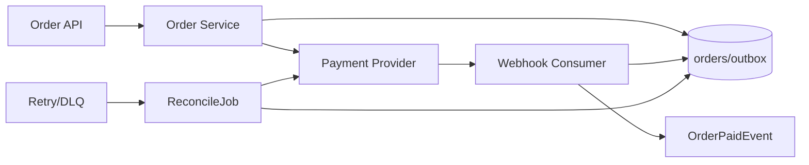
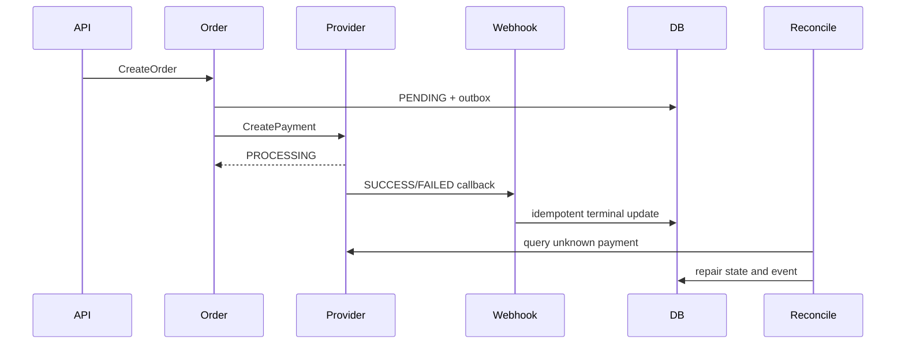

# Flow: 订单支付闭环

## 1. Flow Identity And Outcomes

- Flow ID: CF-ORDER-PAYMENT
- Criticality: critical
- Business outcome: 订单从创建进入可确认的支付业务终态。
- Success terminal: `PAID` with `OrderPaidEvent` recorded for delivery.
- Failure terminals: `FAILED`, `CANCELLED`, `PAYMENT_UNKNOWN`, `MANUAL_REVIEW`.

## 2. Flow Slice Coverage

| Flow ID | Slice ID | Path Kind | Action | Transition / Terminal | Evidence | Diagram IDs | Document Section | Coverage Status |
|---|---|---|---|---|---|---|---|---|
| CF-ORDER-PAYMENT | CF-ORDER-PAYMENT/S01 | main | create order and persist pending | new -> PENDING | `internal/order/handler.go#Create` | D-BOUNDARY, D-SEQUENCE | §3 | covered |
| CF-ORDER-PAYMENT | CF-ORDER-PAYMENT/S02 | branch | provider accepts asynchronous payment | PENDING -> PROCESSING | `internal/payment/client.go#CreatePayment` | D-SEQUENCE, D-STATE | §4 | covered |
| CF-ORDER-PAYMENT | CF-ORDER-PAYMENT/S03 | main | webhook applies provider success/failure | PROCESSING -> PAID/FAILED | `internal/payment/webhook.go#Handle` | D-SEQUENCE, D-STATE, D-ASYNC | §5 | covered |
| CF-ORDER-PAYMENT | CF-ORDER-PAYMENT/S04 | branch | duplicate webhook returns existing result | terminal unchanged | `internal/payment/webhook.go#provider_event_id` | D-STATE, D-ASYNC | §6 | covered |
| CF-ORDER-PAYMENT | CF-ORDER-PAYMENT/S05 | failure | callback retry exhausts into DLQ | PROCESSING -> PAYMENT_UNKNOWN | `config/kafka.yaml#payment_retry` | D-RECOVERY, D-ASYNC | §7 | covered |
| CF-ORDER-PAYMENT | CF-ORDER-PAYMENT/S06 | recovery | reconciler queries provider and repairs state/event | PAYMENT_UNKNOWN -> PAID/MANUAL_REVIEW | `internal/order/reconcile.go#Run` | D-SEQUENCE, D-RECOVERY | §8 | covered |
| CF-ORDER-PAYMENT | CF-ORDER-PAYMENT/S07 | branch | conditional cancel competes with late webhook | PROCESSING -> CANCELLED or PAID | `internal/order/cancel.go#Run` | D-STATE, D-RECOVERY | §9 | covered |

## 3. Core Flow Overview / Boundary — D-BOUNDARY



Covered Slice IDs: S01-S07. `OrderService` owns order truth; provider results are evidence, not direct DB ownership.

## 4. ASCII State Machine — D-STATE

```text
[PENDING] -> [PROCESSING] -> [PAID]
                 |             ^
                 +-> [FAILED]  |
                 +-> [PAYMENT_UNKNOWN] -> reconcile
                 +-> [CANCELLED]
late success may move PROCESSING/PAYMENT_UNKNOWN to PAID only through conditional update
terminal PAID/FAILED/CANCELLED cannot be overwritten by duplicate callbacks
```

Covered Slice IDs: S02-S07. The conditional update and provider-event idempotency protect terminal ownership.

## 5. Timeline / Sequence — D-SEQUENCE



Covered Slice IDs: S01-S06. `PROCESSING` is not a business terminal; webhook or reconciliation closes the flow.

## 6. Failure Recovery Timeline — D-RECOVERY

```text
T1 callback delivery fails
T2 retry topic retries with provider_event_id
T3 retries exhausted -> DLQ + PAYMENT_UNKNOWN
T4 ReconcileJob queries Provider
T5 conditional update -> PAID or MANUAL_REVIEW
T6 missing OrderPaidEvent is republished from durable state
```

Covered Slice IDs: S05-S07.

## 7. Async Message Topology — D-ASYNC

```text
Provider webhook -> consumer -> orders/outbox -> OrderPaidEvent
                         |
                         +-> retry topic -> DLQ -> ReconcileJob
```

Covered Slice IDs: S03-S06. Retry and DLQ are part of the payment closure, not an unrelated future topic.

## 8. 阶段与数据流转

| Stage | Owner | Input | Action | State Read / Written | Output | Evidence |
|---|---|---|---|---|---|---|
| create | OrderService | CreateOrder command | persist order and outbox intent | write `orders=PENDING` | order id | `internal/order/handler.go#Create` |
| provider request | Payment Adapter | order id / amount | create provider payment | read order, write provider reference | PROCESSING | `internal/payment/client.go#CreatePayment` |
| callback | Webhook Consumer | provider event | idempotent conditional terminal update | read event id, write PAID/FAILED | outbox event | `internal/payment/webhook.go#Handle` |
| recovery | ReconcileJob | PAYMENT_UNKNOWN order | query provider and repair state/event | write PAID/MANUAL_REVIEW | reconciliation record | `internal/order/reconcile.go#Run` |

## 9. 状态变化

| State Object | Before | Trigger | After | Persistence / Guard | Evidence |
|---|---|---|---|---|---|
| order | PENDING | provider accepts | PROCESSING | conditional version update | `internal/payment/client.go#CreatePayment` |
| order | PROCESSING | unique SUCCESS callback | PAID | `provider_event_id` + terminal guard | `internal/payment/webhook.go#Handle` |
| order | PROCESSING | retries exhausted | PAYMENT_UNKNOWN | retry metadata and DLQ record | `config/kafka.yaml#payment_retry` |
| order | PAYMENT_UNKNOWN | reconcile success | PAID | conditional terminal guard | `internal/order/reconcile.go#Run` |
| order | PROCESSING | cancel deadline | CANCELLED | update fails if late callback already wrote PAID | `internal/order/cancel.go#Run` |

## 10. 示例

Example trace: `order_id=ord-42`, `provider_event_id=evt-9`. The provider returns PROCESSING, the first callback delivery fails, retry succeeds, and the webhook writes PAID plus the durable paid event. This example is constructed from the synthetic evidence paths listed above.

## 11. 失败路径

| Failure Point | Symptom | Cause | Retry / Compensation / Degradation | User Visible? | Evidence |
|---|---|---|---|---|---|
| provider request | order remains PENDING | timeout before provider reference | retry only with idempotency key | pending result | `internal/payment/client.go#CreatePayment` |
| webhook delivery | PROCESSING does not close | callback delivery failure | retry topic then DLQ | delayed | `config/kafka.yaml#payment_retry` |
| reconciliation | PAYMENT_UNKNOWN remains | provider unavailable or contradictory | MANUAL_REVIEW | support action | `internal/order/reconcile.go#Run` |
| late callback/cancel | competing terminal writes | timing race | conditional update, no terminal overwrite | one final terminal | `internal/order/cancel.go#Run` |

## 12. 排障路径

Trace by `order_id`, `provider_event_id`, and outbox event id. Verify terminal-state conditional update, retry topic attempts, DLQ record, reconciliation result, and event delivery together. Do not inspect only the synchronous API response.

## 13. 变更指南

Changing callback semantics must update provider-event idempotency, terminal-state guards, reconciliation, outbox behavior, all five diagrams, and S03-S07 evidence.

## 14. 代码证据

| Claim | File / Symbol | Direction |
|---|---|---|
| order creation establishes pending truth | `internal/order/handler.go#Create` | API -> OrderService -> orders/outbox |
| callback owns normal terminal transition | `internal/payment/webhook.go#Handle` | Provider -> Consumer -> orders/outbox |
| reconciliation owns unknown-state recovery | `internal/order/reconcile.go#Run` | Job -> Provider -> orders/outbox |
| cancel cannot overwrite terminal payment | `internal/order/cancel.go#Run` | Job -> conditional order update |

## 15. 自检

- Completeness Hard Gate: PASS.
- Required Slice IDs: S01-S07 covered.
- Required Diagram IDs: D-BOUNDARY, D-STATE, D-SEQUENCE covered.
- Complexity-triggered Diagram IDs: D-RECOVERY, D-ASYNC covered.
- Known production-trace gap remains recorded without changing the structural reference result.
