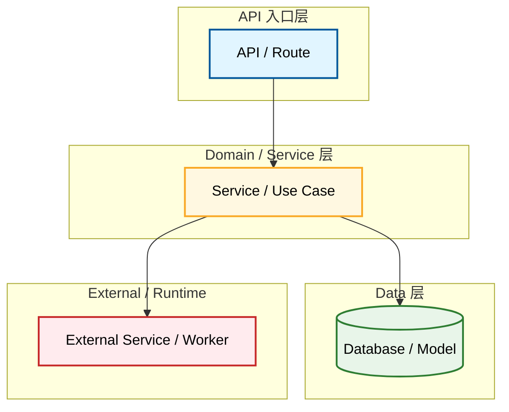

# Onboarding DB Templates

Use this before creating or updating `.agent-loop/onboarding-db/` documents.

Templates define understanding dimensions, not mandatory one-to-one physical files. Onboarding DB Layout Mode decides how many files carry those dimensions.

For new Deep Project Onboarding Scan output, default to `Expanded`. Use `Compact` or `Standard` only when the human explicitly requests fewer/simpler onboarding-db files, or when maintaining an existing onboarding-db already organized that way.

## Common Metadata

Every onboarding-db document must include these fields near the top:

```md
Document Language:
Created:
Last Updated:
Last Verified:
Confidence:
Source Evidence:
Human Review Status:
```

Optional fields:

```md
Freshness Window:
Verification Scope:
Maintainer:
Related Project Memory:
Related Diagrams:
```

Core review states:

```text
draft | reviewed | needs-review | stale
```

## Common Sections

Use this structure when it helps readability:

```md
## Purpose
## How To Read
## Key Facts
## Details
## Evidence
## Unknowns
## Update Rules
## Project Memory Backfill
```

Compact docs may combine `Evidence`, `Unknowns`, and `Project Memory Backfill` into short tables under each section only when Compact was human-requested or inherited from an existing onboarding-db.

## Human-Readable Format

Default shape:

```text
summary first -> tables -> diagrams -> evidence and unknowns
```

Use tables for comparisons, command lists, directories, modules, APIs, jobs, risks, and batch review. Use diagrams for cross-module, cross-process, stateful, or time-sequenced behavior.

Onboarding-db human-readable documents default to Chinese. Keep stable artifact names, file names, commands, API names, and code symbols in English/as-is. Use another language only when the human explicitly requests it or the target project has a strong documented language requirement.

## Onboarding DB Layout Mapping

| Layout | Template Strategy |
|---|---|
| Expanded | default for new Deep Scan; categorized docs with focused splits for modules, flows, runtime, domain, quality, deployment, security, observability, or decision history |
| Standard | human-requested or existing Standard; categorized docs with fewer focused splits; keep low-frequency topics combined |
| Compact | human-requested or existing Compact; combine related dimensions into fewer files |

Anti-misuse rules:

- Compact means fewer physical files, not less understanding. Keep all required dimensions as visible sections, tables, diagrams, evidence, confidence, unknowns, and reading paths.
- Standard is not "generate every template." Create only files justified by project reality, human goal, and the File Derivation tables.
- Expanded is not "one file per directory." Split only durable business/runtime modules, bounded contexts, complex flows, deployment/operations concerns, or repeated maintenance paths.
- Expanded is the default; do not downgrade to Compact or Standard just because the project appears small.
- Expanded minimum files are a floor, not a cap. After the minimum files exist, continue creating or proposing docs for every discovered core module, complex flow, complex entity, async/job path, deployment concern, and repeated maintenance path until the Discovery Coverage Matrix is closed.
- Human onboarding-db layout choice wins after risks are explained. If the human requests Compact or Standard, preserve all understanding dimensions and ask confirmation before writing.
- Onboarding-db layout reshaping requires Batch Human Review.
- Categorization is for reading, not for mirroring the repo tree. Keep onboarding-db at most two levels deep.
- Allowed depth exception: `domain/entities/<entity>.md` may be three levels under `onboarding-db/` because entity detail is a stable data-model subcategory. Do not generalize this exception to arbitrary nested module, flow, or directory mirrors.
- `module-map.md` is an index and navigation doc. Module detail belongs in `modules/<module>.md` when a dedicated module doc is warranted.
- Complex flow details belong in `flows/<flow>.md` when a single merged flow section becomes hard to read. Keep merged Compact sections only when the flow remains small and clearly navigable from README.
- Every diagram-bearing file must include both "How To Read" and "Step-by-Step Walkthrough". A diagram without walkthrough is incomplete even if the visual is correct.
- `diagrams/` directory is optional in all layouts. Default is to embed diagrams in their target docs (module, flow, data-model, entity). Create standalone `diagrams/<name>.md` only when a diagram is referenced by ≥ 2 docs or is too large (> 80 lines Mermaid) to embed comfortably.

Compact suggested files when human-requested or preserving existing Compact:

| File | Carries |
|---|---|
| `README.md` | reading guide, document index, module reading paths |
| `overview.md` | project purpose, users, stack, capabilities |
| `setup-and-run.md` | local setup, run, ports, quick verification |
| `code-map.md` | directories, entrypoints, module summary |
| `architecture-and-integrations.md` | boundaries, APIs, integrations, async/events |
| `flows-and-data.md` | core flows, jobs, data model, states |
| `verification-and-risks.md` | tests, change impact, risks, unknowns, glossary summary |

Standard may split when human-requested or preserving existing Standard:

```text
maps/module-map.md
maps/boundary-map.md
maps/directory-map.md
modules/<module>.md
flows/<flow>.md or core-flows.md
runtime/environment.md
runtime/async-and-events.md
runtime/jobs-and-schedules.md
domain/data-model.md
domain/entities/<entity>.md when a core entity needs its own reading path
quality/testing-and-verification.md
quality/risks-and-unknowns.md
```

Expanded default split:

```text
modules/<name>.md (copy from templates/onboarding-db/module-template.md) — mandatory for each core module
flows/<name>.md (copy from templates/onboarding-db/flow-template.md) — when flow crosses modules or has async/state changes
domain/data-model.md — mandatory when persistent data exists
domain/entities/<entity>.md — when entity is complex enough to need its own reading path
runtime/deployment-and-operations.md — when deployment/ops complexity justifies split
runtime/async-and-events.md — when queues, callbacks, workers exist
domain/security-and-permissions.md — when auth/permissions exist
quality/observability.md — when logs/metrics/traces exist
diagrams/<name>.md — optional; only when embedding is not enough
```

## Standard File Derivation

Onboarding-db layout does not require a direct template file for every topic. Use existing templates as source shapes, then split by this table. For new Deep Scan output, prefer Expanded-style standalone files when they create useful reading paths.

| Standard File | Derive From | Required Content |
|---|---|---|
| `maps/directory-map.md` | `code-map.md` or copy `templates/onboarding-db/directory-map.md` | main directories, generated/vendor/ignored areas, test directories, configs/scripts, read-first hints |
| `maps/module-map.md` | `code-map.md` + `module-template.md` module fields | module summary/cards, module relationship map, coverage, dedicated module-doc links, related diagrams |
| `maps/boundary-map.md` | `architecture-and-integrations.md` or copy `templates/onboarding-db/boundary-map.md` | UI/API/domain/DB/jobs/external boundaries, dependency direction, cross-boundary contracts, boundary risks |
| `core-flows.md` or `flows/<flow>.md` | `flows-and-data.md` + `flow-template.md` flow fields | flow index, human-readable core flow details, diagrams, state/data changes, verification hints, evidence chains |
| `runtime/environment.md` | `setup-and-run.md` + `deployment-and-operations.md` | env files, variables, local/test/prod differences, containers, CI/runtime config, evidence and confidence. **Not standalone in Expanded; merge into `setup-and-run.md`.** |
| `domain/data-model.md` | `flows-and-data.md` + `data-model.md` template fields | core entities, storage/model mapping, relationships, ownership, key fields, state fields, readers/writers, flow/API/job usage, migrations/seeds, tests, evidence |
| `runtime/async-and-events.md` | `architecture-and-integrations.md` + `flow-template.md` async fields | producers, queues/topics, consumers, callbacks, retries, DLQ/compensation, diagrams |
| `runtime/jobs-and-schedules.md` | `flows-and-data.md` + `flow-template.md` job fields | schedules, workers, triggers, operational notes, failure/retry behavior |
| `maps/change-impact-map.md` | `verification-and-risks.md` or copy `templates/onboarding-db/change-impact-map.md` | change categories, affected modules/files/APIs/data/tests, risk level, verification path. **Conditional in Expanded; create only when ≥ 3 core modules or change impact is repeatedly asked.** |
| `quality/testing-and-verification.md` | `verification-and-risks.md` | test systems, fast/full commands, E2E/browser path when present, baseline failures, confidence |
| `quality/risks-and-unknowns.md` | `verification-and-risks.md` | high-risk unknowns, doc/code conflicts, unverified commands, missing diagrams, follow-ups |
| `domain/glossary.md` | `verification-and-risks.md` glossary section | domain terms, Chinese meaning, English meaning, used-in context, synonyms/aliases including acronyms and naming conflicts, source evidence. **Conditional in Expanded; create only when ≥ 8 terms or naming conflicts exist.** |

When deriving a Standard file, keep the common metadata block, summary-first shape, evidence, confidence, unknowns, and project memory backfill section.

## Expanded File Derivation

Expanded onboarding-db layout is the default for new Deep Scan output, but it still splits only areas that are complex enough to deserve their own reading path.

| Expanded File | Use / Derive From | Required Content |
|---|---|---|
| `modules/<name>.md` | copy `templates/onboarding-db/module-template.md` | purpose, boundary, entrypoints, core call chain, core flows, key files, dependencies, tests, risks, evidence chain |
| `flows/<name>.md` | copy `templates/onboarding-db/flow-template.md` | purpose, diagram, quick notes, call-chain details, state changes, async/job/external behavior, verification, evidence chain, risks |
| `domain/data-model.md` | copy `templates/onboarding-db/data-model.md` when persistent data is important enough to split from Compact docs | core entity index, relationship map, ownership, key fields, state field index, usage, migrations, tests, evidence |
| `domain/entities/<entity>.md` | copy `templates/onboarding-db/entity-template.md` when one entity needs its own reading path | storage mapping, fields, relationships, state fields, writers, readers/consumers, related flows, migrations/history, tests, risks, evidence |
| `domain/state-flow-<entity>.md` | copy `templates/onboarding-db/state-flow-template.md` when legal lifecycle states matter | legal states, transitions, guards, side effects, evidence, tests |
| `domain/state-trace-<entity>.md` | copy `templates/onboarding-db/state-trace-template.md` when observed state writers matter | writers, triggers, guards, side effects, tests, evidence |
| `runtime/deployment-and-operations.md` | copy `templates/onboarding-db/deployment-and-operations.md` | environments, pipeline, runtime topology, release/rollback, migrations, health, observability |
| `domain/decisions-and-history.md` | copy `templates/onboarding-db/decisions-and-history.md` | evidenced architectural/product decisions and current status |
| `domain/security-and-permissions.md` | derive from `architecture-and-integrations.md` + module docs | auth boundaries, roles, policies, sensitive data, permission flows, evidence, unknowns |
| `quality/observability.md` | derive from `deployment-and-operations.md` | logs, metrics, tracing, alerts, health checks, error reporting, dashboards if evidenced |

Do not create one Expanded file per directory. Split by durable module, bounded context, complex business flow, async system, deployment concern, or repeated maintenance need.

**Conditional files in Expanded** (create only when triggered by project reality):

| Conditional File | Trigger | Template |
|---|---|---|
| `flows/<name>.md` | flow crosses ≥ 2 modules or has async/external/state changes | `flow-template.md` |
| `domain/entities/<entity>.md` | entity has many fields, complex state, multiple writers/readers | `entity-template.md` |
| `domain/state-flow-<entity>.md` | legal lifecycle states matter | `state-flow-template.md` |
| `domain/state-trace-<entity>.md` | need to trace who writes state | `state-trace-template.md` |
| `runtime/async-and-events.md` | queues, subscriptions, callbacks, workers exist | derive from architecture + flow-template async fields |
| `runtime/jobs-and-schedules.md` | cron, scheduler, background jobs exist | derive from flow-template job fields |
| `maps/change-impact-map.md` | ≥ 3 core modules or change impact is frequently asked | `change-impact-map.md` |
| `domain/glossary.md` | ≥ 8 domain terms or naming conflicts | `glossary.md` |
| `quality/observability.md` | logs, metrics, traces, alerts beyond basic health | derive from deployment-and-operations |
| `diagrams/<name>.md` | diagram referenced by ≥ 2 docs or > 80 lines Mermaid | `diagram.md` |

Never create a conditional file just because the template exists.

## README Requirements

`README.md` must include:

- document language and evidence
- project scope
- freshness status
- 10-minute reading path
- development reading path
- troubleshooting reading path
- async/jobs reading path when async, queues, callbacks, workers, or schedulers exist
- role-based reading paths when the project has distinct frontend, backend, operations, QA, or product readers
- module reading paths
- flow reading paths
- data-model reading path when persistent data exists
- document index
- diagrams index
- needs-review / stale / unknown items

Module reading path table:

| Module | Read First | Then Read | Core Call Chain | Useful For |
|---|---|---|---|---|

If the README lacks module reading paths, onboarding-db is not complete.

Data model reading path table:

| Entity | Meaning | Read First | Then Read | State Docs | Used By | Status |
|---|---|---|---|---|---|---|

If persistent data exists and the README lacks a data-model reading path, onboarding-db is usable but incomplete.

If async/jobs exist and README lacks an async/jobs reading path, onboarding-db is usable but incomplete.

Diagram index table:

| Diagram | Question Answered | Target Doc | Evidence Chain | Last Verified | Confidence |
|---|---|---|---|---|---|

**Diagram coverage check**: The diagrams index must also list modules/flows/entities that **do not yet have diagrams**, with a reason and planned action. If a core module, core flow, or complex entity is missing a diagram, onboarding-db is **usable but incomplete**.

**Diagram walkthrough check**: Every diagram indexed here must have a corresponding "Step-by-Step Walkthrough" in its target document. The walkthrough must be traceable from the diagram index (e.g., via target doc link). A diagram without walkthrough is incomplete even if the visual is present.

## Module Card

Core fields:

```md
## Module: <name>

Purpose:
Boundary:
Entrypoints:
Core Call Chain:
Core Flows:
Key Files:
Related Diagrams:
Evidence Chain:
Evidence:
Confidence:
```

**Diagram requirement**: `Related Diagrams` must list **all diagrams** for this module: at minimum one call-chain flowchart, plus sequence diagrams for async/external/callback interactions. A module card without diagrams is incomplete.

Optional fields:

```md
Depends On:
Called By:
Key Data:
Configuration:
Tests:
Risks:
```

Expanded-only fields:

```md
Operational Notes:
Runtime Ownership:
Deployment Unit:
Observed Failure Modes:
Related Decisions:
```

Do not invent fields. Use `Not found`, `Not applicable`, or `Unknown` when needed.

Core module rule:

- `module-map.md` should link to dedicated module docs for core modules when they have durable behavior, stable entrypoints, their own data/external dependencies, repeated maintenance need, or repeated feature impact.
- support-only areas may remain index-only with evidence.

## Complex Flow Docs

Use `flows/<flow>.md` when a business/runtime flow needs its own reading path. Do not keep complex flows as one row in `flows-and-data.md`.

Create or recommend `flows/<flow>.md` when:

- the flow crosses multiple durable modules or services
- async jobs, callbacks, queues, schedulers, retries, or compensation are part of the flow
- important state transitions or state writers are involved
- there are multiple API, command, job, or UI entrypoints
- the flow has meaningful failure paths or operational risks
- multiple tests or verification paths are needed to trust the flow
- humans repeatedly ask how the flow works

Do not create one flow doc per helper function, endpoint variant, or trivial CRUD path. Keep those in a flow index or Compact-equivalent section.

## Data Model And Entity Docs

Use `domain/data-model.md` for persistent data understanding. It is an index and relationship map, not a dump of every field.

Core fields for `domain/data-model.md`:

```md
## Core Entity Index
## Entity Relationship Map
## Relationships
## Ownership
## Key Fields
## State Field Index
## API / Flow / Job Usage
## Migrations / Seeds / History
## Tests
## Evidence Chain
## Risks / Unknowns
```

Create `domain/entities/<entity>.md` only when the entity needs its own reading path.

Create or recommend entity docs when:

- the entity has many fields or important derived fields
- the entity has complex state or lifecycle transitions
- multiple flows, APIs, jobs, or async consumers read or write it
- migrations/history/compatibility matter for future changes
- the human repeatedly asks about the entity

Do not create entity docs for simple lookup/config tables or join tables without business meaning. Keep those in `domain/data-model.md` with evidence and confidence.

Core fields for `domain/entities/<entity>.md`:

```md
## Purpose
## Storage Mapping
## Fields
## Relationships
## State Fields
## Writers
## Readers / Consumers
## Related Flows
## Migrations / History
## Tests
## Evidence Chain
## Risks / Unknowns
```

## Evidence Chain

Use Evidence Chain tables for key claims in module docs, flow docs, major state traces, async/job docs, and critical verification claims.

```md
## Evidence Chain

| File Path | Symbol / Object | Parameters / Fields | Description | Proves | Confidence |
|---|---|---|---|---|---|
```

Rules:

- do not write `source code`, `README`, or `scan result` alone for critical claims
- use real file paths and concrete symbols/objects when found
- use `Unknown`, `Not found`, or `Not applicable` when evidence is missing
- diagram nodes and edges should be traceable to an Evidence Chain entry in the same doc or target doc

## Deployment Template

Use `deployment-and-operations.md` when deployment is complex enough to stand alone.

Required sections:

```md
# Deployment And Operations

Document Language:
Last Verified:
Confidence:
Source Evidence:
Human Review Status:

## Deployment Overview
## Environments
## Deployment Pipeline
## Runtime Topology
## Release / Rollback
## Migrations / Seeds
## Health Checks
## Logs / Metrics / Tracing
## Operational Access
## Related Diagrams
## Evidence
## Unknowns
```

Tables:

| Environment | Runtime | Deploy Trigger | Config Source | URL / Entry | Owner | Evidence | Confidence |
|---|---|---|---|---|---|---|---|

| Step | Command / System | Working Directory | Preconditions | Rollback | Evidence | Confidence |
|---|---|---|---|---|---|---|

Never write real secrets or production connection strings.

## Decisions And History

Use this for why the project is shaped this way.

| Layout | Placement |
|---|---|
| Compact | section in `architecture-and-integrations.md` |
| Standard | `decisions-and-history.md` |
| Expanded | optional split into `design-decisions.md`, `architecture-history.md`, `technical-debt.md` |

Decision fields:

| Field | Meaning |
|---|---|
| Decision | what was decided |
| Context | constraints and situation |
| Alternatives | known alternatives |
| Why This Choice | reason, only if evidenced |
| Consequences | benefits and costs |
| Current Status | active / superseded / unknown |
| Evidence | docs, commit, issue, PR, code, or human confirmation |
| Confidence | high / medium / low |

Code can prove what exists now; it usually cannot prove why it was chosen. Ask the human when reason is unclear.

## Diagram Template

Use one generic template and set `Diagram Type`. Onboarding diagrams are flowchart-first.

````md
# Diagram: <name>

Document Language: 中文
Last Verified:
Diagram Type:
Question Answered:
Scope:
Source Evidence:
Confidence:
Human Review Status: draft

## Diagram



## How To Read

## Notes

## Unknowns
````

Allowed diagram types include:

```text
module-relationship
core-module-call-chain
boundary
core-flow
async-flow
job-flow
state-flow
api-call-flow
integration-flow
auth-flow
file-flow
failure-recovery
data-entity-map
deployment-map
change-impact-map
sequence-detail
```

Each diagram answers one question. Do not draw a whole repository.

Diagram priority:

| Priority | Use | Diagram Shape |
|---|---|---|
| P0 | newcomer overview, module/flow/boundary understanding | layered `flowchart TB/LR` |
| P1 | entity/state/async/deployment/change-impact understanding | focused flowchart / state diagram / ER-style graph |
| P2 | exact interaction order after overview exists | `sequenceDiagram` as a detail diagram |

Color convention:

| Class | Meaning |
|---|---|
| `user` | human, browser, client |
| `api` | API route, controller, UI action entry |
| `domain` | service, use case, domain logic |
| `task` | job, worker, scheduler, async consumer |
| `db` | database table, ORM model, persistent store |
| `external` | third-party service, object storage, remote runtime |
| `state` | status transition, failure state, manual gate |

Use `sequenceDiagram` **when a core module has async jobs, external APIs, callbacks, WebSocket, retry/compensation, or multi-service interactions**. Sequence diagrams are **mandatory** for these scenarios, not optional. For simple modules without async/external behavior, a flowchart is sufficient.

## Batch Review Template

```md
# Batch Human Review: <stage-or-topic>

| File / Item | Action | Change Summary | Source Evidence | Confidence | Affects Long-Term Memory | Suggested Action |
|---|---|---|---|---|---|---|
```

**Diagram coverage check** (add to every Architecture, Flows And Data, or targeted batch):

| Module / Flow / Entity | Required Diagrams | Has Diagram? | Diagram Type | How To Read? | Step-by-Step Walkthrough? | Action |
|---|---|---|---|---|---|---|

If any core module, core flow, or complex entity is missing a required diagram, flag it in the Batch Review and do not mark onboarding-db complete until resolved.

**Discovery coverage check** (add to every Deep Scan batch):

| Discovery Item | Required Doc / Diagram | Evidence | Status | If Skipped, Why | Action |
|---|---|---|---|---|---|

The Discovery Coverage Matrix prevents treating the minimum file set as a maximum. If a discovered durable module, complex flow, persistent data model, complex entity, async/job/event path, deployment/ops concern, verification system, or high-risk unknown has no matching document/diagram and no evidence-based skip reason, onboarding-db is usable but incomplete.

For onboarding-db batches:

| Batch | Typical Files |
|---|---|
| Project Basics | README, overview, setup/environment, code map |
| Architecture | modules, boundaries, APIs, integrations, async/jobs |
| Flows And Data | core flows, data model, state diagrams, flow diagrams |
| Verification And Risks | testing, change impact, risks, unknowns, glossary |
| Memory Backfill | `project.md` and `project/*.md` proposals |

## Minimum Completion Standard

Onboarding-db is complete only when:

- README has reading paths, module reading paths, data-model reading path, document index, and **diagrams index with coverage check**
- Discovery Coverage Matrix is closed for every discovered core module, complex flow, persistent data model, complex entity, async/job/event path, deployment/ops concern, verification system, and high-risk unknown
- overview explains purpose, users, stack, and capabilities
- setup/run path is usable or blocked with evidence
- code map tells where to start reading
- modules and boundaries are mapped
- **diagrams include module map, boundary map, at least one complete diagram per core module, sequence diagrams for async/external interactions, at least one core flow, and model usage flow map when persistent data exists**
- **all diagrams have "How To Read" notes and "Step-by-Step Walkthrough"**
- async/jobs/deployment/data are documented or marked not applicable/unknown
- tests and verification commands have confidence labels
- risks and unknowns are recorded
- important facts include evidence and confidence
- human review status is recorded

If not, call it usable but incomplete.
