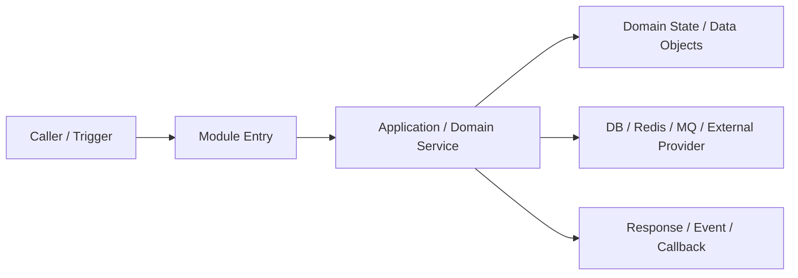
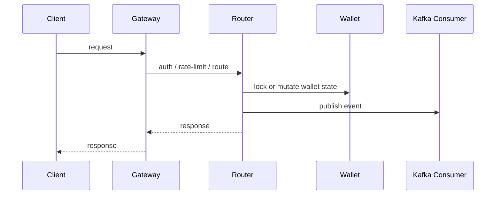

# Evidence-Graph + DDD Onboarding Knowledge Base

Use this stage when the human asks for newcomer-facing docs, durable project understanding, guided project takeover, or `.agent-loop/onboarding-db/` construction.

This is not Project Entry Scan. Project Entry Scan serves agent execution and safe continuation. Onboarding Knowledge Base serves newcomer learning, operational support, and future Agent understanding.

Markdown is the source of truth. A website is only a generated reading experience and is out of scope unless the human starts a separate website feature.

## Entry Rules

Enter only after one of these is true:

- Project Entry Scan is complete;
- reliable `.agent-loop/project.md` exists and current code reality has been checked enough for the requested scope;
- stale memory has been reconciled enough to avoid building docs from false claims.

If project memory is missing, stale, contradictory, or too thin, recommend Project Entry Scan or recovery first.

If existing `.agent-loop/onboarding-db/` files use an old layout, treat them as legacy evidence. Read them when useful, but do not refresh old layouts directly. Migration or replacement requires an accepted Onboarding Spec, Onboarding Tasks, and Full Execution Gate.

## Core Principles

- `project.md` serves Agent execution; `onboarding-db` serves project understanding.
- The first onboarding artifact is Evidence Graph, not README.
- Onboarding Spec is a production spec for future Agents; write it as executable instructions, not prose inspiration.
- Onboarding Tasks split documentation into reviewed batches.
- Module and Flow docs default to single long files: `02-modules/<module-name>.md` and `03-flows/<flow-name>.md`.
- Split a module/flow into a directory only when justified by size, independent subdomains, frequent separate updates, or explicit human request.
- Use Mermaid flowchart / sequenceDiagram for normal flow and sequence diagrams; use ASCII 文本图 / 纯文本线框图 for state machines, complex principle diagrams, and complex examples.
- When older docs say ASCII wireframe, interpret it as “choose the diagram format that best explains the boundary, state, and timing,” not as a generic stacked box.
- 状态图优先。每个正式 onboarding 文档至少包含架构/边界图和 ASCII 状态图 / 状态机图，用来讲清楚结构边界和状态怎么变化。
- 模块和流程文档默认还必须包含 Timeline / 时序图，用来讲清楚流程怎么跑，并在流程讲解中引入相关数据模型。
- Do not default complex flows to a stacked box diagram. stacked box diagram / 阶段堆叠图 is only acceptable for simple layer summaries.
- Mermaid flowchart / sequenceDiagram can be the main diagram for normal flow and timing; ASCII remains preferred for state-machine / decision diagrams and complex examples.
- Default narrative language is Chinese; preserve code symbols, file paths, commands, API paths, env vars, config keys, error messages, and third-party product names.
- 全部正式文档默认使用中文；只有代码符号、路径、命令、API、配置键、错误信息和第三方产品名保持原文。
- Human examples are quality/detail references only. Do not copy their topic list, count, domain names, or project structure.
- Full Execution Gate 确认后 Agent 可以全盘执行。人类先确认 Onboarding Spec，Agent 再写 Onboarding Tasks；人类另行确认 Full Execution Gate 后，Agent 可以一次性创建计划内的完整 onboarding-db 并连续写完能写透的文档。
- batch 是 Agent 的组织和 review 单位，不是人类闸门。不要把 batch 当成每批都需要人类再次授权的暂停点，除非计划变更、证据不足、权限/环境阻塞或人类明确要求暂停。
- 可以一次性创建计划内的完整 onboarding-db，但每个落盘文件必须是内容型文档。禁止空目录、薄 README、planned/later 占位文件、TBD/待补充文件，或用文件数量假装完整。
- 写不透但有证据可推断的内容，应尽量写出并标明“推断”、证据、置信度和待验证点；只有完全搞不明白或缺少关键证据时，才在 `coverage-matrix.md` / `onboarding-tasks.md` 标记 planned / blocked / missing evidence，而不是创建薄文档占位。
- Do not submit docs with unresolved placeholders such as `<...>`, `TBD`, `TODO`, `待补充`, empty required table rows, or vague “see code / 看代码” evidence.
- Coverage tracks topic readiness, not file count.

## Required Information Architecture

Default layout:

```text
.agent-loop/onboarding-db/
  README.md
  onboarding-spec.md
  onboarding-tasks.md
  coverage-matrix.md
  batch-review.md

  00-overview/
    system-context.md
    architecture-map.md
    code-organization.md
    learning-path.md
    glossary.md

  01-domain/
    domain-map.md
    bounded-contexts.md
    aggregates-and-entities.md
    domain-events.md
    cross-domain-data-flow.md

  02-modules/
    <module-name>.md

  03-flows/
    <flow-name>.md

  04-jobs-and-async/
    cronjobs.md
    consumers.md
    callbacks.md
    async-tasks.md

  05-infra/
    dependencies.md
    config.md
    storage-cache-mq.md
    observability.md
    security-license.md

  06-deploy/
    environments.md
    startup-order.md
    test-env.md
    runbooks.md

  07-change-guides/
    add-provider.md
    change-billing.md
    change-apikey-quota.md
    change-wallet.md
    change-runtime.md

  08-review/
    evidence-graph.md
    open-questions.md
    human-review-summary.md
```

This layout is a planning target. After the human accepts the Onboarding Spec, the agent writes Onboarding Tasks. Only after the human separately accepts their Full Execution Gate may the agent create the full planned tree and write all planned docs in one continuous execution pass, as long as each created file is content-rich and evidence-backed. If a planned topic cannot yet be written with meaningful content, keep it in `coverage-matrix.md` / `onboarding-tasks.md` instead of creating an empty or thin file.

## Phase 1: Evidence Graph

Before writing formal onboarding docs, create or update:

```text
08-review/evidence-graph.md
```

Evidence Graph is a code-backed inventory, not a summary. It must identify:

- deployable units;
- bounded-context candidates;
- module candidates;
- flow candidates;
- data object inventory;
- async / job / callback inventory;
- infra / dependency inventory;
- high-risk areas;
- unknowns.

Evidence Graph must also include at least one relationship wireframe / dependency map for non-trivial projects. The graph may be ASCII, but it must show cross-module ownership and flow direction, for example gateway → router → provider → charge → wallet → DB/MQ. A table-only Evidence Graph is not enough for multi-module or multi-service projects.

Evidence quality gate:

- each candidate module / flow / data object must include concrete evidence with file path, symbol/function/class/config key when available, and confidence;
- claims without concrete evidence stay in `Unknowns` and must not enter the formal Module Plan or Flow Plan;
- examples must come from real tests, fixtures, API contracts, logs, configs, or code-constructed objects; if no real example exists, mark it as unknown instead of inventing one.

Minimum sections:

```md
# Evidence Graph

## Deployable Units
| Unit | Entry | Config | Depends On | Called By | Evidence | Confidence |

## Bounded Context Candidates
| Context | Modules | Core Objects | Responsibilities | Evidence | Confidence |

## Module Candidates
| Module | Why It Is A Module | APIs | Data Objects | Use Cases | Evidence | Confidence |

## Flow Candidates
| Flow | Trigger | Participants | State Changes | External Dependencies | Evidence | Risk |

## Relationship Wireframe
```text
┌──────────┐    ┌──────────┐    ┌──────────┐
│ caller   │───▶│ gateway  │───▶│ service  │
└──────────┘    └──────────┘    └──────────┘
                    │               │
                    ▼               ▼
              ┌──────────┐    ┌──────────┐
              │ cache/mq │    │ database │
              └──────────┘    └──────────┘
```

## Data Object Inventory
| Object | Kind | Owner | Key Fields / State | Used By | Evidence |

## Async / Job / Callback Inventory
| Name | Trigger | Consumer / Handler | State Changed | Retry / Compensation | Evidence |

## Infra / Dependency Inventory
| Dependency | Kind | Used By | Purpose | Config Source | Failure Symptom | Evidence |

## High-Risk Areas
| Area | Why Risky | Evidence | Required Docs |

## Unknowns
| Question | Why It Matters | Evidence Missing | Human Needed? |
```

If evidence is missing, mark confidence and unknowns. Do not invent.

## Phase 2: Onboarding Spec

After Evidence Graph, write:

```text
onboarding-spec.md
```

This is the production spec for future Agents. It must define:

- target readers: newcomer developer, technical support, operational support, future Agent;
- scope: whole project or focused area;
- module plan;
- flow plan;
- DDD bounded-context plan;
- jobs / async / callback plan;
- infra / deploy plan;
- gateway / runtime plan when the project uses Nginx, OpenResty, ingress, API gateway, reverse proxy, sidecar, or runtime routing scripts;
- default file strategy: module/flow single long files first;
- split-directory triggers;
- architecture/boundary + ASCII state + Timeline/sequence diagram rules;
- document quality gates;
- batch plan;
- non-goals;
- human confirmation questions.

Use this gate sequence:

```text
Evidence Graph -> accept Onboarding Spec -> write Onboarding Tasks -> accept Full Execution Gate -> formal docs
```

Onboarding Spec acceptance authorizes writing `onboarding-tasks.md`; it does not authorize formal module, flow, infra, deploy, or change-guide docs. After Tasks exist, present their exact outputs, evidence requirements, scope, and Full Execution Gate for a separate human decision.

Do not create formal docs unless all are true:

- Onboarding Spec is accepted;
- planned docs and execution scope are recorded in `onboarding-tasks.md`;
- the Full Execution Gate in `onboarding-tasks.md` is explicitly accepted.

After Full Execution Gate acceptance, the agent should execute the plan autonomously until the planned onboarding package is complete, paused by a real blocker, or a scope/quality issue requires human review.

## Phase 3: Onboarding Tasks

After spec approval, write:

```text
onboarding-tasks.md
```

Rules:

- split tasks by batch, not by full tree generation;
- each batch covers a coherent set of topics; batch size is an execution/review pacing tool, not a human approval boundary;
- each task lists output path, evidence required, and quality gate;
- present the completed task ledger and Full Execution Gate for explicit human acceptance before formal-doc execution;
- after the Full Execution Gate is accepted, create and complete all planned docs that can be written with meaningful evidence-backed content;
- do not create thin planned files for topics that are still unknown; track those topics in `coverage-matrix.md` and `onboarding-tasks.md`;
- every batch updates `coverage-matrix.md` and `batch-review.md`.

## Phase 4: Batch Implementation

### Module Docs

Default path:

```text
02-modules/<module-name>.md
```

Required sections:

```md
# Module: <module-name>

## 1. 模块定位
## 2. 图解
## 3. Bounded Context / DDD 视角
## 4. 核心用例
## 5. 领域模型
## 6. 数据对象
## 7. 信息传递
## 8. API / Events / Jobs
## 9. 状态流转
## 10. 失败模式
## 11. 工作原理与示例
## 12. 验证和排障
## 13. 关键代码索引
## 14. 变更指南
```

Minimum content:

- at least one Architecture / Boundary Diagram, using Mermaid flowchart or ASCII as appropriate;
- at least one ASCII state diagram / state-machine diagram;
- at least one Timeline / sequence diagram that explains how the module flow runs over time;
- a process narrative that introduces referenced data models while explaining the flow;
- 工作原理与示例 section with 关键机制, principle / example diagram, and evidence-backed examples;
- example trace with diagram when the module has non-trivial state or data movement;
- every diagram has an explanation. 每张图必须带讲解: what to look at, what conclusion the diagram supports, which data objects / state fields / messages / configs appear, and the concrete code evidence;
- for apikey / token / credential modules, explain key 生成、hash/加密存储、脱敏展示、权限 scope、过期/轮换/吊销、泄露处置、审计日志;
- at least 3 core use cases unless Evidence Graph proves fewer;
- domain object table;
- data object table that separates proto/API objects, DB models, DTO/internal structs, config objects, events/messages, and external objects;
- inbound / outbound information transfer;
- state transitions;
- failure, retry, compensation, or degradation behavior;
- verification and troubleshooting path;
- concrete code evidence.

### Flow Docs

Default path:

```text
03-flows/<flow-name>.md
```

Required sections:

```md
# Flow: <flow-name>

## 1. 用例
## 2. 架构/边界图
## 3. ASCII 状态图 / 状态机图
## 4. Timeline / 时序图
## 5. 阶段说明
## 6. 数据流转
## 7. 状态变化
## 8. 示例
## 9. 失败路径
## 10. 排障路径
## 11. 变更指南
## 12. 代码证据
```

Every flow must include trigger, participants, ASCII Architecture / Boundary Diagram, ASCII state diagram / state-machine diagram, Timeline / sequence diagram, phase explanation, data transfer, state change, success path, failure path, retry/compensation/degradation, example request/object, troubleshooting path, change guide, and code evidence. 流程讲解时顺带解释涉及的数据模型 so the reader learns objects through the running flow instead of from a detached list.

Examples must be evidence-backed. Prefer real tests, fixtures, API contracts, logs, configs, or code-constructed request/event objects. If an example is inferred, label it as inferred and explain the evidence gap.

For billing, wallet, quota, apikey, order, balance-related, or message-retry flows, include consistency / idempotency / compensation details: idempotency key, transaction boundary, retry behavior, reconciliation path, and how to inspect mismatched state.

For gateway/runtime flows involving Nginx, OpenResty, ingress, API gateway, reverse proxy, sidecar, or runtime routing scripts, include route matching, header propagation, auth/rate-limit behavior, timeout/retry/upstream behavior, and access/error log fields.

## Diagram Rules

Any content-bearing onboarding-db document must include the required diagram set for its document type. Content-bearing means formal onboarding docs that teach project behavior, such as overview, architecture, code organization, domain, module, flow, jobs/async, infra, deploy, runtime, and change-guide docs.

Explicitly exempted docs are control/review artifacts such as `onboarding-spec.md`, `onboarding-tasks.md`, `coverage-matrix.md`, `batch-review.md`, `08-review/evidence-graph.md`, `08-review/open-questions.md`, and `08-review/human-review-summary.md`. If a planned content doc cannot reasonably include the required diagram set, record the explicit exemption and reason in the Diagram Plan before writing that doc.

状态图优先；每个正式 onboarding 文档至少包含架构/边界图和 ASCII 状态图 / 状态机图。模块文档默认必须包含架构/边界图、ASCII 状态图、Timeline / 时序图。流程文档默认必须包含架构/边界图、ASCII 状态图、Timeline / 时序图。Timeline / 时序图 is required by default for module and flow docs because onboarding must explain how the process runs over time. Sequence and flow diagrams may use Mermaid because normal Markdown Mermaid is easier to read for calls and flowcharts. State machine diagrams and complex example diagrams should use ASCII because they often need compact annotations, recovery branches, and data-object notes. List state diagrams and timeline/sequence diagrams before optional supporting diagrams in planning and review so Agent does not default to detached static inventories. Choose extra diagram types by need; do not force every topic into one stacked box.

Every diagram must have an explanation. 每张图必须带讲解，否则读者只能猜图在表达什么。The explanation must state what to look at, what conclusion the diagram supports, which data objects / state fields / messages / configs appear, and the concrete code evidence behind the diagram.

Recommended diagram types:

| Diagram Type | 中文名称 | Use When |
|---|---|---|
| Architecture / Boundary Diagram | 架构/边界图 / ASCII 架构图 / Mermaid flowchart | module location, boundaries, inbound/outbound, ownership, component relations, Redis key layout, wallet type structure, gateway / DB / MQ dependency |
| ASCII State Machine / Decision Diagram | ASCII 状态机图 / 状态机/决策图 | state transition, validation decision, lock/Lua/Kafka/Rollback paths, retry/compensation |
| Timeline / Sequence Diagram | Timeline / 时序图 / Mermaid sequenceDiagram / 纯文本时序图 | required by default for module and flow docs; ordered interactions, request/response, async publish/consume, retry windows, delayed consistency |
| ASCII Swimlane Diagram | ASCII 泳道图 | optional supporting diagram when roles/systems are important and the reader must see who owns each action |
| Timeline Diagram | 时间线图 | incident recovery, retry windows, delayed consistency, callback/reconciliation history |

Required diagram set:

1. 架构/边界图：先讲模块在哪、结构边界、组件关系、数据/依赖位置；可用 Mermaid flowchart 或 ASCII，选择更清楚的格式。
2. ASCII 状态图 / 状态机/决策图：再讲状态怎么变、异常怎么恢复。
3. Timeline / 时序图：对 module / flow 默认必填，讲流程按时间怎么跑、谁先读写什么、哪个阶段引入哪些数据模型；优先用 Mermaid sequenceDiagram，必要时可用纯文本时序图。

Optional supporting diagrams:

1. ASCII 泳道图：当责任归属、跨角色协作或多系统所有权会影响理解时补充。
2. Timeline Diagram：当故障恢复、回调重试、对账窗口或延迟一致性是核心时补充。
3. 原理机制图 / 示例图：当模块内部核心原理、算法、配额/计费/路由选择、锁/事务/缓存/MQ 配合需要讲解时补充。

Use Architecture / Boundary Diagram for module structure. Mermaid flowchart is acceptable and often clearer for normal Markdown readers; ASCII is still allowed when it expresses boundaries better. Module architecture diagrams may use layered boxes, but they must show inbound/outbound boundaries, dependency direction, state ownership, and DB / Redis / MQ / external-provider boundaries. Flow docs must not use vertical stacked stage boxes as the main explanation. Mermaid flowchart example:



ASCII Architecture / Boundary Diagram example:

```text
┌─────────────────────────────────────────────────────────────┐
│ <Module / Flow Name>                                         │
├─────────────────────────────────────────────────────────────┤
│ Inbound / Trigger                                            │
│  - caller -> entry                                           │
├─────────────────────────────────────────────────────────────┤
│ Application / Domain Services                                │
│  - service / handler / use case                              │
├─────────────────────────────────────────────────────────────┤
│ Domain State / Data Objects                                  │
│  - aggregate / entity / value object                         │
├─────────────────────────────────────────────────────────────┤
│ Persistence / Infrastructure                                 │
│  - DB / Redis / MQ / storage / external provider             │
├─────────────────────────────────────────────────────────────┤
│ Outbound / Side Effects                                      │
│  - response / event / callback / report                      │
└─────────────────────────────────────────────────────────────┘
```

Use ASCII 状态机/决策图 for state and exception recovery. Example:

```text
[Start]
  |
  v
[Validate Input] --invalid--> [Reject + No State Change]
  |
  v
[Acquire Lock] --fail--> [Retry / Return Busy]
  |
  v
[Apply Lua / Txn] --partial--> [Compensate / Reconcile]
  |
  v
[Publish Event] --fail--> [Persist Pending + Retry]
  |
  v
[Done]
```

Use Timeline / 时序图 to explain how the module or flow runs from trigger to final state. The narrative around this diagram should introduce referenced data models, state objects, messages, records, and config as they appear in the flow. Mermaid sequenceDiagram is preferred for normal sequence/call timing. Example:



Plain-text sequence remains acceptable when Mermaid is less readable because the diagram needs dense annotations:

```text
Client        Gateway        Router        Wallet        Kafka Consumer
  |              |             |             |                 |
  | request      |             |             |                 |
  |------------->|             |             |                 |
  |              | auth/rate   |             |                 |
  |              |------------>|             |                 |
  |              |             | lock wallet |                 |
  |              |             |------------>|                 |
  |              |             | publish evt |                 |
  |              |             |----------------------------->|
  |              | response    |             |                 |
  |<-------------|<------------|             |                 |
```

Use Timeline Diagram when timing windows matter. Example:

```text
T1 request accepted
T2 wallet locked
T3 charge event publish failed
T4 pending record observed by reconciler
T5 compensation/retry completes
```

Use ASCII 原理机制图 / 示例图 for core principles when a module’s internal behavior is not obvious from the main flow. The example must be evidence-backed or marked as inferred.

普通 flowchart such as `A --> B --> C` is not sufficient as the main diagram because it hides module boundaries, data ownership, and state changes.

Mermaid usage:

- Use Mermaid `sequenceDiagram` for normal Timeline / 时序图.
- Use Mermaid `flowchart` for normal flow diagrams and architecture/boundary flowcharts.
- Use Mermaid `erDiagram` for entity relationship if it reads better than a table.
- Prefer ASCII, not Mermaid, for state-machine / decision diagrams and complex principle/example diagrams that need recovery branches, annotations, or data-object notes.

## DDD Mapping

Even if the project is not written in strict DDD, use DDD language to explain ownership and change:

- Bounded Context;
- Aggregate / Entity;
- Value Object;
- Domain Service;
- Repository;
- External Adapter;
- Domain Event / Async Message;
- State Machine.

Explain “who owns truth”, “who changes state”, and “who is only an adapter”.

## Content Gates

### Forbidden Thin Content

Do not submit docs that only say:

- “wallet handles balance”;
- “provider does protocol conversion”;
- “router calls provider then charge”;
- “check logs when it fails”;
- file lists without behavior;
- TODO placeholders;
- generic A→B→C charts.

### Use Case Gate

Each use case must include:

- trigger;
- caller;
- input object;
- domain objects touched;
- state changes;
- output;
- failure path;
- code evidence.

### Data Object Gate

Each data object table must include:

- owner;
- meaning;
- key fields;
- state semantics;
- read/write path;
- evidence.

### Failure Mode Gate

Each failure mode must include:

- symptom;
- likely cause;
- first thing to inspect;
- key log / field / request id / order id;
- retryability;
- human-confirmation need;
- code evidence.

## Coverage Matrix

`coverage-matrix.md` tracks topic readiness:

```md
| Topic | Type | Doc Path | Score | Status | Missing Evidence | Next Action |
```

Status values:

- discovered;
- planned;
- in-progress;
- draft;
- needs-review;
- newcomer-ready;
- stale;
- blocked-by-unknown;
- not-applicable.

Topic types:

- overview;
- domain;
- module;
- flow;
- jobs-async;
- infra;
- deploy;
- change-guide.

## Review Score

Every batch must score changed topics:

| Dimension | Meaning |
|---|---|
| Required diagram set present | required architecture/boundary + state + timeline/sequence set is present unless explicitly exempted |
| Architecture diagram clarity | boundaries, dependency direction, state ownership, and infra/data boundaries are visible |
| State diagram clarity | state changes, decisions, failures, retries, and recovery paths are understandable |
| Timeline / sequence clarity | the reader can follow the flow over time and see where data models appear |
| Use case completeness | use cases explain real behavior |
| Data object completeness | proto/DB/DTO/config/event/external objects are separated |
| State transition clarity | state changes are understandable |
| Code evidence | concrete files/symbols/behavior support claims |
| Evidence granularity | key claims include file path, symbol/config key, and direction of call/data flow |
| Example authenticity | examples come from tests, fixtures, API contracts, logs, configs, or code-constructed objects |
| Failure troubleshooting | failures are actionable |
| Consistency / gateway risk | idempotency, compensation, reconciliation, gateway routing, timeout, retry, and log fields are covered where applicable |
| Change guidance | future changes have safe reading/verification path |
| Newcomer readability | a newcomer can read continuously |

Rules:

- below 4/5 cannot be `newcomer-ready`;
- below 3/5 must enter next batch or be `blocked-by-unknown`;
- review must record gaps and next action.

## Guided Use / Focused Update

When onboarding-db exists and the human asks a project-understanding or operational-support question:

Focused Update is available only when the existing onboarding-db already follows an accepted Evidence-Graph + DDD Onboarding Spec and has the current Evidence Graph, Tasks, and review structure. Legacy layouts remain evidence-only and require the migration gate defined in Entry Rules.

1. Read `README.md`, `coverage-matrix.md`, and relevant module / flow docs.
2. Check code reality for stale claims before relying on them.
3. Answer directly in Chinese unless requested otherwise.
4. If current-format docs are thin, stale, or contradictory, propose a focused update. If the layout is legacy, propose an Onboarding Spec migration instead.
5. Focused update touches only relevant module / flow / review docs.
6. Do not rerun full onboarding by default.

## Project Memory Boundary

- `project.md` stores current state, index, stable facts, and next suggested action.
- onboarding-db stores newcomer understanding, onboarding spec, tasks, and reviews.
- Do not write temporary TODO, future backlog, or unconfirmed requirements into `project.md`.
- If onboarding discovers stable project facts missing from project memory, recommend Project Memory Update.
- If code changes stale onboarding docs, mark coverage `stale` or `needs-refresh`.

## Completion Gate

Do not call onboarding complete unless:

- Project Entry Scan or reliable project memory exists;
- Evidence Graph exists;
- Onboarding Spec was accepted;
- Onboarding Tasks exist for completed and next batches;
- current batch files contain architecture/boundary diagrams, ASCII state diagrams, Timeline/sequence diagrams for module/flow docs, use cases, data objects, state transitions, failure modes, code evidence, and verification/troubleshooting where applicable;
- coverage matrix records all discovered core topics;
- changed topics were scored;
- low score / low-score topics are not marked newcomer-ready;
- batch review records evidence read, gaps, scores, and next batch;
- no unresolved placeholders, empty required rows, `TBD`, `TODO`, `待补充`, or vague “see code / 看代码” evidence remain in submitted batch files;
- human has reviewed or explicitly paused the current batch.

Exit with exactly one recommended next action: next onboarding batch, focused update, Project Memory Update, Code-Guided Operational Support, Decision & Design If Needed, Product Brief If Needed, Feature Spec, Pause, or Close Onboarding Work.
