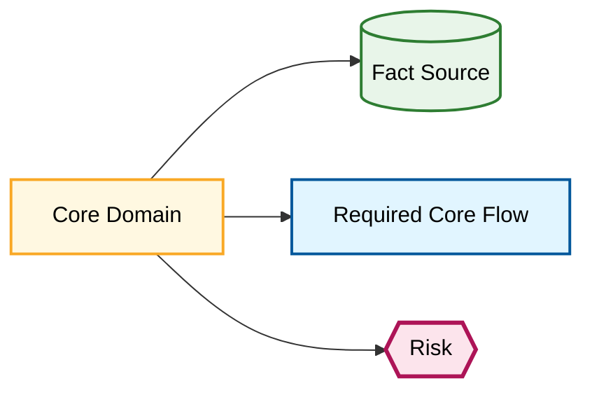

# Core Domain Inventory

Document Language: 中文
Created:
Last Updated:
Last Verified:
Confidence:
Source Evidence:
Human Review Status: draft

## Purpose

从 Evidence Graph 中识别项目核心领域、事实源和高风险边界。不要只按目录名判断领域是否核心。

## Core Domain Table

| Domain | Graph Node ID | Why Core | Owning Services / Modules | Main Flows | Core Data | Fact Source | Risks | Evidence | Confidence | Completion Status |
|---|---|---|---|---|---|---|---|---|---|---|

## Required-Core Signals

- 涉及收入、金额、余额、账单、扣费、退款、手续费。
- 涉及权限、身份、API Key、租户、用户组、折扣。
- 涉及主请求路径、provider 调用、usage 生成、配额、限流。
- 涉及异步一致性、外部回调、状态回写、生产稳定性。
- 人类经常询问或新功能经常修改。

## Domain Relationship Map

## Unknowns / Review Points

| Domain | Unknown | Why It Blocks / Does Not Block | Evidence Needed | Suggested Next Action |
|---|---|---|---|---|
