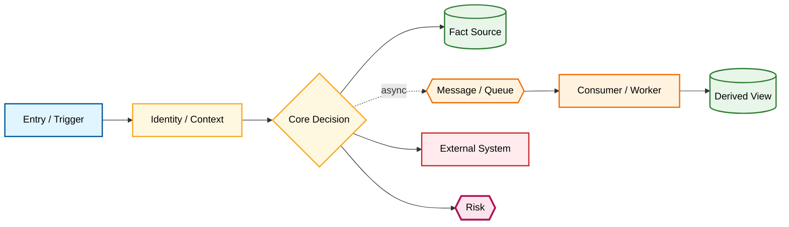
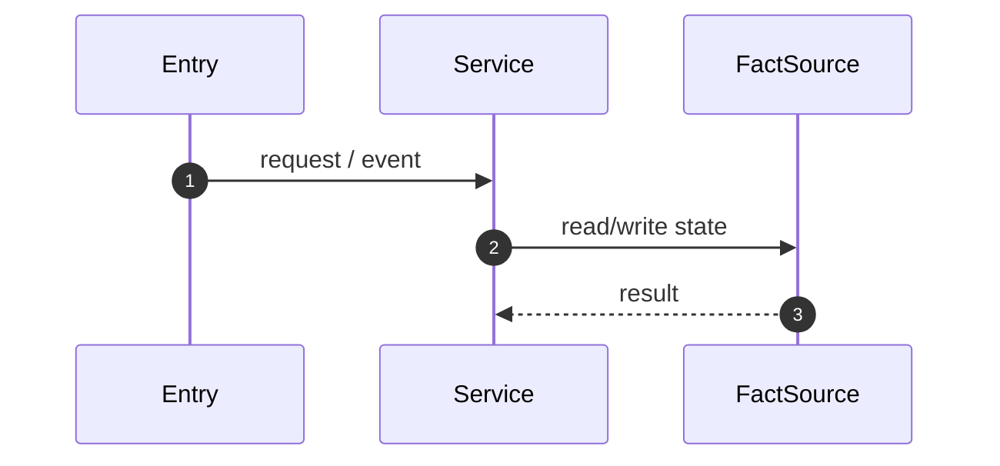

# Core Flow Deep Trace: <flow-name>

Document Language: 中文
Created:
Last Updated:
Last Verified:
Graph Node ID:
Core Role: required-core
Completion Status: graph-only | needs-deep-trace | newcomer-ready | blocked-by-unknown
Confidence:
Source Evidence:
Human Review Status: draft

## Purpose / Business Meaning

## Scope

| Included | Excluded | Why |
|---|---|---|

## Colored Flowchart

HTML/SVG auxiliary visual artifacts cannot replace markdown evidence tables, Mermaid source, or deep trace docs.

## How To Read

## Step-by-Step Walkthrough

1.

## Sequence Diagram Or Not-Applicable Reason

Use `sequenceDiagram` when the flow has async jobs, external APIs, callbacks, WebSocket, retry/compensation, or multi-service interactions. If not applicable, explain why.

## Main Flow Quick Notes

## Code Evidence Trace Table

| Step ID | Branch | Service | File | Symbol | Input | State Read | State Write | External Call / Message | Failure Path | Verification / Observability |
|---|---|---|---|---|---|---|---|---|---|---|

Rules:

- `Step ID` must be stable (`S1`, `S2a`, `S2b`) so Concrete Example can reference it.
- Use `unknown` only when evidence is actually missing, and then update Coverage Matrix.
- Do not replace file/symbol evidence with generic summaries.

## Data Flow And Fact Source

| Data / State | Fact Source | Reader | Writer | Redis / Cache / Topic | Evidence | Confidence | Completion Status |
|---|---|---|---|---|---|---|---|

## State / Money / Permission Changes

| Object / Field | Before | After | Writer Step | Guard / Condition | Side Effect | Evidence | Completion Impact |
|---|---|---|---|---|---|---|---|

## Branch And Failure Matrix

| Branch | Trigger | Expected State / Data | Retry / Idempotency | User Impact | Evidence | Verification | Completion Impact |
|---|---|---|---|---|---|---|---|

## Async / External Behavior

| Boundary | Producer / Caller | Consumer / Callee | Message / Request | Retry / Timeout / Compensation | Evidence | Confidence |
|---|---|---|---|---|---|---|

## Reading Order

| Order | File / Symbol | Why Read This | Related Step | Next |
|---|---|---|---|---|

## Concrete Example Linked To Trace Steps

Use one realistic example and link each sentence to `Step ID` rows, especially for money, permission, state, async, retry, and compensation steps.

1.

## Verification And Observability

| Check / Signal | Command / Log / Metric / Test | Trace Step | What It Proves | Evidence | Confidence |
|---|---|---|---|---|---|

## Risks And Change Impact

| Risk | Why It Matters | Affected Steps | Change Impact | Mitigation / Verification |
|---|---|---|---|---|

## Open Questions / Blockers

| Question / Blocker | Affected Step | Needed Evidence | Owner | Completion Impact |
|---|---|---|---|---|

## Coverage Matrix Update

| Coverage Item | Previous Status | New Status | Evidence | Follow-up |
|---|---|---|---|---|
