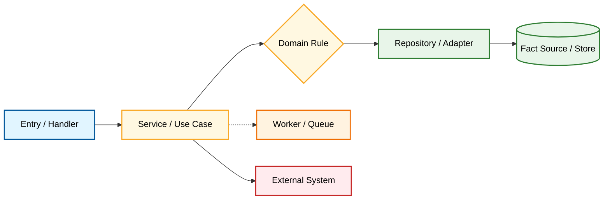

# Core Module Deep Dive: <module-name>

Document Language: 中文
Created:
Last Updated:
Last Verified:
Graph Node ID:
Core Role: required-core
Completion Status: graph-only | needs-deep-trace | newcomer-ready | blocked-by-unknown
Confidence:
Source Evidence:
Human Review Status: draft

## Purpose

## Module Role Vocabulary

| Role | yes/no | Evidence | Notes |
|---|---|---|---|
| fact-source | | | owns durable truth for data/state |
| orchestrator | | | coordinates use cases / flows |
| adapter | | | wraps external systems or infrastructure |
| cache | | | stores derived or temporary state |
| derived-view | | | summary/report/materialized view |
| supporting | | | helper-only, does not own core behavior |

## Role In Core Domains

| Domain | Module Responsibility | Not Responsible For | Fact Source? | Related Flows | Evidence | Confidence |
|---|---|---|---|---|---|---|

## Boundary

| In Scope | Out Of Scope | Evidence | Confidence |
|---|---|---|---|

## Entrypoints

| Entrypoint | Type | File | Symbol | Input | Output / Side Effect | Evidence | Confidence |
|---|---|---|---|---|---|---|---|

## Core Call Chain Diagram

## How To Read

## Step-by-Step Walkthrough

1.

## Core Interaction Sequence Diagram Or Not-Applicable Reason

## Internal Call Chain

| Step ID | File | Symbol | Input | State Read | State Write | External / Async | Failure Path | Evidence | Confidence |
|---|---|---|---|---|---|---|---|---|---|

## Owned Data / Fact Source

| Data / State | Ownership | Table / Model / Key / Topic | Readers | Writers | Evidence | Completion Status |
|---|---|---|---|---|---|---|

## Config / Dependencies

| Dependency / Config | Direction | Purpose | Required For Startup? | Evidence | Confidence |
|---|---|---|---|---|---|

## Related Core Flows

| Flow | Module Role | Deep Trace Doc | Trace Steps | Completion Status |
|---|---|---|---|---|

## Async / Jobs / External

| Boundary | Trigger | Message / Request | Retry / Idempotency | Compensation | Evidence | Confidence |
|---|---|---|---|---|---|---|

## Concrete Examples

| Example | Related Flow | Trace Steps | What It Teaches |
|---|---|---|---|

## Tests / Verification / Observability

| Check | Command / Test / Log / Metric | What It Proves | Evidence | Confidence |
|---|---|---|---|---|

## Risks / Change Impact

| If You Change | Likely Impact | Check These Files / Tests | Risk | Evidence |
|---|---|---|---|---|

## Reading Order

| Order | File / Symbol | Why Read This | Next |
|---|---|---|---|

## Evidence Chain

| File Path | Symbol / Object | Parameters / Fields | Description | Proves | Confidence |
|---|---|---|---|---|---|

## Coverage Matrix Update

| Coverage Item | Previous Status | New Status | Evidence | Follow-up |
|---|---|---|---|---|
