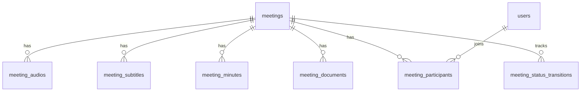

# Data Model

Document Language: 中文
Created:
Last Updated:
Last Verified:
Confidence:
Source Evidence:
Human Review Status: draft

## Purpose

Explain the project's durable business entities, storage/model mapping, relationships, data ownership, key fields, state fields, read/write paths, migrations, and tests.

## Core Entity Index

| Entity | Business Meaning | Storage / Model | Owning Module | Detail Doc | Key Fields | Confidence |
|---|---|---|---|---|---|---|

## Entity Relationship Map

**Deep Scan 下画完整的实体关系图**。包含所有核心实体、关键字段、关系类型（1:1、1:N、N:M）、外键约束。如果项目很大，用 subgraph 分组或分页画多张图，但每个核心实体都要出现在图中。不能只画一个"核心子集"。

## Model Usage Flow Map

**展示哪些核心流程、API、后台任务在哪些步骤调用/读写哪些实体**。这张图把"业务流程"和"数据实体"连起来，让人一眼看出"这个实体在什么时候被谁用"。

```mermaid
flowchart TB
    subgraph Flows["核心业务流程"]
        F1["Flow: 会议上传音频"]
        F2["Flow: ASR 生成字幕"]
        F3["Flow: 纪要生成"]
        F4["Flow: 文档解析"]
    end

    subgraph APIs["API 入口"]
        A1["POST /meetings"]
        A2["POST /meetings/{id}/minutes/generate"]
        A3["POST /meetings/{id}/documents"]
    end

    subgraph Jobs["后台任务"]
        J1["audio_tasks: process_audio"]
        J2["subtitle_tasks: handle_asr"]
        J3["minutes_tasks: generate_minutes"]
        J4["document_tasks: parse_document"]
    end

    subgraph Entities["核心实体"]
        E1[(Meeting)]
        E2[(MeetingAudio)]
        E3[(MeetingSubtitle)]
        E4[(MeetingMinutes)]
        E5[(MeetingDocument)]
    end

    F1 --> E1
    F1 --> E2
    F2 --> E1
    F2 --> E3
    F3 --> E1
    F3 --> E4
    F4 --> E1
    F4 --> E5

    A1 --> E1
    A2 --> E4
    A3 --> E5

    J1 --> E2
    J2 --> E3
    J3 --> E4
    J4 --> E5

    classDef flow fill:#e1f5ff,stroke:#01579b,stroke-width:2px,color:#000
    classDef api fill:#fff8e1,stroke:#f9a825,stroke-width:2px,color:#000
    classDef job fill:#fff3e0,stroke:#ef6c00,stroke-width:2px,color:#000
    classDef entity fill:#e8f5e9,stroke:#2e7d32,stroke-width:2px,color:#000

    class F1,F2,F3,F4 flow
    class A1,A2,A3 api
    class J1,J2,J3,J4 job
    class E1,E2,E3,E4,E5 entity
```

## How To Read This Map

- **流程（蓝色）**：端到端业务流程，箭头表示"该流程会操作这个实体"
- **API（黄色）**：同步 API 入口，箭头表示"该 API 会读写这个实体"
- **任务（橙色）**：后台异步任务，箭头表示"该任务会读写这个实体"
- **实体（绿色）**：持久化数据实体
- 对于详细的 CRUD 操作（创建/读取/更新/删除），见下面的 API/Flow/Job Usage 表格

## Relationships

| From | To | Relationship | Direction | Delete / Cascade Risk | Evidence | Confidence |
|---|---|---|---|---|---|---|

## Ownership

| Entity | Creates | Updates | Deletes / Archives | Reads / Consumes | Evidence | Confidence |
|---|---|---|---|---|---|---|

## Key Fields

| Entity | Field | Meaning | Type / Shape | Why Important | Evidence | Confidence |
|---|---|---|---|---|---|---|

## State Field Index

| Entity | State Field | State Flow Doc | State Trace Doc | Writers | Evidence | Confidence |
|---|---|---|---|---|---|---|

## API / Flow / Job Usage

| Entity | Used By | Usage Type | Related Doc | Evidence | Confidence |
|---|---|---|---|---|---|

## Migrations / Seeds / History

| File Path | Change / Seed | Affected Entity | Meaning | Evidence | Confidence |
|---|---|---|---|---|---|

## Tests

| Entity / Relationship | Test File / Command | What It Proves | Evidence | Confidence |
|---|---|---|---|---|

## Evidence Chain

| File Path | Symbol / Object | Parameters / Fields | Description | Proves | Confidence |
|---|---|---|---|---|---|

## Risks / Unknowns

| Item | Why It Matters | Evidence | Suggested Follow-Up |
|---|---|---|---|

## Project Memory Backfill

| Candidate Fact | Backfill Target | Reason | Evidence | Confidence |
|---|---|---|---|---|
