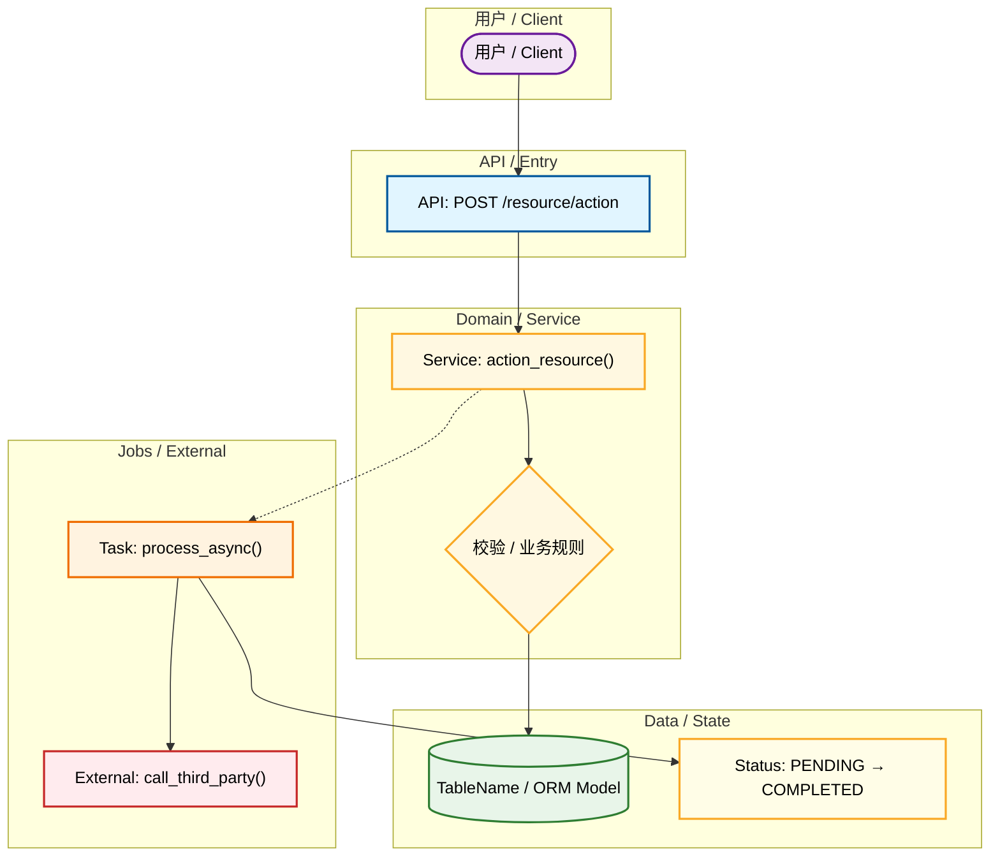
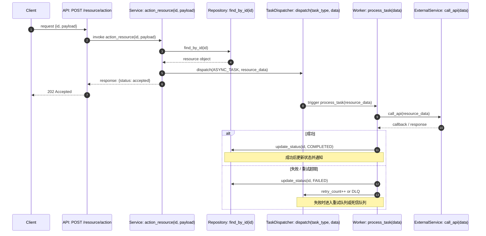

# Diagram: <name>

Document Language: 中文
Last Verified:
Diagram Type:
Question Answered:
Scope:
Source Evidence:
Confidence:
Human Review Status: draft

## Diagram Style Guide

All onboarding diagrams must follow this unified style. Deep Scan diagrams should be as complete as possible.

### Flowchart Style

- **Layer separation**: Use `subgraph` to separate layers:
  - `UserLayer` — human, browser, client
  - `APILayer` — API route, controller, WebSocket handler
  - `DomainLayer` — service, use case, domain logic
  - `DataLayer` — database, ORM model, cache, file storage
  - `RuntimeLayer` — job, worker, queue, scheduler
  - `ExternalLayer` — third-party service, object storage, remote runtime
- **Color classes** (mandatory when 4+ node types):
  - `user` (#f3e5f5 / purple) — human/client
  - `api` (#e1f5ff / blue) — API entry
  - `domain` (#fff8e1 / yellow) — business logic
  - `task` (#fff3e0 / orange) — async job/worker
  - `db` (#e8f5e9 / green) — database/persistent store
  - `external` (#ffebee / red) — external service
  - `state` (#fffde7 / amber) — status transition, failure state
- **Node shapes**:
  - API/Route: `"POST /path"` (rounded rectangle, `api` color)
  - Service/UseCase: `"Service: method()"` (rectangle, `domain` color)
  - Domain Rule / Branch: `{"check permission"}` (diamond, `domain` color, only for decisions)
  - Database/Model: `[(TableName / Model)]` (cylinder, `db` color)
  - Job/Worker: `"Task: task_name()"` (rounded rectangle, `task` color)
  - External Service: `"External: api_name()"` (rounded rectangle, `external` color)
  - State/Status: `"Status: PENDING"` (rounded rectangle, `state` color)
- **Arrows**:
  - Synchronous call: `-->` (solid)
  - Async trigger / callback: `-.->` (dashed)
  - Data return: `-->>` (implied bidirectional, or add note)
- **Naming**: Node labels must contain **specific names**. Use `POST /meetings/{id}/generate` instead of `API`. Use `MinutesService.generate()` instead of `Service`.

### Sequence Diagram Style

- **Participant naming**: `participant X as "Layer: SpecificName()"`
  - Example: `participant API as "API: POST /meetings/{id}/generate"`
  - Example: `participant S as "Service: generate_minutes(id)"`
- **Message format**: `Source->>Target: action(param)` with specific function and key params
- **Auto-numbering**: Use `autonumber` for all sequence diagrams
- **Notes**: Use `Note over X,Y:` or `Note right of X:` for key conditions, exceptions, retry policies
- **Async callback**: Dashed line `-->>` with label `async callback`
- **Branches**: Use `alt` / `else` / `end` for success/failure paths

### Diagram Naming Convention

- Module call chain: `module-<name>-call-chain`
- Module sequence: `module-<name>-sequence`
- Flow overview: `flow-<name>-overview`
- Data entity relationship: `data-entity-relationship`
- Model usage flow: `model-usage-flow`
- Entity lifecycle: `entity-<name>-lifecycle`

## Diagram

## Sequence Diagram Example

Use this for async callbacks, WebSocket lifecycles, external API interactions, retry/compensation, or any scenario where exact call order matters.

## How To Read

**Every diagram must include a "How To Read" section.** Explain:
1. What question this diagram answers
2. What each color means
3. What each shape means
4. What solid vs dashed arrows mean
5. How to trace a specific path through the diagram

If a diagram lacks "How To Read", it is considered incomplete.

## Notes

## Evidence Chain

| Node / Edge | File Path | Symbol / Object | Parameters / Fields | Description | Confidence |
|---|---|---|---|---|---|

## Unknowns

| Item | Why It Matters | Evidence | Suggested Follow-Up |
|---|---|---|---|
