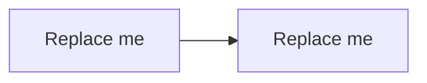

# Diagram: <name>

Document Language:
Last Verified:
Diagram Type:
Question Answered:
Scope:
Source Evidence:
Confidence:
Human Review Status: draft

## Diagram

## How To Read

## Notes

## Unknowns
