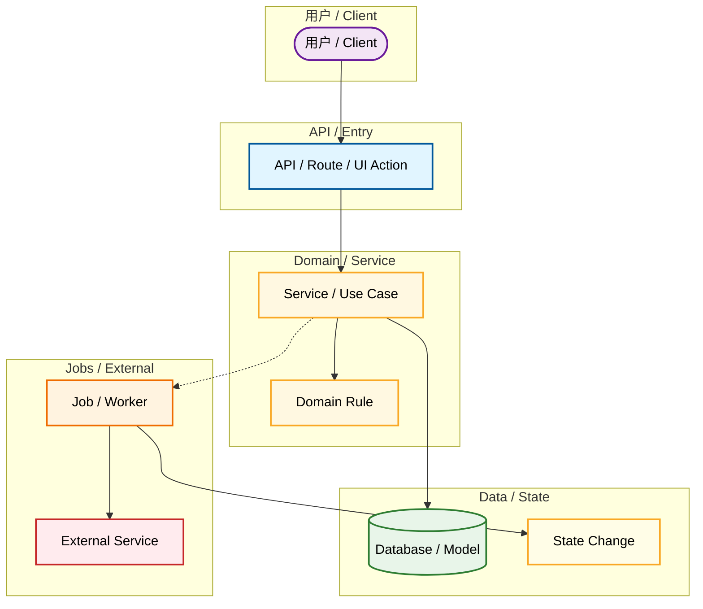

# Diagram: <name>

Document Language: 中文
Last Verified:
Diagram Type:
Question Answered:
Scope:
Source Evidence:
Confidence:
Human Review Status: draft

## Diagram

Onboarding diagrams are flowchart-first. Use `sequenceDiagram` only for narrow interaction details after a module/process flowchart already exists.

## How To Read

## Notes

## Evidence Chain

| Node / Edge | File Path | Symbol / Object | Parameters / Fields | Description | Confidence |
|---|---|---|---|---|---|

## Unknowns

| Item | Why It Matters | Evidence | Suggested Follow-Up |
|---|---|---|---|
