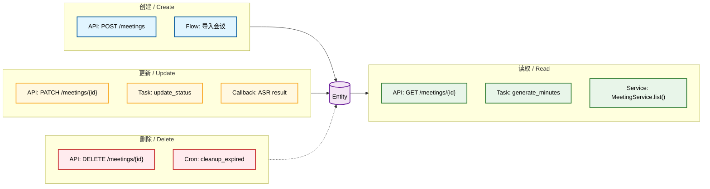

# Entity: <entity>

Document Language: 中文
Created:
Last Updated:
Last Verified:
Confidence:
Source Evidence:
Human Review Status: draft

## Purpose

Explain what business object this entity represents, why it matters, and which modules or flows depend on it.

## Storage Mapping

| Storage / Model | File Path | Symbol / Object | Table / Collection / DTO | Evidence | Confidence |
|---|---|---|---|---|---|

## Fields

| Field | Type / Shape | Meaning | Required? | Sensitive? | Writer | Reader / Consumer | Evidence | Confidence |
|---|---|---|---|---|---|---|---|---|

## Sensitive Data & Compliance

**标记本实体的敏感字段，防止 agent 在新功能中意外暴露 PII 或违反合规要求。**

| Field | Sensitive Type | Encryption At Rest | Encryption In Transit | Masking Rule | Retention | Compliance | Evidence | Confidence |
|---|---|---|---|---|---|---|---|---|
| | PII / password / token / financial | yes / no / partial | yes / no | 全掩码 / 部分掩码 / 不掩码 | 保留天数 | GDPR / 等保 / PCI | | |

**数据访问审计**：
- 谁可以读取敏感字段：
- 审计日志位置：
- 数据脱敏策略：

## Relationships

| Related Entity | Relationship | Direction | File / Field | Risk | Evidence | Confidence |
|---|---|---|---|---|---|---|

## State Fields

| Field | States | State Flow Doc | State Trace Doc | Evidence | Confidence |
|---|---|---|---|---|---|

## Writers

| Writer | Trigger | File Path | Function / Object | Parameters / Fields | What It Changes | Evidence | Confidence |
|---|---|---|---|---|---|---|---|

## Readers / Consumers

| Reader / Consumer | File Path | Function / Object | Parameters / Fields | Why It Reads | Evidence | Confidence |
|---|---|---|---|---|---|---|

## Related Flows

| Flow | Entity Role | Flow Doc | Evidence | Confidence |
|---|---|---|---|---|

## Entity Lifecycle Flow Map

**展示这个实体被谁创建（Create）、读取（Read）、更新（Update）、删除/归档（Delete/Archive）**。把每个能操作该实体的 flow、API、job、service 都画出来，用不同颜色区分操作类型。



## How To Read This Lifecycle

- **创建（蓝色）**：哪些 API/Flow/Job 会创建这个实体的新记录
- **读取（绿色）**：哪些模块会查询/读取这个实体
- **更新（黄色）**：哪些操作会修改该实体的字段或状态
- **删除（红色）**：哪些操作会删除或归档该实体
- **虚线箭头（-.->）**：软删除或归档操作
- 每个节点应包含具体的 API 端点、任务名或服务方法名

## Step-by-Step Walkthrough: Entity Lifecycle

```text
1. 【创建】用户调用 `POST /meetings`（蓝色，创建节点）创建实体的新记录
2. 【创建】或系统通过"导入会议"流程批量创建实体（蓝色，创建节点）
3. 【读取】用户调用 `GET /meetings/{id}`（绿色，读取节点）查询单个实体详情
4. 【读取】生成纪要任务 `generate_minutes`（绿色，读取节点）读取实体以生成摘要
5. 【读取】`MeetingService.list()`（绿色，读取节点）批量读取实体列表
6. 【更新】用户调用 `PATCH /meetings/{id}`（黄色，更新节点）修改实体字段
7. 【更新】后台任务 `update_status`（黄色，更新节点）自动更新实体状态
8. 【更新】ASR 回调结果（黄色，更新节点）异步更新实体的字幕字段
9. 【删除】用户调用 `DELETE /meetings/{id}`（红色，删除节点）删除实体
10. 【删除】定时任务 `cleanup_expired`（红色，删除节点，虚线箭头）软删除或归档过期实体
```

## Migrations / History

| File Path | Change | Why It Exists | Compatibility Note | Evidence | Confidence |
|---|---|---|---|---|---|

## Tests

| Test File / Command | What It Proves | Related Field / Writer / Flow | Evidence | Confidence |
|---|---|---|---|---|

## Evidence Chain

| File Path | Symbol / Object | Parameters / Fields | Description | Proves | Confidence |
|---|---|---|---|---|---|

## Risks / Unknowns

| Item | Why It Matters | Evidence | Suggested Follow-Up |
|---|---|---|---|

## Project Memory Backfill

| Candidate Fact | Backfill Target | Reason | Evidence | Confidence |
|---|---|---|---|---|
