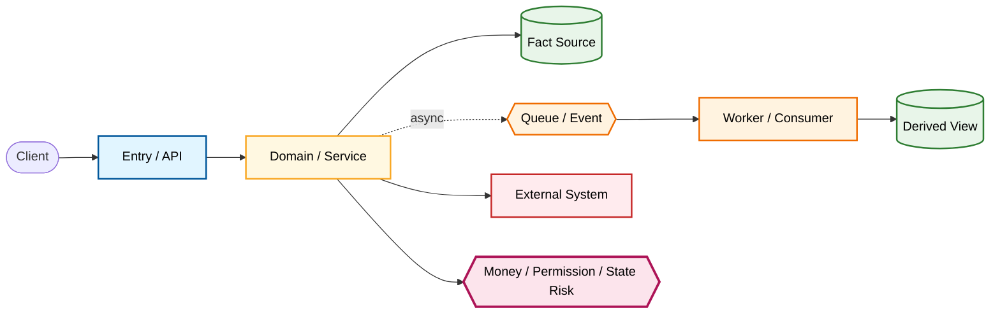

# Evidence Graph

Document Language: 中文
Created:
Last Updated:
Last Verified:
Confidence:
Source Evidence:
Human Review Status: draft

## Purpose

Evidence Graph 是 onboarding 的骨架。它把服务、入口、领域、流程、数据、状态、运行配置、外部依赖和风险点连接起来，后续 Deep 或 Targeted onboarding 必须沿这些证据继续补深。

## Status Model

| Status Category | Values | Meaning |
|---|---|---|
| Confidence | high / medium / low | 证据可靠度，不表示完成 |
| Completion Status | discovered / graph-only / needs-deep-trace / newcomer-ready / supporting-summary / blocked-by-unknown / not-applicable | onboarding 完成度 |
| Human Review Status | draft / reviewed / needs-human-review / rejected | 人类审核状态 |
| Core Role | required-core / supporting / unknown-core / not-core | 是否影响 Deep complete |

## Node Table

| Node ID | Type | Name | Scope | Owner / Fact Source | Core Role | Evidence | Confidence | Completion Status | Notes |
|---|---|---|---|---|---|---|---|---|---|

Node type examples: Service, Entrypoint, Module / Package, Domain, Flow, Data Entity, State Field, Storage, Message / Event, External System, Config / Runtime, Risk.

## Edge Table

| Edge ID | Source Node ID | Edge Type | Target Node ID | Direction | Sync / Async | Trigger / Condition | Data / State | Evidence Path | Symbol / Config | Risk | Required For Complete | Confidence |
|---|---|---|---|---|---|---|---|---|---|---|---|---|

Edge type examples: calls, publishes, consumes, reads, writes, owns, derives, configures, verifies, risks.

## Colored Mermaid Overview

## How To Read

1. 先读 `required-core` 和 `unknown-core` 节点。
2. 再读 `Required For Complete = yes` 的边。
3. 如果事实源、状态写入者、表/字段、Redis key、Kafka topic、callback route、验证或观测方式是 unknown，必须进入 Coverage Matrix。

## Unknowns / Follow-up

| Unknown | Affected Node / Edge | Why It Matters | Owner / Evidence Needed | Completion Impact |
|---|---|---|---|---|
