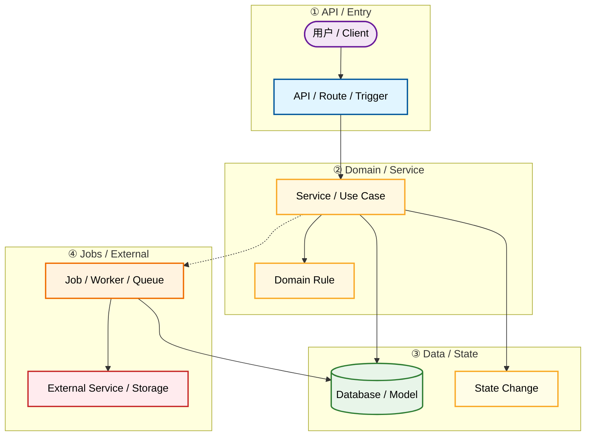

# Flow: <name>

Document Language: 中文
Created:
Last Updated:
Last Verified:
Confidence:
Source Evidence:
Human Review Status: draft

## Purpose

## One Diagram To Understand The Flow

Use a small layered flowchart that answers one flow question. Do not start with a sequence diagram. Use `sequenceDiagram` only later for a narrow interaction detail after this flowchart exists.



## How To Read

```text
这张流程图回答什么问题：
1. 这个业务/运行流程从哪里进入，从哪里结束。
2. 请求经过哪些 API、Service、Domain、Data、Job、External 节点。
3. 哪些步骤是同步，哪些步骤是异步或外部副作用。

怎么看：
- 先从最左或最上方的入口节点开始。
- 按箭头顺序阅读主路径。
- 虚线表示异步、任务、队列或延后处理。
- 对照 Call Chain Details 查看文件、函数、参数和证据。
```

## Step-by-Step Walkthrough

```text
1. 用户 / Client（UserLayer，紫色）发起动作，触发 API / Route / Trigger（API 层，蓝色）
2. API 入口接收请求，同步调用 Service / Use Case（Domain 层，黄色）
3. Service 执行 Domain Rule 业务规则（Domain 层，黄色）
4. 业务规则校验通过后，Service 同步写入 Database / Model（Data 层，绿色）
5. Service 同步更新 State Change（Data 层，绿色）
6. Service 异步触发 Job / Worker / Queue（Runtime 层，橙色，虚线箭头）
7. Worker 同步调用 External Service / Storage（External 层，红色）
8. Worker 同步回写 Database / Model（Data 层，绿色）
9. 流程结束，最终状态或副作用已产生
```

## Main Flow Quick Notes

```text
Start
-> entrypoint receives request or trigger
-> service or use case applies business rule
-> state is written or job is triggered
-> async / external steps if any
-> final state or side effect
```

## Call Chain Details

| Stage | Trigger | File Path | Function / Object | Parameters / Fields | What It Does | Next Step | Evidence | Confidence |
|---|---|---|---|---|---|---|---|---|

## API Entrypoints

| API / Route | Method | File Path | Handler / Object | Request Fields | Response / Side Effect | Evidence | Confidence |
|---|---|---|---|---|---|---|---|

## Task / Job Entrypoints

| Task / Job | Trigger | Queue / Scheduler | File Path | Function / Object | Parameters / Fields | Retry / Recovery | Evidence | Confidence |
|---|---|---|---|---|---|---|---|---|

## Module / Service Responsibility Boundaries

| Module / Service | Responsibility In This Flow | Not Responsible For | Evidence | Confidence |
|---|---|---|---|---|

## Key State Changes

| Object / Entity | Field | Transition | Writer | Trigger / Guard | Side Effects | Evidence | Confidence |
|---|---|---|---|---|---|---|---|

## Retry / Compensation / Failure Paths

| Failure / Delay | Where It Happens | Retry / Compensation | User / System Impact | Evidence | Confidence |
|---|---|---|---|---|---|

## SLA & Limits

**记录这个流程的运行时约束。agent 改流程逻辑前必须知道超时预算和并发上限，否则容易引入级联故障。**

| Stage | Timeout | Max Retry | Concurrency Limit | Circuit Breaker | Rate Limit | Evidence | Confidence |
|---|---|---|---|---|---|---|---|
| 入口 (API / Trigger) | | | | | | | |
| 业务处理 (Service) | | | | | | | |
| 数据写入 (DB) | | | | | | | |
| 异步任务 (Job / Worker) | | | | | | | |
| 外部调用 (External) | | | | | | | |

**整体流程 SLA**：
- 端到端最大允许时间：
- 同步接口最大响应时间：
- 异步任务最大完成时间：
- 降级策略（当外部服务不可用时）：

## Code Reading Order

| Order | File / Symbol | Why Read This | Next |
|---|---|---|---|

## Common Misunderstandings

| Misunderstanding | Correct Reading | Evidence |
|---|---|---|

## Verification Hints

| Check | Command / File / Scenario | What It Proves | Evidence | Confidence |
|---|---|---|---|---|

## Evidence Chain

| File Path | Symbol / Object | Parameters / Fields | Description | Proves | Confidence |
|---|---|---|---|---|---|

## Risks And Unknowns

| Item | Why It Matters | Evidence | Confidence | Suggested Follow-Up |
|---|---|---|---|---|

## Project Memory Backfill

| Candidate Fact | Backfill Target | Reason | Evidence | Confidence |
|---|---|---|---|---|
