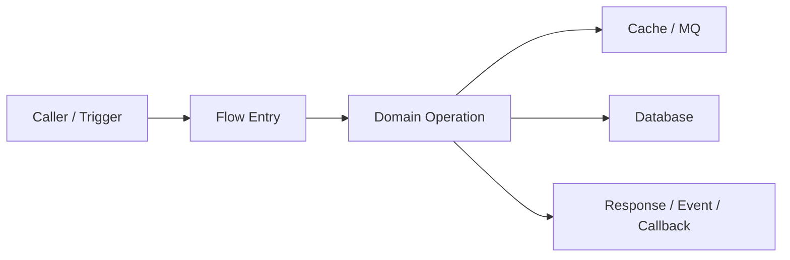
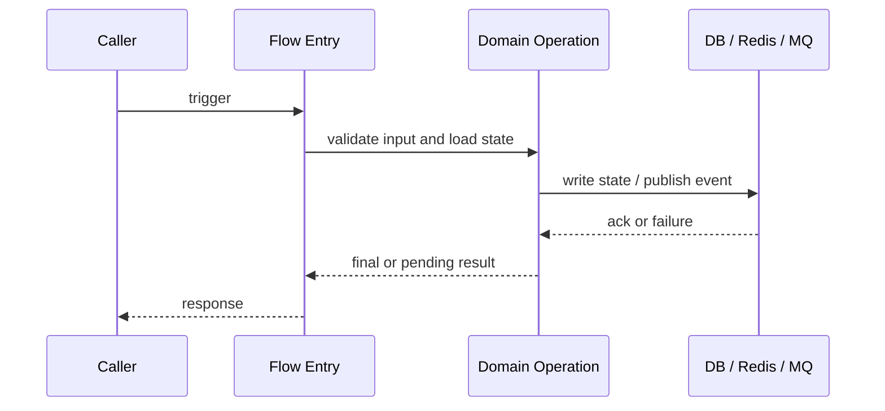

# Flow: <flow-name>

不要只写 A→B→C。状态图优先：每个流程文档默认必须有架构/边界图、ASCII 状态机/决策图、Timeline / 时序图。架构/边界图讲流程在哪些模块/系统之间发生，状态图讲状态怎么变，Timeline / 时序图讲流程怎么跑。Mermaid flowchart / sequenceDiagram 可用于普通流程图和时序图；状态机图、复杂示例图优先用 ASCII。流程讲解时顺带解释涉及的数据模型、状态对象、消息、记录和配置。需要表达恢复窗口时补 Timeline Diagram。不要用 stacked box diagram / 阶段堆叠图当主图。

## 1. 用例

- 业务目标：
- 触发入口：
- 参与模块：
- 前置状态：
- 成功结果：
- 高风险点：

## 2. 架构/边界图 / 线框流程图

用来讲清楚流程涉及的系统边界、模块关系、数据/依赖位置。

优先用 Mermaid flowchart；如果边界和数据所有者用 ASCII 更清楚，也可以用 ASCII 架构图。



## 3. ASCII 状态机/决策图

状态图优先。用来讲状态怎么变、异常怎么恢复、哪里重试/补偿/回滚。

```text
[Start]
  |
  v
[Validate] --invalid--> [Reject + No State Change]
  |
  v
[Lock / Reserve] --fail--> [Retry / Return Busy]
  |
  v
[Apply State Change] --partial--> [Compensate / Reconcile]
  |
  v
[Publish / Callback] --fail--> [Persist Pending + Retry]
  |
  v
[Done]
```

## 4. Timeline / 时序图（必填）

用来讲清楚流程从触发到终态按时间怎么发生；一边讲步骤，一边点名本阶段读写的数据模型/状态字段/消息对象/配置。

优先用 Mermaid sequenceDiagram。



## 5. 三图讲解

- 架构/边界图说明：
- 状态图说明：
- Timeline / 时序图说明：
- 流程中出现的数据模型：
- 推断内容和证据缺口：

## 6. 泳道图（可选）

当责任归属、跨角色协作或多系统所有权影响理解时填写。不要用它替代必填的 Timeline / 时序图。

```text
Caller        Gateway        Service A        Service B / DB        Consumer
  |              |               |                  |                  |
  | trigger      |               |                  |                  |
  |------------->|               |                  |                  |
  |              | auth/route    |                  |                  |
  |              |-------------->|                  |                  |
  |              |               | command/query    |                  |
  |              |               |----------------->|                  |
  |              |               | publish event    |                  |
  |              |               |------------------------------------>|
  |              | response      |                  |                  |
  |<-------------|<--------------|                  |                  |
```

## 7. 阶段说明

| Stage | Owner Module | Input | Action | State Read / Written | Output | Evidence |
|---|---|---|---|---|---|---|

## 8. 数据流转

| Data Object | Produced By | Consumed By | Mutated? | Meaning | Evidence |
|---|---|---|---|---|---|

## 9. 状态变化

| State Object | Before | Trigger | After | Persistence | Evidence |
|---|---|---|---|---|---|

## 10. 示例

### Example Input

```text
<request / command / event / object>
```

### Example Output

```text
<response / state / event / record>
```

### Example Trace

- request id / order id / message id：
- 先查：
- 再查：

### Example Diagram

复杂示例图优先用 ASCII，方便标注分支、恢复路径和数据对象。

```text
[Example Trigger]
      |
      v
[State Decision] --failure--> [Retry / Compensation]
      |
      v
[Final State / Output]
```

## 11. 失败路径

| Failure Point | Symptom | Cause | Retry / Compensation / Degradation | User Visible? | Evidence |
|---|---|---|---|---|---|

## 12. 排障路径

| Question | Inspect | Why | Evidence |
|---|---|---|---|

## 13. 变更指南

| Change | Impact | Must Update | Must Verify | Risk |
|---|---|---|---|---|

## 14. 代码证据

| Claim | File / Symbol | Evidence |
|---|---|---|

## 15. 自检

- [ ] 已包含架构/边界图（Mermaid flowchart 或 ASCII 架构图）和 ASCII 状态机/决策图。
- [ ] 状态图优先，说明了核心状态变化、异常恢复、重试/补偿/回滚。
- [ ] 已包含 Timeline / 时序图（必填，优先 Mermaid sequenceDiagram），并讲清流程怎么跑。
- [ ] 流程讲解时顺带解释涉及的数据模型、状态对象、消息、记录和配置。
- [ ] 没有用 stacked box diagram / 阶段堆叠图替代复杂流程说明。
- [ ] 阶段说明覆盖 owner module、input、action、state read/write、output、evidence。
- [ ] 数据流转和状态变化能解释成功路径和失败路径。
- [ ] 示例来自真实测试、fixture、API contract、日志、配置或代码构造对象；推断示例已标明 inferred。
- [ ] 关键 claim 带文件路径、符号/配置键、调用方向或数据流方向。
- [ ] 涉及 wallet、billing、quota、apikey、order、balance、message retry 时，已说明一致性、幂等、事务边界、补偿和对账。
- [ ] 涉及 gateway/runtime 时，已说明 route matching、header 透传、auth/rate-limit、timeout/retry/upstream、日志字段。
- [ ] 没有 `<...>`、TBD、TODO、待补充、空 required row、泛泛“看代码/see code”证据。
