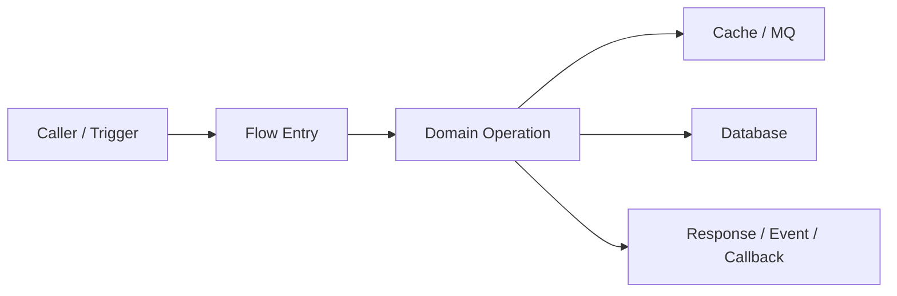
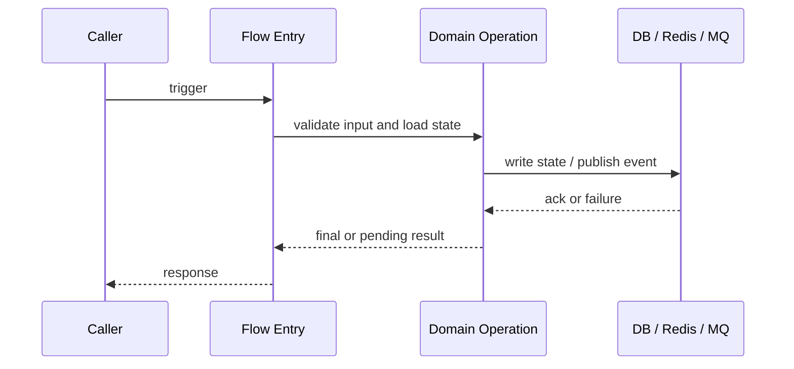

# Flow: <flow-name>

不要只写 A→B→C。critical / important flow 默认必须有架构/边界图、ASCII 状态机/决策图、Timeline / 时序图。架构/边界图讲流程在哪些模块/系统之间发生，状态图讲状态怎么变，Timeline / 时序图讲流程怎么跑。supporting flow 只保留与真实语义相关的章节和图；一旦承担核心状态、外部副作用或恢复责任，就升级并纳入对应核心流程的完整追踪。Mermaid flowchart / sequenceDiagram 可用于普通流程图和时序图；状态机图、复杂示例图优先用 ASCII。流程讲解时顺带解释涉及的数据模型、状态对象、消息、记录和配置。需要表达恢复窗口时补 Timeline Diagram。不要用 stacked box diagram / 阶段堆叠图当主图。

## 1. Flow Identity And Outcomes

- Flow ID：
- Criticality：critical | important | supporting
- 业务目标：
- 触发入口：
- 参与模块：
- 前置状态：
- Success Terminal：
- Failure / Cancel / Unknown / Manual Terminals：
- Variants / Branches：
- External Side Effects：
- Recovery Responsibility：
- Evidence Chain：
- 高风险点：

`accepted` / `pending` / `processing` 只有在它本身是业务终态时才能作为 Success Terminal。callback、consumer、retry、DLQ、compensation、reconciliation 和 job 若负责核心状态、副作用或恢复，必须留在本 Flow 的 slice coverage 中。

## 2. Flow Slice Coverage

`critical` / `important` flow 必填。Supporting flow 只有承担核心状态、外部副作用或恢复责任时才升级。

| Flow ID | Slice ID | Path Kind | Trigger / Precondition | Owner | Input / Output | Action | State Read / Written | Transition | Sync / Async / External | Failure Result | Recovery | Evidence | Diagram IDs | Document Section | Coverage Status |
|---|---|---|---|---|---|---|---|---|---|---|---|---|---|---|---|

`Path Kind`: `main` / `branch` / `failure` / `recovery`。`Coverage Status`: `covered` / `inferred` / `blocked`。

## 3. 架构/边界图 / 线框流程图

用来讲清楚流程涉及的系统边界、模块关系、数据/依赖位置。

优先用 Mermaid flowchart；如果边界和数据所有者用 ASCII 更清楚，也可以用 ASCII 架构图。

- Diagram ID：
- Covered Slice IDs：



## 4. ASCII 状态机/决策图

状态图优先。用来讲状态怎么变、异常怎么恢复、哪里重试/补偿/回滚。

- Diagram ID：
- Covered Slice IDs：

```text
[Start]
  |
  v
[Validate] --invalid--> [Reject + No State Change]
  |
  v
[Lock / Reserve] --fail--> [Retry / Return Busy]
  |
  v
[Apply State Change] --partial--> [Compensate / Reconcile]
  |
  v
[Publish / Callback] --fail--> [Persist Pending + Retry]
  |
  v
[Done]
```

## 5. Timeline / 时序图（必填）

Timeline / Sequence Diagram is the primary per-flow narrative。用来讲清楚流程从触发到终态按时间怎么发生；一边讲步骤，一边点名本阶段读写的数据模型/状态字段/消息对象/配置。

优先用 Mermaid sequenceDiagram。

- Diagram ID：
- Covered Slice IDs：



## 6. 图组讲解与复杂度触发图

- 架构/边界图说明（结论、Covered Slice IDs、数据/状态/消息/配置、code evidence）：
- 状态图说明（结论、Covered Slice IDs、非法转换与恢复、code evidence）：
- Timeline / 时序图说明（结论、Covered Slice IDs、读写与消息顺序、code evidence）：
- 流程中出现的数据模型：
- 推断内容和证据缺口：

| Complexity Signal | Required Additional Diagram | Diagram ID | Covered Slice IDs | Included / N/A Reason |
|---|---|---|---|---|
| callback/retry/compensation/reconciliation | Failure Recovery Timeline |  |  |  |
| object transformations | Data Lineage / Object Transformation |  |  |  |
| transaction/lock/outbox/concurrency/idempotency | Transaction / Concurrency Boundary |  |  |  |
| topics/consumers/retry queue/DLQ | Async Message Topology |  |  |  |
| routing/permission/provider/policy decisions | Decision Tree |  |  |  |
| entity relations affect understanding | ERD / Model Relationship |  |  |  |
| gateway/sidecar/environment topology | Runtime / Deployment Topology |  |  |  |
| distributed logs/metrics/traces/checkpoints | Observability / Troubleshooting Map |  |  |  |

### 泳道图（可选）

当责任归属、跨角色协作或多系统所有权影响理解时填写。不要用它替代必填的 Timeline / 时序图。

```text
Caller        Gateway        Service A        Service B / DB        Consumer
  |              |               |                  |                  |
  | trigger      |               |                  |                  |
  |------------->|               |                  |                  |
  |              | auth/route    |                  |                  |
  |              |-------------->|                  |                  |
  |              |               | command/query    |                  |
  |              |               |----------------->|                  |
  |              |               | publish event    |                  |
  |              |               |------------------------------------>|
  |              | response      |                  |                  |
  |<-------------|<--------------|                  |                  |
```

## 7. 阶段说明

| Stage | Owner Module | Input | Action | State Read / Written | Output | Evidence |
|---|---|---|---|---|---|---|

## 8. 数据流转

| Data Object | Produced By | Consumed By | Mutated? | Meaning | Evidence |
|---|---|---|---|---|---|

## 9. 状态变化

| State Object | Before | Trigger | After | Persistence | Evidence |
|---|---|---|---|---|---|

## 10. 示例

### Example Input

```text
<request / command / event / object>
```

### Example Output

```text
<response / state / event / record>
```

### Example Trace

- request id / order id / message id：
- 先查：
- 再查：

### Example Diagram

复杂示例图优先用 ASCII，方便标注分支、恢复路径和数据对象。

```text
[Example Trigger]
      |
      v
[State Decision] --failure--> [Retry / Compensation]
      |
      v
[Final State / Output]
```

## 11. 失败路径

| Failure Point | Symptom | Cause | Retry / Compensation / Degradation | User Visible? | Evidence |
|---|---|---|---|---|---|

## 12. 排障路径

| Question | Inspect | Why | Evidence |
|---|---|---|---|

## 13. 变更指南

| Change | Impact | Must Update | Must Verify | Risk |
|---|---|---|---|---|

## 14. 代码证据

| Claim | File / Symbol / Config Key | Call / Data Direction | Evidence |
|---|---|---|---|

## 15. 自检

- [ ] `critical` / `important` flow 已从业务触发闭合到 success/failure/cancel/unknown/manual terminal，没有停在非终态响应。
- [ ] supporting flow 未被强制套用完整核心图组；若它承担核心状态、副作用或恢复责任，已升级到对应核心流程追踪。
- [ ] 每个 critical Slice ID 已映射到 evidence、Diagram IDs 和 Document Section；没有 missing/blocked slice 被评分平均掉。
- [ ] callback、consumer、retry、DLQ、compensation、reconciliation 和 job 没有因拆成其他 topic 而离开核心闭环。
- [ ] 若为 critical / important flow，已包含架构/边界图（Mermaid flowchart 或 ASCII 架构图）和 ASCII 状态机/决策图。
- [ ] 若存在真实状态语义，状态图说明了核心状态变化、异常恢复、重试/补偿/回滚。
- [ ] 若为 critical / important flow，已包含 Timeline / 时序图（必填，优先 Mermaid sequenceDiagram），并讲清流程怎么跑。
- [ ] 流程讲解时顺带解释涉及的数据模型、状态对象、消息、记录和配置。
- [ ] 没有用 stacked box diagram / 阶段堆叠图替代复杂流程说明。
- [ ] 阶段说明覆盖 owner module、input、action、state read/write、output、evidence。
- [ ] 数据流转和状态变化能解释成功路径和失败路径。
- [ ] 示例来自真实测试、fixture、API contract、日志、配置或代码构造对象；推断示例已标明 inferred。
- [ ] 关键 claim 带文件路径、符号/配置键、调用方向或数据流方向。
- [ ] 涉及 wallet、billing、quota、apikey、order、balance、message retry 时，已说明一致性、幂等、事务边界、补偿和对账。
- [ ] 涉及 gateway/runtime 时，已说明 route matching、header 透传、auth/rate-limit、timeout/retry/upstream、日志字段。
- [ ] Complexity Signals 已逐项判断，需要的 recovery/lineage/transaction/async/decision/ERD/runtime/troubleshooting 图已经存在并映射 Slice IDs。
- [ ] 若为 critical / important flow，Completeness Hard Gate 已 PASS；它是质量门，不是新的 Human Gate。
- [ ] 没有 `<...>`、TBD、TODO、待补充、空 required row、泛泛“看代码/see code”证据。
