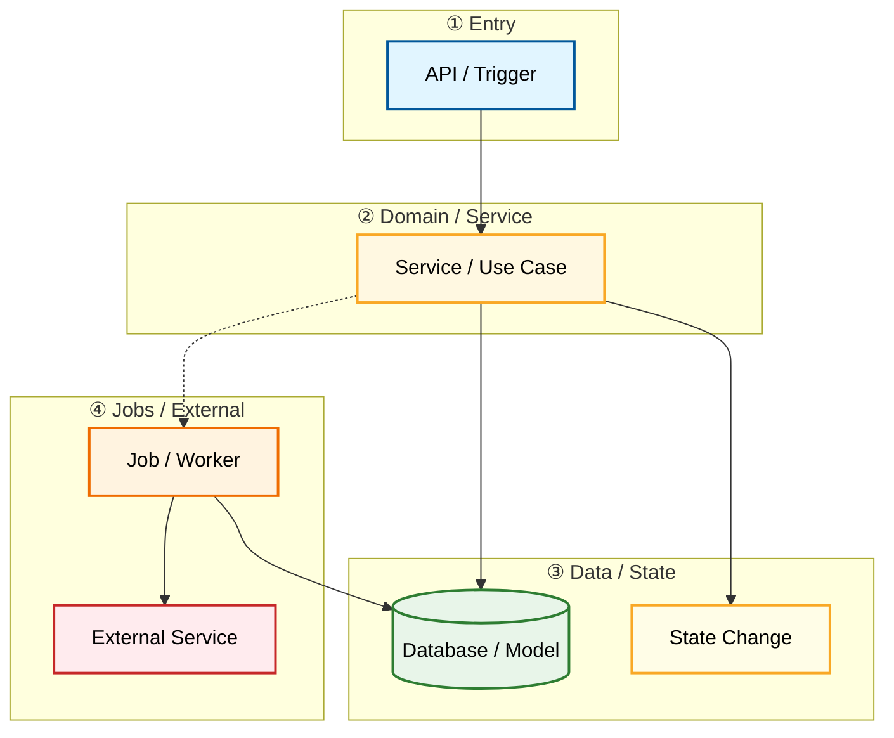

# Flows And Data

Document Language: 中文
Created:
Last Updated:
Last Verified:
Confidence:
Source Evidence:
Human Review Status: draft

## Purpose

## Core Flow Index

| Flow | Trigger | End State | Modules | Related Diagram | Evidence | Confidence |
|---|---|---|---|---|---|---|

## Core Module Call Chains

| Module | Inbound Trigger / Caller | File Path | Function / Object | Core Operation | Data / External / Job Boundary | Output / Side Effect | Related Diagram | Evidence | Confidence |
|---|---|---|---|---|---|---|---|---|---|

## Core Flow: <name>

### One Diagram To Understand The Flow

Use a small layered flowchart first. Do not use a sequence diagram as the first or only explanation for a core flow.



### How To Read

```text
这张流程图回答什么问题：
1. 核心 flow 的入口、业务处理、数据写入、异步任务和外部调用是什么。
2. 数据或状态在哪些步骤发生变化。
3. 哪些模块参与了这个 flow。

怎么看：
- 从 Entry 层开始。
- 顺着实线读同步调用。
- 顺着虚线读异步任务或外部副作用。
- 对照 Core Module Call Chains 和 Call Chain Details 查证据。
```

### Step-by-Step Walkthrough

```text
1. API / Trigger（Entry 层，蓝色）接收外部请求或触发事件
2. API 同步调用 Service / Use Case（Domain 层，黄色）执行业务规则
3. Service 同步写入 Database / Model（Data 层，绿色）
4. Service 同步更新 State Change（Data 层，绿色）
5. Service 异步触发 Job / Worker（Runtime 层，橙色，虚线箭头）
6. Job 同步调用 External Service（External 层，红色）
7. Job 同步回写 Database / Model（Data 层，绿色）
8. 流程结束，最终状态或副作用已产生
```

### Main Flow Quick Notes

```text
Start
-> entrypoint receives request or trigger
-> service / use case applies business rule
-> state is written or job is triggered
-> async / external step if any
-> final state or side effect
```

### Call Chain Details

| Stage | Trigger | File Path | Function / Object | Parameters / Fields | What It Does | Next Step | Evidence | Confidence |
|---|---|---|---|---|---|---|---|---|

### Key State Changes

| Object / Entity | Field | Transition | Writer | Trigger / Guard | Side Effects | Evidence | Confidence |
|---|---|---|---|---|---|---|---|

### Retry / Compensation / Failure Paths

| Failure / Delay | Where It Happens | Retry / Compensation | Impact | Evidence | Confidence |
|---|---|---|---|---|---|

### Code Reading Order

| Order | File / Symbol | Why Read This | Next |
|---|---|---|---|

### Verification Hints

| Check | Command / File / Scenario | What It Proves | Evidence | Confidence |
|---|---|---|---|---|

## Data Model

| Entity | Purpose | Storage | Key Fields | Relationships | Evidence | Confidence |
|---|---|---|---|---|---|---|

### Step-by-Step Walkthrough: Data Relationships

```text
1. 核心实体 A 被 API / Flow 创建，拥有关键字段 id、status、created_at
2. 实体 A 通过 1:N 关系关联实体 B（子记录）
3. 实体 B 通过外键引用实体 A，被 Job / Worker 异步更新
4. 实体 C 与实体 A 是 N:M 关系，通过关联表连接
5. 状态机字段 status 在实体 A 上，由多个 Writer 在不同流程中更新
```

## State Machines

| Entity | State Field | States | Transitions | Diagram | Evidence | Confidence |
|---|---|---|---|---|---|---|

## State Change Traces

Use this when a human asks who or what changes a state/status field. This records observed writers and triggers, not just legal transitions.

| Transition | Trigger | Writer | Guard / Condition | Side Effects | Tests | Evidence | Confidence |
|---|---|---|---|---|---|---|---|

## Jobs And Schedules

| Job | Trigger | File Path | Function / Object | Data Affected | Failure Impact | Verification | Evidence | Confidence |
|---|---|---|---|---|---|---|---|---|

## Evidence Chain

| File Path | Symbol / Object | Parameters / Fields | Description | Proves | Confidence |
|---|---|---|---|---|---|

## Evidence

## Unknowns

## Project Memory Backfill
