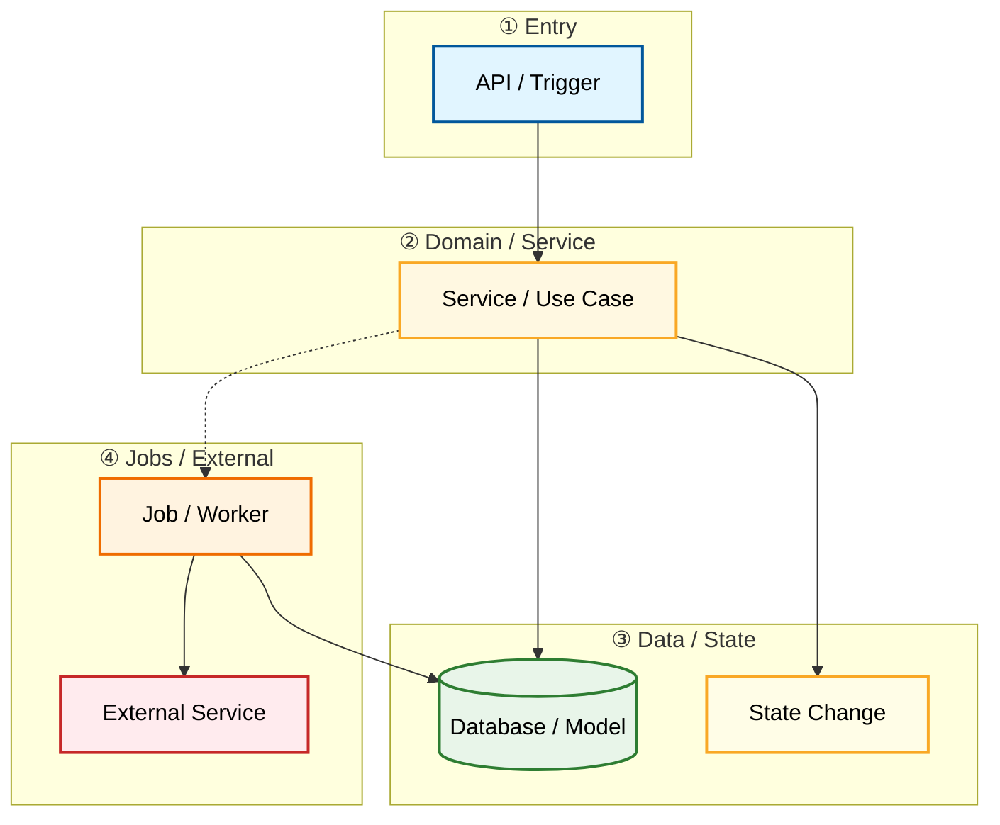

# Flows And Data

Document Language: 中文
Created:
Last Updated:
Last Verified:
Confidence:
Source Evidence:
Human Review Status: draft

## Purpose

## Core Flow Index

| Flow | Trigger | End State | Modules | Related Diagram | Evidence | Confidence |
|---|---|---|---|---|---|---|

## Core Module Call Chains

| Module | Inbound Trigger / Caller | File Path | Function / Object | Core Operation | Data / External / Job Boundary | Output / Side Effect | Related Diagram | Evidence | Confidence |
|---|---|---|---|---|---|---|---|---|---|

## Core Flow: <name>

### One Diagram To Understand The Flow

Use a small layered flowchart first. Do not use a sequence diagram as the first or only explanation for a core flow.



### Main Flow Quick Notes

```text
Start
-> entrypoint receives request or trigger
-> service / use case applies business rule
-> state is written or job is triggered
-> async / external step if any
-> final state or side effect
```

### Call Chain Details

| Stage | Trigger | File Path | Function / Object | Parameters / Fields | What It Does | Next Step | Evidence | Confidence |
|---|---|---|---|---|---|---|---|---|

### Key State Changes

| Object / Entity | Field | Transition | Writer | Trigger / Guard | Side Effects | Evidence | Confidence |
|---|---|---|---|---|---|---|---|

### Retry / Compensation / Failure Paths

| Failure / Delay | Where It Happens | Retry / Compensation | Impact | Evidence | Confidence |
|---|---|---|---|---|---|

### Code Reading Order

| Order | File / Symbol | Why Read This | Next |
|---|---|---|---|

### Verification Hints

| Check | Command / File / Scenario | What It Proves | Evidence | Confidence |
|---|---|---|---|---|

## Data Model

| Entity | Purpose | Storage | Key Fields | Relationships | Evidence | Confidence |
|---|---|---|---|---|---|---|

## State Machines

| Entity | State Field | States | Transitions | Diagram | Evidence | Confidence |
|---|---|---|---|---|---|---|

## State Change Traces

Use this when a human asks who or what changes a state/status field. This records observed writers and triggers, not just legal transitions.

| Transition | Trigger | Writer | Guard / Condition | Side Effects | Tests | Evidence | Confidence |
|---|---|---|---|---|---|---|---|

## Jobs And Schedules

| Job | Trigger | File Path | Function / Object | Data Affected | Failure Impact | Verification | Evidence | Confidence |
|---|---|---|---|---|---|---|---|---|

## Evidence Chain

| File Path | Symbol / Object | Parameters / Fields | Description | Proves | Confidence |
|---|---|---|---|---|---|

## Evidence

## Unknowns

## Project Memory Backfill
