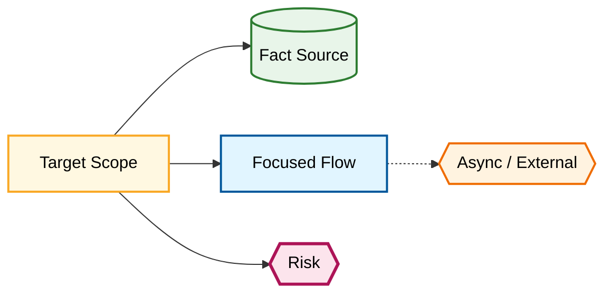

# Graph Slice: <scope>

Document Language: 中文
Created:
Last Updated:
Last Verified:
Scope:
Confidence:
Source Evidence:
Human Review Status: draft

## Purpose

Targeted Onboarding Scan 使用这个模板记录某个领域、flow、module、async path、deployment path 或问题区域的局部 Evidence Graph。

## Included Nodes

| Node ID | Type | Name | Core Role | Evidence | Confidence | Completion Status |
|---|---|---|---|---|---|---|

## Included Edges

| Edge ID | Source Node ID | Edge Type | Target Node ID | Sync / Async | Data / State | Required For Complete | Evidence | Confidence |
|---|---|---|---|---|---|---|---|---|

## Excluded But Related

| Node / Edge | Why Excluded | Risk | Follow-up |
|---|---|---|---|

## Slice Diagram



## Local Completion Decision

```text
Targeted onboarding complete for <scope>.
Full Deep onboarding remains incomplete unless global gates pass.
```

## Global Coverage Impact

| Global Coverage Row | Local Update | Does This Change Deep Completion? | Reason |
|---|---|---|---|

## Focused Output Proposal

| File / Item | Action | Why | Evidence | Confidence |
|---|---|---|---|---|

## Unknowns / Follow-up

| Unknown | Impact | Next Action |
|---|---|---|
