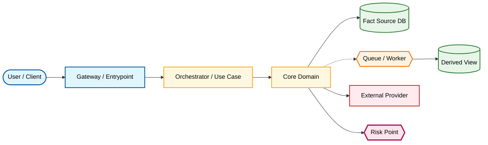

# Main Traffic Flow

Document Language: 中文
Created:
Last Updated:
Last Verified:
Confidence:
Source Evidence:
Human Review Status: draft

## Purpose

解释项目主流量路径：请求、事件或人类操作从哪里进入，经过哪些核心领域、服务、数据和外部依赖，在哪里结束。

## Scope

| Included | Excluded | Why |
|---|---|---|

## Colored Flowchart

## How To Read

## Step-by-Step Walkthrough

1.

## Main Flow Evidence Trace

| Step ID | Graph Edge | File | Symbol | Data / State | Sync / Async | Risk | Evidence | Confidence |
|---|---|---|---|---|---|---|---|---|

## Related Required Core Flows

| Flow | Why It Matters | Target Deep Trace Doc | Completion Status |
|---|---|---|---|

## Verification / Observability

| Signal | Where | What It Proves | Evidence | Confidence |
|---|---|---|---|---|

## Unknowns

| Unknown | Impact | Next Action |
|---|---|---|
