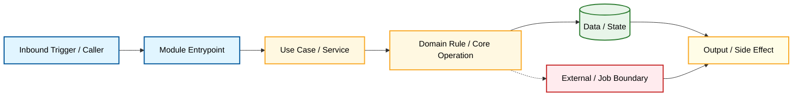

# Module: <name>

Document Language: 中文
Created:
Last Updated:
Last Verified:
Confidence:
Source Evidence:
Human Review Status: draft

## Purpose

## Boundary

| In Scope | Out Of Scope | Evidence | Confidence |
|---|---|---|---|

## Core Call Chain Diagram

Use a small module-level flowchart. Do not draw every function call. Use `sequenceDiagram` only for a later narrow interaction detail.

## Entrypoints

| Entrypoint | Type | File Path | Function / Object | Parameters / Fields | What Starts Here | Evidence | Confidence |
|---|---|---|---|---|---|---|---|

## Core Call Chain Details

| Step | File Path | Function / Object | Parameters / Fields | What It Does | Next Step | Evidence | Confidence |
|---|---|---|---|---|---|---|---|

## Core Flows

| Flow | Trigger | Outcome | Related Doc / Diagram | Evidence | Confidence |
|---|---|---|---|---|---|

## Key Files

| File Path | Role | Read First? | Important Symbols | Description | Evidence | Confidence |
|---|---|---|---|---|---|---|

## Dependencies

| Dependency | Direction | Purpose | Contract / Boundary | Evidence | Confidence |
|---|---|---|---|---|---|

## Data And Side Effects

| Data / Side Effect | Read / Write / Emit | File / Object | Parameters / Fields | Description | Evidence | Confidence |
|---|---|---|---|---|---|---|

## Tests

| Test Area | Command / File | What It Proves | Related Flow / Function | Evidence | Confidence |
|---|---|---|---|---|---|

## Change Impact

| If You Change | Likely Impact | Check These Files / Tests | Risk | Evidence |
|---|---|---|---|---|

## Evidence Chain

| File Path | Symbol / Object | Parameters / Fields | Description | Proves | Confidence |
|---|---|---|---|---|---|

## Risks And Unknowns

| Item | Why It Matters | Evidence | Confidence | Suggested Follow-Up |
|---|---|---|---|---|

## Project Memory Backfill

| Candidate Fact | Backfill Target | Reason | Evidence | Confidence |
|---|---|---|---|---|
