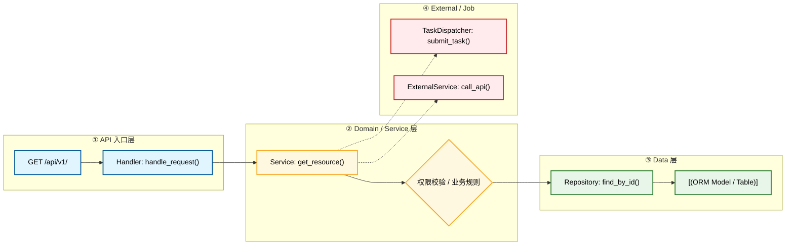
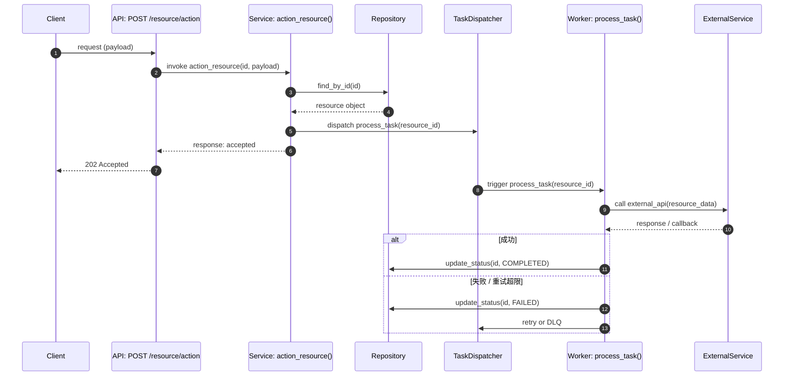

# Module: <name>

Document Language: 中文
Created:
Last Updated:
Last Verified:
Confidence:
Source Evidence:
Human Review Status: draft

## Purpose

## Boundary

| In Scope | Out Of Scope | Evidence | Confidence |
|---|---|---|---|

## Core Call Chain Diagram

**画完整的模块级调用链路图**。Deep Scan 下，把从入口到出口的每个关键节点都画出来：具体的 API Route / Handler、Service / UseCase、Domain Rule、Repository / ORM、External Service / Task Dispatcher。不能只写一个抽象的 "Service" 节点。如果一张图放不下，分成多张（如一张给 API 流程、一张给后台任务流程）。



## How To Read This Diagram

- **API 入口层（蓝色）**：外部调用进入模块的入口，包含具体路由和 Handler 函数名
- **Domain 层（黄色）**：业务逻辑核心，包含具体 Service 类名和关键方法
- **Data 层（绿色）**：数据持久化，包含具体 Repository 和 ORM Model
- **External 层（红色）**：异步任务或外部服务调用
- **实线箭头（-->）**：同步调用
- **虚线箭头（-.->）**：异步触发或外部调用

## Step-by-Step Walkthrough: Call Chain

```text
1. Client 发起请求到 `GET /api/v1/<resource>`（API 层，蓝色）
2. Handler: handle_request() 接收请求并解析参数（API 层，蓝色）
3. Handler 同步调用 `<Resource>Service: get_resource()`（Domain 层，黄色）
4. Service 执行权限校验 / 业务规则（Domain 层，黄色，菱形判断）
5. 校验通过后，Service 同步调用 `<Resource>Repository: find_by_id(id)`（Data 层，绿色）
6. Repository 从 ORM Model / Table 查询并返回结果（Data 层 → Domain 层，同步返回）
7. Service 异步触发 `TaskDispatcher: submit_task()`（External 层，红色，虚线箭头）
8. Service 异步调用 `ExternalService: call_api()`（External 层，红色，虚线箭头）
9. Service 返回最终结果给 Handler（Domain 层 → API 层，同步返回）
10. Handler 返回响应给 Client（API 层 → UserLayer，同步返回）
```

## Core Interaction Sequence Diagram

**当本模块涉及异步 jobs、外部服务调用、回调/webhook、WebSocket、重试补偿时，必须提供时序图。** 时序图展示精确的调用顺序、参数传递、回调时机、成功/失败分支。



## How To Read This Sequence Diagram

- **编号（autonumber）**：按时间顺序编号，方便引用讨论
- **参与者命名**：格式为 `Layer: SpecificName()`，包含具体函数名
- **消息格式**：`Source->>Target: action(param)`，包含动作和关键参数
- **虚线返回（-->>）**：同步返回或异步回调
- **alt/else/end**：展示成功和失败分支

## Step-by-Step Walkthrough: Sequence

```text
1. Client 发送 request (payload) 到 API: POST /resource/action（同步请求）
2. API 同步调用 Service: action_resource(id, payload)，传入 id 和 payload
3. Service 同步调用 Repository: find_by_id(id) 查询资源
4. Repository 返回 resource object 给 Service（同步返回）
5. Service 同步调用 TaskDispatcher: dispatch process_task(resource_id) 提交异步任务
6. Service 返回 response: accepted 给 API（同步返回）
7. API 返回 202 Accepted 给 Client（同步返回，后台任务尚未完成）
8. TaskDispatcher 异步触发 Worker: process_task(resource_id)（后台开始执行）
9. Worker 同步调用 ExternalService: call external_api(resource_data)（调用第三方）
10. ExternalService 返回 response / callback 给 Worker（同步返回）
11. 【成功分支】Worker 调用 Repository 更新状态为 COMPLETED
12. 【失败分支】Worker 调用 Repository 更新状态为 FAILED，并触发 retry 或送入 DLQ
```

## Entrypoints

| Entrypoint | Type | File Path | Function / Object | Parameters / Fields | What Starts Here | Evidence | Confidence |
|---|---|---|---|---|---|---|---|

## Core Call Chain Details

| Step | File Path | Function / Object | Parameters / Fields | What It Does | Next Step | Evidence | Confidence |
|---|---|---|---|---|---|---|---|

## Core Flows

| Flow | Trigger | Outcome | Related Doc / Diagram | Evidence | Confidence |
|---|---|---|---|---|---|

## Key Files

| File Path | Role | Read First? | Important Symbols | Description | Evidence | Confidence |
|---|---|---|---|---|---|---|

## Dependencies

| Dependency | Direction | Purpose | Contract / Boundary | Evidence | Confidence |
|---|---|---|---|---|---|

## SLA & Runtime Limits

**记录这个模块的运行时约束。agent 改代码前必须知道这些，否则容易引入超时/限流/资源耗尽事故。**

| Limit Type | Value | Config Location | Default | Evidence | Confidence |
|---|---|---|---|---|---|
| API timeout | | | | | |
| DB connection pool max | | | | | |
| DB query timeout | | | | | |
| External service timeout | | | | | |
| Rate limit (requests/sec) | | | | | |
| Max retry count | | | | | |
| Concurrent request limit | | | | | |
| Memory / CPU typical usage | | | | | |

## Data And Side Effects

| Data / Side Effect | Read / Write / Emit | File / Object | Parameters / Fields | Description | Evidence | Confidence |
|---|---|---|---|---|---|---|

## Caching Strategy

**如果本模块使用缓存，记录缓存层、key 模式、TTL、失效策略。agent 改写入逻辑时必须同步更新缓存。**

| Cache Layer | Key Pattern | TTL | Invalidation Trigger | Cache-Aside / Write-Through? | Evidence | Confidence |
|---|---|---|---|---|---|---|

如果不使用缓存，写：`Not applicable`。

## Tests

| Test Area | Command / File | What It Proves | Related Flow / Function | Evidence | Confidence |
|---|---|---|---|---|---|

## Error Handling

**记录本模块的常见错误和异常策略，防止 agent 重复造轮子或错误处理不一致。**

| Error Code / Exception | When It Happens | HTTP Status | User Message | Log Level | Retryable? | Handler File | Evidence | Confidence |
|---|---|---|---|---|---|---|---|---|

## Change Impact

| If You Change | Likely Impact | Check These Files / Tests | Risk | Evidence |
|---|---|---|---|---|

## Evidence Chain

| File Path | Symbol / Object | Parameters / Fields | Description | Proves | Confidence |
|---|---|---|---|---|---|

## Risks And Unknowns

| Item | Why It Matters | Evidence | Confidence | Suggested Follow-Up |
|---|---|---|---|---|

## Project Memory Backfill

| Candidate Fact | Backfill Target | Reason | Evidence | Confidence |
|---|---|---|---|---|
