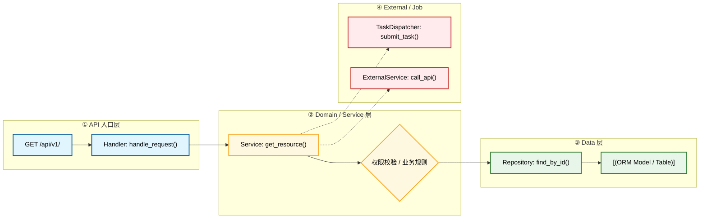
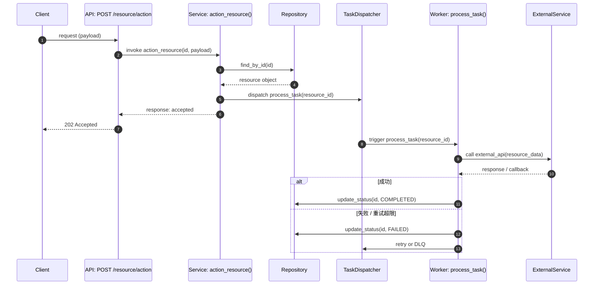

# Module: <name>

Document Language: 中文
Created:
Last Updated:
Last Verified:
Confidence:
Source Evidence:
Human Review Status: draft

## Purpose

## Boundary

| In Scope | Out Of Scope | Evidence | Confidence |
|---|---|---|---|

## Core Call Chain Diagram

**画完整的模块级调用链路图**。Deep Scan 下，把从入口到出口的每个关键节点都画出来：具体的 API Route / Handler、Service / UseCase、Domain Rule、Repository / ORM、External Service / Task Dispatcher。不能只写一个抽象的 "Service" 节点。如果一张图放不下，分成多张（如一张给 API 流程、一张给后台任务流程）。

## How To Read This Diagram

- **API 入口层（蓝色）**：外部调用进入模块的入口，包含具体路由和 Handler 函数名
- **Domain 层（黄色）**：业务逻辑核心，包含具体 Service 类名和关键方法
- **Data 层（绿色）**：数据持久化，包含具体 Repository 和 ORM Model
- **External 层（红色）**：异步任务或外部服务调用
- **实线箭头（-->）**：同步调用
- **虚线箭头（-.->）**：异步触发或外部调用

## Core Interaction Sequence Diagram

**当本模块涉及异步 jobs、外部服务调用、回调/webhook、WebSocket、重试补偿时，必须提供时序图。** 时序图展示精确的调用顺序、参数传递、回调时机、成功/失败分支。

## How To Read This Sequence Diagram

- **编号（autonumber）**：按时间顺序编号，方便引用讨论
- **参与者命名**：格式为 `Layer: SpecificName()`，包含具体函数名
- **消息格式**：`Source->>Target: action(param)`，包含动作和关键参数
- **虚线返回（-->>）**：同步返回或异步回调
- **alt/else/end**：展示成功和失败分支

## Entrypoints

| Entrypoint | Type | File Path | Function / Object | Parameters / Fields | What Starts Here | Evidence | Confidence |
|---|---|---|---|---|---|---|---|

## Core Call Chain Details

| Step | File Path | Function / Object | Parameters / Fields | What It Does | Next Step | Evidence | Confidence |
|---|---|---|---|---|---|---|---|

## Core Flows

| Flow | Trigger | Outcome | Related Doc / Diagram | Evidence | Confidence |
|---|---|---|---|---|---|

## Key Files

| File Path | Role | Read First? | Important Symbols | Description | Evidence | Confidence |
|---|---|---|---|---|---|---|

## Dependencies

| Dependency | Direction | Purpose | Contract / Boundary | Evidence | Confidence |
|---|---|---|---|---|---|

## Data And Side Effects

| Data / Side Effect | Read / Write / Emit | File / Object | Parameters / Fields | Description | Evidence | Confidence |
|---|---|---|---|---|---|---|

## Tests

| Test Area | Command / File | What It Proves | Related Flow / Function | Evidence | Confidence |
|---|---|---|---|---|---|

## Change Impact

| If You Change | Likely Impact | Check These Files / Tests | Risk | Evidence |
|---|---|---|---|---|

## Evidence Chain

| File Path | Symbol / Object | Parameters / Fields | Description | Proves | Confidence |
|---|---|---|---|---|---|

## Risks And Unknowns

| Item | Why It Matters | Evidence | Confidence | Suggested Follow-Up |
|---|---|---|---|---|

## Project Memory Backfill

| Candidate Fact | Backfill Target | Reason | Evidence | Confidence |
|---|---|---|---|---|
