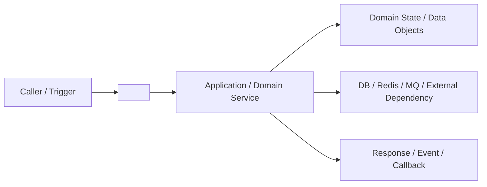
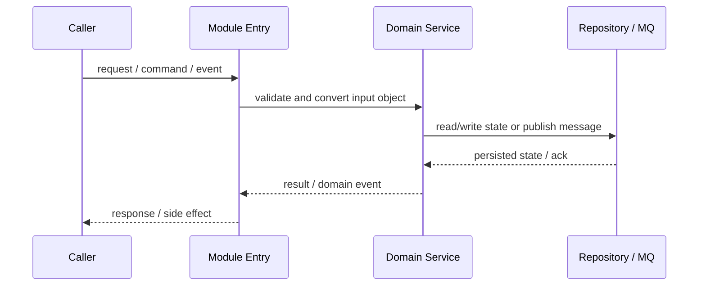
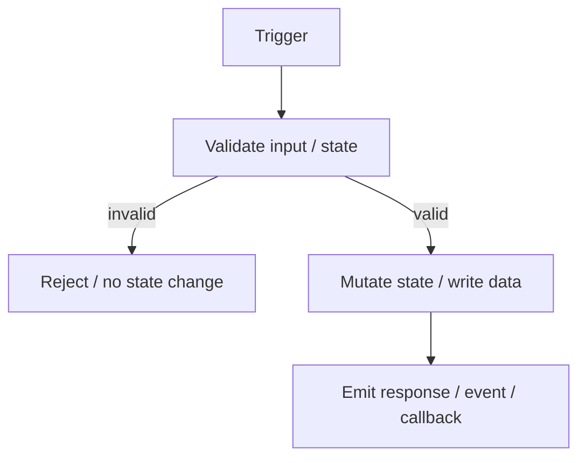

# Module: <module-name>

不要只写“模块负责什么”。本文件必须让新人知道这个模块如何承载领域逻辑、数据如何进出、状态如何变化、失败如何排查、代码从哪里读。

## 1. 模块定位

- 所属 Bounded Context：
- 业务责任：
- 不负责什么：
- 高风险点：
- 证据：

## 2. 图解

这一节先把模块讲“看得见”。模块图 / 架构/边界图用于解释真实边界；只有模块具有状态生命周期时才使用 ASCII 状态机图，具有时间顺序或数据移动时才使用 Timeline / 时序图。不要为 stateless 模块编造状态机。

- 模块图 / 架构/边界图：讲模块在哪、边界在哪、谁调用它、它调用谁、状态归谁管。
- ASCII 状态机图：讲核心对象、请求或任务的状态怎么变，异常怎么恢复。
- Timeline / 时序图：讲核心流程怎么跑；普通时序图优先用 Mermaid sequenceDiagram。
- 流程图：讲普通流程分支；普通流程图优先用 Mermaid flowchart。
- 复杂模块图、复杂原理图、复杂示例图优先用 ASCII，方便标注状态、分支、数据对象和恢复路径。
- 每张图必须带讲解。讲解至少说明：这张图要看什么、表达了什么结论、涉及哪些数据对象/状态字段/消息/配置、对应的代码证据在哪里。
- 流程讲解时顺带解释涉及的数据模型、状态对象、消息、记录和配置，不要先孤立列清单。
- Diagram Plan 记录真实 complexity signals 和选图理由；没有相应语义时直接标明 not-applicable，不需要伪造状态或时间线。
- 不要把复杂逻辑画成 stacked box diagram / 阶段堆叠图；不要用无边界、无状态、无数据对象的 `A-->B-->C` 糊弄主图。

### 2.1 模块图 / 架构/边界图

优先用 Mermaid flowchart；如果边界、状态所有者、Redis/MQ/DB 布局用 ASCII 更清楚，也可以用 ASCII 架构图。



### 2.2 ASCII 状态机图（有状态行为时必填）

```text
[Initial]
  |
  v
[Validate] --invalid--> [Rejected]
  |
  v
[Apply Change] --failed--> [Retry / Compensate]
  |
  v
[Committed]
```

### 2.3 Timeline / 时序图（有顺序或数据移动时必填）

用它讲清楚核心流程按时间怎么发生；一边讲步骤，一边点名本步骤读写的数据模型 / 状态字段 / 消息对象 / 配置。

优先用 Mermaid sequenceDiagram。



### 2.4 流程图（按需）

普通流程图优先用 Mermaid flowchart。流程图必须表达边界、状态或数据对象，不能只是 `A-->B-->C`。



### 2.5 图解说明

每张图必须带讲解，不要只放图。读者应该能从说明中知道图里每个关键节点为什么存在、哪些箭头代表读写、哪些状态是最终事实。

- 模块图 / 架构/边界图说明：
- 状态机图说明：
- Timeline / 时序图说明：
- 流程图说明：
- 流程中出现的数据模型：
- 推断内容和证据缺口：

## 3. Bounded Context / DDD 视角

| DDD Concept | Project Object | Role | Evidence |
|---|---|---|---|
| Bounded Context |  |  |  |
| Aggregate / Entity |  |  |  |
| Value Object |  |  |  |
| Domain Service |  |  |  |
| Repository |  |  |  |
| External Adapter |  |  |  |
| Domain Event / Message |  |  |  |

## 4. 核心用例

按 Evidence Graph 列出所有核心用例。少于 3 个时说明证据；不要为凑数量发明用例。

| Use Case | Trigger | Caller | Input Object | Domain Objects Touched | State Changes | Output | Failure Path | Evidence |
|---|---|---|---|---|---|---|---|---|

## 5. 领域模型

| Concept | Meaning | Owner Of Truth | Key State | Who Changes It | Common Misunderstanding | Evidence |
|---|---|---|---|---|---|---|

## 6. 数据对象

区分 API/proto、DB model、DTO/internal struct、config、event/message、external object。

| Object | Kind | Owner | Meaning | Key Fields | Read Path | Write Path | Evidence |
|---|---|---|---|---|---|---|---|

## 7. 信息传递

### Inbound

| From | Entry | Payload / Object | Purpose | Evidence |
|---|---|---|---|---|

### Outbound

| To | Method / Event | Payload / Object | Purpose | Evidence |
|---|---|---|---|---|

## 8. API / Events / Jobs

| Interface | Type | Caller / Trigger | Handler | Data | Evidence |
|---|---|---|---|---|---|

## 9. 状态流转

| State Object | Initial | Transition | Final | Trigger | Evidence |
|---|---|---|---|---|---|

## 10. 失败模式

| Symptom | Likely Cause | Inspect First | Key Log / Field / ID | Retryable? | Human Confirm? | Evidence |
|---|---|---|---|---|---|---|

## 11. 工作原理与示例

不要只复述调用链。解释这个模块内部为什么这样工作：关键算法、路由选择、配额/计费、锁/事务、缓存/MQ 协作、provider 协议转换、降级策略等。示例必须来自真实测试、fixture、API contract、日志、配置或代码构造对象；如果只能推断，要标明“推断”、证据、置信度和待验证点。示例也要带图，不能只给输入/输出。

### 11.1 关键机制

#### 原理机制图 / 示例图

复杂原理图和示例图优先用 ASCII。

```text
┌──────────────┐
│ Input Signal │
└──────┬───────┘
       ▼
┌──────────────┐      reads       ┌──────────────┐
│ Decision     │─────────────────▶│ State / Rule │
└──────┬───────┘                  └──────────────┘
       │ choose / mutate
       ▼
┌──────────────┐      writes      ┌──────────────┐
│ Effect       │─────────────────▶│ Record/Event │
└──────────────┘                  └──────────────┘
```

- 核心判断：
- 关键状态：
- 为什么这样设计：
- 容易误解：
- 证据：

### 11.2 示例 1：<example-name>

#### 示例图

```text
[Example Input]
      |
      v
[Module Decision] --branch--> [State / Data Object]
      |
      v
[Example Output / Event / Record]
```

- 输入：
- 关键中间对象：
- 状态变化：
- 输出：
- 如何验证：
- 证据：

### 11.3 示例 2：<example-name>

#### 示例图

```text
[Example Input]
      |
      v
[Module Decision] --branch--> [State / Data Object]
      |
      v
[Example Output / Event / Record]
```

- 输入：
- 关键中间对象：
- 状态变化：
- 输出：
- 如何验证：
- 证据：

## 12. 验证和排障

- 最小自动化验证：
- 手工验证：
- 日志 / 指标：
- 数据查询：
- 常见误判：

## 13. 关键代码索引

| Concern | File / Symbol | Why Read It |
|---|---|---|

## 14. 变更指南

| Change Type | Must Read | Must Verify | Risk |
|---|---|---|---|

## 15. 自检

- [ ] 已包含模块图 / 架构/边界图（Mermaid flowchart 或 ASCII 架构图）。
- [ ] 模块存在状态生命周期时已包含 ASCII 状态机图；stateless 时已写明证据和 not-applicable 理由，没有编造状态。
- [ ] 模块存在时间顺序或数据移动时已包含 Timeline / 时序图（优先 Mermaid sequenceDiagram）；不适用时已说明依据。
- [ ] 每张图必须带讲解，说明图要看什么、表达什么结论、涉及哪些数据对象/状态字段/消息/配置和代码证据。
- [ ] 图解说明顺带解释涉及的数据模型、状态对象、消息、记录和配置。
- [ ] 工作原理与示例包含关键机制、原理机制图 / 示例图；示例 1 和示例 2 均有证据，每个示例都带示例图。无法提供时说明豁免原因、证据缺口和置信度。
- [ ] 复杂模块没有只用 stacked box diagram / 阶段堆叠图糊弄。
- [ ] 核心用例包含 trigger、caller、input、domain objects、state changes、output、failure path、evidence。
- [ ] 数据对象区分 API/proto、DB model、DTO/internal struct、config、event/message、external object。
- [ ] 关键 claim 带文件路径、符号/配置键、调用方向或数据流方向。
- [ ] 示例来自真实测试、fixture、API contract、日志、配置或代码构造对象；推断示例已标明 inferred。
- [ ] 涉及 wallet、billing、quota、apikey、order、balance、message retry 时，已说明一致性、幂等、事务边界、补偿和对账。
- [ ] 涉及 apikey / token / credential 时，已说明 key 生成、hash/加密存储、脱敏展示、权限 scope、过期/轮换/吊销、泄露处置、审计日志。
- [ ] 涉及 gateway/runtime 时，已说明 route matching、header 透传、auth/rate-limit、timeout/retry/upstream、日志字段。
- [ ] 没有 `<...>`、TBD、TODO、待补充、空 required row、泛泛“看代码/see code”证据。
